--- 
title: "Tutorial of Spatial Heatmap"
author: "Jianhai Zhang (UCR PhD student) 
 Advisor: Prof. Dr. Thomas Girke (UCR)"
date: "Last update: `r format(Sys.time(), '%d %B, %Y')`"
output:
  html_document:
    toc: true
    toc_float:
        collapsed: true
        smooth_scroll: true
    toc_depth: 3
    fig_caption: yes
    code_folding: show
    number_sections: true
fontsize: 14pt
bibliography: bibtex.bib
---

Maintainer: Jianhai Zhang (<jzhan067@ucr.edu;> <zhang.jianhai@hotmail.com>)

# Summary

This Shiny App based Spatial Heatmap can be used for interactive visualisation as long as a data matrix and an associated svg image are provided. This tutorial is specifically designed for how to make svg image and link it with gene expression matrix. The tutorial requires a png image with each region coloured by a unique colour, a data matrix, the svg editor Inkscape, and optionally the image editor GIMP. The png image is the template to make the svg image while the data matrix is used to fill different regions in the image. Inkscape is used to associate the svg image with the data matrix and GIMP is optionally used to facilitate making the svg image. 

In the following the tutorial is given with a gene expression matrix and an associated root tissue image in SVG format as an example. It is just a basic example for users without experience to start, which includes almost all the necessary steps relevant to using this App. All the files used in this tutorial can be downloaded <a href=http://biocluster.ucr.edu/~jzhan067/shiny_HM_tutorial/>here</a>.

  <b>Users are advised to pay enough attention to the bold text below, because it can prevent common errors when using the App. </b>

# Procedure

## Gene expression matrix

  In the gene matrix, the row and column names are often gene IDs and samples/conditions respectively, and one column of annotation can also be included. The dimension names can be transposed. <b>The sample names shoud be followed by double underscore and then the condition names, eg: epidermis__standard_1h [@Geng2013-ek], where epidermis is the tissue and standard_1h is the condition. In names of sample, condition, and annotation, only letters, digits, single underscore, dots are allowed</b>.

  

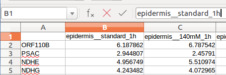
 

## Make svg images 

###  Make blank svg images by drawing 

If the contour in the png image is not clear, GIMP can generate low-quality svg images. In this case, one can draw the blank svg image on Inkscape by using the png as a template. Below is an example of drawing only two polygons.

  1. Draw polygons 

 
  Open the root png image [@Mustroph2009-nu] in Inkscape. The image can be zoomed by press "-" or "+" on the keyboard. Select the "Draw freeahnd lines (F6)" at the left tool bar. Left click once at the first corner of the polygon, and move to the second corner and double left click, and so on. Lastly, when drawing the last line click at the first corner to seal the polygon.
  

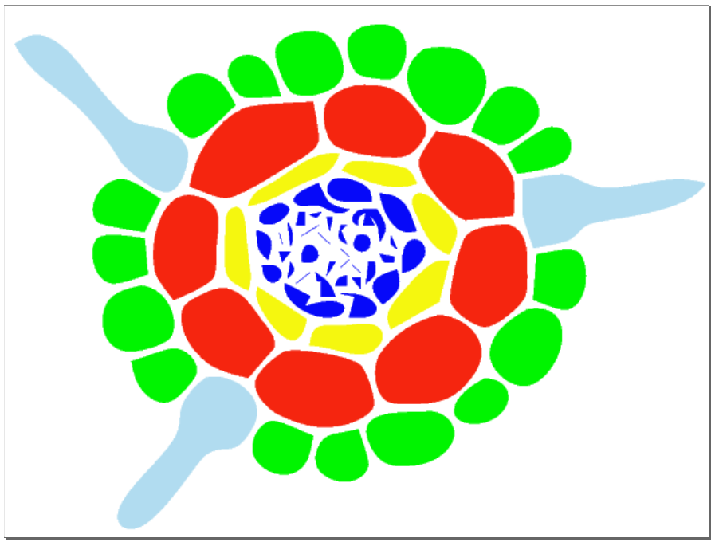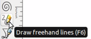

  

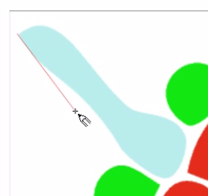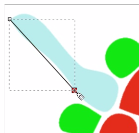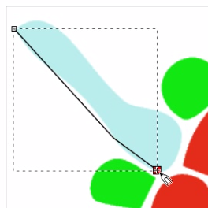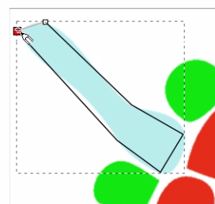

  2. Overlay polygons 

 
  Select "Edit path by nodes (F2)" from the left tool bar. Draw a large rectangle to select the whole sealed polygon and draw a large rectangle to select all nodes.
  

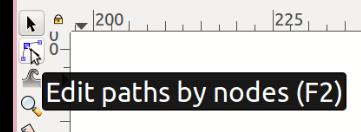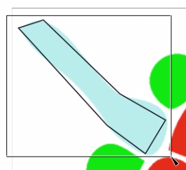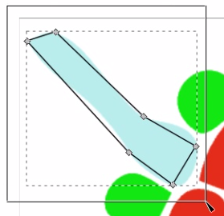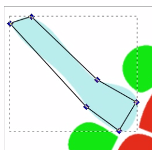

    Click the "Make selected nodes smooth" in the top tool bar. Drag the edges and handles to make the sealed polygon overlap with the template, then the first polygon is created. 

  
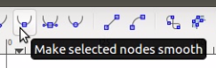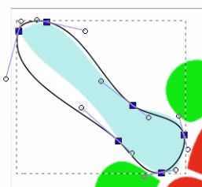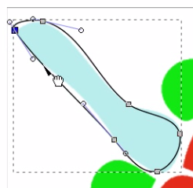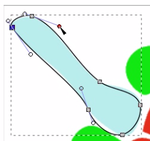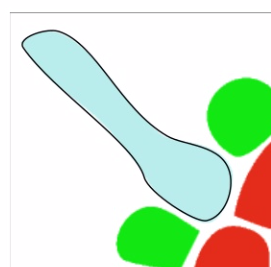

  3.  Make polygons with shapes 

  Alternatively, the polygons can be made with rectangles. Click "Create rectangles and squares (F4)" at the left tool bar and draw a rectangle in the second template polygon. Select the rectangle and click "Object to Path" under the "Path" tab at the top, then the rectangle becomes an svg path, which can be edited. Switch cursor to "Select and Transform Objects (F1)" and rotate the rectangle. 

  

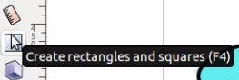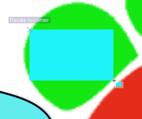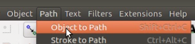

  
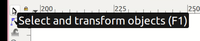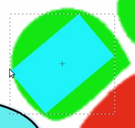

  &nbsp; &nbsp; Switch the cursor to "Edit path by nodes (F2)" and select all nodes of the rectangle. Click "Make selected nodes corner" at the top tool bar. Drag the edges and handles to overlay the rectangle path on the template, then the second polygon is drawn. 

  

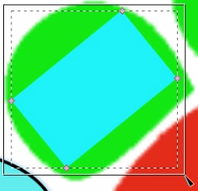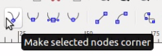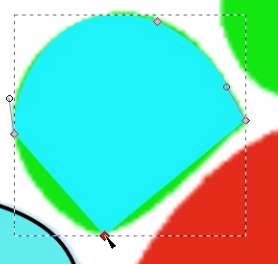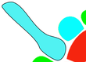
 

  In this root image there are many polygons, so it is time-consuming to draw them individually. In order to same time, GIMP can be used to extract the polygons automatically. 

### Make blank svg images with GIMP

If the png image contains many polygons and their contour is clear (e.g. the root image), GIMP can be used to automatically extract the polygons. 

  4. Open the root png image with GIMP. There are five coloured tissues (skyblue, green, red, yellow, blue). The skyblue is not present in the gene matrix while the green, red, yellow, blue correspond to epidermis, cortex, endodermis, stele in the gene matrix respectively. Enable the "Paths" panel under the "Windows" tab at the top. Right click and select "By Color" under "Select". 

  

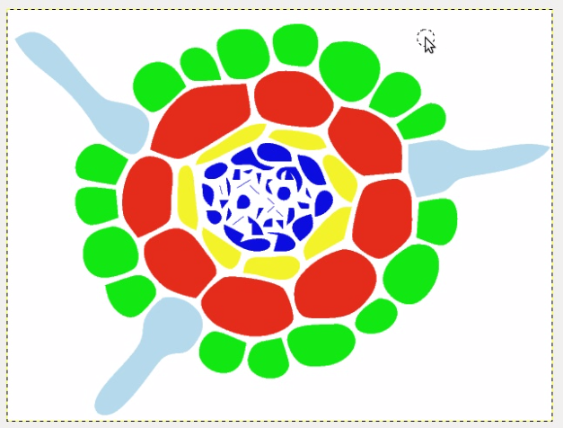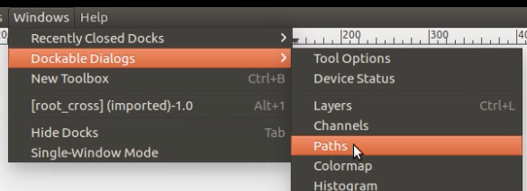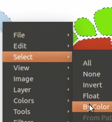
 

  5. Click on the skyblue tissue, then right click, select "To Path" under "Select", and the paths of the all skyblue tissues is shown in the "Paths" panel. 

     
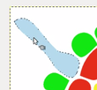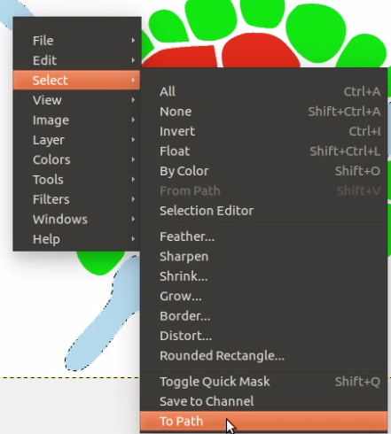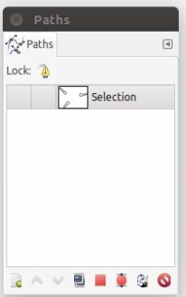

  6. Similarly, exrtact paths of other tissues. In the "Paths" panel, and set paths visible by enabling the eye symbol, then right click and merge visible paths. Right click and export merged paths, which is a blank svg image. 

  
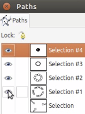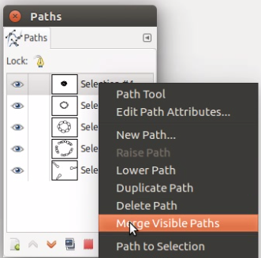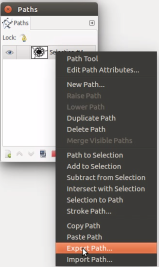
 

### Make blank svg images with GIMP and drawing

The drawing method produce accurate svg images but it is time-consuming, while the GIMP method is faster but it can generate fused polygons. In this tutorial, the root png image has well separated polygons and clear contours, so GIMP can produce accurate svg images. Otherwise the resulting svg images would have mixed and noise polygons. Considering the pros and cons of two methods, the good practice is to use GIMP to extract polygons first then use drawing the refine the blank svg image. Below is an example of an svg image with fused polygons, which is generated by GIMP.

  7.  Place all svg paths inside a layer 

  Open the blank fused svg image in Inkscape (the image can be zoomed by press "-" or "+" on the keyboard). Under the "Layers" tab at the top click "Layers", the "Layers" panel will come out on the right, then click "+" at the bottom left corner of the panel to add "Layer 1". 
  

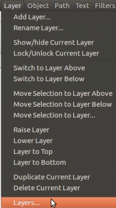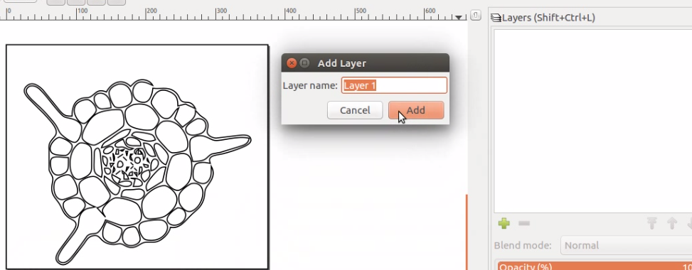

    Draw a rectangle over the fused svg graph and cut. Then click on "Layer 1" and paste the fused svg to "Layer 1" (make sure the "Layer 1" is unlocked by refering to the lock symbol). Open the "XML Editor" from the "Edit" tab at the top, if "\<svg:path id="path 77"\>" is under "\<svg:g id="layer1" inkscape:label="Layer 1"\>", then the fused svg is inside \"Layer 1\" for sure. 
     

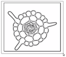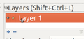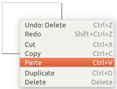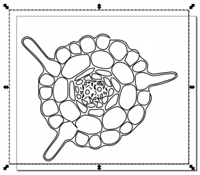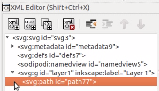
 

  8. Refine and modify the svg image 

  Draw a ractangle over the image, click "Break Apart" under the "Path" tag, then select the outer noisy rectangle by clicing on its edge. Press "delete" on the keyboard to delete it. 

  
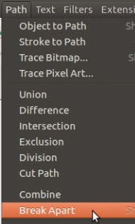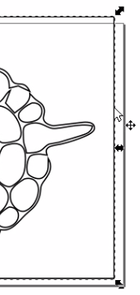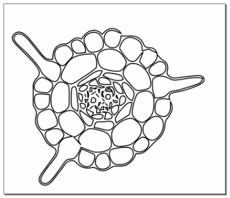
 
 

    Click on the edge of large fused polygon and move. Use the [drawing method](#draw) to make new polygons (blue) with the fused ones as templates. Place back the new polygons to make the tissue complete. 

  
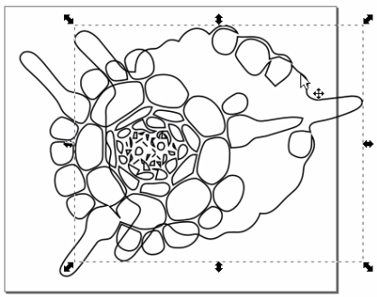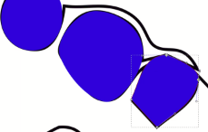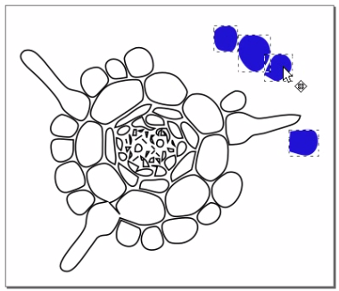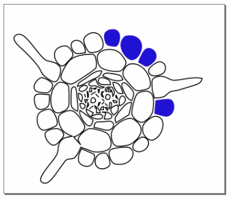

    If a large fused polygon needs to be separated, one can use the eraser tool. Drag the fused polygon away from the tissue, select the eraser tool from the left tool bar, then use the eraser to cut the fused polygon into three independent polygons. Select the cut polygons and click "Break Apart" under the "Path" tab at the top, then the three polygons are entirely separated. Place back the three polygons to make the tissue complete. 

  
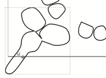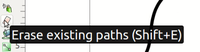

  

  9. Fill and stroke 

  Under "Object" tab at the top, select "Fill and Stroke...", then the "Fill and Stroke (Shift+Ctrl+F)" panel will come out on the right. Select all polygons by drawing a large rectangle over them. 

  

    Under the "Stroke paint" tab in the fill and stroke panel, select "Flat color". <b> Must make sure the “Alpha (opacity)” is 255, “Opacity(%)” is 100.0, and “Blur(%)” is 0.0 </b>. Under the "Stroke style" tab, set the stroke width, e.g.: 1.5 px. 

  

    Under the "Fill" tab, click "No paint", then the resulting blank svg image is ready to be used in next section. 

  

## Link the svg image with gene matrix

  In the svg image, each polygon is defined by a string of coordinates, and these strings have unique IDs. To use the Spatial Heatmap, these IDs should be replaced with sample names <b>exactly from gene matrix</b>. <b> No matter how the blank svg image is created, it should be [placed inside a layer](#layer) before linked to the gene matrix </b>.

  10. Group same tissues 

  If multiple polygons belong to the same tissue type, they can be grouped together. The example of grouping epidermis is given below. Open "XML Editor..." under the "Edit" tab on the top, then the "XML Editor (Shift+Ctrl+X)" panel comes out on the right. Select all the epidermis polygons by pressing the "Shift" key, right click and select "Group".  
  

  11. Associate polygons with samples 

  The corresponding epidermis group \<svg:g id="987"\> shows up in the XML panel. Click "id", change "g939" to "epidermis", and click "Set", then the new group id is set. This means all the polygons in this group correspond to epidermis.
  

 

    In the "Fill and Stroke (Shift+Ctrl+F)" panel, select "Flat color" under the "Fill" tag, then specify a color for epidermis (e.g. green). <b> Must make sure the “Alpha (opacity)” is 255, “Opacity(%)” is 100.0, and “Blur(%)” is 0.0 </b>. 

  

    Group other tissues, set ids and colours. 

  

  12. Tiny polygons 

  If the resolution of the template png image is poor, GIMP can produce tiny polygons. These tiny polygons can interfere with colour mapping in the spatial heatmap, i.e. some polygons in one tissue are mapped with the colour from the neighbour tissue. If this error arises, it suggests the presense of "tiny" polygons. <b> One sulution is to delete these tiny polygons from related tissue groups in the Inkscape XML editor. These tiny polygons only interfere with the group below them, so if such tiny polygons exist only in one tissue group (e.g. the stele tissue group in the root center), another solution is to place the group containing tiny polygons at the bottom in the XML editor, then no group will be interfered with. </b> 

  13. Encircling polygons 

  <b> If a polygon encircles other polygons and does not have a corresponding sample in the gene matrix, just a structure of the whole tissue, its "path" should be placed to the top over other "paths" in the "XML Editor". Otherwise, it can hide other tissues. </b> E.g. In the brain svg image, the grey outer polygon (the path "rect5480") encircling all other polygons is at the top over other "paths", which is drawn with Inkscape by refering to [here](http://anatomybodysystem.com/lateral-view-of-the-brain-labeled/lateral-view-of-the-brain-labeled-brain-diagram-and-label-anatomy-body-list/) and [here](https://www.epilepsyresearch.org.uk/the-hippocampus-what-is-it/). 

  

## Add text to label tissues

  Users can add text to label tissues. Basically, the text is first typed in with the text tool and then the text object is coverted to paths. Next text paths are added into the polygon group of target tissue and filled with the same tissue colour.

  14. Creat text paths 

  Select "Creat and select text objects (F8)" from the left tool bar, drag a text box, and type (epidermis). Click on the text object and convert it to path. 
  

  15. Text fill and stroke 

  Click on the text paths and fill them with the same colour of target tissue using "Pick colors from image (F7)" from the left tool bar. In the "Fill and Stroke" panel, set the stroke style and make sure <b> the “Alpha (opacity)” is 255, “Opacity(%)” is 100.0, and “Blur(%)” is 0.0 for both fill and stroke </b>.  
  

  16. Add text paths to tissue group 

  Click and cut the text. Double click the target tissue (epidermis, green) to enter the group.  
  

  Paste the text anywhere and move/resize it, then right click the text and ungroup it.  
  

  All the text paths are in the target tissue group (epidermis).  
  

  To add a pointer, [draw a rectangle](#shape) and convert it to path, fill it with the same style as the target tissue, then move, rotate and resize it.  

  

  Click one of any other tissues, then drag the target tissue to see the text and pointer are grouped together with the target.  

  

  Similarly, add text to other tissues.  
  

 

  17. Save the final svg graph, which is ready to use in the spatialHeatmap. The name of saved svg image can only consists of letters, digits, underscores. E.g. "root_cross_final.svg" is acceptable while "root_cross_final(copy).svg" will give errors. 

## Troubleshooting

  The process of making svg file is error-prone, if errors arise in the Spatial Heatmap app, such as some tissues are missing, then users are advised to double check the bold text above.

# Reference

  1. https://www.gimp.org/tutorials/
  2. https://inkscape.org/en/doc/tutorials/advanced/tutorial-advanced.en.html
  3. http://www.microugly.com/inkscape-quickguide/

