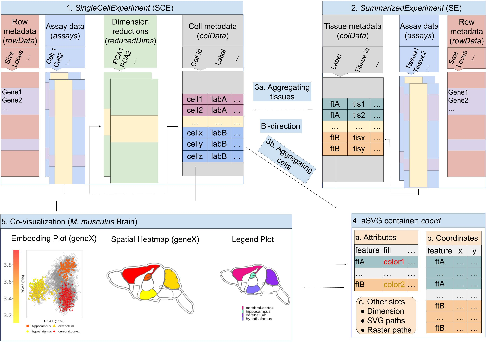
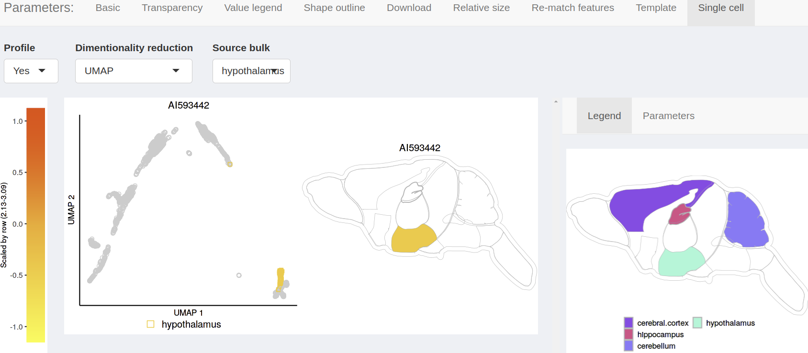

```{css, echo=FALSE}
pre code {
white-space: pre !important;
overflow-x: scroll !important;
word-break: keep-all !important;
word-wrap: initial !important;
}
```

```{r global_options, include=FALSE}
## ThG: chunk added to enable global knitr options. The below turns on
## caching for faster vignette re-build during text editing.
knitr::opts_chunk$set(cache=TRUE)
```
<!-- 
<style type="text/css">
 .main-container { max-width: 1800px; margin-left: 5px; margin-right: auto; }
</style>
<style>body { text-align: justify }</style>  

```{r css, echo = FALSE, results = 'asis'}
BiocStyle::markdown(css.files=c('file/custom.css'))
```
-->

```{r setup0, eval=TRUE, echo=FALSE, message=FALSE, warning=FALSE}
library(knitr); opts_chunk$set(message=FALSE, warning=FALSE)
```

# Introduction 


## Overview

The primary utility of the _spatialHeatmap_ package is the generation of
_spatial heatmaps_ (SHM) for visualizing cell-, tissue- and organ-specific
abundance patterns of biological molecules (_e.g._ RNAs) in anatomical images
[@shm]. This is useful for identifying molecules with spatially enriched (SE)
abundance patterns as well as clusters and/or network modules composed of
molecules sharing similar abundance patterns such as similar gene expression
patterns. These functionalities are introduced in the [main
vignette](https://bioconductor.org/packages/release/bioc/html/spatialHeatmap.html)
of the _spatialHeatmap_ package. The following describes extended
functionalities for integrating tissue with single cell data by
co-visualizing them in composite plots that combine spatial heatmaps with
embedding plots of high-dimensional data. The resulting spatial context
information is important for gaining insights into the tissue-level organiztion
of single cell data. 

The required quantitative assay data, such as gene expression values, can be
provided in a variety of widely used tabular data structures (_e.g._
`data.frame`, `SummarizedExperiment` or `SingleCellExperiment`). The corresponding
anatomic images need to be supplied as annotated SVG (aSVG) images. The
creation of aSVGs is described in the main vignette of this package. For the
embedding plots of single cell data, several dimensionality reduction
algorithms (_e.g._ PCA, UMAP or tSNE) are supported. To associate single cells
with their source tissues, the user can choose among three major methods including 
annotation-based, manual and automated methods (Figure \@ref(fig:covizOver)). Similar 
to other functionalities in _spatialHeatmap_, these functionalities are available within
R as well as the corresponding [Shiny app](#autoSCE) [@shiny].   

## Methods for Associating Cells and Bulk Tissues


To co-visualize single cell data with tissue features (Figure
\@ref(fig:covizOver)), the individual cells of the single cell data are mapped
via their group labels to the corresponding tissue features in an aSVG image. If
the feature labels in an aSVG are different than the corresponding group labels
used for the single cell data, _e.g._ due to variable terminologies, a
translation map can be used to avoid manual relabelling. Throughout this
vignette the usage of the term feature is a generalization referring in most
cases to tissues or organs. For the implementation of the co-visualization
tool, _spatialHeatmap_ takes advantage of efficient and reusable Bioconductor
core data structures such as the widely used `SingleCellExperiment` (`SCE`)
container illustrated in Figure \@ref(fig:covizOver).1 [@sce]. The slots
`assays`, `colData`, `rowData` and `reducedDims` in an `SCE` contain expression data,
cell metadata, molecule metadata and reduced dimensionality embedding results,
respectively. The cell group labels are stored in the `colData` slot as shown
in Figure \@ref(fig:covizOver).1. For handling cell-to-tissue grouping
information, three general methods are available including (a)
annotation-based, (b) manual and (c) automated (Figure \@ref(fig:covizOver).2).
The annotation-based and manual methods are similar by using known cell group
labels. The main difference is how the cell labels are provided. In the
annotation-based method, existing group labels are available and can be
uploades and/or stored in the `SCE` object, as is the case in some of the `SCE`
instances provided by the `scRNAseq` package [@scrnaseq]. The manual method
allows users to create the cell to tissue associations one-by-one or import
them from a tabular file. In contrast to this, the automated method aims to
assign single cells to the corresponding source tissues computationally by a
co-clustering algorithm (Figure \@ref(fig:covizOver).2c). This co-clustering is
experimental and requires bulk expression data that are obtained from the
tissues represented in the single cell data. The grouping information is
visualized by using for each group the same color in both the single cell
embedding plot and the tissue spatial heatmap plot (Figure
\@ref(fig:covizOver).4). The colors can represent any type of custom or numeric
information. In a typical use case, either fixed tissue-specific colors or a
heat color gradient is used that is proportional to the numeric expression
information obtained from the single cell or bulk expression data of a chosen
gene. When the expression values among groups are very similar, toggling
between the two coloring option is important to track the tissue origin in
the single cell data. To color by single cell data, one often wants to first
summarize the expression of a given gene across the cells within each group via a
meaningful summary statistics, such as mean or median. Cells and tissues with
the same group label will be colored the same. When coloring by tissues
the color used for each tissue feature will be applied to the corresponding 
cell groups represented in the embedding plot. 

```{r covizOver, echo=FALSE, fig.wide=TRUE, out.width="100%", fig.cap=("Overview of single cell and tissue co-visualization. (1) Single cell data are organized in a `SingleCellExperiment` object where cell grouping information is stored in the `colData` slot. Usally, each cell group maps to a certain tissue in the spatial heatmap plot. (2) The cell grouping labels are managed by three methods: annotation, manual and automated. Cell groups and tissues can be colored by fixed tissue colors or by expression values of selected genes based on the provided single cell or bulk data.")} 

```

# Getting Started  

## Installation  

The `spatialHeatmap` package can be installed with the `BiocManager::install` command.  

```{ eval=FALSE, echo=TRUE, warnings=FALSE} 
if (!requireNamespace("BiocManager", quietly = TRUE))
    install.packages("BiocManager")
BiocManager::install("spatialHeatmap")
```

## Packages and Documentation

Next, the packages required for running the sample code in this vignette need
to be loaded.  

```{r, eval=TRUE, echo=TRUE, warnings=FALSE, results='hide'}
library(spatialHeatmap); library(SummarizedExperiment); library(scran); library(scater); library(igraph); library(SingleCellExperiment); library(BiocParallel)
```

The following lists the vignette(s) of this package in an HTML browser.
Clicking the name of the corresponding vignette will open it. 

```{r, eval=FALSE, echo=TRUE, warnings=FALSE}
browseVignettes('spatialHeatmap')
```

To reduce runtime, intermediate results can be cached under `~/.cache/shm`.  

```{r eval=TRUE, echo=TRUE, message=FALSE, warnings=FALSE }
cache.pa <- '~/.cache/shm' # Set path of the cache directory
```

# Quick Start {#test}

To obtain for examples with randomized data or parameters always the same results, a fixed seed is set.

```{r , eval=TRUE, echo=TRUE, warnings=FALSE}
set.seed(10)
```

A single cell test data set is loaded using `mockSCE` from the `scuttle`
package [@scater]. The data are normalized and log2-transformed
(`logNormCounts`), and subsequently processed by a dimensionality reduction
method such as PCA, TSNE or UMAP (`reduce_dim`).    

```{r , eval=TRUE, echo=TRUE, warnings=FALSE}
sce.test <- mockSCE() 
sce.norm.test <- logNormCounts(sce.test)
sce.dimred.test <- reduce_dim(sce.norm.test) 
```

The downstream co-visualization is demonstrated on the cell cycle labels
(`Cell_Cycle`) including _G1_, _S_, _G0_ and _G2M_.   

```{r , eval=TRUE, echo=TRUE, warnings=FALSE}
colData(sce.dimred.test)[1:2, ]
unique(colData(sce.dimred.test)$Cell_Cycle)
```

To visualize single cell data in spatial heatmaps, the single cell expression values
are summarized by their source tissue grouping using common summary statistics such as mean or median. 

```{r , eval=TRUE, echo=TRUE, warnings=FALSE}
sce.aggr.test <- aggr_rep(sce.dimred.test, assay.na='logcounts', sam.factor='Cell_Cycle', con.factor=NULL, aggr='mean')
colData(sce.aggr.test)
```

The summarized values are then used to color the tissue features of the corresponding
aSVG file of mouse brain that is included in the `spatialHeatmap` package. The
function `return_feature` is used for feature extraction. 

```{r , eval=TRUE, echo=TRUE, warnings=FALSE, results='hide'}
svg.mus.brain <- system.file("extdata/shinyApp/example", "mus_musculus.brain.svg", package="spatialHeatmap")
feature.df <- return_feature(svg.path=svg.mus.brain)
```

A subset of features is returned from `feature.df`.

```{r , eval=TRUE, echo=TRUE, warnings=FALSE}
tail(feature.df$feature) 
```

In the chosen example each cell cycle corresponds to one feature in the aSVG
image. To define this relationship, a `list` with named components is used.
Note, each cell label can be matched to multiple aSVG features but not vice
versa. 

<p style="color:red">Using a cell cycle data set as an exmple is a poor choice since
all tissues in your spatial heatmap will have cells from most/all cell cycles.</p>

```{r , eval=TRUE, echo=TRUE, warnings=FALSE}
lis.match.test <- list(G1=c('hypothalamus'), G0=c('brainstem', 'medulla.oblongata'))
```
<p style="color:red">Unclear why individual cell types would map to specific tissues? 
even if this is juat a toy example why not using one that makes sense? Especially,
biologists will be confused here. </p>

A co-visualization plot is created using gene `Gene_0010` as an example. The embedding
plot on the left includes all cells. The `G1` and `G0` cells are colored by their 
summarized group expression values (`data=sce.aggr.test`). The corresponding source 
tissues in the spatial heatmap plot are colored accordingly. The `cell.group` argument
specifies which column to use as cell labels under `colData` for `sce.aggr.test`.  

```{r , eval=TRUE, echo=TRUE, warnings=FALSE, results='hide', fig.cap=('Co-visualization of single cell data and tissue features. The co-visualization is created for gene `Gene_0010`. Single cells in the embedding plot on the left and their matching aSVG features in the spatial heatmap on the right are connected by the same color. Heat colors are used to represent the summarized expression values for each cell group.')}
shm.lis.test <- spatial_hm(svg.path=svg.mus.brain, data=sce.aggr.test, ID=c('Gene_0010'), height=0.7, legend.r=1.5, legend.key.size=0.02, legend.text.size=12, legend.nrow=3, sce.dimred=sce.dimred.test, dimred='PCA', cell.group='Cell_Cycle', assay.na='logcounts', tar.cell=c('matched'), lis.rematch=lis.match.test, bar.width=0.11, dim.lgd.nrow=1)
```

<p style="color:red">Why isn't the covisualization handled by its own function that
calls spatial_hm. Having one function do too many things is poor software design.
</p>

# Cell-to-Tissue Mappings

## Annotation-based

The annotation-based mapping uses existing cell-to-tissue labels. Those can be imported 
(_e.g._ from a tabular file) and then stored in the `colData` slot of an `SCE` object. 
Alternatively, an `SCE` object might already contain this information. This is the 
case in some of the `SCE` objects provided by the `scRNAseq` package [@scrnaseq].    

The following example uses single cell data from oligodendrocytes of mouse
brain [@Marques2016-ff]. This data set was obtained from the `scRNAseq`
[@scrnaseq] package with minor modificatons. Prior to co-visualization, the
single cell data is pre-processed by the `process_cell_meta` function 
that applies common QC, normalization and dimensionality reduction routines.
The details of these pre-processing methods are described in the corresponding 
help file. Additional background information on these topics can be found in the 
[OSCA](http://bioconductor.org/books/3.14/OSCA.workflows/zeisel-mouse-brain-strt-seq.html){target='blank'} tutorial.

<!--
[ThG: obove your referred to OSCA to find the details, Yet now you are describing some 
of the details here that are really not necessary for explaining the covisualization.
Either delete the following or explain it in the help file for your process_cell_meta 
function.]
In QC, common per-cell metrics are cacluated such as library size, mitochodrial gene percentage, *etc*. Then problematic cells are filtered out according to these metrics. Refer to `perCellQCMetrics` and `perCellQCFilters` in the `scuttle` package for more details [@scater]. In normalization, per-cell size factors are computed using a scaling normalization method followed by a deconvolution strategy. Single cells are finally normalized by these per-cell size factors. See more details in `quickCluster`, `computeSumFactors` from the `scran` package [@scran], and `logNormCounts` from the `scuttle` package [@scater].  

In dimensionality reduction, the high-dimensional gene expression data are embedded into a 2-3
dimensional space using PCA, tSNE and UMAP. All three embedding result sets
are stored in the `SingleCellExperiment` object. Details are seen in `denoisePCA` from `scran` [@scran], and `runUMAP`, `runTSNE` from `scater` [@scater]. Subsequently, the UMAP result is visualized as an example in form of a scatter plot where the dots are colored by the corresponding cell labels.
--> 

```{r scRead, eval=TRUE, echo=TRUE, warnings=FALSE}
sce.pa <- system.file("extdata/shinyApp/example", "sce_manual_mouse.rds", package="spatialHeatmap")
sce <- readRDS(sce.pa)
sce.dimred <- process_cell_meta(sce, qc.metric=list(subsets=list(Mt=rowData(sce)$featureType=='mito'), threshold=1))
```

The UMAP embedding results can be plotted with the `plotUMAP` function. The dots representing cells are colored by the grouping information stored in the `colData` slot of the `SCE` object. 

<a name='cusLab'></a>

```{r eval=TRUE, echo=TRUE, warnings=FALSE, fig.wide=TRUE, fig.cap=('Embedding plot of single cell data. The cells (dots) are colored by the grouping information stored in the `colData` slot of the corresponding `SCE` object'), out.width="100%", fig.show='show'}
plotUMAP(sce.dimred, colour_by="label")
```

The following command returns a slice of the cell metadata stored in the `colData` slot of an `SCE` object. Any grouping column in `colData` can be used here as annotation labels for co-visualization. The following example uses the `label` and `expVar` columns 
as annotations and experimental variables, respectively.    

```{r scLab, eval=TRUE, echo=TRUE, warnings=FALSE}
colData(sce.dimred)[25:27, ]
```

The expression values for each gene are summarized across the cells within each group (here `aggr='mean'`). If additional experimental variables are provided, the summaries will consider them as well (_e.g._ `label` and `expVar`). 

```{r scLabAggr, eval=TRUE, echo=TRUE, warnings=FALSE}
sce.aggr <- aggr_rep(sce.dimred, assay.na='logcounts', sam.factor='label', con.factor='expVar', aggr='mean')
```

A slice of the summarized data is printed below for two genes (Tcea1 and Atp6v1h), where `hypothalamus` and `control` are the grouping and treatment information, respectively. 


```{r eval=TRUE, echo=TRUE, warnings=FALSE}
as.matrix(logcounts(sce.aggr)[1:2, 1:2])
```

Next, spatial features are extracted with the `return_feature` function 
from an aSVG image of mouse brain. 

```{r eval=TRUE, echo=TRUE, warnings=FALSE, results='hide'}
svg.mus.brain <- system.file("extdata/shinyApp/example", "mus_musculus.brain.svg", package="spatialHeatmap")
feature.df <- return_feature(svg.path=svg.mus.brain)
```
A subset of features can be extracted as follows.  

```{r eval=TRUE, echo=TRUE, warnings=FALSE}
tail(feature.df$feature)
```

In practice the labels used for the features in the aSVG image and the cell groups of the single cell data may not be the same. To resolve this without manual relabeling, a translation list is used to make them match, where the cell and feature labels are expected to be the names and elements of the list components, respectively. 

```{r scLabList, eval=TRUE, echo=TRUE, warnings=FALSE}
lis.match <- list(hypothalamus=c('hypothalamus'), cortex.S1=c('cerebral.cortex'), corpus.callosum=c('corpus.striatum'))
```

The following plots the corresponding co-visualization for sample gene Cops5. A co-visualization plot is generated for each experimental variable, here `control` and `6h.post.stress`. The legend under the embedding plots shows the cell labels in the matching list (`lis.match`). The source tissue information is indicated by using the same colors in the embedding and tissue plots on the left and right, respectively. 

```{r scLabVis, eval=TRUE, echo=TRUE, warnings=FALSE, fig.wide=TRUE, fig.cap=('Co-visualizing single cells and tissues by annotation. In this plot, `Cops5` is used as an example. Each cell population is colored by its summarized expression value in the embedding plot on the left, and the corresponding tissue shares the same color in the spatial heatmap on the right.'), out.width="100%", fig.show='show', results='hide'}
shm.lis <- spatial_hm(svg.path=svg.mus.brain, data=sce.aggr, ID=c('Cops5'), height=0.7, legend.r=1.5, legend.key.size=0.02, legend.text.size=12, legend.nrow=2, sce.dimred=sce.dimred, dimred='PCA', cell.group='label', assay.na='logcounts', tar.cell=c('matched'), lis.rematch=lis.match, bar.width=0.09, dim.lgd.nrow=2)
```
<p style="color:red">Several things are missing: (1) To track tissue assignment, if expression values are similar across tissues, there needs to be an argument toggle to color one time by expression values and another time by tissue. Otherwise tissue assignment info is lost. (2) I don't understand the plot on the bottom that shows the stress sample. Why does the sp heatmap highlight in this case only one tissue? </p>

## Manual Method

To provide additional flexibility for defining cell groupings, several manual
options are provided. Here users can assign cell groups manually or by
clustering methods for single cell embedding data that are often used in the
analysis of single cell embedding data. The resulting cell grouping or cluster
information needs to be stored in a tabular file, that will be imported into an
`SCE` object (here `manual_group` function). The following demonstration uses
the same single cell and aSVG data as the annotation example above. The only
difference is an additional clustering step. For demonstration purposes a small
example of a cluster file is included  in the `spatialHeatmap` package. In this
case the group labels were created by the `cluster_cell` function. The details
of this function are available in its help file. The cluster file contains at
least two columns: a `cell` column with single cell identifiers used under
`colData` and a `cluster` column with the cell group labels. For practical
reasons of building this vignette a pure manual example could not be used here.
However, the chosen clustering example can be easily adapted to manual or
hybrid grouping approach since the underlying tabular data structure is the
same for both that can be generated in most text or spreadsheet programs.

```{r eval=TRUE, echo=TRUE, warnings=FALSE}
manual.clus.mus.sc.pa <- system.file("extdata/shinyApp/example", "manual_cluster_mouse_brain.txt", package="spatialHeatmap")
manual.clus.mus.sc <- read.table(manual.clus.mus.sc.pa, header=TRUE, sep='\t')
manual.clus.mus.sc[1:3, ]
```

<a name='manual_clus'></a>

The `manual_group` function can be used to append the imported group labels to the `colData` slot of an `SCE` object without interferring with other functions and methods operating
on `SCE` objects.

```{r eval=TRUE, echo=TRUE, warnings=FALSE}
sce.clus <- manual_group(sce=sce.dimred, df.group=manual.clus.mus.sc, cell='cell', cell.group='cluster')
colData(sce.clus)[1:3, ]
```

An embedding plot of single cell data is created. The cells represented as dots are 
colored by the grouping information stored in the `cluster` column of the `colData`
slot of `SCE`.   

```{r eval=TRUE, echo=TRUE, warnings=FALSE, fig.wide=TRUE, fig.cap=('Embedding plot of single cells. The cells (dots) are colored by the grouping information stored in the `colData` slot of the corresponding `SCE` object .'), out.width="100%", fig.show='show'}
plotUMAP(sce.clus, colour_by="cluster")
```

The same mouse brain aSVG as above is used here.  

```{r eval=TRUE, echo=TRUE, warnings=FALSE}
tail(feature.df$feature)
```

Similarly as above, a mapping list is used to match the cell clusters with aSVG
features.

```{r scAutoList, eval=TRUE, echo=TRUE, warnings=FALSE}
lis.match.clus <- list('clus1'=c('cerebral.cortex'), 'clus3'=c('hypothalamus', 'midbrain'))
```

The gene expression values are summarized for the cells within each group.

```{r scAutoAggr, eval=TRUE, echo=TRUE, warnings=FALSE}
sce.clus.aggr <- aggr_rep(sce.clus, assay.na='logcounts', sam.factor='cluster', con.factor=NULL, aggr='mean')
```

The co-visualization is plotted for gene `Rpl7`. In this example the coloring
is based on the gene expression summary for each cell group obtained by clustering.
Completely manual groupings can be provided the same way.  

```{r scAutoVis, eval=TRUE, echo=TRUE, warnings=FALSE, fig.wide=TRUE, fig.cap=('Co-visualization of single cell data and tissue features with cluster groupings. Gene `Rpl7` is used as an example and the cell groupings were obtained by clustering.'), out.width="100%", fig.show='show', results='hide'}
shm.lis <- spatial_hm(svg.path=svg.mus.brain, data=sce.clus.aggr, ID=c('Rpl7'), height=0.7, legend.r=1.5, legend.key.size=0.02, legend.text.size=12, legend.nrow=3, sce.dimred=sce.clus, dimred='PCA', cell.group='cluster', assay.na='logcounts', tar.cell=c('matched'), lis.rematch=lis.match.clus, bar.width=0.09, dim.lgd.nrow=1)
```

## Automated Method

If both single cell and bulk gene expression data are available for the same or
overlapping tissues then co-clustering can be used to assign cells to tissues
automatically (Figure \@ref(fig:coclusOver)). Subsequently, the predicted
cell-to-tissue assignments can be used for co-visualizing single cell embedding
data with tissue level bulk data. This approach could help to predict the
source tissues for unassigned cells without prior knowledge as is required for
the annotation and manual approaches introduced above. While attractive there
are various challenges to overcome to reliably co-cluster single cell data with
the corresponding tissue-level bulk data. This is due to the different
properties of single cell and bulk gene expression data, such as lower
sensitity and higher sparsity in single cell compared to bulk data. This
section introduces a co-clustering method that is largely based on parameter
optimization including three major steps. First, the genes in the bulk data are
reduced to those robustly expressed in the single cell data. Second, the
methods and their parameter settings used for preprocessing both data types are
optimized to achieve the most robust results. Third, the best performing
clustering method for this data is chosen. Both preprocessing and clustering
parameters are optimized on real data with known cell-to-tissue assignments.
The following introduces the three steps of this method based on RNA-Seq data.

1. The raw read count matrix of the single cell data is reduced to genes
   with robust expression across X% cells. The bulk data is subsetted to the
   same genes and then column-wise appended to the processed single cell count
   matrix. As a result the sparcity in the single cell data has been reduced
   and the bulk data has been made more compareable by subsetting it to the same 
   genes.
2. The combined single cell and bulk read count data are normalized jointly.
   After separating single cell and bulk data, they are filtered a second time
   and then embedded using PCA (UMAP or other).
3. Co-clustering is performed on the embedding data where single cells are joined
   with the nearest neighbor bulk tissue. 

<p style="color:red">I have removed a lot of text from this section as well as the
legend of the corresponding figure. The text was far too long and contained a lot 
of detail that doesn't belong in a section of a vignette that is supposed to be 
a tutorial. In addition, I wasn't able to understand several parts making it 
impossible for me to revise your write-up. So please fill in additional details 
that are required under the three steps/bullets above but be consise and focus 
on the essentials and leave out the exceptions.</p> 

<p style="color:red">A few questions I have are: (1) in many cases you say some
step has been optimized but then you don't give the name of the method that has
actually been chosen. For instance, what normalization method, what embedding
method and most importantly what method for co-clustering is then actually been
used? So keep it short but mention those relevant details. (2) As described you
seem to have performed the embedding separatedly on the single cell and bulk
data, but then combine the embeddings for the co-clustering. Are you sure this 
is valid? I would be very concerned that those embeddings are relative data that 
need to be generted jointly on both to remain compareable. Perhaps I am 
misunderstanding? (3) The purpose of the clustering step and co-clustering steps 
are not clearly defined. The reader will think they are the same or just get confused. </p>

```{r coclusOver, echo=FALSE, fig.wide=TRUE, out.width="100%", fig.cap=("Overview of co-clustering. Details of each step are explained in the text.")}
include_graphics('img/coclustering.jpg')
```

<p style="color:red">After revising the method outline for the co-clustering
please revise the figure 7 above accordingly. The legend can just refer to the
main text to avoid duplication. PLEASE keep it simple and clear.
If a figure raises more questions than it answers then it defeats the purpose of
guiding the reader and providing clarity. </p>

To obtain reasonably robust default settings for co-clustering, the
preprocessing methods and their parameters have been optimized. This includes
the filtering, normalization, dimension reduction, and cluster refinement
steps. The details of this optimization are given
[here](https://jianhaizhang.github.io/spatialHeatmap_supplement/cocluster_optimize.html).
The following applies the co-clustering method using single cell and bulk data
from mouse brain [@Vacher2021-xg; @Ortiz2020-yt]. Both data sets have been
simplified for demonstraton purposes. 


<p style="color:red">That's how far I could edit your text. </p>

### Pre-processing {#proCoclus}

To obtain reproducible results, a fixed seed is set for generating random numbers.    

```{r , eval=TRUE, echo=TRUE, warnings=FALSE}
set.seed(10)
```

The example bulk and single cell count data are included in `spatialHeatmap` and imported. Replicates of the same bulk tissue should have the same identifiers. For example, all replicates of Cerebral Cortex have the label `CERE.CORTEX` instead of `CERE.CORTEX1`, `CERE.CORTEX2`, and so on.       

```{r , eval=TRUE, echo=TRUE, warnings=FALSE}
# Example bulk data.
blk.mus.pa <- system.file("extdata/shinyApp/example", "bulk_mouse_cocluster.txt", package="spatialHeatmap") 
blk.mus <- as.matrix(read.table(blk.mus.pa, header=TRUE, row.names=1, sep='\t', check.names=FALSE))
blk.mus[1:3, 1:5]

# Example single cell data.
sc.mus.pa <- system.file("extdata/shinyApp/example", "cell_mouse_cocluster.txt", package="spatialHeatmap") 
sc.mus <- as.matrix(read.table(sc.mus.pa, header=TRUE, row.names=1, sep='\t', check.names=FALSE))
sc.mus[1:3, 1:5]
```

Make sure bulk tissues and single cells do not share identifiers. Otherwise, the co-clustering results are not accurate.  

```{r , eval=TRUE, echo=TRUE, warnings=FALSE}
intersect(colnames(blk.mus), colnames(sc.mus))
```

The raw count data of bulk tissues and single cells are initially filtered to remove noisy values for subsequent normalization. In bulk data, genes with counts over 5 across bulk tissues at a minimum proportion of 0.05 (`pOA`) and coefficient of variances (`CV`) between 0.05 and 100 are retained. Refer to `filterfun` in the `geneflter` package for more details [@Gentleman2018-xj]. In single cell data, cells with a minimum count of 1 (`min.cnt=1`) in at least 1% (`p.in.cell=0.01`) of genes are retained. Genes with a minimum count of 1 (`min.cnt=1`) in at least 5% (`p.in.gen=0.05`) of cells are retained.   

```{r , eval=TRUE, echo=TRUE, warnings=FALSE}
blk.mus.fil1 <- filter_data(data=blk.mus, pOA=c(0.05, 5), CV=c(0.05, 100), verbose=FALSE) 
mus.lis.fil1 <- filter_cell(lis=list(sc.mus=sc.mus), bulk=blk.mus.fil1, min.cnt=1, p.in.cell=0.01, p.in.gen=0.05, verbose=FALSE) 
```

The main different between bulk and single cell data is the sparsity in the latter. To reduce such difference, they are combined in a column-wise manner and normalized together, then separated. The whole process is a single function call on `norm_multi`.    

```{r , eval=TRUE, echo=TRUE, warnings=FALSE, results='hide'}
mus.lis.nor <- read_cache(cache.pa, 'mus.lis.nor') 
if (is.null(mus.lis.nor)) { 
  mus.lis.nor <- norm_multi(dat.lis=mus.lis.fil1, cpm=FALSE)
  save_cache(dir=cache.pa, overwrite=TRUE, mus.lis.nor)
}
```

The log2-scale normalized data of bulk tissues and single cells are filtered at a second time respectively in a similar way as the initial filtering.   

```{r , eval=TRUE, echo=TRUE, warnings=FALSE}
blk.mus.fil2 <- filter_data(data=mus.lis.nor$bulk, pOA=c(0.1, 1), CV=c(0.1, 50), verbose=FALSE) 
mus.lis.fil2 <- filter_cell(lis=list(sc.mus=mus.lis.nor$sc.mus), bulk=blk.mus.fil2, min.cnt=1, p.in.cell=0.1, p.in.gen=0.01, verbose=FALSE) 
```

The same aSVG file of mouse brain as the [Quick Start](#test) is used. The process of extracting aSVG features is not shown.  

```{r , eval=TRUE, echo=TRUE, warnings=FALSE}
tail(feature.df$feature) # Partial features are shown.
```

The matching between bulk and single cells are automatic, while the matching between aSVG features and bulk tissues needs to be defined by users in a `data.frame`. Since there is no uniform naming scheme for aSVG features or bulk tissues. In most cases, identifiers of aSVG features and bulk tissues are user dependent, especially when they are from different sources. The matching `data.frame` is utilized to coordinate differences of naming schemes between aSVG features and bulk tissues. In addition, it gives flexibility for users to choose desired identifiers.  

The matching table for this example is included in `spatialHeatmap` and imported. The `SVGBulk` and `dataBulk` columns are aSVG features and bulk tissues respectively. Note, these two columns names are fixed so that the algorithm is able to recognize them.    


```{r , eval=TRUE, echo=TRUE, warnings=FALSE}
match.mus.brain.pa <- system.file("extdata/shinyApp/example", "match_mouse_brain_cocluster.txt", package="spatialHeatmap")
df.match.mus.brain <- read.table(match.mus.brain.pa, header=TRUE, row.names=1, sep='\t')
df.match.mus.brain
``` 

### Co-clustering

The processes of clustering single cells (Figure \@ref(fig:coclusOver).4), refining cell clusters (Figure \@ref(fig:coclusOver).5), and
co-clustering bulk and single cells (Figure \@ref(fig:coclusOver).6-8) are
performed in a single function call. Setting `return.all=TRUE` returns results in a `list` (`res.lis`).     

```{r , eval=TRUE, echo=TRUE, warnings=FALSE, results='hide'}  
res.lis <- read_cache(cache.pa, 'res.lis')
if (is.null(res.lis)) {
  res.lis <- coclus_meta(bulk=mus.lis.fil2$bulk, cell=mus.lis.fil2$sc.mus, df.match=df.match.mus.brain, return.all=TRUE, multi.core.par=MulticoreParam(workers=1), verbose=FALSE)
  res.lis <- res.lis[[1]]
  save_cache(dir=cache.pa, overwrite=TRUE, res.lis)
}
```

<a name='autoRes'></a>

The source bulk tissue assignments are stored in the `colData` slot of `sce.asg` in the result list (`res.lis`), which are partialy shown below. The `assignedBulk` indicates assigned source bulk tissues for each cell, and the `SVGBulk` contains corresponding aSVG features, which is based on the matching table `df.match.mus.brain`. The `predictor` includes similarities (Spearman's correlation coefficient) between single cells and assigned bulk tissues.    

```{r , eval=TRUE, echo=TRUE, warnings=FALSE}  
colData(res.lis$sce.asg)[1:2, c('cell', 'assignedBulk', 'predictor', 'SVGBulk')]
```

The co-cluster information is stored in the `colData` slot of `sce.bulk.cell` in the result list (`res.lis`). The `cluster` and `cell` columns indicate co-cluster labels and bulk/cell identifiers respectively.    

```{r , eval=TRUE, echo=TRUE, warnings=FALSE}
colData(res.lis$sce.bulk.cell)[1:3, ]
```

Each co-cluster consisting of bulk and cells can be visualized in an embedding plot. The following plot is the visualization of co-cluster `clus11`, where other bulk and cells are in gray.   

```{r , eval=TRUE, echo=TRUE, warnings=FALSE, fig.wide=TRUE, fig.cap=('Embedding plot of co-clusters. Dots represent bulk tissues or single cells. The bulk and cells in the target co-cluster are in blue while all other bulk and cells are in gray.'), out.width="80%", fig.show='show'}
plot_dim(res.lis$sce.bulk.cell, dim='PCA', color.by='cluster', group.sel='clus11')
```


### Tailoring Co-clustering Results {#tailor}

The automatic (co-clustering) method is optimized and tested on a small number of real bulk and single cell datasets, due to the limited availability of single cell datasets where single cells are assayed on a whole organ or whole large tissue and each single cell is well annotated. Thus, the accuracy of automatic source bulk tissue assignments might be also limited. As a remedy, utilities are developed for tailoring the automatic bulk tissue assignments at user preferences. Note, the tailoring step is optional, if users are satisfied with the bulk assignments, just proceed to the [co-visualization](#covisAuto) step.   

The tailoring can be performed in command line or on a [Shiny app](#asgBulkShiny). This section illustrates the command-line based tailoring. First visualize single cells after single-cell cluster refining (Figure \@ref(fig:coclusOver).5) in an embedding plot as shown below. In order to define more accurate coordinates in the next step, tune the x-y axis breaks (`x.break`, `y.break`) and set `panel.grid=TRUE`.   


```{r , eval=TRUE, echo=TRUE, warnings=FALSE, fig.wide=TRUE, fig.cap=('PCA embedding plot of mouse brain single cell data. Single cells right after cluster refining are plotted.'), out.width="100%", fig.show='show'}
plot_dim(res.lis$cell.refined, dim='UMAP', color.by='cell', x.break=seq(-10, 10, 1), y.break=seq(-10, 10, 1), panel.grid=TRUE)
```

Define desired bulk tissues (`desiredSVGBulk`) for cells selected by x-y coordinate ranges (`x.min`, `x.max`, `y.min`, `y.max`) in the embedding plot in form of a `data.frame` (`df.desired.bulk`). The `dimred` reveals where the coordinates come from and are required. In this example, `cerebellum` is the desired bulk tissue for cells in the selected region.   

```{r , eval=TRUE, echo=TRUE, warnings=FALSE}  
df.desired.bulk <- data.frame(x.min=c(1), x.max=c(3), y.min=c(3), y.max=c(4), desiredSVGBulk=c('hypothalamus'), dimred='UMAP')
df.desired.bulk
```

Incorporate desired bulk assignments to co-clustering results by calling `refine_asg`. The [predictors](#autoRes) corresponding to desired bulk are internally set at the maximum of 1. The `thr` argument is a predictor threshold and used to filter bulk assignments.   


```{r , eval=TRUE, echo=TRUE, warnings=FALSE}  
res.lis <- refine_asg(res.lis=res.lis, thr=0, df.desired.bulk=df.desired.bulk, df.match=df.match.mus.brain)
```

### Co-visualization {#covisAuto}

Similar with the annotation-based and manual methods, cells under the same SVG feature (bulk tissue) are aggregated by averaging (`aggr='mean'`) normalized assay profiles (`assay.na='logcounts'`). The aggregated assay profiles are used to color corresponding aSVG features.   


```{r , eval=TRUE, echo=TRUE, warnings=FALSE}  
sce.aggr <- aggr_rep(data=res.lis$sce.asg, assay.na='logcounts', sam.factor='SVGBulk', con.factor=NULL, aggr='mean')
```

The co-visualization of bulk and single cells is built on aggregated gene abundance profiles (`profile=TRUE`) of gene `Adcy1`. All available bulk tissues (aSVG features) are selected as targets, *i.e.* `hippocampus`, `hypothalamus`, `cerebellum` and `cerebral.cortex`. In the embedding plot, cells matching the same target aSVG feature in the anatomical image are colored according to their aggregated assay profiles, and the same color is used to fill their matching aSVG features. The cells defined in `df.desired.bulk` in the [tailoring](#tailor) section are also colored in the embedding plot and counted when aggregating expression profiles.   

```{r , eval=TRUE, echo=TRUE, warnings=FALSE, fig.wide=TRUE, fig.cap=('Co-visualizing bulk and single cells of mouse brain with abundance profiles. The aggregated expression profile of gene `Adcy1` in cells matching the same bulk is used to fill these cells and bulk tissues.'), out.width="100%", fig.show='show', results='hide'}
shm.lis1 <- spatial_hm(svg.path=svg.mus.brain, data=sce.aggr, ID=c('Adcy1'), legend.nrow=4, sce.dimred=res.lis$cell.refined, assay.na='logcounts', dimred='UMAP', tar.bulk=c('hippocampus', 'hypothalamus', 'cerebellum', 'cerebral.cortex'), profile=TRUE, dim.lgd.text.size=10, dim.lgd.nrow=2, bar.width=0.1)
```

Bulk tissues and single cells are co-visualized without abundance profiles (`profile=FALSE`). All available bulk tissues (aSVG features) are selected to show, *i.e.* `hippocampus`, `hypothalamus`, `cerebellum` and `cerebral.cortex`. They are filled by different colors in the anatomical image, while the matching cells are indicated in the embedding plot with the same color as their source bulk tissues. Cells selected in the [tailoring](#tailor) section are also colored in the embedding plot.    

```{r , eval=TRUE, echo=TRUE, warnings=FALSE, fig.wide=TRUE, fig.cap=('Co-visualizing bulk and single cells of mouse brain without abundance profiles. The matching between cells and source bulk tissues (aSVG features) is denoted by the same color between the embedding plot and anatomical image.'), out.width="100%", fig.show='show', results='hide'}
shm.lis2 <- spatial_hm(svg.path=svg.mus.brain, data=sce.aggr, legend.nrow=4, sce.dimred=res.lis$cell.refined, dimred='UMAP', tar.bulk=c('hippocampus', 'hypothalamus', 'cerebellum', 'cerebral.cortex'), profile=FALSE, dim.lgd.text.size=10, dim.lgd.nrow=2)
```

# Shiny App {#autoSCE}


The co-visualization feature is included in the integrated Shiny app that is an GUI implementation of `spatialHeatmap`, including annotation-based, maual, and automatic methods. To start this app, simply call `shiny_shm()` in R. Below is a screenshot of the co-visulization output generated by the automatic method.  

```{r echo=FALSE, fig.wide=TRUE, out.width="100%", fig.cap=('Screenshot of the co-visualization output in Shiny app. The co-visualization plot is generated by the automatic method.')}

```

When using the Shiny app, single cell data in annotation-based and manual methods or combined
single cell and bulk data in automatic method are stored in a `SingleCellExperiment` object and saved in an `.rds` file by `saveRDS`, then the `.rds` file should be uploaded to the app. In the manual method, the manual cell group labels in a tabular file should be included in the `colData` slot by calling `manual_group` before creating an `.rds` file, as shown [here](#manual_clus). In the automatic method, bulk tissues and single cells are labeled by `bulk` and `cell`
respectively in the `bulkCell` column in `colData` slot. The matching table between bulk tissues and aSVG features is stored in the `metadata` list with the name `df.match`. The example `.rds` file below illustrates these rules.     

```{r , eval=TRUE, echo=TRUE, warnings=FALSE}  
sce.auto <- readRDS(system.file("extdata/shinyApp/example", 'sce_auto_bulk_cell_mouse_brain.rds', package="spatialHeatmap"))
colData(sce.auto)
metadata(sce.auto)$df.match
```

# Supplementary Section {#sup} 

## Assigning Desired Bulk on Shiny App {#asgBulkShiny}


This section describes [tailoring](#tailor) co-clustering results on the convenience Shiny app, which is lauched by calling `desired_bulk_shiny`. 

Figure \@ref(fig:tailorShiny) is the screenshot of the Shiny app. The file to upload is an `.rds` file of a `SingleCellExperiment` object saved by `saveRDS`. An example of how to generate such a file is seen in the help file of `desired_bulk_shiny`. On the left embedding plot, cells are selected with the "Lasso Select" tool. On the right, selected cells and their coordinates are listed in a table, and the desired bulk tissues (aSVG features) can be selected from the dropdown list, here `cerebral.cortex`. To download the table just click the "Download" button. The "Help" button gives more instructions.  

```{r tailorShiny, echo=FALSE, fig.wide=TRUE, out.width="100%", fig.cap=('Screenshot of the Shiny app for selecting desired bulk tissues. On the left is the embedding plot of single cells, where target cells are selected with the "Lasso Select" tool. On the right, desired bulk tissues are assigned for selected cell.')}
include_graphics('img/assign_bulk.png')
```

An example of desired bulk downloaded from the convenience Shiny app is shown below. The x-y coordinates refer to single cells in embbeding plots (`dimred`). The `df.desired.bulk` is ready to use in the [tailoring](#tailor) section.   
 
```{r eval=TRUE, echo=TRUE, warnings=FALSE}  
desired.blk.pa <- system.file("extdata/shinyApp/example", "selected_cells_with_desired_bulk.txt", package="spatialHeatmap")
df.desired.bulk <- read.table(desired.blk.pa, header=TRUE, row.names=1, sep='\t')
df.desired.bulk[1:3, ]
``` 


<br/>

# Version Informaion 

```{r eval=TRUE, echo=TRUE}
sessionInfo()
```

# Funding

This project has been funded by NSF awards: [PGRP-1546879](https://www.nsf.gov/awardsearch/showAward?AWD_ID=1546879&HistoricalAwards=false){target="_blank"}, [PGRP-1810468](https://www.nsf.gov/awardsearch/showAward?AWD_ID=1810468){target="_blank"}, [PGRP-1936492](https://www.nsf.gov/awardsearch/showAward?AWD_ID=1936492&HistoricalAwards=false){target="_blank"}.

# References
<!-- 
ThG: keep this html comment to number Reference list like any other section in table of content.
-->


