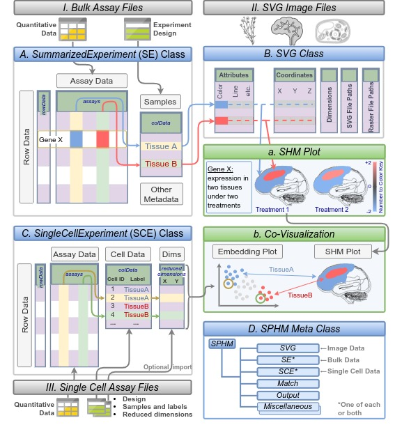
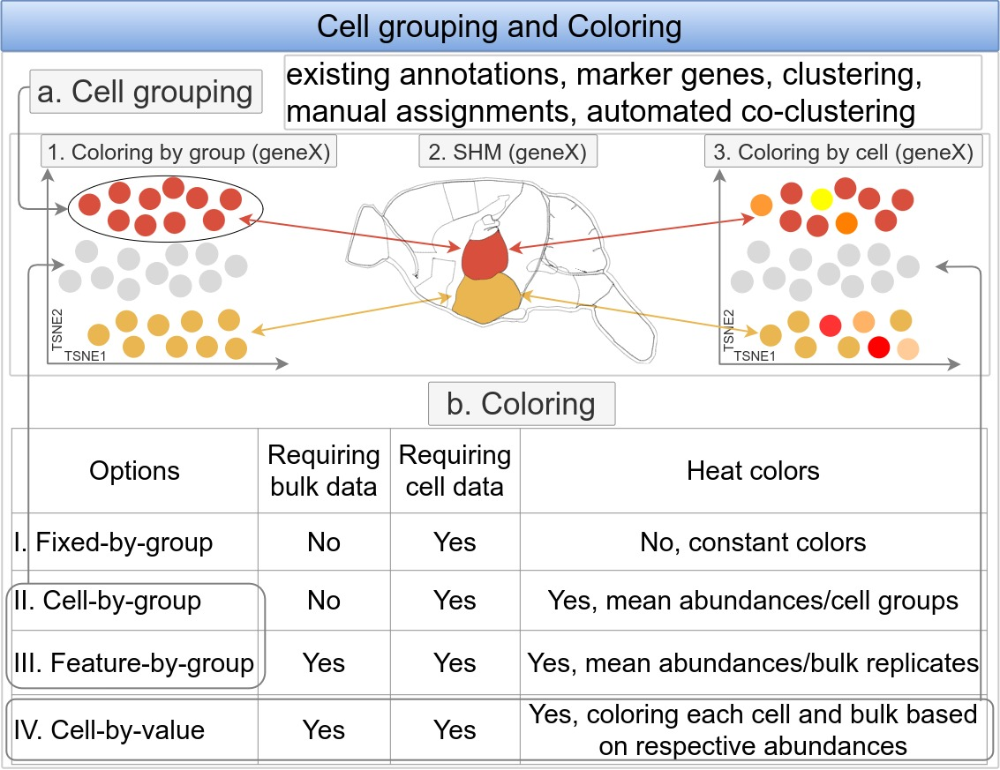
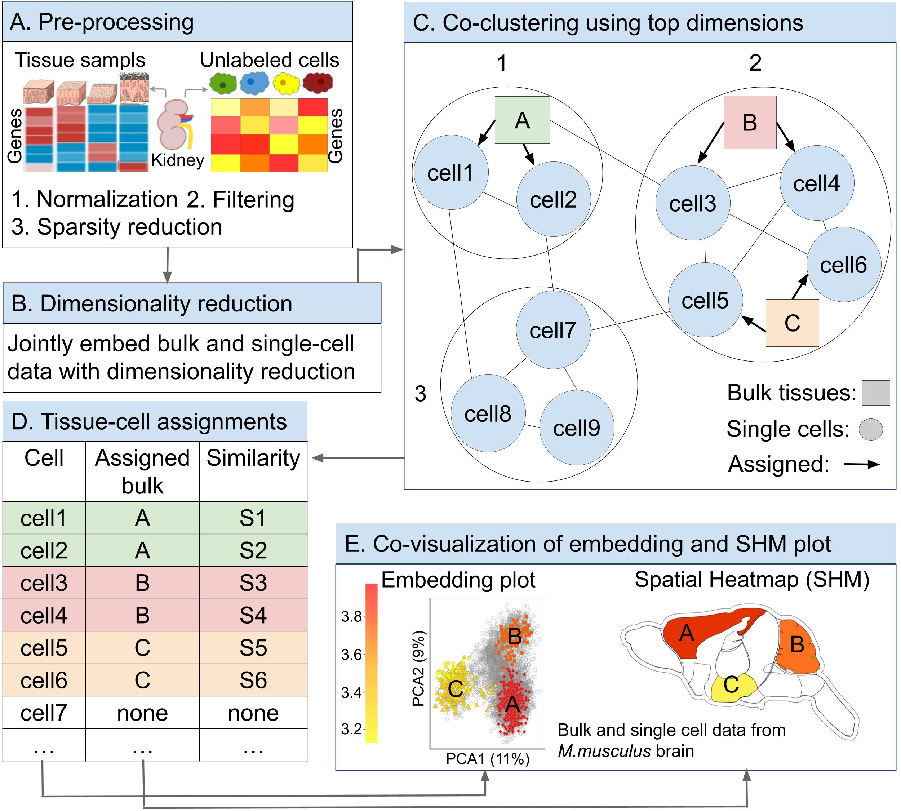
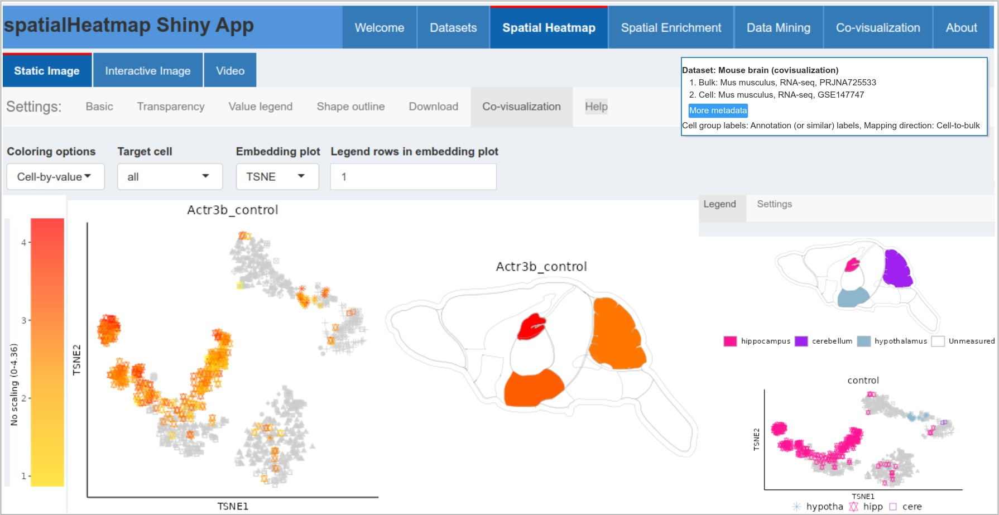

```{css, echo=FALSE}
pre code {
white-space: pre !important;
overflow-x: scroll !important;
word-break: keep-all !important;
word-wrap: initial !important;
}
```

```{r global_options, include=FALSE}
## ThG: chunk added to enable global knitr options. The below turns on
## caching for faster vignette re-build during text editing.
knitr::opts_chunk$set(cache=TRUE)
```
<!-- 
<style type="text/css">
 .main-container { max-width: 1800px; margin-left: 5px; margin-right: auto; }
</style>
<style>body { text-align: justify }</style>  

```{r css, echo = FALSE, results = 'asis'}
BiocStyle::markdown(css.files=c('file/custom.css'))
```
-->

```{r setup0, eval=TRUE, echo=FALSE, message=FALSE, warning=FALSE}
library(knitr); opts_chunk$set(message=FALSE, warning=FALSE)
```
<font style='color:blue'>
JH: explanations on blue color: <br> 
1. Any changes (including small changes) are indicated by blue color. <br>
2. A paragraph in blue: either big changes in text or relocated without text change.
</font>

# Introduction 

<span style="color:red">[ThG: I have edited/commented sections 1-4. Overall
I think you should (1) provide a simple illustration in the introduction that
summarizes all 3 methods (annot, manual, co-clustring). Figure 5 can then be
removed since it is hard to follow and contains too much information relating to 
the supplement which we wanted to remove from this vignette. (2) Further please reduce 
the number of code chunks to make things easier for the user. For clarity you could 
use meta functions and summarize in the text what they are doing. Often you include the
individual steps but then there is no explanation given what they are doning. (3) The
optimization part needs to be entirely removed from the main part of this
vignette as there is no context given what its relevance is. (4) Please also
simplify the Supplement section 5 or remove it from the vignette and perhaps
include it in a script file that is then just referenced for expert users in
the text. Once this part 5 has been improved I will fine edit it. (5) 
In addition, please address my comments given in red font throughout the 
text.]</span>

## Overview

The primary utility of the _spatialHeatmap_ package is the generation of
spatial heatmaps (SHMs) for visualizing cell-, tissue- and organ-specific
abundance patterns of biological molecules (_e.g._ RNAs) in spatial anatomical images
[@shm]. This is useful for identifying biomolecules with spatially enriched/depleted 
abundance patterns as well as clusters and/or network modules composed of
biomolecules sharing similar abundance patterns such as similar gene expression
patterns. These functionalities are introduced in the [main
vignette](https://bioconductor.org/packages/release/bioc/html/spatialHeatmap.html){target='blank'}
of this package. The following describes extended
functionalities for integrating tissue with single-cell data by
co-visualizing them in composite plots that combine SHMs with
embedding plots of high-dimensional data. The resulting spatial context
information is important for gaining insights into the tissue-level organization
of single cell data or vice versa.   

## Data Structures

<font style='color:blue'> 
The supported bulk and single-cell assay data come from most large-scale profiling technologies such as transcriptomics, proteomics, metabolomics, etc, while the corresponding anatomical images need to be supplied as annotated SVG ([aSVG](https://bioconductor.org/packages/devel/bioc/vignettes/spatialHeatmap/inst/doc/spatialHeatmap.html#13_Image_Format:_SVG){target='blank'}) images, where spatial features (e.g. tissues) are assigned unique identifiers.   

To implement the co-visualization functionality, _spatialHeatmap_ takes advantage of efficient and reusable S4 classes for both assay data and aSVGs respectively. The former includes the Bioconductor core data structures `SummarizedExperiment` (`SE`, @se) and `SingleCellExperiment` (`SCE`, @sce) for bulk and single-cell data respectively (Figure \@ref(fig:datastr)A, C). The slots
`assays`, `colData`, and `rowData` contain expression values,
tissue/cell metadata, and biomolecule metadata respectively. For the embedding plots of single-cell data, the reduced dimensionality embedding results (PCA, UMAP or tSNE) are stored in the `reducedDims` slot of `SCE`.   

The S4 class `SVG` (Figure \@ref(fig:datastr)B) is developed specifically in `spatialHeatmap` for storing aSVG instances. The two most important slots `coordinate` and `attribute` stores the aSVG feature coordinates and respective attributes (colors, line withs, etc) respectively, while other slots `dimension`, `svg`, and `raster` stores image dimension, original aSVG instances, and raster image paths respectively. Moreover, the meta class `SPHM` (Figure \@ref(fig:datastr)D) is developed to harmonize these data objects.   

When creating co-visualization plots (Figure \@ref(fig:datastr)a-b), SHMs are created by mapping expression values from `SE` to corresponding spatial features in `SVG` through the same identifiers (here TissuesA and TissueB) between the two, and single cells in `SCE` are associated with spatial features through their group labels (here TissuesA and TissueB) stored in the `colData` slot.   
</font>

```{r datastr, echo=FALSE, fig.wide=TRUE, out.width="100%", fig.cap=("Schematic view of data structures and creation of co-visualization plots. File imports, classes, and plotting functionalities are illustrated in boxes with color-coded title bars in grey, blue and green, respectively. Quantitative and experimental design data (I) are imported into matching slots of an `SE` container (A). aSVG image files are stored in `SVG` containers (B). Expression profiles of a chosen gene (GeneX) in (A) are mapped to the corresponding spatial features in (B) via common identifiers (here TissuesA and TissueB). The quantitative data is represented in the matching features by colors according to a number to color key and the output is an SHM (a). For co-visualization plots, single-cell data are stored in the `SCE` object class (C). Reduced dimension data for embedding plots can be generated in R or imported from files. The single-cell embedding results are co-visualized with SHMs where the cell-to-tissue mappings are indicated by common colors in the co-visualization plot (b). The `SPHM` meta class organizes the individual objects (A)-(C) along with internally generated data.")} 

```

## Cell-Tissue Mapping and Coloring

<font style='color:blue'> 
To co-visualize bulk and single-cell data (Figure
\@ref(fig:datastr)b), the individual cells of the single-cell data are mapped
via their group labels to the corresponding tissue features in an aSVG image. For handling cell grouping
information, five major methods are supported including (1)
existing annotation labels, (2) manual assignments, (3) marker genes, (4) clustering labels, and (5) automated co-clustering (Figure \@ref(fig:grpcolor)a). In the
annotation method, existing group labels are available and can be
uploaded and/or stored in the `SCE` object, such as the `SCE`
instances in the `scRNAseq` package [@scrnaseq]. The manual method allows users to create cell-tissue associations one-by-one or import
them from a tabular file. The marker-gene method utilizes known marker genes to group cells. In the clustering method, cells are clustered and grouped by clustering labels. In contrast, the automated co-clustering aims to
assign source tissues to corresponding single cells computationally by a
co-clustering method (Figure \@ref(fig:coclusOver)). This method is
experimental and requires bulk expression data that are obtained from the
tissues represented in the single-cell data.   

The matching between cell groups in the embedding plots and tissue features in SHMs are indicated with four coloring schemes (Figure \@ref(fig:grpcolor)b). The first three 'fixed-group', 'cell-by-group', and 'feature-by-group' assign the same color for a cell group and matching tissue. The main difference is that 'fixed-group' uses constance colors while the latter two uses heat colors that is proportional to the numeric expression information obtained from the single cell or bulk expression data of a chosen gene. When expression values among groups are very similar, toggling between the constant and heat colors is important to track the tissue origin in
the single cell data. In 'cell-by-group' coloring, expression values of a given gene within each cell group are summarized by mean or median, then heat colors are created from the summary values and assigned to the corresponding cells and tissues (Figure \@ref(fig:grpcolor).1-2). In this case, the mapping direction is cell-to-tissue. The 'feature-by-group' coloring is similar except that heat colors are based on summary values of each tissue, and the mapping direction is tissue-to-cell. The most meaningful coloring is 'cell-by-value' (Figure \@ref(fig:grpcolor).2-3). In this option, each cell and tissue is colored independently according to respective expression values of a chosen gene, so the cellular heterogeneity is reflected.      
</font> 

Similar to other functionalities in _spatialHeatmap_, these functionalities are available within R as well as the corresponding [Shiny App](#autoSCE) [@shiny].   

<font style='color:blue'> 

```{r grpcolor, echo=FALSE, fig.wide=TRUE, out.width="100%", fig.cap=("Cell grouping and coloring. (a) For co-visualizing with SHMs, single cells need to have group labels. Five methods are supported to obtain group labels. (b) In the co-visualization plot, matching between cells and aSVG features is indicated by colors between the two. Four coloring options are summarized in a table. The cell grouping and coloring are schematically illustrated in 1-3.")} 

```

</font>

# Getting Started  

## Installation  

The `spatialHeatmap` package can be installed with the `BiocManager::install` command.  

```{ eval=FALSE, echo=TRUE, warnings=FALSE} 
if (!requireNamespace("BiocManager", quietly = TRUE))
    install.packages("BiocManager")
BiocManager::install("spatialHeatmap")
```

## Packages and Documentation

Next, the packages required for running the sample code in this vignette need to be loaded.  

```{r, eval=TRUE, echo=TRUE, warnings=FALSE, results='hide'}
library(spatialHeatmap); library(SummarizedExperiment); library(ggplot2); library(SingleCellExperiment);
library(kableExtra); library(Seurat)
```

The following lists the vignette(s) of this package in an HTML browser.
Clicking the name of the corresponding vignette will open it. 

```{r, eval=FALSE, echo=TRUE, warnings=FALSE}
browseVignettes('spatialHeatmap')
```

To reduce runtime, intermediate results can be cached under `~/.cache/shm`.  

```{r eval=TRUE, echo=TRUE, message=FALSE, warnings=FALSE }
cache.pa <- '~/.cache/shm' # Set path of the cache directory
```

# Quick Start {#test}

To obtain for examples with randomized data or parameters always the same results, a fixed seed is set.

```{r , eval=TRUE, echo=TRUE, warnings=FALSE}
set.seed(10)
```

<font style="color:blue">
This quick start example is demonstrated on 'cell-by-group' coloring by using a single-cell data set from oligodendrocytes of mouse brain [@Marques2016-ff], which is obtained from the `scRNAseq` [@scrnaseq].  

The single-cell data is first pre-processed by the `process_cell_meta` function that applies common QC, normalization and dimension reduction routines.
The details of these pre-processing methods are described in the corresponding 
help file. Additional background information on these topics can be found in the 
[OSCA](http://bioconductor.org/books/3.14/OSCA.workflows/zeisel-mouse-brain-strt-seq.html){target='blank'} tutorial.   

```{r , eval=TRUE, echo=TRUE, warnings=FALSE}
sce.pa <- system.file("extdata/shinyApp/data", "cell_mouse_brain.rds", package="spatialHeatmap")
sce <- readRDS(sce.pa)
sce.dimred.quick <- process_cell_meta(sce, qc.metric=list(subsets=list(Mt=rowData(sce)$featureType=='mito'), threshold=1))
colData(sce.dimred.quick)[1:3, 1:2]
```

The gene expression values in single-cell data 
are averaged within their group labels in the `label` column of `colData` slot, which correspond to their source tissues.  

```{r , eval=TRUE, echo=TRUE, warnings=FALSE}
sce.aggr.quick <- aggr_rep(sce.dimred.quick, assay.na='logcounts', sam.factor='label', aggr='mean')
```

The aSVG of mouse brain is imported with the function `read_svg` and stored in an `SVG` object `svg.mus.brain`.  

```{r , eval=TRUE, echo=TRUE, warnings=FALSE, results='hide'}
svg.mus.brain.pa <- system.file("extdata/shinyApp/data", "mus_musculus.brain.svg", package="spatialHeatmap")
svg.mus.brain <- read_svg(svg.mus.brain.pa)
```

A subset of features and related attributes are returned from `svg.mus.brain`, where `fill` and `stroke` refer to color and line width respectively.   

```{r , eval=TRUE, echo=TRUE, warnings=FALSE}
tail(attribute(svg.mus.brain)[[1]])[, 1:4]
```

<a name='list'></a>

Due to differences in naming conventions, cell group labels and tissue labels are often programatically different. To match the two, a `list` with named components is used, where cell labels are in name slots and tissue features are corresponding `list` elements (translation map). This is a general approach for ensuring cell group labels and tissue labels are programmatically matched. Note, in the cell-to-tisssue mapping, each cell label can be matched to multiple aSVG features but not vice versa.

```{r , eval=TRUE, echo=TRUE, warnings=FALSE}
lis.match.quick <- list(hypothalamus=c('hypothalamus'), cortex.S1=c('cerebral.cortex', 'nose'))
```

For efficient data management and reusability, the data objects for co-visualization are stored in an `SPHM` container.    

```{r , eval=TRUE, echo=TRUE, warnings=FALSE}
dat.quick <- SPHM(svg=svg.mus.brain, bulk=sce.aggr.quick, cell=sce.dimred.quick, match=lis.match.quick)
```

The co-visualization plot is created with gene `Apod` using the function `covis`. In the embedding plot, the `hypothalamus` and `cortex.S1` cells are colored according to their respecitive aggregated expression values of `Apod`. In the SHM plot, aSVG features are assigned the same color as the matching cells defined in `lis.match.quick`. The `cell.group` argument refers to cell group labels in the `colData` slot of `sce.aggr.quick`, `tar.cell` specifies the target cell groups to show, and `dimred` specifies the embeddings.  

```{r , eval=TRUE, echo=TRUE, warnings=FALSE, results='hide', fig.cap=('Co-visualization of "cell-by-group" coloring. The co-visualization is created with gene `Apod`. Single cells in the embedding plot and their matching aSVG features in the SHM are assigned the same colors that are created according to mean expression values of `Apod` within cell groups.')}
shm.res.quick <- covis(data=dat.quick, ID=c('Apod'), dimred='UMAP', cell.group='label', tar.cell=names(lis.match.quick), assay.na='logcounts', bar.width=0.09, dim.lgd.nrow=2, legend.r=1.5, legend.key.size=0.02, legend.text.size=10, legend.nrow=4, h=0.6, verbose=FALSE) 
```

</font>

# Co-visualization Plots

<font style='color:blue'>
This section showcases different cell grouping methods (Figure \@ref(fig:grpcolor)a) and coloring options (Figure \@ref(fig:grpcolor)b) for co-visualizing SHMs with single-cell embedding plots. As the cell grouping methods of annotation labels, clustering, manual assignments, and marker genes are very similar, this section only demonstrates the methods of annotation labels as well as automated co-clustering. The clustering/manual assignments are shown in the [Supplementary Section](#manClus). The 'cell-by-group' coloring is already showcased in the Quick Start, thus this section focuses on the other three coloring options. In addition, the co-visualization functioinality is demonstrated with patially resolved single-cell (SRSC) data.   
</font>

## Annotation Labels {#ann}

To obtain reproducible results, a fixed seed is set for generating random numbers.    

```{r , eval=TRUE, echo=TRUE, warnings=FALSE}
set.seed(10)
```

<font style='color:blue'>
This section demonstrates the co-visualization plots created with annotation labels and 'feature-by-group' coloring. The single-cell data are stored in an `SCE` object downloaded from the `scRNAseq` package [@scrnaseq], which is the same as the [Quick Start](#test) (`sce`). The annotation labels are stored in the `label` column of the `colData` slot and partially shown below.   

```{r eval=TRUE, echo=TRUE, warnings=FALSE}
colData(sce)[1:3, 1:2]
```

The bulk RNA-seq data are modified from a research on mouse cerebellar development [@Vacher2021-xg] and are imported in an `SE` object, which are partially shown below. Note, replicates
are indicated by the same tissue names (_e.g._ `cerebral.cortex`).   

```{r eval=TRUE, echo=TRUE, warnings=FALSE}
blk.mus.pa <- system.file("extdata/shinyApp/data", "bulk_mouse_cocluster.rds", package="spatialHeatmap") 
blk.mus <- readRDS(blk.mus.pa)
assay(blk.mus)[1:3, 1:5]
colData(blk.mus)[1:3, , drop=FALSE]
```

Bulk and single cell data are jointly normalized and subsequently separated.  

```{r eval=TRUE, echo=TRUE, warnings=FALSE}
mus.ann.nor <- read_cache(cache.pa, 'mus.ann.nor') 
if (is.null(mus.ann.nor)) {
  # Joint normalization.
  mus.lis.nor <- norm_cell(sce=sce, bulk=blk.mus, quick.clus=list(min.size = 100, d=15), com=FALSE)
  save_cache(dir=cache.pa, overwrite=TRUE, mus.ann.nor)
}
# Separate bulk and cell data.
blk.mus.nor <- mus.lis.nor$bulk
cell.mus.nor <- mus.lis.nor$cell
colData(cell.mus.nor) <- colData(sce)
```

In normalized single-cell data, dimension reductions are performed with PAC, UMAP, and TSNE methods respectively, then single cells are plotted at the TSNE dimensions, where cells are represented by dots and are colored by the annotation labels (`color.by="label"`).     

```{r eval=TRUE, echo=TRUE, warnings=FALSE, fig.wide=TRUE, fig.cap=('Embedding plot of single-cell data. The cells (dots) are colored by the grouping information stored in the `colData` slot of the corresponding `SCE` object'), out.width="70%", fig.show='show'}
cell.dim <- reduce_dim(cell.mus.nor, min.dim=5)
plot_dim(cell.dim, color.by="label", dim='UMAP')
```

In normalized bulk data, expression values for each gene are summarized by mean across tissue replicates (here `aggr='mean'`).    

```{r eval=TRUE, echo=TRUE, warnings=FALSE, results='hide'}
# Aggregation.
blk.mus.aggr <- aggr_rep(blk.mus.nor, sam.factor='sample', aggr='mean')
assay(blk.mus.aggr)[1:2, ]
```

The aSVG instance of mouse brain from the Quick Start is used. Partial of the aSVG features are shown.  

```{r eval=TRUE, echo=TRUE, warnings=FALSE}
tail(attribute(svg.mus.brain)[[1]])[1:3, 1:4]
```

Following the same conventions in the main vignette, at least one tissue in bulk data should have the same identifier with an aSVG feature so as to create SHM.  

```{r eval=TRUE, echo=TRUE, warnings=FALSE}
colnames(blk.mus) %in% attribute(svg.mus.brain)[[1]]$feature
```

Same with the [Quick Start](#list), a translation `list` is used to match cell group and tissue labels. In 'feature-by-group' coloring, the feature and cell labels should be be the names and corresponding elements of the `list`, respectively.   

```{r scLabList, eval=TRUE, echo=TRUE, warnings=FALSE}
lis.match.blk <- list(cerebral.cortex=c('cortex.S1'), hypothalamus=c('corpus.callosum', 'hypothalamus'))
```

The following plots the corresponding co-visualization for sample gene 'Cacnb4'. The legend under the embedding plot shows the cell labels in the matching list (`lis.match.blk`). The source tissue information is indicated by using the same colors in the embedding and SHM plots on the left and right, respectively. In contrast to the Quick Start, the `tar.bulk` indicates target tissues to show.   

```{r eval=TRUE, echo=TRUE, warnings=FALSE, fig.wide=TRUE, fig.cap=("Co-visualization plot with 'feature-by-group' coloring. This plot is created with gene 'Cacnb4'. Tissues in SHM are colored according to respective expression values of 'Cacnb4', and cells of each group in the embedding plot are assigned the same colors as the matching tissues in SHM."), out.width="100%", results='hide'}
# Store data objects in an SPHM container. 
dat.ann.tocell <- SPHM(svg=svg.mus.brain, bulk=blk.mus.aggr, cell=cell.dim, match=lis.match.blk)
covis(data=dat.ann.tocell, ID=c('Cacnb4'), dimred='UMAP', cell.group='label', tar.bulk=names(lis.match.blk), bar.width=0.09, dim.lgd.nrow=2, dim.lgd.text.size=12, h=0.6, legend.r=1.5, legend.key.size=0.02, legend.text.size=10, legend.nrow=3)
```

In scenarios where expression values are similar across tissues, the mapping between cells and tissues can be indicated by constant colors by setting `profile=FALSE`.   

```{r eval=TRUE, echo=TRUE, warnings=FALSE, fig.wide=TRUE, fig.cap=('Co-visualization plot of constant colors. In this plot, mapping beween cell groups and tissues are indicated by fixed colors instead of expression values. '), out.width="100%", fig.show='show', results='hide'}
covis(data=dat.ann.tocell, ID=c('Cacnb4'), profile=FALSE, dimred='UMAP', cell.group='label', tar.bulk=names(lis.match.blk), bar.width=0.09, dim.lgd.nrow=2, dim.lgd.text.size=12, h=0.8, legend.r=1.5, legend.key.size=0.02, legend.text.size=10, legend.nrow=3)
```

In the above examples, cells of the same group are assigned the same color in the embedding plots. It is useful to reveal matching between cell groups and tissues, but the cellular herterogeniety within groups is missing. The 'cell-by-value' coloring scheme is developed to overcome this limitation. In the following, this option is activated by `col.idp=TRUE`.  

```{r colidp, eval=TRUE, echo=TRUE, warnings=FALSE, fig.wide=TRUE, fig.cap=("Co-visualization plot with 'cell-by-value' coloring. This plot is created with gene 'Cacnb4'. Tissues in SHM and cells in embedding plot are colored independently according to respective expression values of 'Cacnb4'."), out.width="100%", results='hide'}
covis(data=dat.ann.tocell, ID=c('Cacnb4'), col.idp=TRUE, dimred='UMAP', cell.group='label', tar.bulk=names(lis.match.blk), bar.width=0.08, dim.lgd.nrow=2, dim.lgd.text.size=10, h=0.6, legend.r=0.1, legend.key.size=0.01, legend.text.size=10, legend.nrow=2)
```

</font>


## Co-clustering Labels 

If both single cell and bulk gene expression data are available for the same or
overlapping tissues then co-clustering can be used to assign cells to tissues
automatically (Figure \@ref(fig:coclusOver)). Subsequently, the predicted
tissue-cell assignments can be used for creating co-visualization plots. This approach is useful for predicting the
source tissues of unlabeled cells without prior knowledge as is required for
the annotation approach. While attractive there
are various challenges to overcome to reliably co-cluster single cell data with
the corresponding tissue-level bulk data. This is due to the different
properties of single cell and bulk gene expression data, such as lower
sensitivity and higher sparsity in single cell compared to bulk data. This
section introduces a co-clustering method that is largely based on parameter
optimization including three major steps. <font style='color:blue'> First, both data are preprocessed to retain the most reliable expression values (Figure \@ref(fig:coclusOver)A1-2). Second, the genes in the bulk data are
reduced to those robustly expressed in the single cell data (Figure \@ref(fig:coclusOver)A3). Third, bulk and cell data are co-clustered (Figure \@ref(fig:coclusOver)C) by using optimal default settings (Table \@ref(tab:optPar)) that are obtained through optimization on real data with known tissue-cell assignments. The following introduces the three steps of this method in more detail using
the example of RNA-Seq data.

1. The raw count matrices of bulk and single cells are column-wise combined for joint normalization (Figure \@ref(fig:coclusOver)A1). After separated from bulk data, the single-cell data are reduced to genes with robust expression across at least a proportion of cells and to cells with robust expression across at least a proportion of genes (Figure \@ref(fig:coclusOver)A2). In the bulk data, genes are filtered according to expression values exceeding a cutoff over a proportion of bulk samples and a coefficient of variance (CV) between CV1 and CV2 (Figure \@ref(fig:coclusOver)A2).   

2. The bulk data are subsetted to the same genes as the single cell data (Figure \@ref(fig:coclusOver)A3). This and the previous filtering steps reduce the sparsity in the single-cell data and the bulk data are made more compareable to the single cell data by subsetting it to the same genes.  

3. Bulk and single-cell data are column-wise combined for joint embedding using PCA or UMAP (Figure \@ref(fig:coclusOver)B). Co-clustering is then performed. Specifically, a graph is built on the the embedding data with methods (Table \@ref(tab:optPar)) from *scran* [@scran], where nodes are cells (or tissues) and edges are connections between nearest neighbors, and subsequently this graph is partitioned with methods (Table \@ref(tab:optPar)) from *igraph* to obtain clusters [@igraph]. Three types of clusters are produced. First, a single tissue is co-clustered with multiple cells (Figure \@ref(fig:coclusOver)C1), and this tissue is assigned to all these cells. Second, multiple tissues are co-clustered with multiple cells (Figure \@ref(fig:coclusOver)C2). The nearest-neighbor tissue is assigned to each cell based on the similarity measure Spearman's correlation coefficient. Third, no tissue is co-clustered with cells (Figure \@ref(fig:coclusOver)C3). All these cells are treated as unlabeled and represent candidates for discovering novel cell types. After co-clustering, cells are labeled by tissues or remain unlabeled (Figure \@ref(fig:coclusOver)D) and these labels are used for associating cells and tissues in embedding plots and SHMs, respectively (Figure \@ref(fig:coclusOver)E).   
</font>

```{r coclusOver, echo=FALSE, fig.wide=TRUE, out.width="100%", fig.cap=("Co-clustering illustration. (A) The single-cell and bulk tissue data are jointly pre-processed. (B) Single-cell and bulk data are embedded with dimension reduction methods. (C) The embedding results are used for co-clustering single-cells and bulk tissue data. Cells are assigned to tissues based on the clustering results as follows: (1) If a cluster contains a single tissue, then the cells of this cluster are assigned to the corresponding tissue. (2) If a cluster contains multiple tissues and cells, a nearest-neighbor approach resolves this ambiguous situation by assigning cells to the closest tissue sample. (3) Cells in clusters without tissue samples remain unassigned. (D) The cell-tissue assignments and the similarity scores of the predictions are stored in a table. (E) The predictions are used to color the cells by predicted source tissues in co-visualization plots.")}

```

<font style='color:blue'>
To achieve reasonably robust default settings, the co-clustering optimization focuses on the two most important steps: joint dimension reduction and co-clustering (Figure \@ref(fig:coclusOver)B-C). The relevant parameters associated with these steps are presented in Table \@ref(tab:optPar), with the optimal settings highlighted in bold. These optimal settings are adopted as the default settings. The details of this optimization are given [here](https://jianhaizhang.github.io/spatialHeatmap_supplement/cocluster_optimize.html){target='_blank'}. The following example applies the default settings (bold in Table \@ref(tab:optPar)) using single cell and bulk data from mouse brain
[@Vacher2021-xg; @Ortiz2020-yt]. Both data sets have been simplified for demonstraton purposes.   
</font>

```{r optPar, eval=TRUE, echo=FALSE, warnings=FALSE}
df.opt <- cbind(
Parameter=c('dimensionReduction (dimred)', 'topDimensions (dims)', 'graphBuilding (graph.meth)', 'clusterDetection (cluster)'),
Settings=c( 
'**PCA**, UMAP', '5 to 80 (**14**)', '**knn**, snn', 'wt, **fg**, le'
),
Description=c(
'Dimension reduction methods. Choosing "PCA" and "UMAP" involves utilizing the "denoisePCA" function from the scran package and the "runUMAP" function from the scater package, respectively', 
'Number of top dimensions selected for co-clustering.',
'Methods for building a graph where nodes are cells and edges are connections between nearest neighbors. Choosing "knn" and "snn" involves utilizing the "buildKNNGraph" and "buildSNNGraph" function from the scran package, respectively.',
'Methods for partitioning the graph to generate clusters. Choosing "wt", "fg", and "le" involves utilizing the "cluster_walktrap", "cluster_fast_greedy", and "cluster_leading_eigen" function from the igraph package, respectively.'
)
)
#write.table(df.opt, 'cocluster_para.txt', col.names=TRUE, row.names=TRUE, sep='\t')

kable(df.opt, caption='Settings for optimization. Optimal settings are indicated by bold text.', col.names=colnames(df.opt), row.names=FALSE, escape=TRUE) %>%  kable_styling("striped", full_width = TRUE) %>% scroll_box(width = "700px", height = "230px")
```

### Pre-processing {#proCoclus}

To obtain reproducible results, a fixed seed is set for generating random numbers.    

```{r , eval=TRUE, echo=TRUE, warnings=FALSE}
set.seed(10)
```

<font style='color:blue'>
The bulk data (`blk.mus`) are the same with the [Annotation Labels](#ann) section. The following imports the single-cell data from the `spatialHeatmap` package and shows its partial metadata in `colData` slot.  
</font>

```{r eval=TRUE, echo=TRUE, warnings=FALSE}
sc.mus.pa <- system.file("extdata/shinyApp/data", "cell_mouse_cocluster.rds", package="spatialHeatmap") 
sc.mus <- readRDS(sc.mus.pa)
colData(sc.mus)[1:3, , drop=FALSE]
```

<font style='color:blue'>
Bulk and single cell raw count data are jointly normalized by the function `norm_cell`, which is a wrapper of `computeSumFactors` from `scran` [@scran]. `com=FALSE` means bulk and single cells are separated after normalization for subsequent separate filtering.  
</font>

```{r eval=TRUE, echo=TRUE, warnings=FALSE, results='hide'}
#mus.lis.nor <- read_cache(cache.pa, 'mus.lis.nor') 
#if (is.null(mus.lis.nor)) {
  mus.lis.nor <- norm_cell(sce=sc.mus, bulk=blk.mus, com=FALSE)
  save_cache(dir=cache.pa, overwrite=TRUE, mus.lis.nor)
#}
```

<font style='color:blue'>
The normalized single cell and bulk data (log2-scale) are filtered to remove low expression values and reduce sparsity in the former. In the bulk data, replicates are first aggregated by taking means using the function `aggr_rep`. Then genes are filtered according to expression values $\ge$ 1 at a proportion of $\ge 10\%$ (`pOA`) across bulk samples and a coefficient of variance (`CV`) between $0.1-50$ [@Gentleman2018-xj]. 

In the single cell data, genes with expression values $\ge 1$ (`cutoff=1`) in $\ge 1\%$ (`p.in.gen=0.01`) of cells are retained, and cells having expression values $\ge 1$ (`cutoff=1`)
in $\ge 10\%$ (`p.in.cell=0.1`) of all genes are retained.      
</font>

```{r , eval=TRUE, echo=TRUE, warnings=FALSE}
# Aggregate bulk replicates
blk.mus.aggr <- aggr_rep(data=mus.lis.nor$bulk, assay.na='logcounts', sam.factor='sample', aggr='mean')
# Filter bulk
blk.mus.fil <- filter_data(data=blk.mus.aggr, pOA=c(0.1, 1), CV=c(0.1, 50), verbose=FALSE) 
# Filter cell and subset bulk to genes in cell
blk.sc.mus.fil <- filter_cell(sce=mus.lis.nor$cell, bulk=blk.mus.fil, cutoff=1, p.in.cell=0.1, p.in.gen=0.01, verbose=FALSE) 
```

Compared to bulk RNA-Seq data, single cell data has a much higher level of
sparsity. This difference is reduced by the above filtering and then subsetting
the bulk data to the genes remaining in the filtered single cell data. This
entire process is accomplished by the `filter_cell` function.  

The same mouse brain aSVG as in the [Quick Start](#test) section is used here and the aSVG importing is omitted for brevity.  

```{r , eval=TRUE, echo=TRUE, warnings=FALSE}
tail(attribute(svg.mus.brain)[[1]])[1:3, 1:4] # Partial features are shown.
```

### Co-clustering

<p style="color:red">I have tried my best with the co-clustering section, but had to stop since this section is FAR TO LONG and often confusing. Rather than cutting to the chase (here co-cluster and plot co-viz), you bury the interesting parts in too much detail and lengthy descriptions of exceptions. For instance the Tailoring part should be removed or moved to the supplement. After having described how the co-visualization works the co-clustering should be performed in a few lines of code and then the co-viz plot generated. That is all. Despite all of this detail your are currently providing, you are not including the relevant information such as what clustering algorithm is actually used at the end. So please do the following:</p> 

1. <p style="color:red">Revise the entire tutorial section of the co-clustering to 2 short code blocks and another one that plots the co-viz. Importantly, the above pre-processing should be included in the 2 short code blocks!</p>
2. <p style="color:red">Address my comments and questions I included in the vignette in red.  </p>
3. <p style="color:red">Currently, the data point (dots) of the bulk data are not shown in the scatter plots after co-clustering. This would be a feature everyone would expect to see for a co-clustering utility that focuses on visualization. One also might want to have a co-clustering stringency filter that allows to show only those cells that are tightly co-clustered with the bulk data points, meaning when the stringency is increased only those cells are shown that are in closer proximity to the bulk.  Thus, showing the bulk in the scatter plot would be extremely useful.</p>


<font style='color:blue'>
The co-clustering process is implemented in the function `cocluster`. In the following, default settings obtained from the optimization are used, where `min.dim`, `dimred`, `graph.meth`, and `cluster` refers to `topDimensions`, `dimensionReduction`, `graphBuilding`, and `clusterDetection` in Table \@ref(tab:optPar) respectively. The results are saved in `coclus.mus`.    
</font>

```{r eval=TRUE, echo=TRUE, warnings=FALSE, results='hide'}  
coclus.mus <- read_cache(cache.pa, 'coclus.mus')
if (is.null(coclus.mus)) {
  coclus.mus <- cocluster(bulk=blk.sc.mus.fil$bulk, cell=blk.sc.mus.fil$cell, min.dim=14, dimred='PCA', graph.meth='knn', cluster='fg')
  save_cache(dir=cache.pa, overwrite=TRUE, coclus.mus)
}
```

<font style='color:blue'>
The tissue-cell assignments from the co-clustering process are stored in the `colData` slot of the `coclus.mus` object. The 'cluster' column represents cluster labels, 'bulkCell' indicates whether each entry represents bulk tissues or single cells, 'sample' represents the original labels of the bulk and cells, 'assignedBulk' refers to the bulk tissues assigned to cells with 'none' indicating unassigned cells, and 'similarity' represents Spearman's correlation coefficients used for the tissue-cell assignments, serving as a measure of assignment stringency.
</font>

```{r eval=TRUE, echo=TRUE, warnings=FALSE}
colData(coclus.mus)
```

<font style='color:blue'>
The tissue-cell assignments can be controled by filtering the values in the `similarity` column. This utility is impletmented in function `filter_asg`, where only assignments with similarities above the cutoff `min.sim` will be retained. Utilities are also developed to tailor the assignments, such as assigning specific tissues to cells without assignments. Details of the tailoring are explained in the [Supplementary Section](#tailor).   
</font>

```{r eval=TRUE, echo=TRUE, warnings=FALSE}
coclus.mus <- filter_asg(coclus.mus, min.sim=0.1)
```

<font style="color:blue">
The co-clusters that consist of tissues and cells can be visualized in an embeding plot with the function `plot_dim`. The `dim` argument specifies an embedding method. To see all co-clusters, assign `TRUE` to `cocluster.only`, in this case, other clusters containing only cells will be in grey. To only show a specific cluster, assign the cluster label to `group.sel`, for example, `group.sel='clus3'`. In the embedding plot, tissues and cells are indicated by large and small circles respectively.  
</font>

```{r , eval=TRUE, echo=TRUE, warnings=FALSE, fig.wide=TRUE, fig.cap=('Embedding plot of co-clusters. Large and small circles refer to tissues and single cells respectively. '), out.width="80%", fig.show='show', results='hide'}
plot_dim(coclus.mus, dim='PCA', color.by='cluster', cocluster.only=TRUE, group.sel=NULL)
```

### Co-visualization {#covisAuto}

<font style="color:blue">
In co-clustering based co-visualization, assigned tissues are treated as group labels for cells. This section focuses on the 'cell-by-value' coloring, other coloring options (Figure \@ref(fig:grpcolor)b) are provided in the [Supplementary Section](#coclusColor).     

Single-cell and bulk data are separated from each other.  
</font>

```{r , eval=TRUE, echo=TRUE, warnings=FALSE}  
# Separate bulk data.
coclus.blk <- subset(coclus.mus, , bulkCell=='bulk')
# Separate single cell data.
coclus.sc <- subset(coclus.mus, , bulkCell=='cell')
```

<font style="color:blue">
The co-visualization of 'cell-by-value' coloring is built on gene 'Atp2b1'. Each cell in the embedding plot and each tissue in SHM are colored independently according to respective expression value of 'Atp2b1'. The matching between cells and tissues are indicated in the legend plot with constant colors.    
</font>

```{r , eval=TRUE, echo=TRUE, warnings=FALSE, fig.wide=TRUE, fig.cap=('Co-visualization of "cell-by-value" coloring with the co-clustering method. This plot is created on gene "Atp2b1". Each cell and each tissue are colored independently according to expression values of "Atp2b1".'), out.width="100%", results='hide'}
# Store data objects in an SPHM container. 
dat.auto.idp <- SPHM(svg=svg.mus.brain, bulk=coclus.blk, cell=coclus.sc)
covis(data=dat.auto.idp, ID=c('Atp2b1'), dimred='TSNE', tar.cell=c('hippocampus', 'hypothalamus', 'cerebellum', 'cerebral.cortex'), col.idp=TRUE, dim.lgd.text.size=10, dim.lgd.nrow=2, bar.width=0.08, legend.nrow=3, h=0.6, legend.key.size=0.01, legend.text.size=10, legend.r=0.27)
```

## Spatial Single-Cell Data

Except for conventional single-cell data, the co-visualization module is able to co-visualize spatially resolved single-cell (SRSC) and bulk data as well. In the following example, the bulk data are the same as the [Annotation Labels](#ann) section, while the SRSC data are from the anterior region of sagittal mouse brain (10X Genomics Visium). For simplicity, the pre-processing steps of bulk and SRSC data are not described here and the pre-processed data are imported directly. These steps include (1) jointly normalizing bulk and SRSC data and subsequently separating them, which is performed with the the function `norm_srsc` in `spatialHeatmap`, (2) reducing dimensions (PCA, UMAP, TSNE) of the separated SRSC data, and (3) clustering the SRSC data. More details are described in the `Seurat` [vignette](https://satijalab.org/seurat/articles/spatial_vignette.html){target='_blank'} [@seurat1, @seurat2, @seurat3, @seurat4].    

The pre-processed bulk and SRSC data are imported and partially shown.     

```{r eval=TRUE, echo=TRUE, warnings=FALSE, collapse=TRUE}
# Importing bulk data.
blk.sp <- readRDS(system.file("extdata/shinyApp/data", "bulk_sp.rds", package="spatialHeatmap"))
# Bulk assay data are partially shown.
assay(blk.sp)[1:3, ]
# Importing SRSC data.
srt.sc <- read_cache(cache.pa, 'srt.sc') 
if (is.null(srt.sc)) {
  srt.sc <- readRDS(gzcon(url("https://zenodo.org/record/8240964/files/srt_sc.rds?download=1")))
  save_cache(dir=cache.pa, overwrite=TRUE, srt.sc)
}
# SRSC assay data are partially shown.
srt.sc@assays$SCT@data[1:3, 1:2]
```

The SRSC data are stored in a `Seurat` object. The cluster labels of cells are stored in the `seurat_clusters` column of the `meta.data` slot and partially shown.  

```{r eval=TRUE, echo=TRUE, warnings=FALSE, collapse=TRUE}
# SRSC metadata of cells are partially shown.
srt.sc@meta.data[1:2, c('seurat_clusters', 'nFeature_SCT')]
```

The coordinates of spatial spots are stored in the `image` slot in the `Seurat` object and partially shown.  

```{r eval=TRUE, echo=TRUE, warnings=FALSE, collapse=TRUE}
# Coordinates of spatial spots are partially shown.
srt.sc@images$anterior1@coordinates[1:2, c('imagerow', 'imagecol')]
```

The aSVG of mouse brain is included in `spatialHeatmap` and imported into an `SVG` object.  

```{r eval=TRUE, echo=TRUE, warnings=FALSE, results='hide'}
svg.mus.sp <- read_svg(system.file("extdata/shinyApp/data", "mus_musculus.brain_sp.svg", package="spatialHeatmap"), srsc=TRUE)
```

In order to position spatial spots in the SRSC data correctly in the aSVG, a shape named `overlay` that defines the region of the spatial spots is required in the aSVG. By using this shape as a reference, the coordinates of spatial spots in the SRSC data are transformed so that all these spots are positioned within this shape. The `overlay` shape can be created in an SVG editor such as Inkscape. The process involves using the spatial plot generated by the `SpatialFeaturePlot` function in `Seurat` as a template.   

```{r eval=TRUE, echo=TRUE, warnings=FALSE}
attribute(svg.mus.sp)[[1]][7:8, c('feature', 'id', 'fill', 'stroke')]
```

In the `SVG` object, the `angle` slot is designed for optionally rotating the spatial spots. In the SRSC data generated by the Visium technology, a 90 degree rotation is required for correctly positioning the spatial spots, which is shown below.  

```{r eval=TRUE, echo=TRUE, warnings=FALSE}
angle(svg.mus.sp)[[1]] <- angle(svg.mus.sp)[[1]] + 90 
```

The co-visualization plot is created with the gene 'Epha4' using 'cell-by-value' coloring. Assigning `FALSE` to `profile` will turn on the 'fixed-group' coloring. The cluster labels are treated as the cell group labels (`cell.group='seurat_clusters'`). The 'cerebral.cortex' tissue anatomically correspond to cell clusters of 'clus1', 'clus2', 'clus3', and 'clus5', and this association is defined by a `list` called `lis.match`. The co-visualization plot consists of an embedding plot on the left, a single-cell SHM (scSHM) in the middle, and a SHM on the right. In the scSHM, spatial spots are positioned in the `overlay` region and superimposed the anatomical structures in the aSVG.    

```{r eval=TRUE, echo=TRUE, warnings=FALSE, fig.wide=TRUE, fig.cap=('Co-visualization of SRSC data with SHM. This plot is created on gene "Epha4". Each spatial spot and each tissue are colored independently according to expression values of "Epha4".'), out.width="100%", fig.show='show', results='hide'}
# Association between "cerebral.cortex" and clusters.
lis.match <- list(cerebral.cortex=c('clus1', 'clus2', 'clus3', 'clus5'))   
dat.srsc <- SPHM(svg=svg.mus.sp, bulk=blk.sp, cell=srt.sc, match=lis.match)
covis(data=dat.srsc, ID='Epha4', assay.na='logcounts', dimred='TSNE', cell.group='seurat_clusters', tar.bulk=c('cerebral.cortex'), col.idp=TRUE, bar.width=0.07, dim.lgd.nrow=2, dim.lgd.text.size=8, legend.r=0.1, legend.key.size=0.013, legend.text.size=10, legend.nrow=3, h=0.6, profile=TRUE, ncol=3, vjust=5, dim.lgd.key.size=3, size.r=0.97, dim.axis.font.size=8, size.pt=1.5, lgd.plots.size=c(0.35, 0.25, 0.35), verbose=FALSE)
```


# Shiny App {#autoSCE}

<font style="color:blue">
The co-visualization module is included in the [spatialHeatmap Shiny App](https://tgirke.shinyapps.io/spatialHeatmap/){target='_blank'} that is an interactive implementation of `spatialHeatmap`. To start this App in R, simply call `shiny_shm()`. Below is a screenshot of the co-visulization output.     
</font>

```{r echo=FALSE, fig.wide=TRUE, out.width="100%", fig.cap=('Screenshot of the co-visualization output in Shiny App.')}

```

<font style="color:blue">

To upload single-cell and bulk data to this App for co-visualization, these two data types can be combined column-wise into an `SCE` object or saved as tabular files. When opting for the former, the metadata in the `colData` slot of the `SCE` object should be formatted according to the following rules:

1. Use the `bulkCell` column to indicate whether a sample is a bulk or a single cell. Use `bulk` for bulk samples and `cell` for single-cell samples. If no `bulk` designation is included in this column, all samples will default to single cells.  

2. If multiple versions of cell group labels (such as annotation labels or marker genes) are provided, include them in columns labeled `label`, `label1`,`label2`, and so on. In each of these label columns, include the corresponding aSVG spatial features as bulk tissue labels.    

Once the assay data is properly formatted as shown below, save the `SCE` object as an '.rds' file using the `saveRDS` function in R. Then, upload both the '.rds' file and the aSVG file to the App for co-visualization. An example of bulk and single-cell data for use in the Shiny App are included in `spatialHeatmap` and shown [below](#cdat). Alternatively, the combined bulk and single-cell assay data, along with sample metadata (targets file) can be saved as separate tabular files for uploading. The conventions for formatting the targets file are given [below](#cdat). It is important to make sure the order of bulk and single-cell samples remains consistent between the assay data and the targets file.   
</font>

<a name='cdat'></a>
```{r eval=TRUE, echo=TRUE, warnings=FALSE}  
shiny.dat.pa <- system.file("extdata/shinyApp/data", "shiny_covis_bulk_cell_mouse_brain.rds", package="spatialHeatmap")
shiny.dat <- readRDS(shiny.dat.pa)
colData(shiny.dat)
``` 


# Supplementary Section {#sup} 

More examples of the co-visualization feature in *spatialHeatmap* are showcased [here](https://jianhaizhang.github.io/spatialHeatmap_supplement/manuscript_examples.html#5_Co-visualization){target='_blank'}.   

## Single-cell Clustering Labels {#manClus}

To provide additional flexibility for defining cell groupings, several other options are provided. Here users can assign cell groups manually or by using clustering methods that are often used in the
analysis of single-cell data. The resulting cell grouping or cluster
information needs to be stored in a tabular file, that will be imported into an
`SCE` object (here `cell_group` function). The following demonstration uses
the same single cell and aSVG instance as the example of annotation labels above. The only
difference is an additional clustering step. For demonstration purposes a small
example of a cluster file is included in the `spatialHeatmap` package. In this
case the group labels were created by the `cluster_cell` function. The details
of this function are available in its help file. The cluster file contains at
least two columns: a column (here `cell`) with single cell identifiers used under
`colData` and a column (here `cluster`) with the cell group labels. For practical
reasons of building this vignette a pure manual example could not be used here.
However, the chosen clustering example can be easily adapted to manual or
hybrid grouping approaches since the underlying tabular data structure is the
same for both that can be generated in most text or spreadsheet programs.  

```{r eval=TRUE, echo=TRUE, warnings=FALSE}
manual.clus.mus.sc.pa <- system.file("extdata/shinyApp/data", "manual_cluster_mouse_brain.txt", package="spatialHeatmap")
manual.clus.mus.sc <- read.table(manual.clus.mus.sc.pa, header=TRUE, sep='\t')
manual.clus.mus.sc[1:3, ]
```

The `cell_group` function can be used to append the imported group labels to the `colData` slot of an `SCE` object.  

```{r eval=TRUE, echo=TRUE, warnings=FALSE}
sce.clus <- cell_group(sce=sce.dimred.quick, df.group=manual.clus.mus.sc, cell='cell', cell.group='cluster')
colData(sce.clus)[1:3, c('cluster', 'label', 'variable')]
```

An embedding plot of single cell data is created. The cells represented as dots are 
colored by the grouping information stored in the `cluster` column of the `colData`
slot of `SCE`.   

```{r eval=TRUE, echo=TRUE, warnings=FALSE, fig.wide=TRUE, fig.cap=('Embedding plot of single cells. The cells (dots) are colored by the grouping information stored in the `colData` slot of the corresponding `SCE` object .'), out.width="70%", fig.show='show'}
plot_dim(sce.clus, color.by="cluster", dim='TSNE')
```

The same mouse brain aSVG as above is used here.  

```{r eval=TRUE, echo=TRUE, warnings=FALSE}
tail(attribute(svg.mus.brain)[[1]])[1:3, 1:4]
```

Similarly as above, a mapping list is used to match the cell clusters with aSVG
features.

```{r eval=TRUE, echo=TRUE, warnings=FALSE}
lis.match.clus <- list(clus1=c('cerebral.cortex'), clus3=c('brainstem', 'medulla.oblongata'))
```
<font style='color:blue'>

This example is demonstrated with 'cell-by-group' coloring, so gene expression values need to be summarized for the cells within each group label. Any grouping column in `colData` can be used as labels for summarizing. In this example, the `cluster` labels are used.  

If additional experimental variables (e.g. treatments) are provided, the summarizing will consider them as well (here `variable`). The following example uses the `cluster` and `variable` columns as group labels and experimental variables, respectively.   

```{r eval=TRUE, echo=TRUE, warnings=FALSE}
sce.clus.aggr <- aggr_rep(sce.clus, assay.na='logcounts', sam.factor='cluster', con.factor='variable', aggr='mean')
colData(sce.clus.aggr)[1:3, c('cluster', 'label', 'variable')]
```

The co-visualization plot with 'cell-by-group' coloring is created with gene `Tcea1`.   

```{r eval=TRUE, echo=TRUE, warnings=FALSE, fig.wide=TRUE, fig.cap=('Co-visualization plot created with cluster groupings.'), out.width="100%", results='hide'}
# Store data objects in an SPHM container. 
dat.man.tobulk <- SPHM(svg=svg.mus.brain, bulk=sce.clus.aggr, cell=sce.clus, match=lis.match.clus)
covis(data=dat.man.tobulk, ID=c('Tcea1'), dimred='TSNE', cell.group='cluster', assay.na='logcounts', tar.cell=names(lis.match.clus), bar.width=0.09, dim.lgd.nrow=1, h=0.6, legend.r=1.5, legend.key.size=0.02, legend.text.size=12, legend.nrow=4, verbose=FALSE)
```

</font>


## Co-clustering Labels: Other Coloring {#coclusColor}

### Cell-by-Group

<font style="color:blue">
In 'cell-by-group' coloring, after separated from bulk, gene expression values in single-cell data are summarized by means within each cell group, _i.e._ tissue assignement.  
</font>

```{r , eval=TRUE, echo=TRUE, warnings=FALSE}  
# Separate single cell data.
coclus.sc <- subset(coclus.mus, , bulkCell=='cell')
# Summarize expression values in each cell group.
sc.aggr.coclus <- aggr_rep(data=coclus.sc, assay.na='logcounts', sam.factor='assignedBulk', aggr='mean')
colData(sc.aggr.coclus)
```

<font style="color:blue">
The co-visualization plot with 'cell-by-group' coloring is created on gene 'Atp2b1'. Cells in the embedding plot and respective assigned tissues in SHM are colored by mean expression values of 'Atp2b1' in each cell group.  
</font>

```{r , eval=TRUE, echo=TRUE, warnings=FALSE, fig.wide=TRUE, fig.cap=('Co-clustering based co-visualization plot with "cell-by-group" coloring.'), out.width="100%", results='hide'}
# Store data objects in an SPHM container. 
dat.auto.tobulk <- SPHM(svg=svg.mus.brain, bulk=sc.aggr.coclus, cell=coclus.sc)
covis(data=dat.auto.tobulk, ID=c('Atp2b1'), dimred='TSNE', tar.cell=c('hippocampus', 'hypothalamus', 'cerebellum', 'cerebral.cortex'), dim.lgd.text.size=10, dim.lgd.nrow=2, bar.width=0.09, legend.nrow=5, h=0.6, legend.key.size=0.02, legend.text.size=12, legend.r=1.5)
```

### Feature-by-Group

<font style='color:blue'>
Similar to the aforementioned 'cell-by-group' coloring, in the 'feature-by-group' coloring approach, expression values need to be aggregated across bulk replicates, a step that has already been performed during preprocessing.
</font>

```{r , eval=TRUE, echo=TRUE, warnings=FALSE}  
coclus.blk <- subset(coclus.mus, , bulkCell=='bulk')
```

<font style='color:blue'>
Same with the convention when plotting SHMs in the main vignette, at least one tissue in bulk assay data should share a common identifier with an aSVG feature.   
</font>

```{r eval=TRUE, echo=TRUE, warnings=FALSE}
colnames(coclus.blk) %in% attribute(svg.mus.brain)[[1]]$feature
```

<font style="color:blue">
The co-visualization plot with 'feature-by-group' coloring is created on gene 'Atp2b1'. Cells in the embedding plot and respective assigned tissues in SHM are colored according to mean expression values of 'Atp2b1' across tissue replicates.    
</font>

```{r eval=TRUE, echo=TRUE, warnings=FALSE, fig.wide=TRUE, fig.cap=('Co-clustering based co-visualization plot wiht "feature-by-group" coloring.'), out.width="100%", results='hide'}
# Store data objects in an SPHM container. 
dat.auto.tocell <- SPHM(svg=svg.mus.brain, bulk=coclus.blk, cell=coclus.sc)
covis(data=dat.auto.tocell, ID=c('Atp2b1'), dimred='TSNE', tar.bulk=colnames(coclus.blk), assay.na='logcounts', legend.nrow=5, dim.lgd.text.size=10, dim.lgd.nrow=2, bar.width=0.08, h=0.6, legend.key.size=0.02, legend.text.size=12, legend.r=1.5)
```

### Fixed-by-Group

<font style="color:blue">
By setting `profile=FALSE`, the co-visualization plot is created with 'fixed-by-group' coloring, where the same constant colors between the embedding plot and SHM indicate matching between cells and tissues respectively.    
</font>

```{r eval=TRUE, echo=TRUE, warnings=FALSE, fig.wide=TRUE, fig.cap=('Co-clustering based co-visualization plot with "fixed-by-group" coloring.'), out.width="100%", results='hide'}
covis(data=dat.auto.tocell, ID=c('Atp2b1'), dimred='TSNE', profile=FALSE, assay.na='logcounts', legend.nrow=4, dim.lgd.text.size=10, dim.lgd.nrow=2, bar.width=0.09)
```

## Tailoring Co-clustering Results {#tailor}

### Command-line Method 

<font style="color:blue">
The tissue-cell assignments in the automated co-clustering can be optionally tailored. Both command-line and [graphical](#asgBulkShiny) methods are supported for this purpose. In the command-line, the first step is to visualize single cells in an embedding plot as shown below.      
</font>

```{r eval=TRUE, echo=TRUE, warnings=FALSE, fig.wide=TRUE, fig.cap=('Embedding plot of tissues and single cells of mouse brain. Tissues and single cells are indicated by large and small circles respectively. '), out.width="100%", fig.show='show'}
plot_dim(coclus.mus, dim='PCA', color.by='sample', x.break=seq(-10, 10, 1), y.break=seq(-10, 10, 1), panel.grid=TRUE, lgd.ncol=2)
```

<font style="color:blue">
Second, select cells with x-y coordinate ranges (`x.min`, `x.max`, `y.min`, `y.max`) in the embedding plot and define corresponding desired tissues (`desiredBulk`) in form of a `data.frame` (`df.desired.bulk`). In order to define more accurate coordinates, tune the x-y axis breaks (`x.break`, `y.break`) and set `panel.grid=TRUE` in the first step. In the `data.frame`, the `dimred` represents embedding plots where the coordinates come from. For demonstration, some cells near the tissue `hippocampus` (the large green dot) are selected and `hippocampus` is chosen as the desired tissue.   
</font>

```{r eval=TRUE, echo=TRUE, warnings=FALSE, results='hide'} 
df.desired.bulk <- data.frame(x.min=c(-8), x.max=c(5), y.min=c(1), y.max=c(5), desiredBulk=c('hippocampus'), dimred='PCA') 
df.desired.bulk
```

<font style="color:blue">
Next, the tissue-cell assignments from co-clustering are updated with the function `refine_asg` by incorporating the desired tissues. The similarities corresponding to desired tissues are internally set at the maximum of 1. After that, single-cell data are separated from bulk data for creating co-visualization plots. 
</font>

```{r eval=TRUE, echo=TRUE, warnings=FALSE}  
# Incorporate desired bulk
coclus.mus.tailor <- refine_asg(sce.all=coclus.mus, df.desired.bulk=df.desired.bulk)
# Separate cells from bulk
coclus.sc.tailor <- subset(coclus.mus.tailor, , bulkCell=='cell')
```

<font style="color:blue">
After the above tailoring steps, the co-visualization plot with 'feature-by-group' coloring is created on gene 'Atp2b1' (Figure \@ref(fig:aftertailor)). To reveal the tailoring, only the tissue `hippocampus` is selected to show (`tar.bulk=c('hippocampus')`). Cells of `hippocampus` in the embedding plot include tailored cells in `df.desired.bulk` and those labeled `hippocampus` in co-clustering. All these cells have the same color as the tissue `hippocampus` in SHM. As a comparison, the hippocampus cells before tailoring is shown in Figure \@ref(fig:beforetailor).   
</font>

```{r aftertailor, eval=TRUE, echo=TRUE, warnings=FALSE, fig.wide=TRUE, fig.cap=('Co-visualization plot with "feature-by-group" coloring after tailoring. This plot is created on gene "Atp2b1". Only the tissue and cells of hippocampus are shown to indicate the tailoring.'), out.width="100%", results='hide'}
# Store data objects in an SPHM container. 
dat.auto.tocell.tailor <- SPHM(svg=svg.mus.brain, bulk=coclus.blk, cell=coclus.sc.tailor)
covis(data=dat.auto.tocell.tailor, ID=c('Atp2b1'), dimred='PCA', tar.bulk=c('hippocampus'), assay.na='logcounts', legend.nrow=4, dim.lgd.text.size=10, dim.lgd.nrow=2, bar.width=0.08, legend.r=1.5)
```


```{r beforetailor, eval=TRUE, echo=TRUE, warnings=FALSE, fig.wide=TRUE, fig.cap=('Co-visualization plot with "feature-by-group" coloring before tailoring. This plot is created on gene "Atp2b1". Only the tissue and cells of hippocampus are shown.'), out.width="100%", results='hide'}
covis(data=dat.auto.tocell, ID=c('Atp2b1'), dimred='PCA', tar.bulk=c('hippocampus'), assay.na='logcounts', legend.nrow=4, dim.lgd.text.size=10, dim.lgd.nrow=2, bar.width=0.08, legend.r=1.5)
```


### Graphical Method {#asgBulkShiny}

<font style="color:blue">
This section describes the graphical method for [tailoring](#tailor) co-clustering results through a convenience Shiny App (see the function `desired_bulk_shiny`).   

Figure \@ref(fig:tailorShiny) is the screenshot of the convenience Shiny App. To use this App, upload the co-clustering result returned by the `cocluster` function (here `coclus.mus`), which should be saved as an '.rds' file using the `saveRDS` function. In the embedding plot on the left, cells are selected using the "Lasso Select" tool. The selected cells and their coordinates are then displayed in a table on the right. From the dropdown list, the desired tissues (aSVG features) are selected, here `hippocampus`. To download the table, simply click on the "Download" button. To refer to more guidance, click on the "Help" button.   
</font>

```{r tailorShiny, echo=FALSE, fig.wide=TRUE, out.width="100%", fig.cap=('Screenshot of the Shiny App for selecting desired tissues. On the left is the embedding plot of single cells, where target cells are selected with the "Lasso Select" tool. On the right, desired tissues are assigned for selected cells.')}
include_graphics('img/assign_bulk.png')
```

<font style="color:blue">
An example of desired tisssues downloaded from the convenience Shiny App is shown below and imported to `df.desired.bulk`, which is ready to use in the [tailoring](#tailor) section. The x-y coordinates refer to selected single cells in embbeding plots (`dimred`).  
</font>
 
```{r eval=F, echo=TRUE, warnings=FALSE}  
desired.blk.pa <- system.file("extdata/shinyApp/data", "selected_cells_with_desired_bulk.txt", package="spatialHeatmap")
df.desired.blk <- read.table(desired.blk.pa, header=TRUE, row.names=1, sep='\t')
df.desired.blk[1:3, ]
``` 


<br/>

# Version Informaion 

```{r eval=TRUE, echo=TRUE}
sessionInfo()
```

# Funding

This project has been funded by NSF awards: [PGRP-1546879](https://www.nsf.gov/awardsearch/showAward?AWD_ID=1546879&HistoricalAwards=false){target="_blank"}, [PGRP-1810468](https://www.nsf.gov/awardsearch/showAward?AWD_ID=1810468){target="_blank"}, [PGRP-1936492](https://www.nsf.gov/awardsearch/showAward?AWD_ID=1936492&HistoricalAwards=false){target="_blank"}.

# References
<!-- 
ThG: keep this html comment to number Reference list like any other section in table of content.
-->


