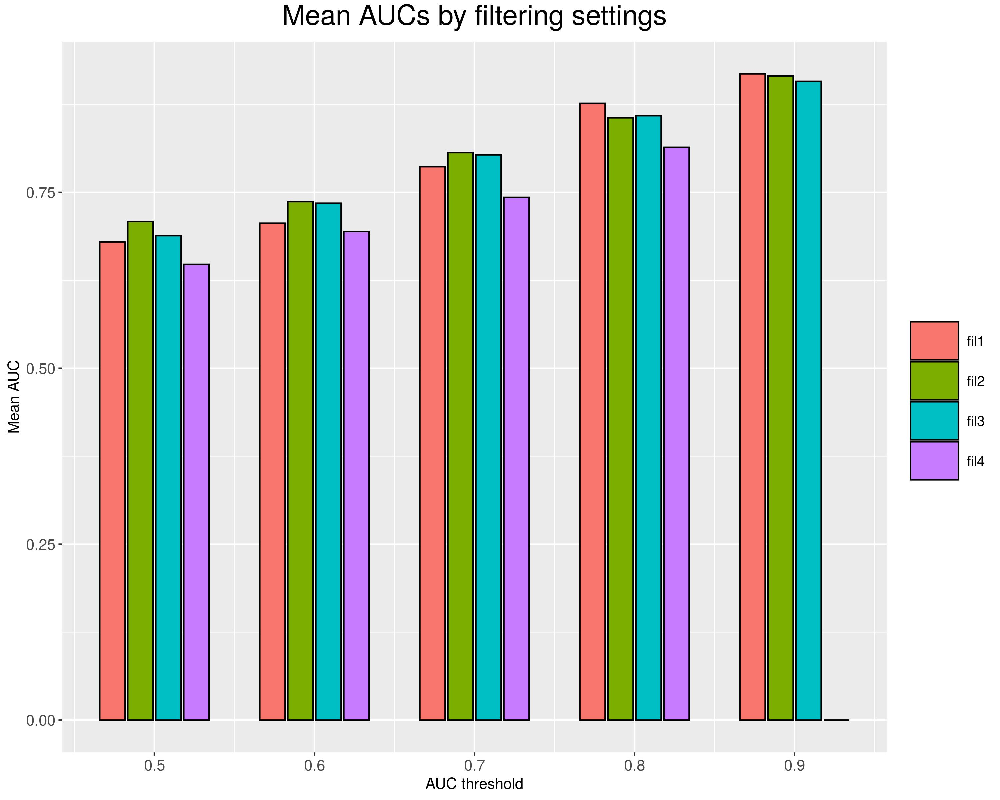
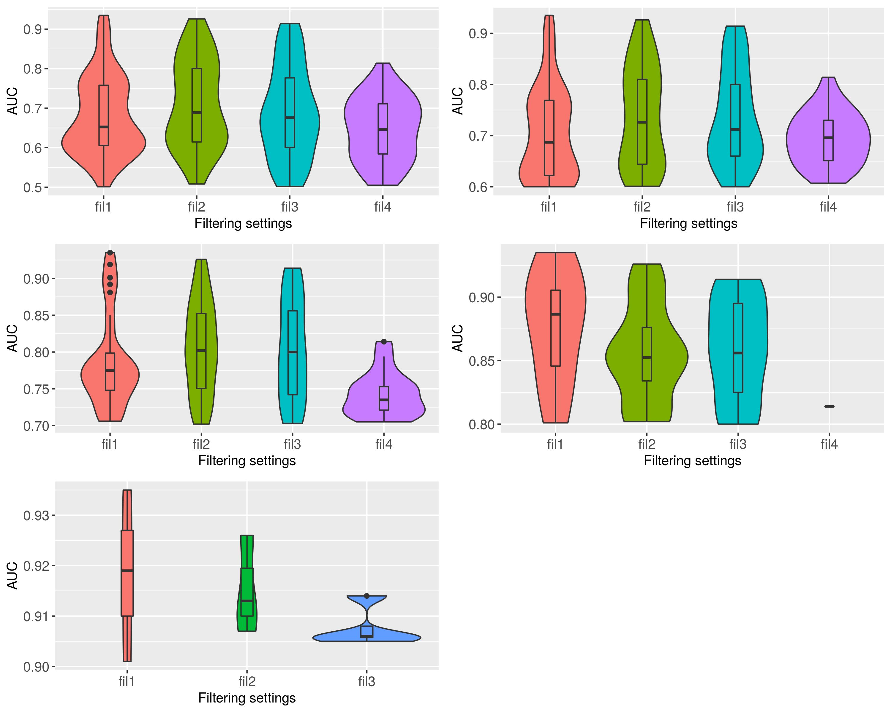
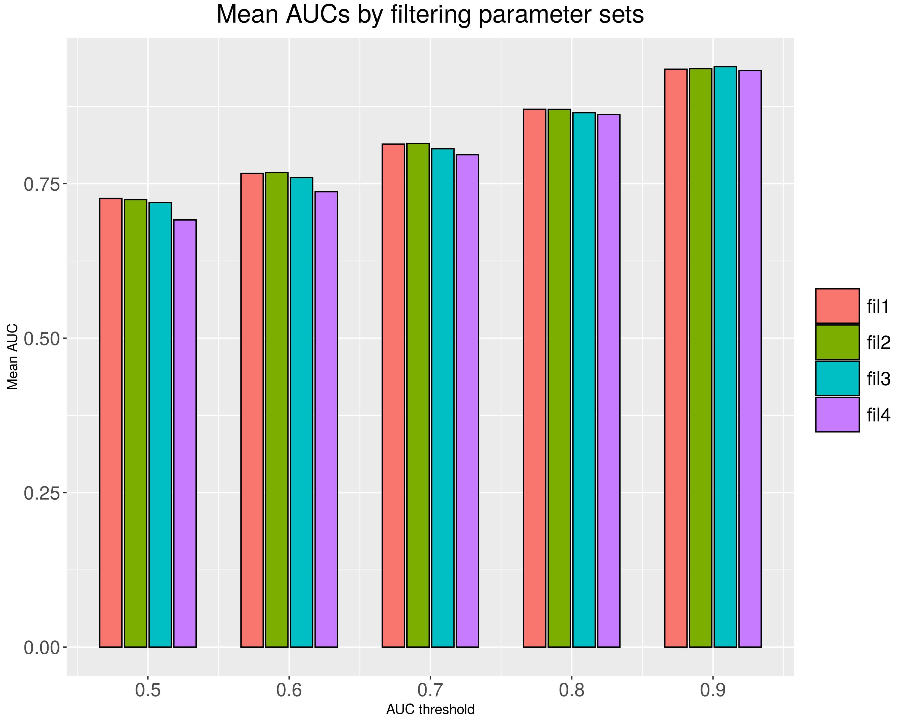
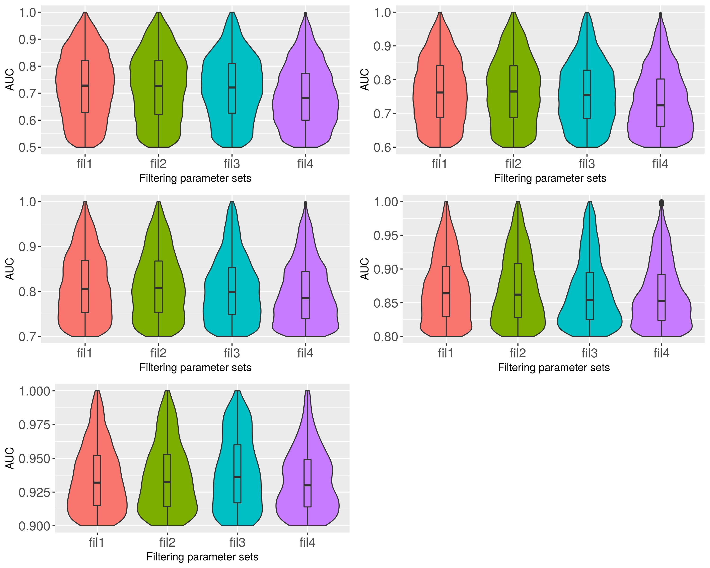
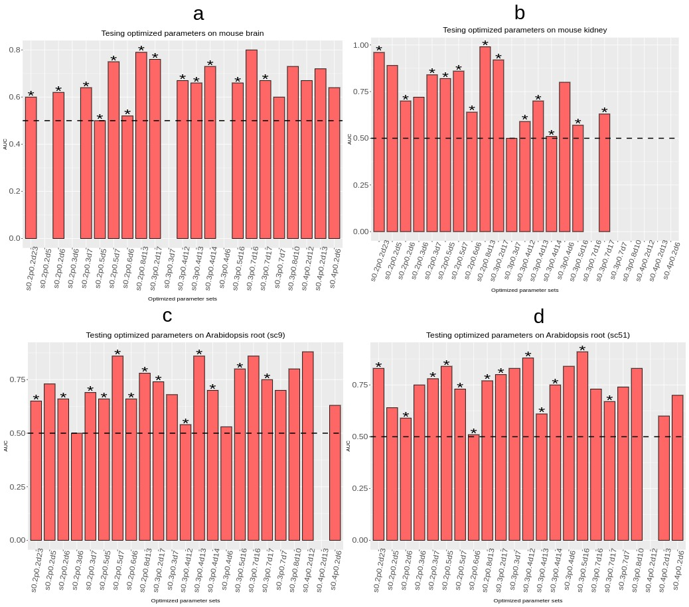
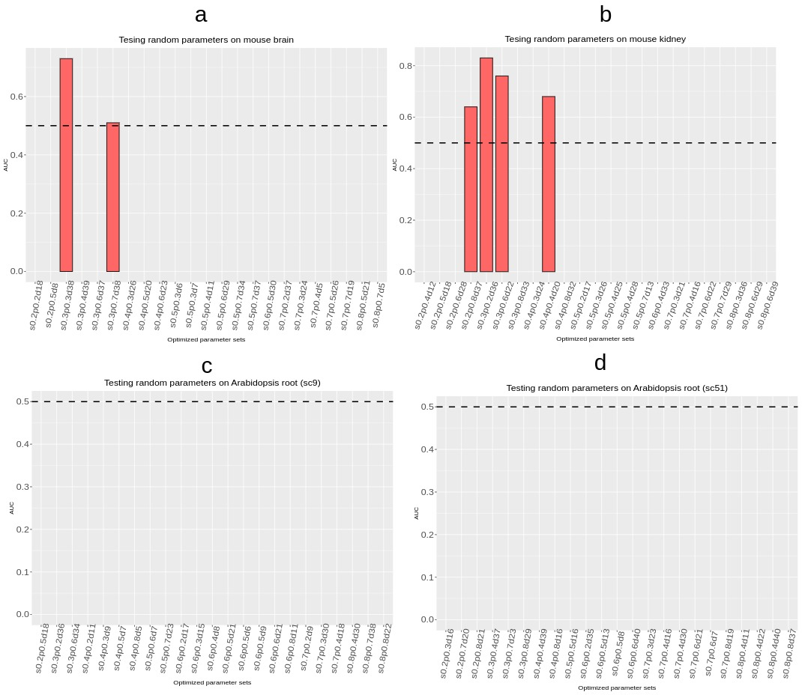

```{css, echo=FALSE}
pre code {
white-space: pre !important;
overflow-x: scroll !important;
word-break: keep-all !important;
word-wrap: initial !important;
}
```

```{r global_options, include=FALSE}
## ThG: chunk added to enable global knitr options. The below turns on
## caching for faster vignette re-build during text editing.
knitr::opts_chunk$set(cache=TRUE)
```
<!-- 
<style type="text/css">
 .main-container { max-width: 1800px; margin-left: 5px; margin-right: auto; }
</style>
<style>body { text-align: justify }</style>  

```{r css, echo = FALSE, results = 'asis'}
BiocStyle::markdown(css.files=c('file/custom.css'))
```
-->

```{r setup0, eval=TRUE, echo=FALSE, message=FALSE, warning=FALSE}
library(knitr); opts_chunk$set(message=FALSE, warning=FALSE)
```

# Introduction 

## Overview

The primary utility of the _spatialHeatmap_ package is the generation of
_spatial heatmaps_ (SHM) for visualizing cell-, tissue- and organ-specific
abundance patterns of biological molecules in anatomical images. This includes
the identification of genes with spatially enriched (SE) expression patterns as
well as clusters and/or network modules composed of genes sharing similar
expression patterns. These functionalities are described in the [main
vignette](https://bioconductor.org/packages/release/bioc/html/spatialHeatmap.html)
of the _spatialHeatmap_ package. 

This vignette describes extended functionalities for integrating bulk tissue
with single cell data by co-visualizing them in a composite plot combining
spatial heatmaps with embedding plots of high-dimensional data, respectively.
Several dimensionality reduction algorithms (_e.g._ PCA, UMAP or tSNE) are
supported to generate the embedding plots. To associate the single cells with 
the corresponding features (_e.g._ tissues and organs) in the spatial heatmaps, 
the user can choose among annotation, manual, and automatic methods. They can
be used from R as well as the corresponding [Shiny app](#autoSCE) [@shiny, @shinydashboard].   

## Supported Objects and Image Formats

The data objects supported by the co-visualization include: `data.frame`,
`SummarizedExperiment` (SE), and `SingleCellExperiment` (SCE). The usage of the
first two is described in the main vignette of this package. Compared to SE,
SCE objects contain two additional slots that are used by the 
co-visualization functionality of this package. First, SCE has a `label` column 
in the `colData` slot for storing [cell type annotation labels](#cusLab) <span style="color: blue"> that are provided by users </span>. <span style="color: red;">[ThG: please revise 
the following sentences. They make no sense since you start here with 
specific features of SCE but the following doesn't relate to it. This could also 
be removed since it is too detailed for an intro.]</span> <span style="color: blue;">[jianhai: removed to the Shiny app section.]</span> Second, when using the automatic method
in [Shiny app](#autoSCE), the true matching table across single cells, bulk
tissues, and aSVG features is stored in the `metadata` slot of SCE. More details about using the co-visualization in Shiny app is provided in the [Using Shiny App](#autoSCE) section.    

The images in co-visualization are in the same form of annotated SVGs (aSVGs)
with SHM plots, which is detained in the main vignette.   


# Getting Started  

## Installation  

The `spatialHeatmap` package should be installed from an R (version $\ge$ 3.6)
session with the `BiocManager::install` command.  

```{ eval=FALSE, echo=TRUE, warnings=FALSE} 
if (!requireNamespace("BiocManager", quietly = TRUE))
    install.packages("BiocManager")
BiocManager::install("spatialHeatmap")
```

## Packages and Documentation

Next, the packages required for running the sample code in this vignette need to be loaded.  

```{r, eval=TRUE, echo=TRUE, warnings=FALSE, results='hide'}
library(spatialHeatmap); library(SummarizedExperiment); library(scran); library(scater); library(igraph); library(SingleCellExperiment); library(BiocParallel)
```

The following lists the vignette(s) of this package in an HTML browser. Clicking the corresponding name will open this vignette. 

```{r, eval=FALSE, echo=TRUE, warnings=FALSE}
browseVignettes('spatialHeatmap')
```

To reduce runtime, some data are cached in `~/.cache/shm`.  

```{r eval=TRUE, echo=TRUE, message=FALSE, warnings=FALSE }
cache.pa <- '~/.cache/shm' # The path of cache.
```

# Annotation Method 

<span style="color: red;">[ThG: does the annotation based option also fall under
manual. If so why not distintuishing annotation and manual. For the user this makes
a big difference.]</span>

<span style="color: blue"> jianhai: old </span>
In manual matching mode the single cell clusters can be automatically detected or
pre-defined by the user. When matching with source bulk tissues, the matching
relationship needs to be manually defined. <span style="color:red">[ThG: Confusing why the
first option falls into the manual section but then can be auto-detected. The latter
is the only relevant one for the matching. So I don't understand...]</span> 
In R the matching is defined by a named `list`, while in Shiny App simply mouse actions 
including dragging and dropping are supported.  

<span style="color: blue"> jianhai: new </span>
In the annotation method, cell labels are provided by users such as cell types and are stored in the `label` column in the `colData` slot of SCE. In R the matching between source bulk tissues and single cells is defined by a named `list`, while in Shiny App simply mouse actions including dragging and dropping are supported.   

The example single cell data of mouse brain are from a oligodendrocyte
heterogeneity study in mouse central nervous system [@Marques2016-ff]. Before
co-visualizing, single cell data are processed through quality check, normalization, and dimensionality reduction, which is
learned from [Bioconductor
OCSA](http://bioconductor.org/books/3.14/OSCA.workflows/zeisel-mouse-brain-strt-seq.html){target='blank'}.
Since these steps are not the focus, details are not explained.   

To obtain reproducible results, always start a new R session and set a fixed
seed for Random Number Generator at the beginning, which is required only once in each R session.     

```{r , eval=TRUE, echo=TRUE, warnings=FALSE}
set.seed(10)
```

Read the example single cell data.  

```{r scRead, eval=TRUE, echo=TRUE, warnings=FALSE}
sce.pa <- system.file("extdata/shinyApp/example", "sce_manual_mouse.rds", package="spatialHeatmap")
sce <- readRDS(sce.pa)
```

Quality check, normalization, and dimensionality reduction. Individual steps are seen in the [Supplementary Section](#stepAnn).   

```{r eval=TRUE, echo=TRUE, warnings=FALSE}
# Quality check.
sce.qc <- qc_cell(sce, qc.metric=list(subsets=list(Mt=rowData(sce)$featureType=='mito'), threshold=1), qc.filter=list(nmads=3))
# Normalization.
sce.norm <- norm_cell(sce=sce.qc, quick.clus=list(min.size = 100), com.sum.fct=list(max.cluster.size = 3000), log.norm=list())
# Dimensionality reduction.
sce.dimred <- reduce_dim(sce=sce.norm, prop=0.1, min.dim=13, max.dim=50, model.var=list(), top.hvg=list(n = 3000), de.pca=list(assay.type = "logcounts"), pca=FALSE, tsne=list(dimred="PCA", ncomponents=2), umap=list(dimred="PCA"))
```

<a name='cusLab'></a>

<span style="color:red">[ThG: confusing why this falls under manual?]</span>

The custom cell labels (annotations) are defined in the `label` column of `colData`, which are cell sources provided in the original study.  

```{r scLab, eval=TRUE, echo=TRUE, warnings=FALSE}
unique(colData(sce.dimred)$label) 
```

Embedding plot of single cells colored by clusters in the `cluster` column in `colData`.   

```{r eval=TRUE, echo=TRUE, warnings=FALSE, fig.wide=TRUE, fig.cap=('Embedding plot single cells. The cells are colored by labels in the `label` column in `colData`.'), out.width="100%", fig.show='show'}
plotUMAP(sce.dimred, colour_by="label")
```

Aggregate cells by annnotations defined in the `label` column.   

```{r scLabAggr, eval=TRUE, echo=TRUE, warnings=FALSE}
sce.aggr <- aggr_rep(sce.dimred, assay.na='logcounts', sam.factor='label', con.factor='expVar', aggr='mean')
```

The spatial features in mouse brain aSVG are extracted. They are the bulk tissues to be matched with cell labels.   

```{r eval=TRUE, echo=TRUE, warnings=FALSE}
svg.mus.brain <- system.file("extdata/shinyApp/example", "mus_musculus.brain.svg", package="spatialHeatmap")
# Spatial features to match with single cell clusters.
feature.df <- return_feature(svg.path=svg.mus.brain)
feature.df$feature
```

Create a named `list` to match cells and aSVG features.    

```{r scLabList, eval=TRUE, echo=TRUE, warnings=FALSE}
lis.match <- list(hypothalamus=c('hypothalamus'))
```

Co-visualization on gene `Cops5`.      

```{r eval=TRUE, echo=TRUE, warnings=FALSE}
colData(sce.aggr)[, c('label', 'expVar')]
```

```{r scLabVis, eval=TRUE, echo=TRUE, warnings=FALSE, fig.wide=TRUE, fig.cap=('Co-visualizing single cells and bulk tissues by custom cell labels. The expression profiles of gene `Cops5` are used.'), out.width="100%", fig.show='show'}
shm.lis <- spatial_hm(svg.path=svg.mus.brain, data=sce.aggr, ID=c('Cops5'), height=0.7, legend.r=1.5, legend.key.size=0.02, legend.text.size=12, legend.nrow=2, sce.dimred=sce.dimred, dimred='PCA', cell.group='label', assay.na='logcounts', tar.cell=c('matched'), lis.rematch=lis.match, bar.width=0.1, dim.lgd.nrow=1)
```

# Manual Method

In the manual method, cell cluster labels are manually created through clustering algorithms. The same single cell data and aSVG file as in the annotation method are used to domenstrate the manual method.
The steps of quality control, normalization, and dimensionality reduction are the same with the annotation method, while a subsequent clustering step is involved to created cell labels.  

The dimensionality reduction and clustering steps are wrapped in the same function `cluster_cell`. Individual steps are seen in the [Supplementary Section](#stepManu).   

```{r eval=TRUE, echo=TRUE, warnings=FALSE}
sce.clus <- read_cache(cache.pa, 'sce.clus')
if (is.null(sce.clus)) {
  sce.clus <- cluster_cell(data=sce.norm, prop=0.1, min.dim=13, max.dim=50, pca=FALSE, graph.meth='knn', dimred='PCA', model.var=list(), top.hvg=list(n = 3000), de.pca=list(assay.type = "logcounts"), tsne=list(dimred="PCA", ncomponents=2), umap=list(dimred="PCA"), knn.gr=list(), snn.gr=list(), cluster.wk=list(steps = 4))
  save_cache(dir=cache.pa, overwrite=TRUE, sce.clus)
}
```

The cluster labels are exclusively saved in the `cluster` column in the `colData` slot.   

```{r eval=TRUE, echo=TRUE, warnings=FALSE}
table(colData(sce.clus)$cluster)
```

Embedding plot of single cells colored by clusters in the `cluster` column in `colData`.   

```{r eval=TRUE, echo=TRUE, warnings=FALSE, fig.wide=TRUE, fig.cap=('Embedding plot single cells. The cells are labeled by clusters in the `cluster` column in `colData`.'), out.width="100%", fig.show='show'}
plotUMAP(sce.clus, colour_by="cluster")
```

The spatial features in mouse brain aSVG are extracted. They are the bulk tissues to be matched with cell clusters.  

```{r eval=TRUE, echo=TRUE, warnings=FALSE}
svg.mus.brain <- system.file("extdata/shinyApp/example", "mus_musculus.brain.svg", package="spatialHeatmap")
# Spatial features to match with single cell clusters.
feature.df <- return_feature(svg.path=svg.mus.brain)
feature.df$feature
```

Create a named `list` to match cell cluster `clus1` with aSVG feature `hypothalamus`, and cluster `clus3` with `cerebral.cortex` and `midbrain`.    

```{r scAutoList, eval=TRUE, echo=TRUE, warnings=FALSE}
lis.match.clus <- list('clus1'=c('hypothalamus'), 'clus3'=c('cerebral.cortex', 'midbrain'))
```

Aggregate cells by clusters defined in the `cluster` column.  

```{r scAutoAggr, eval=TRUE, echo=TRUE, warnings=FALSE}
sce.clus.aggr <- aggr_rep(sce.clus, assay.na='logcounts', sam.factor='cluster', con.factor=NULL, aggr='mean')
```

Co-visualization on gene `Cops5`.  

```{r scAutoVis, eval=TRUE, echo=TRUE, warnings=FALSE, fig.wide=TRUE, fig.cap=('Co-visualizing single cells and bulk tissues by manually-detected cell clusters. The expression profiles of gene `Cops5` are used.'), out.width="100%", fig.show='show'}
shm.lis <- spatial_hm(svg.path=svg.mus.brain, data=sce.clus.aggr, ID=c('Cops5'), height=0.7, legend.r=1.5, legend.key.size=0.02, legend.text.size=12, legend.nrow=3, sce.dimred=sce.clus, dimred='PCA', cell.group='cluster', assay.na='logcounts', tar.cell=c('matched'), lis.rematch=lis.match.clus, bar.width=0.11, dim.lgd.nrow=1)
```

# Automatic Method

Except for annatation and manual clustering methods, an automatic method is developed to match cells and bulk tissues in co-visualization. The automatic process is carried out by combining and co-clustering bulk and single cell data. The bulk and single cell data need to be derived from the same organ or same large tissue. If same organ, the single cell data are assayed on the whole organ. By contrast, if single cell data are from a whole tissue, the bulk tissues should be sub-tissues. To obtain optimal default settings for the automatic method, utilities for optimizing the automatic method are developed in *spatialHeatmap*. This section showcases application of the automatic method on mouse brain data with default settings obtained through optimization. The optimization on toy data and real data are explained in the [Supplementary Section](#opt).    

The potential applications of auto-matching include: 1) Reduce single cell RNA-seq (scRNA-seq) complexities. In conventional scRNA-seq, there is ususally a complex and laborious stage of isolating single cells. Auto-matching has the potential to avoid such processes since it only requires scRNA-seq on a whole organ; 2) Discover novel cell types. The cells with bulk tissue assignments are assumed to be major populations in the bulk, while cells without bulk assignemnts are likely to be novel cell types or cells at the bulk tissue boundaries; and 3) Estimate cellular compositions. If bulk tissues are representative of a whole organ, cellular compositions of the organ could be estimated according to their bulk tissue assignments. This application is useful in disease diagnose and treatment, since it helps to analyze each cell type's contribution to the disease.    

## Workflow Overview

Figure \@ref(fig:coclusOver) is the automatic method (co-clustering) workflow overview. The inputs are raw count data (*e.g.* RNA-seq) of bulk tissues and single cells of the same organ (Figure \@ref(fig:coclusOver).1). The single cells should come from the whole organ or at least covers the bulk tissues. The identities of each bulk tissue and each cell need to be labeled so as to evaluate the co-clustering performance. Bulk and single cell data are initially filtered at low strigency. The main difference between bulk and single cells is the sparsity in the latter. To reduce such difference, the bulk and single-cell data are combined, normalized, and then separated (Figure \@ref(fig:coclusOver).2). After separation, the normalized bulk data are filtered to remove genes of low and constant expressions (Figure \@ref(fig:coclusOver).3). The normalized single-cell data are also filtered to remove genes and cells having high zero-count rates. After filtered, the gene dimensionalities of single-cell data are reduced using PCA or UMAP method, and the top dimensionalities are clustered (Figure \@ref(fig:coclusOver).4). In each cell cluster, cells having low similarities with other cells in the same cluster are filtered (Figure \@ref(fig:coclusOver).5), and therefore the remaining clusters are more homogeneous (Figure \@ref(fig:coclusOver).6). The filtered bulk and filtered single cells are combined and co-clustered (Figure \@ref(fig:coclusOver).7).  

The results include three types of co-clusters: 1) Two bulk tissues are clustered with cells. The source bulk is assigned to each cell according to Spearman's correlation coefficient. For example, in Figure \@ref(fig:coclusOver).8a bulk A is assigned to cell a1 because a1 has higher similarity with A than B. Since the true source bulk of a1 is A, this assignment is TRUE. By contrast, cell b1 also has higher similarity with A than B, and A is assigned to b1, but this assignment is labeled FALSE since the true source bulk of b1 is B; 2). Only one bulk tissue is clustered with cells. This bulk is assigned to all the cells in the same co-cluster (\@ref(fig:coclusOver).8b); and 3) No bulk is included. All these cells are discarded (Figure \@ref(fig:coclusOver).8c). Lastly, the Spearman's correlation coefficient and TRUE or FALSE assignments are used to create ROC plots and evaluate the performance (Figure \@ref(fig:coclusOver).9).


```{r coclusOver, echo=FALSE, fig.wide=TRUE, out.width="80%", fig.cap=("Overview of coclustering. The coclustering are illustrated in 9 steps. Basically, bulk and single data are initially filtered, then combined, normalized, and separated. The normalized bulk and single cell data are filtered again. Single cells are clustered and resulting clusters are refined. Subsequently bulk and single cells are combined and co-clustered. In each co-cluster, bulk tissues are assigned to cells. The assignments are evaluated by ROC curves.")}
include_graphics('img/coclustering_overview.jpg')
```

## Application on Mouse Brain 

This section demonstrates co-visulization of bulk and single cells using the automatic method on mouse brain data. The bulk RNA-seq data are generated in a research on the impact of placental endocrine on mouse cerebellar development [@Vacher2021-xg] and the scRNA-seq data are from a study of mouse brain molecular atlas [@Ortiz2020-yt]. Both bulk and single cell data sets are reduced for demonstration purpose. The optimal settings of `fct`, `fil1`, `pca`, `knn`, `s0.2p0.8d13` in Table \@ref(tab:optParFin) are taken as default settings and used in this section.  

### Co-clustering 

To obtain reproducible results, always start a new R session and set a fixed seed for Random Number Generator at the beginning, which is required only once in each R session.   

```{r , eval=TRUE, echo=TRUE, warnings=FALSE}
set.seed(10)
```

Read bulk and single cell data. The bulk tissues and single cells are labeled with known identity so that the perforance of auto method can be evaluated. The same tissue or cell type should have the same label such as `isocort`. Overlaps between between bulk tissue and single cells labels are not allowed.     

```{r , eval=TRUE, echo=TRUE, warnings=FALSE}
# Example bulk data.
blk.mus.pa <- system.file("extdata/shinyApp/example", "bulk_mouse_cocluster.txt", package="spatialHeatmap") 
blk.mus <- as.matrix(read.table(blk.mus.pa, header=TRUE, row.names=1, sep='\t', check.names=FALSE))
blk.mus[1:3, 1:5]

# Example single cell data.
sc.mus.pa <- system.file("extdata/shinyApp/example", "cell_mouse_cocluster.txt", package="spatialHeatmap") 
sc.mus <- as.matrix(read.table(sc.mus.pa, header=TRUE, row.names=1, sep='\t', check.names=FALSE))
sc.mus[1:3, 1:5]
```
 
Initial filtering at lower strigency.   

```{r , eval=TRUE, echo=TRUE, warnings=FALSE}
blk.mus <- filter_data(data=blk.mus, sam.factor=NULL, con.factor=NULL, pOA=c(0.1, 5), CV=c(0.2, 100), verbose=FALSE) 
mus.lis <- filter_cell(lis=list(sc.mus=sc.mus), bulk=blk.mus, gen.rm=NULL, min.cnt=1, p.in.cell=0.5, p.in.gen=0.1, verbose=FALSE) 
```

Bulk and single cell are combined and normalized, then separated.   

```{r , eval=TRUE, echo=TRUE, warnings=FALSE}
mus.lis.nor <- read_cache(cache.pa, 'mus.lis.nor') 
if (is.null(mus.lis.nor)) { 
  mus.lis.nor <- norm_multi(dat.lis=mus.lis, cpm=FALSE)
  save_cache(dir=cache.pa, overwrite=TRUE, mus.lis.nor)
}
```

Secondary filtering at higher strigency.  

```{r , eval=TRUE, echo=TRUE, warnings=FALSE}
blk.mus.fil <- filter_data(data=logcounts(mus.lis.nor$bulk), sam.factor=NULL, con.factor=NULL, pOA=c(0.1, 0.5), CV=c(0.2, 100), verbose=FALSE) 
mus.lis.fil <- filter_cell(lis=list(sc.mus=logcounts(mus.lis.nor$sc.mus)), bulk=blk.mus.fil, gen.rm=NULL, min.cnt=1, p.in.cell=0.05, p.in.gen=0.02, verbose=FALSE)
```

The aSVG file of mouse brain.  
```{r , eval=TRUE, echo=TRUE, warnings=FALSE}
svg.mus.brain <- system.file("extdata/shinyApp/example", "mus_musculus.brain.svg", package="spatialHeatmap")
# Spatial features.  
feature.df <- return_feature(svg.path=svg.mus.brain)
```

The true matching between bulk tissues and single cells are defined in a table and provided to the co-clustering workflow so that the performance can be assessed. In addition, the matching between tissues and aSVG features (`SVGBulk`) are defined in the same table, which is used to create the co-visualization plot.    

```{r , eval=TRUE, echo=TRUE, warnings=FALSE}
match.mus.brain.pa <- system.file("extdata/shinyApp/example", "match_mouse_brain_cocluster.txt", package="spatialHeatmap")
df.match.mus.brain <- read.table(match.mus.brain.pa, header=TRUE, row.names=1, sep='\t')
df.match.mus.brain
``` 

Ensure the `SVGBulk` tissues are in the aSVG file.   

```{r , eval=TRUE, echo=TRUE, warnings=FALSE}
df.match.mus.brain$SVGBulk %in% feature.df$feature
```

The processes of clustering single cells, refining cell clusters, and co-clustering bulk and single cells (Figure \@ref(fig:coclusOver)) are performed in a single function call. Setting `return.all=TRUE` returns a `list` of refined cell clusters, ROC object, and a `data.frame` of auto-matching results. If `return.all=FALSE`, a `data.frame` of parameter settings and resulting AUC is returned. Details of individual steps are provided in the [Supplementary Section](#stepAuto).   

```{r , eval=TRUE, echo=TRUE, warnings=FALSE}  
res.lis <- read_cache(cache.pa, 'res.lis')
if (is.null(res.lis)) {
  res.lis <- cocluster(bulk=mus.lis.fil$bulk, cell=mus.lis.fil$sc.mus, df.match=df.match.mus.brain, df.para=NULL, sim=0.2, sim.p=0.8, dim=13, graph.meth='knn', dimred='PCA', sim.meth='spearman', return.all=TRUE, multi.core.par=MulticoreParam(workers=1, RNGseed=50), verbose=FALSE)
  res.lis <- res.lis[[1]]
  save_cache(dir=cache.pa, overwrite=TRUE, res.lis)
}
```

The co-clustering results are listed in `roc.lis$df.roc`. `predictor` is the similarity (Spearman's or Pearson's correlation coefficient) between bulk and cells within a co-cluster, which is used to assign bulk tissues to cells (Figure \@ref(fig:coclusOver).8). `response` indicates whether the bulk assignment is correct according to the matching table. `index` is the cell index in the `SingleCellExperiment` after cell clusters are refined.   
```{r , eval=TRUE, echo=TRUE, warnings=FALSE}
res.lis$df.roc[1:3, ]
table(res.lis$df.roc$response)
```

ROC curve is created according to `roc.lis$df.roc` and the AUC value indicates the auto-matching performance, where higher AUC indicates better performance.   
```{r , eval=TRUE, echo=TRUE, warnings=FALSE, fig.wide=TRUE, fig.cap=('ROC curve of auto-matching on mouse brain data. The AUC value is a measure of accuracy on bulk assignments.'), out.width="70%", fig.show='show'}
plot(res.lis$roc.obj, print.auc=TRUE)
```

The function `cocluster` accepts multiple combinations of parameter settings provided in a `data.frame`, and co-clustering on these combinations can be performed in parallel on multiple cpu cores through `multi.core.par`.    

Multiple combinations of parameter settings. If some parameters are not specified in this table such as `graph.meth`, their default settings will be used.   
```{r , eval=TRUE, echo=TRUE, warnings=FALSE}  
df.par <- data.frame(sim=c(0.2, 0.3), sim.p=c(0.8, 0.7), dim=c(12, 13))
df.par
```

The coclustering is run on 2 cpu cores (`workers=2`).  

```{r , eval=FALSE, echo=TRUE, warnings=FALSE}  
res.multi <- cocluster(bulk=mus.lis.fil$bulk, cell=mus.lis.fil$sc.mus, df.match=df.match.mus.brain, df.para=df.par, sc.dim.min=10, max.dim=50, sim=0.2, sim.p=0.8, dim=13, graph.meth='knn', dimred='PCA', sim.meth='spearman', return.all=TRUE, multi.core.par=MulticoreParam(workers=2, RNGseed=50), verbose=FALSE)
```

### Tailoring Co-clustering Results

The co-clustering results can be tailored through "Lasso Select" on the convenience Shiny app (`desired_bulk_shiny`) or manually defining desired bulk. If the former, save `cell.refined` in an `.rds` file by `saveRDS(cell.refined, file='cell.refined.rds')` and upload `cell.refined.rds` to the Shiny app, where tailoring instructions are provided.    

Example of desired bulk downloaded from the convenience Shiny app. The x-y coordinates refer to single cells in embbeding plots (`dimred`).    
```{r , eval=TRUE, echo=TRUE, warnings=FALSE}  
desired.blk.pa <- system.file("extdata/shinyApp/example", "selected_cells_with_desired_bulk.txt", package="spatialHeatmap")
df.desired.bulk <- read.table(desired.blk.pa, header=TRUE, row.names=1, sep='\t')
df.desired.bulk[1:3, ]
``` 

If manually defining desired bulk, first visualize single cells in the embedding plot.  

```{r , eval=TRUE, echo=TRUE, warnings=FALSE, fig.wide=TRUE, fig.cap=('PCA embedding plot of mouse brain single cell data. Single cell data after cluster refining are plotted.'), out.width="70%", fig.show='show'}
plot_dim(res.lis$cell.refined, dim='PCA', color.by='cell', x.break=seq(-10, 10, 2), y.break=seq(-10, 10, 2))
```

Manually define desired bulk for certain cells by x-y coordinates ranges (`x.min`, `x.max`, `y.min`, `y.max`) in the embedding plot. The `dimred` reveals where the coordinates come from and are required.  

```{r , eval=TRUE, echo=TRUE, warnings=FALSE}  
df.desired.bulk <- data.frame(x.min=c(-6, 6), x.max=c(-4, 10), y.min=c(6, -4), y.max=c(8, -2), desiredSVGBulk=c('cerebral.cortex', 'cerebral.cortex'), dimred='PCA')
df.desired.bulk
```

Extract cells with bulk assignments. If the `df.desired.bulk` argument is assigned a value, the corrresponding assignments are incorporated in `res.lis$df.roc`, and their `response` and `predictor` is set `TRUE` and 1 respectively. `thr` is a cutoff for the `predictor` in `res.lis$df.roc`, so `thr=0` denotes `predictor` is not filtered. `true.only=TRUE` indicates only true assignments are extracted.   

```{r , eval=TRUE, echo=TRUE, warnings=FALSE}  
sce.lis <- sub_asg(res.lis=res.lis, thr=0, df.desired.bulk=df.desired.bulk, df.match=df.match.mus.brain, true.only=TRUE)
```

### Co-visualization

Aggregate extracted cells by `SVGBulk`. The aggregated cells are equivalent to bulk tissues (spatial features) in the aSVG. The aggregated abundance profiles are used to color matching bulk tissues in the aSVG image.    

```{r , eval=TRUE, echo=TRUE, warnings=FALSE}  
sce.aggr <- aggr_rep(data=sce.lis$cell.sub, assay.na='logcounts', sam.factor='SVGBulk', con.factor=NULL, aggr='mean')
```

Co-visualize bulk and single cells with aggregated abundance profiles of gene `Adcy1`. `tar.bulk` refers to the target bulk in aSVG and all corresponding cells are highlighted in the embedding plot. Cells with true assignments of `tar.bulk` are colored according to the color key, while other corresponding cells with false or without assignments are colored black. All other cells not corresponding to `tar.bulk` are in gray. In the embedding plot, the top and right clusters of red cells are the cells defined in `df.desired.bulk`.   

```{r , eval=TRUE, echo=TRUE, warnings=FALSE, fig.wide=TRUE, fig.cap=('Co-visualizing bulk and single cells of mouse brain with abundance profiles. The aggregated expression profiles of gene `Adcy1` are plotted.'), out.width="100%", fig.show='show'}
shm.lis1 <- spatial_hm(svg.path=svg.mus.brain, data=sce.aggr, ID=c('Adcy1'), legend.nrow=4, sce.dimred=sce.lis$cell.refined, dimred='PCA', assay.na='logcounts', tar.bulk=c('cerebral.cortex'), profile=TRUE, dim.lgd.text.size=10, dim.lgd.nrow=1, bar.width=0.1)
```

Co-visualize bulk and single cells without abundance profiles.  

```{r , eval=TRUE, echo=TRUE, warnings=FALSE, fig.wide=TRUE, fig.cap=('Co-visualizing bulk and single cells of mouse brain without abundance profiles. The matching between cells and SVG bulk is denoted by color in-between.'), out.width="100%", fig.show='show'}
shm.lis2 <- spatial_hm(svg.path=svg.mus.brain, data=sce.aggr, ID=c('Adcy1'), legend.nrow=4, sce.dimred=sce.lis$cell.refined, dimred='PCA', tar.bulk=c('cerebral.cortex'), profile=FALSE, dim.lgd.text.size=10, dim.lgd.nrow=1)
```

# Using Shiny App {#autoSCE}

When using the Shiny app, single cell data in annotation method or combined
single cell and bulk data in automatic method are saved in an `.rds` file of
`SingleCellExperiment` object by `saveRDS`. In addition, in the automatic method bulk tissues and single cells are labeled by `bulk` and `cell` respectively by the `bulkCell` column in `colData` slot. The true matching table is stored in the `metadata` list with the name `df.match`. The example below illustrates these rules.     

```{r , eval=TRUE, echo=TRUE, warnings=FALSE}  
sce.auto <- readRDS(system.file("extdata/shinyApp/example", 'sce_auto_bulk_cell_mouse_brain.rds', package="spatialHeatmap"))
colData(sce.auto)
metadata(sce.auto)$df.match
```

</font>

# Supplementary Section {#sup} 

<a name='stepAnn'></a>

## Individual Steps in Annotaion Method

This section presents individual steps in the annotation method. Since the results are the same with the main section, the following code is not evaluated.   

To obtain reproducible results, always start a new R session and set a fixed
seed for Random Number Generator at the beginning.     

```{r , eval=FALSE, echo=TRUE, warnings=FALSE}
set.seed(10)
```

Read the example single cell data.  

```{r eval=FALSE, echo=TRUE, warnings=FALSE}
sce.pa <- system.file("extdata/shinyApp/example", "sce_manual_mouse.rds", package="spatialHeatmap")
sce <- readRDS(sce.pa)
```

The following routine steps in single-cell data analysis are learned from [Bioconductor
OCSA](http://bioconductor.org/books/3.14/OSCA.workflows/zeisel-mouse-brain-strt-seq.html){target='blank'}.
Since these steps are not the focus, details are not explained.   

Quality control through mitochondria and spike-in genes.  

```{r eval=FALSE, echo=TRUE, warnings=FALSE}
stats <- perCellQCMetrics(sce, subsets=list(Mt=rowData(sce)$featureType=='mito'), threshold=1)
sub.fields <- 'subsets_Mt_percent'
ercc <- 'ERCC' %in% altExpNames(sce)
if (ercc) sub.fields <- c('altexps_ERCC_percent', sub.fields)
qc <- perCellQCFilters(stats, sub.fields=sub.fields, nmads=3)
# Discard unreliable cells.
colSums(as.matrix(qc))
sce <- sce[, !qc$discard]
```
     
Normalization.

```{r eval=FALSE, echo=TRUE, warnings=FALSE}
clusters <- quickCluster(sce)
sce <- computeSumFactors(sce, cluster=clusters) 
sce <- logNormCounts(sce)
```

Dimensionality reduction with PCA, UMAP and tSNE.   

```{r eval=FALSE, echo=TRUE, warnings=FALSE}
# Variance modelling.
df.var <- modelGeneVar(sce)
top.hvgs <- getTopHVGs(df.var, prop = 0.1, n = 3000)
# Dimensionality reduction. 
sce <- denoisePCA(sce, technical=df.var, subset.row=top.hvgs, min.rank=13, max.rank=50, assay.type = "logcounts")
sce <- runUMAP(sce, dimred = "PCA", ncomponents=min.dim)
sce <- runTSNE(sce, dimred="PCA")
```  

<a name='stepManu'></a> 

## Individual Steps in Manual Method

The manual method has the same steps with the annotation method except for a subsequently clustering step. This section showcases individual steps in the clustering step.    

Cell clusters are detected by first building a graph object then
partitioning the graph, where cells are nodes in the graph.  

```{r eval=FALSE, echo=TRUE, warnings=FALSE}
# Build graph.
snn.gr <- buildSNNGraph(sce.manual, use.dimred="PCA") 
plot(snn.gr)
# Partition graph to detect cell clusters.
cluster <- paste0('clus', cluster_walktrap(snn.gr)$membership)
table(cluster)
```

Cell cluster assignments are stored in the `cluster` column in `colData` slot of `SingleCellExperiment`. If there are experimental variables such as treatments or time points, they should be stored in the `expVar` column.   

```{r eval=FALSE, echo=TRUE, warnings=FALSE}
cdat <- colData(sce.manual) 
lab.lgc <- 'label' %in% make.names(colnames(cdat))
if (lab.lgc) {
  cdat <- cbind(cluster=cluster, colData(sce.manual))
  idx <- colnames(cdat) %in% c('cluster', 'label')
  cdat <- cdat[, c(which(idx), which(!idx))]
} else cdat <- cbind(cluster=cluster, colData(sce.manual))
colnames(cdat) <- make.names(colnames(cdat))
colData(sce.manual) <- cdat; cdat[1:3, ]
```

<a name='opt'></a> 

## Optimizing Automatic Method

### Optimization on Example Data {#opt_demo}

Since real optimizations have high demand on computing power and take a long time, it is demonstrated on toy data. Thus the result parameter settings may not be really optimal. The example bulk and single cell RNA-seq data are from Arabidopsis thaliana (Arabidopsis) root. Bulk tissue data comprise all the major root tissues such as epidermis, cortex, endodermis, xylem, columella, which are generated in a research on alternative splicing and lincRNA regulation [@Li2016-yz]. The two single cell data sets are derived from the whole root, which are produced in a study of single cell Arabidopsis root atlas [@Shahan2020-zj]. The identities of bulk and single cells are all labeled.   

The optimization focuses on parameters of normalization methods, filtering, dimensionality reduction methods, refining homogeneous cell clusters, number of top dimensionalities in co-clustering, graph-building methods in co-clustering. The optimization is performed by running the co-clustering workflow (Figure \@ref(fig:coclusOver)) on each of the single cell data sets. The parameter settings being optimized is fixed and all settings of other parameters are varied across all possible combinations.  

Each running of the workflow yields an AUC value, thus after running the workflow on all possible settings combinations one parameter settings has a set of AUC values. The AUCs are filtered according to some criteria and the remaining AUCs are averaged. A settings with a higher mean AUC than its counterparts are taken as optimal in a parameter. For example, when optimizing dimensionality reduction methods, the settings are PCA and UMAP. If the mean of remaining AUCs of PCA is 0.6 while UMAP is 0.55, PCA is regarded as the optimal.   

Since optimzation on example data also takes a relatively long time, most of the following steps are not evaluated. A common computer with 4G memory and 4 CPUs is enough to run the following optimization process.   

To obtain reproducible results, always start a new R session and set a fixed seed for Random Number Generator at the beginning, which is required only once in each R session.   
```{r , eval=TRUE, echo=TRUE, warnings=FALSE}
set.seed(10)
```

Read bulk and two single cell data.  

```{r optRead, eval=TRUE, echo=TRUE, warnings=FALSE}
blk <- readRDS(system.file("extdata/cocluster/data", "bulk_cocluster.rds", package="spatialHeatmap")) # Bulk.
sc10 <- readRDS(system.file("extdata/cocluster/data", "sc10_cocluster.rds", package="spatialHeatmap")) # Single cell.
sc11 <- readRDS(system.file("extdata/cocluster/data", "sc11_cocluster.rds", package="spatialHeatmap")) # Single cell.
blk; sc10; sc11
```

These example data are already pre-processed. To demonstrate the optimization process the pre-processing steps are perfomed again with few genes or cells removed.   

Inital filtering with low strigency before normalization.   

```{r optInitFil, eval=FALSE, echo=TRUE, warnings=FALSE}
blk <- filter_data(data=blk, pOA=c(0.2, 15), CV=c(1.5, 100))
fil.init <- filter_cell(lis=list(sc10=sc10, sc11=sc11), bulk=blk, gen.rm='^ATCG|^ATCG', min.cnt=1, p.in.cell=0.3, p.in.gen=0.1); fil.init
```

Combine and normalize bulk and single cell data, then separate them. By default `computeSumFactors (fct)` in `scran` package is used [@scran]. If `cpm=TRUE`, additional normalization of counts per million is applied.    

```{r optNorm, eval=FALSE, echo=TRUE, warnings=FALSE}
norm.fct <- norm_multi(dat.lis=fil.init, cpm=FALSE) # fct.
norm.cpm <- norm_multi(dat.lis=fil.init, cpm=TRUE) # fct + cpm
```

Secondary filtering with higher strigency after normalization. Four sets of filtering parameter settings are created. In bulk data, genes with expression values over `A` across samples of over proportion `p` and with coefficinet of variance (CV) between cv1 and cv2 are retained. In cell data, genes with expression values over `min.cnt` of at least proportion `p.in.gen` are retained, and cells with with expression values over `min.cnt` of at least proportion `p.in.cell` are retained.   

```{r optFilPar, eval=TRUE, echo=TRUE, warnings=FALSE}
df.par.fil <- data.frame(p=c(0.1, 0.2, 0.3, 0.4), A=rep(1, 4), cv1=c(0.1, 0.2, 0.3, 0.4), cv2=rep(100, 4), min.cnt=rep(1, 4), p.in.cell=c(0.1, 0.25, 0.3, 0.35), p.in.gen=c(0.01, 0.05, 0.1, 0.15))
df.par.fil
``` 

Filter bulk and cell data using the four filtering settings. The results are automatically saved in the working directory `wk.dir` and are recognized in the downstream. Thus the working directory should be the same across the entire workflow.  

```{r optFil, eval=FALSE, echo=TRUE, warnings=FALSE}
if (!dir.exists('opt_res')) dir.create('opt_res')
fct.fil.all <- filter_iter(bulk=norm.fct$bulk, cell.lis=list(sc10=norm.fct$sc10, sc11=norm.fct$sc11), df.par.fil=df.par.fil, gen.rm='^ATCG|^ATCG', wk.dir='opt_res', norm.meth='fct')
  
cpm.fil.all <- filter_iter(bulk=norm.cpm$bulk, cell.lis=list(sc10=norm.cpm$sc10, sc11=norm.cpm$sc11), df.par.fil=df.par.fil, gen.rm='^ATCG|^ATCG', wk.dir='opt_res', norm.meth='cpm')
```

To evaluate the downstream auto-matching performance, a ground-truth matching relationship is required in form of `data.frame`. The `cell` and `trueBulk` refer to bulk tissue identifiers in aSVG files, single cell identifiers and bulk tissue identifiers in the data for co-clustering, respectively. If a cell matches multiple bulk tissues, bulk identifiers are separated by comma, semicolon, or single space such as `NONHAIR,LRC_NONHAIR`. The `SVGBulk` is the bulk identifiers in aSVG files, which are recognized in co-visualization.   

```{r optMatch, eval=TRUE, echo=TRUE, warnings=FALSE}
match.pa <- system.file("extdata/cocluster/data", "match_arab_root_cocluster.txt", package="spatialHeatmap")
df.match.arab <- read.table(match.pa, header=TRUE, row.names=1, sep='\t')
df.match.arab[1:3, ]
```

In real application, the whole optimization takes a long time and requires a lot of computation power. For example, combined bulk and cell data with 6945 genes and 7747 samples requires about 20G memory for coclustering. To speed up computation, the optimization function `coclus_opt` provides two levels of parallel computing through `BiocParallel` [@biocpara]. The first one is `BatchtoolsParam` and relies on a cluster scheduler such as the [SLURM](https://slurm.schedmd.com/documentation.html){target='blank'} scheduler and the second one utilizes `MulticoreParam`.   

Before optimzation, users could check the parallelization guide by setting `parallel.info=TRUE`, then it returns the max possible parallelizations for each level respectively.   

```{r optGuide, eval=FALSE, echo=TRUE, warnings=FALSE}
coclus_opt(wk.dir='opt_res', parallel.info=TRUE, dimred=c('PCA', 'UMAP'), graph.meth=c('knn', 'snn'), sim=seq(0.2, 0.4, by=0.1), sim.p=seq(0.2, 0.4, by=0.1), dim=seq(5, 7, by=1))
```

A SLURM template is provided as an example for the first level parallelization. Users are advised to make a new copy and set SLURM parameters in the new copy. If users have access to other cluster schedulers, the template should be provided accordingly.  

```{r optTmpl, eval=FALSE, echo=TRUE, warnings=FALSE}
file.copy(system.file("extdata/cocluster", "slurm.tmpl", package="spatialHeatmap"), './slurm.tmpl')
```

Below is the demonstration of two-level parallelization on SLURM. For instance, the first- and second-level parallelizations are set 3 and 2 cpu cores respectively. The `wk.dir` is the same in secondary filtering.  

`sim` and `sim.p` are parameters in refining cell clusters (Figure \@ref(fig:coclusOver).5). Specifically, in a cell cluster, cells having similarities over `sim` with other cells in the same cluster of at least proportion `sim.p` would remain. `sim` is Spearman' or Pearson's correlation coefficient. `dim` is the number of top dimensionalities (equivalent to genes) in co-clustering. Since the three parameters are related to each other, they are treated as a set `spd.set`.     

```{r optPara2, eval=FALSE, echo=TRUE, warnings=FALSE}
opt <- coclus_opt(wk.dir='opt_res', dimred=c('PCA', 'UMAP'), graph.meth=c('knn', 'snn'), sim=seq(0.2, 0.4, by=0.1), sim.p=seq(0.2, 0.4, by=0.1), dim=seq(5, 7, by=1), df.match=df.match.arab, batch.par=BatchtoolsParam(workers=3, cluster="slurm", template='slurm.tmpl', RNGseed=100,  stop.on.error = FALSE, log =TRUE, logdir=file.path('opt_res', 'batch_log')), multi.core.par=MulticoreParam(workers=2), verbose=FALSE)
```

If no cluster scheduler is available, optimization can be parallelized only at the second-level by setting `batch.par=NULL`.      

```{r optPara1, eval=FALSE, echo=TRUE, warnings=FALSE}
opt <- coclus_opt(wk.dir='opt_res', dimred=c('PCA', 'UMAP'), graph.meth=c('knn', 'snn'), sim=seq(0.2, 0.4, by=0.1), sim.p=seq(0.2, 0.4, by=0.1), dim=seq(5, 7, by=1), df.match=df.match.arab, batch.par=NULL, multi.core.par=MulticoreParam(workers=2))
```

The performace of each combination of parameter settings on each single cell data set is measured by an AUC value in ROC curve. These AUCs are filtered according to a cutoff (`aucs` over 0.5) and corresponding total bulk assignments (`total.min`) and total true assignments (`true.min`). The following demonstrates how to visualize the AUCs and select optimal parameter settings.  

Extract AUCs for each filtering settings across `aucs` at 0.5, 0.6, 0.7, 0.8, 0.9 respectively.   

```{r optParFil, eval=FALSE, echo=TRUE, warnings=FALSE}
df.lis.fil <- auc_stat(wk.dir='opt_res', tar.par='filter', total.min=500, true.min=300, aucs=round(seq(0.5, 0.9, 0.1), 1))
```

Mean AUCs by each filtering settings and AUC cutoff.  

```{r optParFilMean, eval=FALSE, echo=TRUE, warnings=FALSE}
df.lis.fil$df.auc.mean[1:3, ]
mean_auc_bar(df.lis.fil[[1]], bar.width=0.07, title='Mean AUCs by filtering settings', x.text.size=15, y.text.size=15, lgd.text.size=15)
```

```{r optParFilMeanPlot, echo=FALSE, fig.wide=TRUE, out.width="80%", fig.cap=("Mean AUCs of filtering settings. One bar refers to mean AUCs of a filtering settings at a certain AUC cutoff.")}

```

All AUCs by each filtering settings and AUC cutoff. 

```{r optParFilAll, eval=FALSE, echo=TRUE, warnings=FALSE}
auc_violin(df.lis=df.lis.fil, xlab='Filtering settings', x.text.size=13, y.text.size=13)
```

```{r optParFilAllPlot, echo=FALSE, fig.wide=TRUE, out.width="80%", fig.cap=("All AUCs of filtering settings. A violin plot refers to all AUCs of a filtering settings at a certain AUC cutoff.")}

```

According to the mean AUCs, optimal filtering settings are fil1, fil2, fil3.  

```{r optParFilSel, eval=TRUE, echo=TRUE, warnings=FALSE}
df.par.fil[c(1, 2, 3), ]
```

Extract AUCs for normalization methods across `aucs` at 0.5, 0.6, 0.7, 0.8, 0.9 respectively.   

```{r optParNor, eval=FALSE, echo=TRUE, warnings=FALSE}
df.lis.norm <- auc_stat(wk.dir='opt_res', tar.par='norm', total.min=500, true.min=300, aucs=round(seq(0.5, 0.9, 0.1), 1))
```

Mean AUCs by each normalization method and AUC cutoff.  

```{r optParNorMean, eval=FALSE, echo=TRUE, warnings=FALSE}
df.lis.norm$df.auc.mean[1:3, ]
mean_auc_bar(df.lis.norm[[1]], bar.width=0.07, title='Mean AUCs by normalization methods', x.text.size=15, y.text.size=15, lgd.text.size=15)
```

All AUCs by each normalization method and AUC cutoff. 

```{r optParNorAll, eval=FALSE, echo=TRUE, warnings=FALSE}
auc_violin(df.lis=df.lis.norm, xlab='Normalization methods', x.text.size=13, y.text.size=13)
```

Optimal normalization method: `fct` (`computeSumFactors`).  

Extract AUCs for graph-building methods across `aucs` at 0.5, 0.6, 0.7, 0.8, 0.9 respectively.   

```{r optParGra, eval=FALSE, echo=TRUE, warnings=FALSE}
df.lis.graph <- auc_stat(wk.dir='opt_res', tar.par='graph', total.min=500, true.min=300, aucs=round(seq(0.5, 0.9, 0.1), 1))
```

Mean AUCs by each graph-building method and AUC cutoff.  

```{r optParGraMean, eval=FALSE, echo=TRUE, warnings=FALSE}
df.lis.graph$df.auc.mean[1:3, ]
mean_auc_bar(df.lis.graph[[1]], bar.width=0.07, title='Mean AUCs by graph-building methods')
```

All AUCs by each graph-building method and AUC cutoff.   

```{r optParGraAll, eval=FALSE, echo=TRUE, warnings=FALSE}
auc_violin(df.lis=df.lis.graph, xlab='Graph-building methods')
```

Optimal graph-building methods: `knn` (`buildKNNGraph`).  


Extract AUCs for dimensionality reduction methods across `aucs` at 0.5, 0.6, 0.7, 0.8, 0.9 respectively.   

```{r optParDim, eval=FALSE, echo=TRUE, warnings=FALSE}
df.lis.dimred <- auc_stat(wk.dir='opt_res', tar.par='dimred', total.min=500, true.min=300, aucs=round(seq(0.5, 0.9, 0.1), 1))
```

Mean AUCs by each dimensionality reduction method and AUC cutoff.  

```{r optParDimMean, eval=FALSE, echo=TRUE, warnings=FALSE}
df.lis.dimred$df.auc.mean[1:3, ]
# Mean AUCs by each dimensionality reduction method and AUC cutoff.
mean_auc_bar(df.lis.dimred[[1]], bar.width=0.07, title='Mean AUCs by dimensionality reduction methods')
```

All AUCs by each dimensionality reduction method and AUC cutoff. 

```{r optParDimAll, eval=FALSE, echo=TRUE, warnings=FALSE}
auc_violin(df.lis=df.lis.dimred, xlab='Dimensionality reduction')
```

Optimal dimensionality reduction method: `pca` (`denoisePCA`).   

Extract AUCs for spd.set across `aucs` at 0.5, 0.6, 0.7, 0.8, 0.9 respectively.   

```{r optParSpd, eval=FALSE, echo=TRUE, warnings=FALSE}
df.lis.spd <- auc_stat(wk.dir='opt_res', tar.par='spd.set', total.min=500, true.min=300, aucs=round(seq(0.5, 0.9, 0.1), 1))
df.lis.spd$auc0.5$df.frq[1:3, ]
```

All AUCs of top five spd.sets ranked by frequency across `aucs` at 0.5, 0.6, 0.7, 0.8, 0.9 respectively.    

```{r optParSpdTop, eval=FALSE, echo=TRUE, warnings=FALSE}
spd_auc_violin(df.lis=df.lis.spd, n=5, xlab='spd.sets', x.vjust=0.6)
```

Top five spd.sets across `aucs` at 0.5, 0.6, 0.7, 0.8, 0.9 respectively are taken as optimal spd.sets.   

```{r optParSpdTopFin, eval=FALSE, echo=TRUE, warnings=FALSE}
n <- 5; df.spd.opt <- NULL
for (i in df.lis.spd) {
  df.spd.opt <- rbind(df.spd.opt, i$df.frq[seq_len(n), c('sim', 'sim.p', 'dim')])
}
df.spd.opt$spd.set <- paste0('s', df.spd.opt$sim, 'p', df.spd.opt$sim.p, 'd', df.spd.opt$dim)
df.spd.opt <- subset(df.spd.opt, !duplicated(spd.set))
df.spd.opt[1:3, ]
```

In real application, the optimized settings need to be validated on data sets from other organs of different species, which is presented below.  


### Optimization in Real Case {#opt_real}

Ideally, the co-clustering should be optimized on different organs from different organisms as many possible. The single cell data need to be generated on whole organs and each cell's identity need to be labeled. Such data are less common and not easy to obtain in public databases, since most single cell RNA-seq (scRNA-seq) assays only focus on specific cell populations rather than whole organs, which are isolated by microdissection or fluorescent assisted cell sorting (FACS). As a result, the co-clustering optimization is performed only on five single cell data sets of Arabidopsis thaliana (Arabidopsis) root. The optimized parameter settings are validated on mouse brain and kidney.  

The optimization in real case has high demand on computing power and takes a long time, so most of the following steps are not evaluated. The following steps are not explained in details since they are the same as [last section](#opt_demo).  

The bulk [@Li2016-yz] and five single cell [@Shahan2020-zj] data sets of Arabidopsis root are accessed from the same studies as [last section](#opt_demo). Details about how to access and format them are described [here](https://github.com/jianhaizhang/cocluster_data){target='blank'}. In the following, `blk.arb.rt` refers to bulk data and `sc.arab.rt10`, `sc.arab.rt11`, `sc.arab.rt12`, `sc.arab.rt30`, `sc.arab.rt31` refers to the five single cell data sets respectively.  

To obtain reproducible results, always start a new R session and set a fixed seed for Random Number Generator at the beginning, which is required only once in each R session.   
```{r , eval=TRUE, echo=TRUE, warnings=FALSE}
set.seed(10)
```

Inital filtering with low strigency before normalization. 

```{r , eval=FALSE, echo=TRUE, warnings=FALSE}
blk.arab.rt <- filter_data(data=blk.arab.rt, pOA=c(0.05, 5), CV=c(0.05, 100))
fil.init <- filter_cell(lis=list(sc10=sc.arab.rt10, sc11=sc.arab.rt11, sc12=sc.arab.rt12, sc30=sc.arab.rt30, sc31=sc.arab.rt31), bulk=blk, gen.rm='^ATCG|^ATCG', min.cnt=1, p.in.cell=0.01, p.in.gen=0.05); fil.init
```

Combine and normalize bulk and single cell data, then separate them.       

```{r , eval=FALSE, echo=TRUE, warnings=FALSE}
norm.fct <- norm_multi(dat.lis=fil.init, cpm=FALSE) # fct.
norm.cpm <- norm_multi(dat.lis=fil.init, cpm=TRUE) # fct + cpm
```

Secondary filtering with higher strigency after normalization. Four sets of filtering parameter settings are created.      

```{r , eval=TRUE, echo=TRUE, warnings=FALSE}
df.par.fil <- data.frame(p=c(0.1, 0.2, 0.3, 0.4), A=rep(1, 4), cv1=c(0.1, 0.2, 0.3, 0.4), cv2=rep(100, 4), min.cnt=rep(1, 4), p.in.cell=c(0.1, 0.25, 0.3, 0.35), p.in.gen=c(0.01, 0.05, 0.1, 0.15))
df.par.fil
``` 

Filter bulk and cell data using the four filtering settings. The results are automatically saved in the working directory `wk.dir` and are recognized in the downstream. Thus the working directory should be the same across the entire workflow.  

```{r , eval=FALSE, echo=TRUE, warnings=FALSE}
if (!dir.exists('opt_real_res')) dir.create('opt_real_res')

fct.fil.all <- filter_iter(bulk=norm.fct$bulk, cell.lis=list(sc10=norm.fct$sc10, sc11=norm.fct$sc11, sc12=norm.fct$sc12, sc30=norm.fct$sc30, sc31=norm.fct$sc31), df.par.fil=df.par.fil, gen.rm='^ATCG|^ATCG', wk.dir='opt_real_res', norm.meth='fct')
  
cpm.fil.all <- filter_iter(bulk=norm.cpm$bulk, cell.lis=list(sc10=norm.cpm$sc10, sc11=norm.cpm$sc11, sc12=norm.cpm$sc12, sc30=norm.cpm$sc30, sc31=norm.cpm$sc31), df.par.fil=df.par.fil, gen.rm='^ATCG|^ATCG', wk.dir='opt_real_res', norm.meth='cpm')
```

Ground-truth matching relationship across `cell`, `trueBulk`, and `SVGBulk`.     

```{r , eval=TRUE, echo=TRUE, warnings=FALSE}
match.pa <- system.file("extdata/cocluster/data", "match_arab_root_cocluster.txt", package="spatialHeatmap")
df.match.arab <- read.table(match.pa, header=TRUE, row.names=1, sep='\t')
df.match.arab[1:3, ]
```

The max possible parallelizations for each level respectively.  

```{r , eval=FALSE, echo=TRUE, warnings=FALSE}
coclus_opt(wk.dir='opt_real_res', parallel.info=TRUE, dimred=c('PCA', 'UMAP'), graph.meth=c('knn', 'snn'), sim=seq(0.2, 0.8, by=0.1), sim.p=seq(0.2, 0.8, by=0.1), dim=seq(5, 40, by=1))
```

Take the SLURM scheduler as an example for two-level parallelizatio. Make a new copy of the default SLURM template and set parameters in the new copy.  

```{r , eval=FALSE, echo=TRUE, warnings=FALSE}
file.copy(system.file("extdata/cocluster", "slurm.tmpl", package="spatialHeatmap"), './slurm.tmpl')
```

The first- and second-level parallelizations are set 3 and 2 cpu cores respectively. The `wk.dir` is the same in secondary filtering. Note the settings of `spd.set` (`sim/sim.p/dim`) has wider ranges than in last section. The parallel computation is performed at High-Performance Computing Center (HPCC) at University of California, Riverside.  

```{r , eval=FALSE, echo=TRUE, warnings=FALSE}
opt <- coclus_opt(wk.dir='opt_real_res', dimred=c('PCA', 'UMAP'), graph.meth=c('knn', 'snn'), sim=seq(0.2, 0.8, by=0.1), sim.p=seq(0.2, 0.8, by=0.1), dim=seq(5, 40, by=1), df.match=df.match.arab, batch.par=BatchtoolsParam(workers=3, cluster="slurm", template='slurm.tmpl', RNGseed=100, stop.on.error=FALSE, log=TRUE, logdir=file.path('opt_res', 'batch_log')), multi.core.par=MulticoreParam(workers=2), verbose=FALSE)
```

If no cluster scheduler is not available, optimization can be parallelized only at the second-level by setting `batch.par=NULL`.      

```{r , eval=FALSE, echo=TRUE, warnings=FALSE}
opt <- coclus_opt(wk.dir='opt_real_res', dimred=c('PCA', 'UMAP'), graph.meth=c('knn', 'snn'), sim=seq(0.2, 0.8, by=0.1), sim.p=seq(0.2, 0.8, by=0.1), dim=seq(5, 40, by=1), df.match=df.match.arab, batch.par=NULL, multi.core.par=MulticoreParam(workers=2))
```

The performace of each combination of parameter settings on each single cell data set is measured by an AUC value in ROC curve. These AUCs are filtered according to a cutoff (`aucs` over 0.5) and corresponding total bulk assignments (`total.min`) and total true assignments (`true.min`). The following demonstrates how to visualize the AUCs and select optimal parameter settings.  

Extract AUCs for each filtering settings across `aucs` at 0.5, 0.6, 0.7, 0.8, 0.9 respectively.   

```{r , eval=FALSE, echo=TRUE, warnings=FALSE}
df.lis.fil <- auc_stat(wk.dir='opt_real_res', tar.par='filter', total.min=500, true.min=300, aucs=round(seq(0.5, 0.9, 0.1), 1))
```

Mean AUCs by each filtering settings and AUC cutoff.  

```{r , eval=FALSE, echo=TRUE, warnings=FALSE}
df.lis.fil$df.auc.mean[1:3, ]
mean_auc_bar(df.lis.fil[[1]], bar.width=0.07, title='Mean AUCs by filtering settings')
```

```{r , echo=FALSE, fig.wide=TRUE, out.width="70%", fig.cap=("Mean AUCs of filtering settings in real optimization. A bar refers to mean AUCs of a filtering settings at a certain AUC cutoff.")}

```

All AUCs by each filtering settings and AUC cutoff. 

```{r , eval=FALSE, echo=TRUE, warnings=FALSE}
 auc_violin(df.lis=df.lis.fil, xlab='Filtering settings')
```

```{r , echo=FALSE, fig.wide=TRUE, out.width="80%", fig.cap=("All AUCs of filtering settings in real optimization. A violin plot refers to all AUCs of a filtering settings at a AUC cutoff.")}

```

According to the mean AUCs, fil1, fil2, and fil3 are selected as optimal filtering settings.    

```{r , eval=TRUE, echo=TRUE, warnings=FALSE}
df.par.fil[c(1, 2, 3), ]
```

Extract AUCs for normalization methods across `aucs` at 0.5, 0.6, 0.7, 0.8, 0.9 respectively.   

```{r , eval=FALSE, echo=TRUE, warnings=FALSE}
df.lis.norm <- auc_stat(wk.dir='opt_real_res', tar.par='norm', total.min=500, true.min=300, aucs=round(seq(0.5, 0.9, 0.1), 1))
```

Mean AUCs by each normalization method and AUC cutoff.  

```{r , eval=FALSE, echo=TRUE, warnings=FALSE}
df.lis.norm$df.auc.mean[1:3, ]
mean_auc_bar(df.lis.norm[[1]], bar.width=0.07, title='Mean AUCs by normalization methods')
```

All AUCs by each normalization method and AUC cutoff. 

```{r , eval=FALSE, echo=TRUE, warnings=FALSE}
auc_violin(df.lis=df.lis.norm, xlab='Normalization methods')
```

Optimal normalization method: `fct` (`computeSumFactors`).  

Extract AUCs for graph-building methods across `aucs` at 0.5, 0.6, 0.7, 0.8, 0.9 respectively.   

```{r , eval=FALSE, echo=TRUE, warnings=FALSE}
df.lis.graph <- auc_stat(wk.dir='opt_real_res', tar.par='graph', total.min=500, true.min=300, aucs=round(seq(0.5, 0.9, 0.1), 1))
```

Mean AUCs by each graph-building method and AUC cutoff.  

```{r , eval=FALSE, echo=TRUE, warnings=FALSE}
df.lis.graph$df.auc.mean[1:3, ]
mean_auc_bar(df.lis.graph[[1]], bar.width=0.07, title='Mean AUCs by graph-building methods')
```

All AUCs by each graph-building method and AUC cutoff.   

```{r , eval=FALSE, echo=TRUE, warnings=FALSE}
auc_violin(df.lis=df.lis.graph, xlab='Graph-building methods')
```

Since `knn` (`buildKNNGraph`) and `snn` (`buildSNNGraph`) have similar mean AUCs, both are selected as optimal graph-building methods.   


Extract AUCs for dimensionality reduction methods across `aucs` at 0.5, 0.6, 0.7, 0.8, 0.9 respectively.   

```{r , eval=FALSE, echo=TRUE, warnings=FALSE}
df.lis.dimred <- auc_stat(wk.dir='opt_real_res', tar.par='dimred', total.min=500, true.min=300, aucs=round(seq(0.5, 0.9, 0.1), 1))
```

Mean AUCs by each dimensionality reduction method and AUC cutoff.  

```{r , eval=FALSE, echo=TRUE, warnings=FALSE}
df.lis.dimred$df.auc.mean[1:3, ]
# Mean AUCs by each dimensionality reduction method and AUC cutoff.
mean_auc_bar(df.lis.dimred[[1]], bar.width=0.07, title='Mean AUCs by dimensionality reduction methods')
```

All AUCs by each dimensionality reduction method and AUC cutoff. 

```{r , eval=FALSE, echo=TRUE, warnings=FALSE}
auc_violin(df.lis=df.lis.dimred, xlab='Dimensionality reduction')
```

Optimal dimensionality reduction method: `pca` (`denoisePCA`).   


Extract AUCs for spd.set across `aucs` at 0.5, 0.6, 0.7, 0.8, 0.9 respectively.   

```{r , eval=FALSE, echo=TRUE, warnings=FALSE}
df.lis.spd <- auc_stat(wk.dir='opt_real_res', tar.par='spd.set', total.min=500, true.min=300, aucs=round(seq(0.5, 0.9, 0.1), 1))
df.lis.spd$auc0.5$df.frq[1:3, ]
```

All AUCs of top five spd.sets ranked by frequency across `aucs` at 0.5, 0.6, 0.7, 0.8, 0.9 respectively.    

```{r , eval=FALSE, echo=TRUE, warnings=FALSE}
spd_auc_violin(df.lis=df.lis.spd, n=5, xlab='spd.sets', x.vjust=0.6)
```

Top five spd.sets across `aucs` at 0.5, 0.6, 0.7, 0.8, 0.9 respectively are taken as optimal spd.sets. `s`, `p`, `d` stands for `sim`, `sim.p`, `dim` respectively. *E.g.* `s0.2p0.5d12` means `sim` = 0.2, `sim.p` = 0.5, `dim` = 12.     

```{r , eval=FALSE, echo=TRUE, warnings=FALSE}
n <- 5; df.spd.opt <- NULL
for (i in df.lis.spd) {
  df.spd.opt <- rbind(df.spd.opt, i$df.frq[seq_len(n), c('sim', 'sim.p', 'dim')])
}

df.spd.opt$spd.set <- paste0('s', df.spd.opt$sim, 'p', df.spd.opt$sim.p, 'd', df.spd.opt$dim)

df.spd.opt <- subset(df.spd.opt, !duplicated(spd.set))
df.spd.opt[1:3, ]
```

```{r , eval=TRUE, echo=FALSE, warnings=FALSE}
df.spd.opt <- read.table(system.file("extdata/cocluster", "df_spd_opt.txt", package="spatialHeatmap"), header=TRUE, row.names=1, sep='\t')
df.spd.opt[1:3, ]
```

The optimal parameter settings at this stage are listed in the table below.   
```{r optPar, eval=TRUE, echo=FALSE, warnings=FALSE}
df.opt <- data.frame(normalization='fct', filtering.set='fil1, fil2, fil3', dimensionality.reduction='pca', graph.building='knn, snn', spd.set=df.spd.opt$spd.set)
kable(df.opt, caption='Optimized parameter settings on Arabidopsis thaliana root data sets', col.names=colnames(df.opt), row.names=FALSE, escape=TRUE)
```

Next, these optimal settings are validated on mouse brain, mouse kindney, and Arabidopsis root data sets. In mouse brain, the bulk RNA-seq data are generated in a research on the impact of placental endocrine on mouse cerebellar development [@Vacher2021-xg] and the scRNA-seq data are from a study of mouse brain molecular atlas [@Ortiz2020-yt]. The bulk count data are produced using systemPipeR (2.1.12) [@systempiper]. Details about how to access and format bulk and single data are described [here](https://github.com/jianhaizhang/cocluster_data){target='blank'}. In the following, `blk.mus.brain` and `sc.mus.brain` refers to bulk and single cell data respectively. The validation is performed by applying these optimal settings on the same coclustering workflow, so the following procedures are not detailed.  


Initial filtering.   
```{r , eval=FALSE, echo=TRUE, warnings=FALSE}
blk.mus.brain <- filter_data(data=blk.mus.brain, pOA=c(0.05, 5), CV=c(0.05, 100)) 
mus.brain.lis <- filter_cell(lis=list(sc.mus=sc.mus.brain), bulk=blk.mus.brain, gen.rm=NULL, min.cnt=1, p.in.cell=0.01, p.in.gen=0.05, verbose=FALSE) 
```

Bulk and single cell are combined and normalized, then separated.   
```{r , eval=FALSE, echo=TRUE, warnings=FALSE}
mus.brain.lis.nor <- norm_multi(dat.lis=mus.brain.lis, cpm=FALSE)
```

Secondary filtering. Since `fil1` and `fil2` exhibit similar performaces, only `fil1` is used.    
```{r , eval=FALSE, echo=TRUE, warnings=FALSE}
blk.mus.brain.fil <- filter_data(data=mus.brain.lis.nor$bulk, pOA=c(0.1, 1), CV=c(0.1, 100), verbose=FALSE) 
mus.brain.lis.fil <- filter_cell(lis=list(sc.mus=mus.brain.lis.nor$sc.mus), bulk=blk.mus.brain.fil, gen.rm=NULL, min.cnt=1, p.in.cell=0.1, p.in.gen=0.01, verbose=FALSE)
```

Matching table indicating true bulk tissues of each cell type and corresponding SVG bulk (spatial feature).  
```{r , eval=TRUE, echo=TRUE, warnings=FALSE}
match.mus.brain.pa <- system.file("extdata/shinyApp/example", "match_mouse_brain_cocluster.txt", package="spatialHeatmap")
df.match.mus.brain <- read.table(match.mus.brain.pa, header=TRUE, row.names=1, sep='\t')
df.match.mus.brain
``` 

Since `knn` and `snn` display similar performances, only `knn` is used. All optimal `spd.set` settings in Table \@ref(tab:optPar) are tested, and results are shown in Figure \@ref(fig:validateOpt)a.   

```{r , eval=FALSE, echo=TRUE, warnings=FALSE}  
mus.brain.df.para <- cocluster(bulk=mus.brain.lis.fil$bulk, cell=mus.brain.lis.fil$sc.mus, df.match=df.match.mus.brain, df.para=df.spd.opt[, c('sim', 'sim.p', 'dim')], graph.meth='knn', dimred='PCA', return.all=FALSE, multi.core.par=MulticoreParam(workers=2))
```

In mouse kidney, four bulk tissues are selected: proximal straight tubule in cortical medullary rays (PTS2), cortical collecting duct (CCD), and cortical thick ascending limb of the loop of Henle (cTAL), glomerulus. PTS2 data are from a research on cell-type selective markers in mouse kidney [@Clark2019-is], CCD and cTAL are from transcriptome analysis of major renal collecting duct cell types in mouse kidney [@Chen2017-ar], and glomerulus is from a transcriptome atlas study of mouse glomerulus [@Karaiskos2018-kr]. The FASTQ files of the four tissues are downloaded from original studies and raw count data are generated with systemPipeR (2.1.12) [@systempiper]. The single cell data are accessed from an investigation in cellular targets of mouse kidney metabolic acidosis [@Park2018-zr]. Details about how to access and format bulk and single data are described [here](https://github.com/jianhaizhang/cocluster_data){target='blank'}.   

The validating procedures on mouse kindey are same with mouse brain except that after initial filtering replicates in each bulk are reduced to 3 by using function `reduce_rep` due to two many replicates. The results are shown in Figure \@ref(fig:validateOpt)b.   

In Arabidopsis root, the same bulk tissues [@Li2016-yz] and two additional single cell data sets (`sc9`, `sc51`, [@Shahan2020-zj]) from the same studies as [real optimization](#opt_real) are used. Details about how to access and format them are described [here](https://github.com/jianhaizhang/cocluster_data){target='blank'}. The procedures of validating optimized settings are the same with mouse brain except that in normalization two single cell data sets are used instead of one. The results are shown in Figure \@ref(fig:validateOpt)c and d.  

As comparisons, random combinations of non-optimal settings are generated and tested. In filtering, fil4 is regarded non-optimal, but it filters out too many genes so that the coclustering procedures cannot run. Thus fil3 is used in the random settings. The graph-building methods have two settings `knn` and `snn`, and both are taken as optimal, thus they are all used for generating random combinations. See details [here](https://github.com/jianhaizhang/cocluster_data/tree/master/validate){target='blank'}.   

```{r , eval=FALSE, echo=TRUE, warnings=FALSE}  
df.par.rdn <- random_para(fil.set=c('fil3'), norm='cpm', dimred='UMAP', graph.meth=c('knn', 'snn'), sim=round(seq(0.2, 0.8, by=0.1), 1), sim.p=round(seq(0.2, 0.8,by=0.1), 1), dim=seq(5, 40, by=1), df.spd.opt=df.spd.opt)
df.par.rdn[1:3,  ]
```

These random settings are tested on each of the four validating data sets, where other settings such as initial filtering are not changed. The results are shown in Figure \@ref(fig:validateRdm)c and d.  

The AUCs of optimal and random settings are presented in Figure \@ref(fig:validateOpt) and Figure \@ref(fig:validateRdm) respectively. In both figures, if total bulk assignments < 500 or total true assignments < 300 or AUC < 0.5, AUCs are set 0. It is clear that the optimal settings exhibit better performance than random settings, so the optimization workflow and results are reliable to some extent. In Figure \@ref(fig:validateOpt), asterisks indicate optimal settings have AUCs >= 0.5, total bulk assignments >= 500, and total true assignments >= 300 across all four data sets. These settings are regarded as final optimal settings (Table \@ref(tab:optParFin)).   

```{r validateOpt, echo=FALSE, fig.wide=TRUE, fig.cap=("Validating optimal settings. AUCs of optimal settings on each validating data sets. A bar refers to one AUC of one optimal settings. Asterisks indicate optimal settings have AUC >= 0.5, total bulk assignments >= 500, and total true assignments >= 300 across all four data sets. If total bulk assignments < 500 or total true assignments < 300 or AUC < 0.5, AUCs are set 0. (a) Mouse brain. (b) Mouse kidndy. (c) Arabidopsis root of single cell 9. (d) Arabidopsis root of single cell 51. "), out.width="100%"}

```  

```{r validateRdm, echo=FALSE, fig.wide=TRUE, fig.cap=("Random settings. AUCs of random settings on each validating data sets. A bar refers to one AUC of one random settings. If total bulk assignments < 500 or total true assignments < 300 or AUC < 0.5, AUCs are set 0. (a) Mouse brain. (b) Mouse kidndy. (c) Arabidopsis root of single cell 9. (d) Arabidopsis root of single cell 51. "), out.width="100%"}

```  

```{r optParFin, eval=TRUE, echo=FALSE, warnings=FALSE}
df.opt.final <- subset(df.opt, spd.set %in% c("s0.2p0.2d23", "s0.2p0.2d6", "s0.2p0.3d7", "s0.2p0.5d5", "s0.2p0.5d7", "s0.2p0.6d6", "s0.2p0.8d13", "s0.3p0.2d17", "s0.3p0.4d12", "s0.3p0.4d13", "s0.3p0.4d14", "s0.3p0.5d16", "s0.3p0.7d17"))
kable(df.opt.final, caption='Final optimal parameter settings after validation.', col.names=colnames(df.opt.final), row.names=FALSE, escape=TRUE)
```

<a name='stepAuto'></a> 

## Individual Steps in Automatic Method

This section illustrates individual steps in the application of automatic method on the mouse brain data.  

The aSVG file of mouse brain.  
```{r , eval=FALSE, echo=TRUE, warnings=FALSE}
svg.mus.brain <- system.file("extdata/shinyApp/example", "mus_musculus.brain.svg", package="spatialHeatmap")
# Spatial features.  
feature.df <- return_feature(svg.path=svg.mus.brain)
```

The true matching between bulk tissues and single cells are defined in a table and provided to the co-clustering workflow so that the performance can be assessed. In addition, the matching between tissues and aSVG features (`SVGBulk`) are defined in the same table, which is used to create the co-visualization plot.    

```{r , eval=FALSE, echo=TRUE, warnings=FALSE}
match.mus.brain.pa <- system.file("extdata/shinyApp/example", "match_mouse_brain_cocluster.txt", package="spatialHeatmap")
df.match.mus.brain <- read.table(match.mus.brain.pa, header=TRUE, row.names=1, sep='\t')
df.match.mus.brain
``` 

Ensure the `SVGBulk` tissues are in the aSVG file.   

```{r , eval=FALSE, echo=TRUE, warnings=FALSE}
df.match.mus.brain$SVGBulk %in% feature.df$feature
```

Before co-clustered with bulk tissues, single cells are clustered and resultant clusters are refined to obtain more homogeneous single cell clusters (Figure \@ref(fig:coclusOver).5-6) . Cluster labels are stored in the `cluster` column in `colData`.   

```{r , eval=FALSE, echo=TRUE, warnings=FALSE}
clus.sc <- read_cache(cache.pa, 'clus.sc') # Retrieve data from cache.
if (is.null(clus.sc)) {
  clus.sc <- cluster_cell(data=mus.lis.fil$sc.mus, min.dim=10, max.dim=50, graph.meth='knn', dimred='PCA')
  save_cache(dir=cache.pa, overwrite=TRUE, clus.sc)
}
colData(clus.sc)[1:3, ]
``` 

Refine cell clusters.  
```{r , eval=FALSE, echo=TRUE, warnings=FALSE}
cell.refined <- refine_cluster(clus.sc, sim=0.2, sim.p=0.8, sim.meth='spearman', verbose=FALSE)
```

Include matching information in `colData`.  
```{r , eval=FALSE, echo=TRUE, warnings=FALSE}
cell.refined <- true_bulk(cell.refined, df.match.mus.brain)
colData(cell.refined)[1:3, ]
```

Co-cluster bulk and single cells.    
```{r , eval=FALSE, echo=TRUE, warnings=FALSE}
roc.lis <- read_cache(cache.pa, 'roc.lis') # Retrieve data from cache.
if (is.null(roc.lis)) {
  roc.lis <- coclus_roc(bulk=mus.lis.fil$bulk, cell.refined=cell.refined, df.match=df.match.mus.brain, min.dim=13, graph.meth='knn', dimred='PCA') 
  save_cache(dir=cache.pa, overwrite=TRUE, roc.lis)
}
```

The auto-matching results are listed in `roc.lis$df.roc`. `predictor` is the similarity (Spearman's or Pearson's correlation coefficient) between bulk and cells within a co-cluster, which is used to assign bulk tissues to cells (Figure \@ref(fig:coclusOver).8). `response` indicates whether the bulk assignment is correct according to the matching table. `index` is the cell index in the `SingleCellExperiment` after cell clusters are refined.   
```{r , eval=FALSE, echo=TRUE, warnings=FALSE}
roc.lis$df.roc[1:3, ]
table(roc.lis$df.roc$response)
```

Incorporate `cell.refined` in `roc.lis` for downstream co-visualization.  
```{r , eval=FALSE, echo=TRUE, warnings=FALSE}
res.lis <- c(list(cell.refined=cell.refined), roc.lis)
```  


<br/>

# Version Informaion 

```{r eval=TRUE, echo=TRUE}
sessionInfo()
```

# Funding

This project has been funded by NSF awards: [PGRP-1546879](https://www.nsf.gov/awardsearch/showAward?AWD_ID=1546879&HistoricalAwards=false){target="_blank"}, [PGRP-1810468](https://www.nsf.gov/awardsearch/showAward?AWD_ID=1810468){target="_blank"}, [PGRP-1936492](https://www.nsf.gov/awardsearch/showAward?AWD_ID=1936492&HistoricalAwards=false){target="_blank"}.

# References
<!-- 
ThG: keep this html comment to number Reference list like any other section in table of content.
-->


