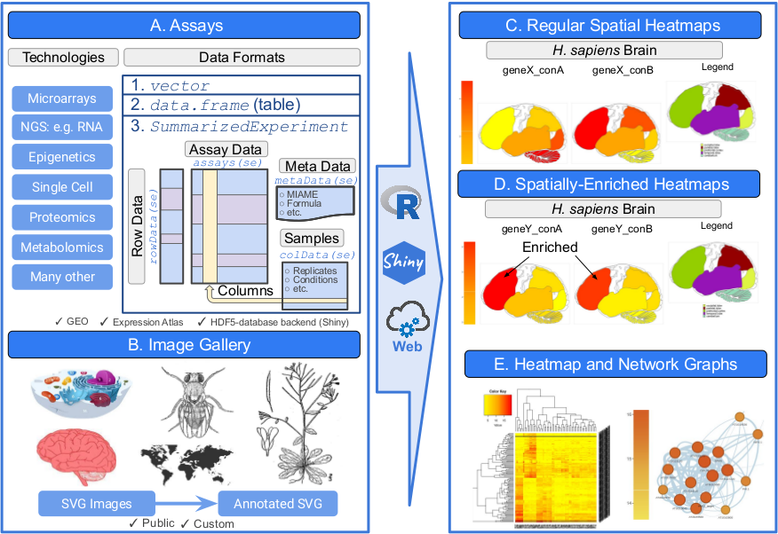
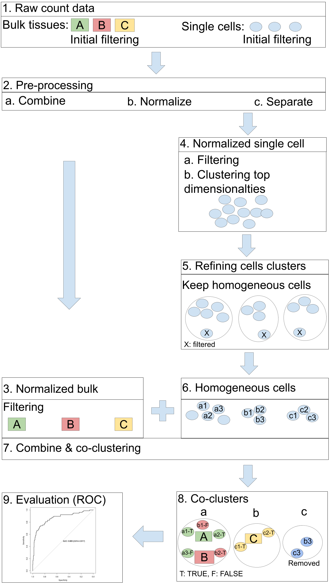

```{css, echo=FALSE}
pre code {
white-space: pre !important;
overflow-x: scroll !important;
word-break: keep-all !important;
word-wrap: initial !important;
}
```

```{r global_options, include=FALSE}
## ThG: chunk added to enable global knitr options. The below turns on
## caching for faster vignette re-build during text editing.
knitr::opts_chunk$set(cache=TRUE)
```
<!-- 

<style type="text/css">
 .main-container { max-width: 1800px; margin-left: 5px; margin-right: auto; }
</style>

<style>body { text-align: justify }</style>  


```{r css, echo = FALSE, results = 'asis'}
BiocStyle::markdown(css.files=c('file/custom.css'))
```

-->

```{r setup0, eval=TRUE, echo=FALSE, message=FALSE, warning=FALSE}
library(knitr); opts_chunk$set(message=FALSE, warning=FALSE)
```

<p style='color:red'>jianhai: text in red. </p>

# Introduction 

## Motivation

The primary functionality of _spatialHeatmap_ package is to visualize cell-,
tissue- and organ-specific data of biological assays by coloring the
corresponding spatial features defined in anatomical images according to a
numeric color key. The color scheme used to represent the assay values can be
customized by the user. This core functionality of the package is called a
_spatial heatmap_ (SHM) plot. <font style='color:red'> It also has extended functionalities of spatial enrichment (SE) and clustering. SE is specialized in detecting genes that are specifically expressed in a particular spatial feature, while clustering is designed to detect biological molecule groups sharing related abundance profiles (_e.g._ gene modules) and visualize them in matrix heatmaps combined with hierarchical clustering dendrograms and network representations. Moreover, an advanced functionality of integrated co-visualization of bulk and single-cell data (co-visualization) is also developed. Sinlge cells in embedding plots (PCA, UMAP, TSNE) are matched with corresponding bulk tissues in SHMs manually or automatically. These functionalities form an integrated methodology for spatial biological assay data visualization and analysis. </font>     

The functionalities of _spatialHeatmap_ can be used either in a command-driven mode
from within R or a graphical user interface (GUI) provided by a Shiny App that
is also part of this package. While the R-based mode provides flexibility to
customize and automate analysis routines, the Shiny App includes a variety of
convenience features that will appeal to experimentalists and other users less
familiar with R. Moreover, the Shiny App can be used on both local computers as
well as centralized server-based deployments (_e.g._ cloud-based or custom
servers) that can be accessed remotely as a public web service for using
_spatialHeatmap's_ functionalities with community and/or private data. The
functionalities of the `spatialHeatmap` package are illustrated in Figure
\@ref(fig:illus).   


```{r illus, echo=FALSE, fig.wide=TRUE, out.width="100%", fig.cap=("Overview of spatialHeatmap. (A) The _saptialHeatmap_ package plots numeric assay data onto spatially annotated images. A wide range of omics technologies is supported including genomic, transcriptomic, proteomic and metabolomic profiling data. The assay data can be provided as numeric vectors, tabular data, or _SummarizedExperiment_ objects. The latter is a widely used data container for organizing both assay data as well as associated annotation and experimental design data. (B) Anatomical and other spatial images need to be provided as annotated SVG (aSVG) files where the spatial features and the corresponding data components of the assay data have matching labels (_e.g._ tissue labels). The assay data are used to color the matching spatial features in aSVG images according to a color key. The result is called a spatial heatmap (SHM). In the regular SHM (C), the feature profiles may or may not be contrasting, while in the enriched SHM (D) there are clear contrasting profiles across features. (E) Data mining graphics, such as matrix heatmaps and network graphs, are integrated to facilitate the identification of factors with similar assay profiles. The functionalities of _spatialHeatmap_ can be accessed from local computers via the R console or a graphical user interface based on Shiny. In addition, the latter can be deployed as a web service on custom servers or cloud-based systems.")}

```

As anatomical images the package supports both tissue maps from public
repositories and custom images provided by the user. In general any type of
image can be used as long as it can be provided in SVG (Scalable Vector
Graphics) format, where the corresponding spatial features have been defined
(see [aSVG](#term) below). The numeric values plotted onto an SHM
are usually quantitative measurements from a wide range of profiling
technologies, such as microarrays, next generation sequencing (_e.g._ RNA-Seq
and scRNA-Seq), proteomics, metabolomics, or many other small- or large-scale
experiments. For convenience, several preprocessing and normalization methods
for the most common use cases are included that support raw and/or preprocessed
data. Currently, the main application domains of the _spatialHeatmap_ package
are numeric data sets and spatially mapped images from biological, agricultural
and biomedical areas. Moreover, the package has been designed to also work with
many other spatial data types, such a population data plotted onto geographic
maps. This high level of flexibility is one of the unique features of
_spatialHeatmap_. Related software tools for biological applications in this
field are largely based on pure web applications [@Maag2018-gi; @Lekschas2015-gd; @Papatheodorou2018-jy; @Winter2007-bq; @Waese2017-fx] or local tools [@Muschelli2014-av] that typically
lack customization functionalities. These restrictions limit users to utilizing
pre-existing expression data and/or fixed sets of anatomical image collections. Additionally, these existing tools are only able to visualize data, but not analyze data to identify feature-specific information. To close this gap for biological use cases, we have developed _spatialHeatmap_
as a generic R/Bioconductor package for plotting quantitative values onto any
type of spatially mapped images in a programmable environment and/or in an
intuitive to use GUI application.

## Design {#design}

The core feature of [`spatialHeatmap`](#shm) is to map assay values (_e.g._
gene expression data) of one or many items (_e.g._ genes) measured under
different conditions in form of numerically graded colors onto the
corresponding cell types or tissues represented in a chosen SVG image. In the
gene profiling field, this feature supports comparisons of the expression
values among multiple genes by plotting their SHMs next to each
other. Similarly, one can display the expression values of a single or multiple
genes across multiple conditions in the same plot (Figure \@ref(fig:mul)). This level of flexibility is
very efficient for visualizing complicated expression patterns across genes,
cell types and conditions. In case of more complex anatomical images with
overlapping multiple layer tissues, it is important to visually expose the
tissue layer of interest in the plots. To address this, several default and
customizable layer viewing options are provided. They allow to hide features in
the top layers by making them transparent in order to expose features below
them. This transparency viewing feature is highlighted below in the mouse
example (Figure \@ref(fig:musshm)). Except for spatial data, this package also works on spatiotemporal data and generates spatiotemporal heatmaps (STHMs, Figure \@ref(fig:clpshm)). Moreover, one can plot multiple distinct 
aSVGs in a single SHM plot as shown in Figure \@ref(fig:arabshm). This is 
particularly useful for displaying abundance trends across multiple development 
stages, where each is represented by its own aSVG image. In addition to
static SHM representations, one can visualize them in form of interactive HTML files or generate videos for them. In spatial enrichment, the target feature is compared with reference features in a pairwise manner. Genes are specifically-expressed in the target feature across all pairwise comparisons are deemed target-specific.   
To maximize reusability and extensibility, the package organizes large-scale
omics assay data along with the associated experimental design information in a
`SummarizedExperiment` object (Figure \@ref(fig:illus)A). The latter is one of the core S4 classes within
the Bioconductor ecosystem that has been widely adapted by many other software
packages dealing with gene-, protein- and metabolite-level profiling data
[@SummarizedExperiment]. In case of gene expression data, the `assays` slot of
the `SummarizedExperiment` container is populated with a gene expression
matrix, where the rows and columns represent the genes and tissue/conditions,
respectively, while the `colData` slot contains sample data including replicate
information. The tissues and/or cell type information in the object maps via
`colData` to the corresponding features in the SVG images using unique
identifiers for the spatial features (_e.g._ tissues or cell types). This
allows to color the features of interest in an SVG image according to the
numeric data stored in a `SummarizedExperiment` object. For simplicity the
numeric data can also be provided as numeric `vectors` or `data.frames`. This
can be useful for testing purposes and/or the usage of simple data sets that
may not require the more advanced features of the `SummarizedExperiment` class,
such as measurements with only one or a few data points. The details about how to
access the SVG images and properly format the associated expression data are
provided in the [Supplementary Section](#data_form) of this vignette.

## Image Format: SVG {#term}
SHMs are images where colors encode numeric values in features of
any shape. For plotting SHMs, Scalable Vector Graphics (SVG) has
been chosen as image format since it is a flexible and widely adapted vector
graphics format that provides many advantages for computationally embedding
numerical and other information in images. SVG is based on XML formatted text
describing all components present in images, including lines, shapes and
colors. In case of biological images suitable for SHMs, the shapes
often represent anatomical or cell structures. To assign colors to specific
features in SHMs, _annotated SVG_ (aSVG) files are used where the
shapes of interest are labeled according to certain conventions so that they
can be addressed and colored programmatically. SVGs and aSVGs of anatomical structures can
be downloaded from many sources including the repositories described [below](#data_repo).
Alternatively, users can generate them themselves with vector graphics software
such as [Inkscape](https://inkscape.org/){target="_blank"}. Typically, in aSVGs one or more 
shapes of a feature of interest, such as the cell shapes of an organ, are
grouped together by a common feature identifier. Via these group identifiers
one or many feature types can be colored simultaneously in an aSVG according to
biological experiments assaying the corresponding feature types with the
required spatial resolution. Correct assignment of image features and assay
results is assured by using for both the same feature identifiers. The color
gradient used to visually represent the numeric assay values is controlled by a
color gradient parameter. To visually interpret the meaning of the colors, the
corresponding color key is included in the SHM plots.  Additional
details for properly formatting and annotating both aSVG images and assay data
are provided in the [Supplementary Section](#sup) section of this vignette. 

## Data Repositories {#data_repo}

If not generated by the user, SHMs can be generated with data downloaded from
various public repositories. This includes gene, protein and metabolic
profiling data from databases, such as [GEO](https://www.ncbi.nlm.nih.gov/gds){target="_blank"},
[BAR](http://bar.utoronto.ca/){target="_blank"} and [Expression
Atlas](https://www.ebi.ac.uk/gxa/home){target="_blank"} from EMBL-EBI [@Papatheodorou2018-jy]. A
particularly useful resource, when working with `spatialHeatmap`, is the EBI
Expression Atlas. This online service contains both assay and anatomical
images. Its assay data include mRNA and protein profiling experiments for
different species, tissues and conditions. The corresponding anatomical image
collections are also provided for a wide range of species including animals and
plants. In `spatialHeatmap` several import functions are provided to work with
the expression and [aSVG repository](#svg_repo) from the Expression Atlas
directly. The aSVG images developed by the `spatialHeatmap` project are
available in its own repository called [spatialHeatmap aSVG
Repository](https://github.com/jianhaizhang/spatialHeatmap_aSVG_Repository){target="_blank"},
where users can contribute their aSVG images that are formatted according to
our guidlines.

## Tutorial Overview {#sample_data}

The following sections of this vignette showcase the most important
functionalities of the `spatialHeatmap` package using as initial example a simple
to understand toy data set, and then more complex mRNA profiling data from the
Expression Atlas and GEO databases. First, SHM plots are generated for both the toy
and mRNA expression data. The latter include gene expression data sets from
RNA-Seq and microarray experiments of [Human Brain](#hum), [Mouse
Organs](#mus), [Chicken Organs](#chk), and [Arabidopsis Shoots](#shoot). The
first three are RNA-Seq data from the [Expression
Atlas](https://www.ebi.ac.uk/gxa/home){target="_blank"}, while the last one is a microarray data
set from [GEO](https://www.ncbi.nlm.nih.gov/geo/){target="_blank"}.  Second, gene context
analysis tools are introduced, which facilitate the visualization of
gene modules sharing similar expression patterns. This includes the
visualization of hierarchical clustering results with traditional matrix
heatmaps ([Matrix Heatmap](#mhm)) as well co-expression network plots
([Network](#net)). Third, the [spatial enrichemnt](#se) functionality is illustrated on the mouse RNA-seq data. Lastly, an overview of the corresponding [Shiny App](#shiny)
is presented that provides access to the same functionalities as the R
functions, but executes them in an interactive GUI environment [@shiny;
@shinydashboard]. Fourth, more advanced features for plotting customized
SHMs are covered using the Human Brain data set as an example.  


# Getting Started  

## Installation  

The `spatialHeatmap` package should be installed from an R (version $\ge$ 3.6)
session with the `BiocManager::install` command.  

```{ eval=FALSE, echo=TRUE, warnings=FALSE} 
if (!requireNamespace("BiocManager", quietly = TRUE))
    install.packages("BiocManager")
BiocManager::install("spatialHeatmap")
```

## Packages and Documentation

Next, the packages required for running the sample code in this vignette need to be loaded.  

```{r, eval=TRUE, echo=TRUE, warnings=FALSE, results='hide'}
library(spatialHeatmap); library(SummarizedExperiment); library(ExpressionAtlas); library(GEOquery); library(scran)
library(scater); library(igraph); library(SingleCellExperiment)
library(BiocParallel)
```

The following lists the vignette(s) of this package in an HTML browser. Clicking the corresponding name will open this vignette. 

```{r, eval=FALSE, echo=TRUE, warnings=FALSE}
browseVignettes('spatialHeatmap')
```

# Spatial Heatmaps (SHMs) {#shm}

## Toy Example {#toy}

SHMs are plotted with the `spatial_hm` function. To provide a quick
and intuitive overview how these plots are generated, the following uses a
generalized toy example where a small vector of random numeric values is
generated that are used to color features in an aSVG image. The image chosen
for this example is an aSVG depicting the human brain. The corresponding image
file 'homo_sapiens.brain.svg' is included in this package for testing purposes.
The path to this image on a user\'s system, where `spatialHeatmap` is
installed, can be obtained with the `system.file` function.

### aSVG Image

The following commands obtain the directory of the aSVG collection and the full path 
to the chosen target aSVG image on a user's system, respectively.

```{r eval=TRUE, echo=TRUE, warnings=FALSE }
svg.dir <- system.file("extdata/shinyApp/example", package="spatialHeatmap")
svg.hum <- system.file("extdata/shinyApp/example", 'homo_sapiens.brain.svg', package="spatialHeatmap")
```

To identify feature labels of interest in annotated aSVG images, the `return_feature`
function can be used. The following searches the aSVG images stored in `dir`
for the query terms 'lobe' and 'homo sapiens' under the `feature` and `species`
fields, respectively. The identified matches are returned as a `data.frame`.   


```{r eval=TRUE, echo=TRUE, warnings=FALSE }
feature.df <- return_feature(feature=c('lobe'), species=c('homo sapiens'), remote=NULL, dir=svg.dir)
feature.df
fnames <- feature.df[, 1]
```

### Numeric Data

The following example generates a small numeric toy vector, where the data slot
contains four numbers and its name slot is populated with the three feature
names obtained from the above aSVG image. In addition, a non-matching entry
(here 'notMapped') is included for demonstration purposes. Note, the numbers
are mapped to features via matching names among the numeric vector and the aSVG,
respectively. Accordingly, only numbers and features with matching name
counterparts can be colored in the aSVG image. Entries without name matches
are indicated by a message printed to the R console, here "notMapped". This
behavior can be turned off with `verbose=FALSE` in the corresponding function
call. In addition, a summary of the numeric assay to feature mappings is stored
in the result `data.frame` returned by the `spatial_hm` function (see below). 


```{r eval=TRUE, echo=TRUE, warnings=FALSE }
my_vec <- sample(1:100, length(unique(fnames))+1)
names(my_vec) <- c(unique(fnames), 'notMapped')
my_vec
```

### Plot SHM

Next, the SHM is plotted with the `spatial_hm` function (Figure
\@ref(fig:toyshm)). Internally, the numbers in `my_vec` are translated into
colors based on the color key assigned to the `col.com` argument, and then
painted onto the corresponding features in the aSVG, where the path to the image
file is defined by `svg.path=svg.hum`. The remaining arguments used here include:
`ID` for defining the title of the plot; `ncol` for setting the column-wise layout 
of the plot excluding the feature legend plot on the right; and `height` for defining 
the height of the SHM relative to its width. In addition, the outline feature `g4320` covers all tissue features due to its default color, so it is set transparent through `ft.trans`. More details of the transparency function is explained in the mouse example (Figure \@ref(fig:musshm)). In the given example
(Figure \@ref(fig:toyshm)) only three features in `my_vec` ('occipital lobe', 
'parietal lobe', and 'temporal lobe') have matching entries in the corresponding 
aSVG.   

```{r toyshm, eval=TRUE, echo=TRUE, warnings=FALSE, fig.wide=TRUE, fig.cap=("SHM of human brain with toy data. The plots from left to right represent: color key, SHM and legend. The colors in the first two plots depict the user provided numeric values, whereas in the legend plot they are used to map the feature labels to the corresponding spatial regions in the image. "), out.width="100%" }
shm.lis <- spatial_hm(svg.path=svg.hum, data=my_vec, ID='toy', ncol=1, height=0.9, width=0.8, sub.title.size=20, legend.nrow=2, ft.trans=c('g4320'))
```

The named numeric values in `my_vec`, that have name matches with the features in the 
chosen aSVG, are stored in the `mapped_feature` slot. The attributes of features are stored in `feature_attribute` slot.  

```{r eval=TRUE, echo=TRUE, warnings=FALSE} 
# The SHM, mapped features, and feature attributes are stored in a list
names(shm.lis)
# Mapped features
shm.lis[['mapped_feature']]
# Feature attributes
shm.lis[['feature_attribute']][1:3, ]
```

## Human Brain {#hum} 

This subsection introduces how to find cell- and tissue-specific assay data in
the Expression Atlas database. After choosing a gene expression experiment, the
data is downloaded directly into a user\'s R session. Subsequently, the 
expression values for selected genes can be plotted onto a chosen aSVG image with 
or without prior preprocessing steps (_e.g._ normalization). For querying and 
downloading expression data from the Expression Atlas database, functions from 
the `ExpressionAtlas` package are used [@ebi]. 

### Gene Expression Data

The following example searches the Expression Atlas for expression data derived from
specific tissues and species of interest, here _'cerebellum'_ and _'Homo sapiens'_,
respectively.  

To avoid repetitive downloading, the downloaded data sets are cached in `~/.cache/shm` in all the following examples.  

```{r eval=TRUE, echo=TRUE, message=FALSE, warnings=FALSE }
cache.pa <- '~/.cache/shm' # The path of cache.
all.hum <- read_cache(cache.pa, 'all.hum') # Retrieve data from cache.
if (is.null(all.hum)) { # Save downloaded data to cache if it is not cached.
  all.hum <- searchAtlasExperiments(properties="cerebellum", species="Homo sapiens")
  save_cache(dir=cache.pa, overwrite=TRUE, all.hum)
}
```

The search result is stored in a `DFrame` containing `r nrow(all.hum)`
accessions matching the above query. For the following sample code, the
accession
'[E-GEOD-67196](https://www.ebi.ac.uk/arrayexpress/experiments/E-GEOD-67196/){target="_blank"}'
from Prudencio _et al._ [-@Prudencio2015-wd] has been chosen, which corresponds
to an RNA-Seq profiling experiment of _'cerebellum'_ and _'frontal cortex'_ brain
tissue from patients with amyotrophic lateral sclerosis (ALS). Details about the
corresponding record can be returned as follows.

```{r eval=TRUE, echo=TRUE, warnings=FALSE }
all.hum[2, ]
```

The `getAtlasData` function allows to download the chosen RNA-Seq experiment
from the Expression Atlas and import it into a `RangedSummarizedExperiment`
object of a user\'s R session.   

```{r eval=TRUE, echo=TRUE, warnings=FALSE }
rse.hum <- read_cache(cache.pa, 'rse.hum') # Read data from cache.
if (is.null(rse.hum)) { # Save downloaded data to cache if it is not cached.
  rse.hum <- getAtlasData('E-GEOD-67196')[[1]][[1]]
  save_cache(dir=cache.pa, overwrite=TRUE, rse.hum)
}
```

The design of the downloaded RNA-Seq experiment is described in the `colData` slot of 
`rse.hum`. The following returns only its first five rows and columns.

```{r eval=TRUE, echo=TRUE, warnings=FALSE }
colData(rse.hum)[1:5, 1:5]
```

### aSVG Image {#humSVG} 

The following example shows how to download from the above described [SVG
repositories](#data_repo) an aSVG image that matches the tissues and species
assayed in the gene expression data set downloaded in the previous subsection.
The `return_feature` function queries the repository for feature- and
species-related keywords, here `c('frontal cortex', 'cerebellum')` and `c('homo
sapiens', 'brain')`, respectively. To return matching aSVGs, the argument
`keywords.any` is set to `TRUE` by default. When `return.all=FALSE`, only aSVGs
matching the query keywords are returned and saved under `dir`. Otherwise, all
aSVGs are returned regardless of the keywords. To avoid overwriting of existing
SVG files, it is recommended to start with an empty target directory, here
`tmp.dir.shm`. To search a local directory for matching aSVG images, the argument
setting `remote=NULL` needs to be used, while specifying the path of the
corresponding directory under `dir`. All or only matching features are returned
if `match.only` is set to `FALSE` or `TRUE`, respectively.  

According to Bioconductor's requirements, downloadings are not allowed inside functions, 
so the remote repos are downloaded before calling `return_feature`.    

<!--
Code chunk not evaluated to save time building this vignette.
-->
```{r eval=FALSE, echo=TRUE, warnings=FALSE }
# Remote aSVG repos.
data(aSVG.remote.repo)
tmp.dir <- normalizePath(tempdir(check=TRUE), winslash="/", mustWork=FALSE)
tmp.dir.ebi <- paste0(tmp.dir, '/ebi.zip')
tmp.dir.shm <- paste0(tmp.dir, '/shm.zip')
# Download the remote aSVG repos as zip files.
download.file(aSVG.remote.repo$ebi, tmp.dir.ebi)
download.file(aSVG.remote.repo$shm, tmp.dir.shm)
remote <- list(tmp.dir.ebi, tmp.dir.shm)
```

Query the downloaded remote aSVG repos.   

<!--
Code chunk not evaluated to save time building this vignette.
-->
```{r eval=FALSE, echo=TRUE, warnings=FALSE }
tmp.dir.shm <- paste0(normalizePath(tempdir(check=TRUE), winslash="/", mustWork=FALSE), '/shm')  # Create empty directory
feature.df <- return_feature(feature=c('frontal cortex', 'cerebellum'), species=c('homo sapiens', 'brain'), keywords.any=TRUE, return.all=FALSE, dir=tmp.dir.shm, remote=remote, match.only=TRUE, desc=FALSE) # Query aSVGs
feature.df[1:8, ] # Return first 8 rows for checking
unique(feature.df$SVG) # Return all matching aSVGs
```

To build this vignettes according to the R/Bioconductor package requirements, the
following code section uses the aSVG file instance included in the
`spatialHeatmap` package rather than the downloaded instance from the previous
example. 


```{r eval=TRUE, echo=TRUE, warnings=FALSE }
feature.df <- return_feature(feature=c('frontal cortex', 'cerebellum'), species=c('homo sapiens', 'brain'), keywords.any=TRUE, return.all=FALSE, dir=svg.dir, remote=NULL)
```

Note, the target tissues `frontal cortex` and `cerebellum` are included in both
the experimental design slot of the downloaded expression data as well as the 
annotations of the aSVG. This way these features can be colored in the downstream
SHM plots. If necessary users can also change from within R the feature identifiers 
and names in an aSVG. Details on this utility are provided in the [Supplementary Section](#update).  

```{r eval=TRUE, echo=TRUE, warnings=FALSE }
feature.df
```

Since the Expression Atlas supports the [cross-species anatomy
ontology](http://uberon.github.io/){target="_blank"}, the corresponding UBERON identifiers are
included in the `id` column of the `data.frame` returned by the above function
call of `return_feature` [@Mungall2012-ma]. This ontology is also supported
by the `rols` Bioconductor package [@rols].


### Experimental Design

For organizing experimental designs and downstream plotting purposes, it can be
desirable to customize the text in certain columns of `colData`. This way one can
use the source data for displaying 'pretty' sample names in columns and legends
of all downstream tables and plots, respectively, in a consistent and automated
manner. To achieve this, the following example imports a 'targets' file that
can be generated and edited by the user in a text or spreadsheet program. In
the following example the target file content is used to replace the text in the
`colData` slot of the `RangedSummarizedExperiment` object with a version containing
shorter sample names that are more suitable for plotting purposes. 


The following imports a custom target file containing simplified sample labels 
and experimental design information.

```{r eval=TRUE, echo=TRUE, warnings=FALSE }
hum.tar <- system.file('extdata/shinyApp/example/target_human.txt', package='spatialHeatmap')
target.hum <- read.table(hum.tar, header=TRUE, row.names=1, sep='\t')
```

Load custom target data into `colData` slot.  

```{r eval=TRUE, echo=TRUE, warnings=FALSE }
colData(rse.hum) <- DataFrame(target.hum)
```

A slice of the simplified `colData` object is shown below, where the `disease`
column contains now shorter labels than in the original data set. Additional
details for generating and using target files in `spatialHeatmap` are provided
in the [Supplementary Section](#data_form) of this vignette.  


```{r eval=TRUE, echo=TRUE, warnings=FALSE}
colData(rse.hum)[c(1:3, 41:42), 4:5]
```

### Preprocess Assay Data

The actual gene expression data of the downloaded RNA-Seq experiment is stored
in the `assay` slot of `rse.hum`. Since it contains raw count data, it can be
desirable to apply basic preprocessing routines prior to plotting spatial
heatmaps. The following shows how to normalize the count data, aggregate
replicates and then remove genes with unreliable expression responses.  These
preprocessing steps are optional and can be skipped if needed. For this,
the expression data can be provided to the `spatial_hm` function directly, where
it is important to assign to the `sam.factor` and `con.factor` arguments 
the corresponding sample and condition column names (Table \@ref(tab:arg)).  

For normalizing raw count data from RNA-Seq experiments, the `norm_data`
function can be used. It supports the following pre-existing functions from
widely used packages for analyzing count data in the next generation sequencing
(NGS) field: `calcNormFactors` (CNF) from `edgeR` [@edgeR1]; as well as
`estimateSizeFactors` (ESF),  `varianceStabilizingTransformation` (VST), and
`rlog` from DESeq2 [@DESeq2].  The argument `norm.fun` specifies one of the
four internal normalizing methods: `CNF`, `ESF`, `VST`, and `rlog`. If
`norm.fun='none'`, no normalization is applied.  The arguments for each
normalizing function are provided via a `parameter.list`, which is a `list`
with named slots. For example, `norm.fun='ESF'` and
`parameter.list=list(type='ratio')` is equivalent to
`estimateSizeFactors(object, type='ratio')`.  If `paramter.list=NULL`, the
default arguments are used by the normalizing function assigned to `norm.fun`.
For additional details, users want to consult the help file of the `norm_data`
function by typing `?norm_data` in the R console. 

The following example uses the `ESF` normalization option. This method has been 
chosen mainly due to its good time performance.   

```{r eval=TRUE, echo=TRUE, warnings=FALSE }
se.nor.hum <- norm_data(data=rse.hum, norm.fun='ESF', log2.trans=TRUE)
```

Replicates are aggregated with the `aggr_rep` function, where the summary
statistics can be chosen under the `aggr` argument (_e.g._ `aggr='mean'`). The
columns specifying replicates can be assigned to the `sam.factor` and
`con.factor` arguments corresponding to samples and conditions, respectively.
For tracking, the corresponding sample/condition labels are used as column
titles in the aggregated `assay` instance, where they are concatenated with a
double underscore as separator. In addition, the corresponding rows in the
`colData` slot are collapsed accordingly.


```{r eval=TRUE, echo=TRUE, warnings=FALSE }
se.aggr.hum <- aggr_rep(data=se.nor.hum, sam.factor='organism_part', con.factor='disease', aggr='mean')
assay(se.aggr.hum)[1:3, ]
```

To remove unreliable expression measures, filtering can be applied.
The following example retains genes with expression values
larger than 5 (log2 space) in at least 1% of all samples (`pOA=c(0.01, 5)`), and
a coefficient of variance (CV) between 0.30 and 100 (`CV=c(0.30, 100)`).  

```{r eval=TRUE, echo=TRUE, warnings=FALSE }
se.fil.hum <- filter_data(data=se.aggr.hum, sam.factor='organism_part', con.factor='disease', pOA=c(0.01, 5), CV=c(0.3, 100), dir=NULL)
```

To inspect the results, the following returns three selected rows of the fully
preprocessed data matrix (Table \@ref(tab:humtab)). 

```{r eval=FALSE, echo=TRUE, warnings=FALSE }
assay(se.fil.hum)[c(5, 733:734), ]
```

```{r humtab, eval=TRUE, echo=FALSE, warnings=FALSE}
cna <- c("cerebellum\\_\\_ALS", "frontal.cortex\\_\\_ALS", "cerebellum\\_\\_normal", "frontal.cortex\\_\\_normal")
kable(assay(se.fil.hum)[c(5, 733:734), ], caption='Slice of fully preprocessed expression matrix.', col.names=cna, escape=TRUE)
```

### SHM: Single Gene

The preprocessed expression values for any gene in the `assay` slot of
`se.fil.hum` can be plotted as an SHM. The following uses gene
`ENSG00000268433` as an example. The chosen aSVG is a depiction of the human
brain where the assayed featured are colored by the corresponding expression
values in `se.fil.hum`.  

<!--
This image is hidden to meet the 5MB requirement on vignette.
-->
<a name='hum_single'></a>
```{r humshm, eval=TRUE, echo=TRUE, warnings=FALSE, fig.wide=TRUE, fig.cap=("SHM of human brain. Only cerebellum and frontal cortex are colored, because they are present in both the aSVG and the expression data. The legend plot on the right maps the feature labels to the corresponding spatial regions in the image."), out.width="100%", fig.show='show' }
shm.lis <- spatial_hm(svg.path=svg.hum, data=se.fil.hum, ID=c('ENSG00000268433'), height=0.7, legend.r=1.5, legend.key.size=0.02, legend.text.size=12, legend.nrow=2, ft.trans=c('g4320'))
```

The plotting instructions of the SHM along with the corresponding 
mapped features and feature attributes are stored as a `list`, here named `shm.lis`. Its components
can be accessed as follows.  

```{r eval=TRUE, echo=TRUE, warnings=FALSE }
names(shm.lis) # All slots.
shm.lis[['mapped_feature']] # Mapped features.
shm.lis[['feature_attribute']][1:3, ] # Feature attributes.
```

In the above example, the normalized expression values of gene `ENSG00000268433` 
are colored in the frontal cortex and cerebellum, where the different conditions, 
here normal and ALS, are given in separate SHMs plotted next to 
each other. The color and feature mappings are defined
by the corresponding color key and legend plot on the left and right, respectively.

### SHM: Multiple Genes

SHMs for multiple genes can be plotted by providing the
corresponding gene IDs under the `ID` argument as a character vector. The
`spatial_hm` function will then sequentially arrange the SHMs for
each gene in a single composite plot. To facilitate comparisons among expression
values across genes and/or conditions, the `lay.shm` parameter can be assigned
`'gene'` or `'con'`, respectively. For instance, in Figure \@ref(fig:mul) the
SHMs of the genes `ENSG00000268433` and `ENSG00000006047` are organized
by condition in a horizontal view. This functionality is particularly useful when
comparing gene families. Users can also customize the order of the SHM subplots, by
assigning `lay.shm='none'`. With this setting the SHM subplots are organized according 
to the gene and condition ordering under `ID` and `data`, respectively.    

```{r mul, eval=TRUE, echo=TRUE, warnings=FALSE, fig.wide=TRUE, fig.cap=("SHMs of two genes. The subplots are organized by \"condition\" with the `lay.shm='con'` setting."), out.width="100%" }
spatial_hm(svg.path=svg.hum, data=se.fil.hum, ID=c('ENSG00000268433', 'ENSG00000006047'), lay.shm='con', width=0.8, height=1, legend.r=1.5, legend.nrow=2, ft.trans=c('g4320'))
```

### SHM: HTML and Video

SHMs can be saved to interactive HTML files as well as video files. To trigger
this export behavior, the argument `out.dir` needs to be assinged a directory
path where the HTML and video files will be stored. Each HTML file
contains an interactive SHM with zoom in and out functionality. Hovering over
graphics features will display data, gene, condition and other information. The
video will play the SHM subplots in the order specified under the `lay.shm`
argument. 

The following example saves the interactive HTML and video files under  
a directory named `tmp.dir.shm`.  

<!--
Code chunk not evaluated to save time building this vignette.
-->
```{r eval=FALSE, echo=TRUE, warnings=FALSE }
tmp.dir.shm <- paste0(normalizePath(tempdir(check=TRUE), winslash="/"), '/shm')
spatial_hm(svg.path=svg.hum, data=se.fil.hum, ID=c('ENSG00000268433', 'ENSG00000006047'), lay.shm='con', width=0.8, height=1, legend.r=1.5, legend.nrow=2, out.dir=tmp.dir.shm, ft.trans=c('g4320'))
```

### SHM: Customization

To provide a high level of flexibility, the `spatial_hm` contains many arguments.
An overview of important arguments and their utility is provided in Table \@ref(tab:arg).

```{r arg, eval=TRUE, echo=FALSE, warnings=FALSE}
arg.df <- read.table('file/spatial_hm_arg.txt', header=TRUE, row.names=1, sep='\t')
kable((arg.df), escape=TRUE, caption="List of important argumnets of \'spatial_hm\'.")
```

## Mouse Organs {#mus}

This section generates an SHM plot for mouse data from the Expression Atlas.
The code components are very similar to the previous [Human Brain](#hum)
example. For brevity, the corresponding text explaining the code has
been reduced to a minimum. 

### Gene Expression Data

The chosen mouse RNA-Seq data compares tissue level gene expression across 
mammalian species [@Merkin2012-ak]. The following searches the Expression 
Atlas for expression data from _'heart'_ and _'Mus musculus'_.

```{r eval=TRUE, echo=TRUE, warnings=FALSE }
all.mus <- read_cache(cache.pa, 'all.mus') # Retrieve data from cache.
if (is.null(all.mus)) { # Save downloaded data to cache if it is not cached.
  all.mus <- searchAtlasExperiments(properties="heart", species="Mus musculus")
  save_cache(dir=cache.pa, overwrite=TRUE, all.mus)
}
```

Among the many matching entries, accession 'E-MTAB-2801' will be downloaded.  

```{r eval=TRUE, echo=TRUE, warnings=FALSE }
all.mus[7, ]
rse.mus <- read_cache(cache.pa, 'rse.mus') # Read data from cache.
if (is.null(rse.mus)) { # Save downloaded data to cache if it is not cached.
  rse.mus <- getAtlasData('E-MTAB-2801')[[1]][[1]]
  save_cache(dir=cache.pa, overwrite=TRUE, rse.mus)
}
```

The design of the downloaded RNA-Seq experiment is described in the `colData` slot of 
`rse.mus`. The following returns only its first three rows.

```{r eval=TRUE, echo=TRUE, warnings=FALSE }
colData(rse.mus)[1:3, ]
```

### aSVG Image  

The following example shows how to retrieve from the above described [remote SVG
repositories](#data_repo) an aSVG image that matches the tissues and species
assayed in the gene expression data set downloaded in the previous subsection.
The remote repos are downloaded in the [Human Brain](#humSVG) example (`remote`) and 
are used below. As before the image is saved to a directory named `tmp.dir.shm`.  

<!--
Code chunk not evaluated to save time building this vignette.
-->
```{r eval=FALSE, echo=TRUE, warnings=FALSE }
tmp.dir.shm <- paste0(normalizePath(tempdir(check=TRUE), winslash="/", mustWork=FALSE), '/shm')
feature.df <- return_feature(feature=c('heart', 'kidney'), species=c('Mus musculus'), keywords.any=TRUE, return.all=FALSE, dir=tmp.dir.shm, remote=remote, match.only=FALSE)
```

To build this vignettes according to the R/Bioconductor package requirements, the
following code section uses the aSVG file instance included in the
`spatialHeatmap` package rather than the downloaded instance from the example in
the previous step. 

```{r eval=TRUE, echo=TRUE, warnings=FALSE }
feature.df <- return_feature(feature=c('heart', 'kidney'), species=NULL, keywords.any=TRUE, return.all=FALSE, dir=svg.dir, remote=NULL, match.only=FALSE) 
```

Return the names of the matching aSVG files.

```{r eval=TRUE, echo=TRUE, warnings=FALSE }
unique(feature.df$SVG)
```

The following first selects `mus_musculus.male.svg` as target aSVG, then
returns the first three rows of the resulting `feature.df`, and finally prints
the unique set of all aSVG features.   

```{r eval=TRUE, echo=TRUE, warnings=FALSE }
feature.df <- subset(feature.df, SVG=='mus_musculus.male.svg')
feature.df[1:3, ]
unique(feature.df[, 1])
```

Obtain path of target aSVG on user system.   

```{r eval=TRUE, echo=TRUE, warnings=FALSE}
svg.mus <- system.file("extdata/shinyApp/example", "mus_musculus.male.svg", package="spatialHeatmap")
```

### Experimental Design

The following imports a sample target file that is included in this package.
To inspect its content, the first three rows of the target file are printed to the 
screen.

```{r eval=TRUE, echo=TRUE, warnings=FALSE }
mus.tar <- system.file('extdata/shinyApp/example/target_mouse.txt', package='spatialHeatmap')
target.mus <- read.table(mus.tar, header=TRUE, row.names=1, sep='\t')
target.mus[1:3, ]
unique(target.mus[, 3])
```

Load custom target data into `colData` slot.  

```{r eval=TRUE, echo=TRUE, warnings=FALSE }
colData(rse.mus) <- DataFrame(target.mus)
```

### Preprocess Assay Data

The raw RNA-Seq count are preprocessed with the following steps: (1)
normalization, (2) aggregation of replicates, and (3) filtering of reliable
expression data. The details of these steps are explained in the sub-section 
above using data from human.

```{r eval=TRUE, echo=TRUE, warnings=FALSE }
se.nor.mus <- norm_data(data=rse.mus, norm.fun='ESF', log2.trans=TRUE) # Normalization
se.aggr.mus <- aggr_rep(data=se.nor.mus, sam.factor='organism_part', con.factor='strain', aggr='mean') # Aggregation of replicates
se.fil.mus <- filter_data(data=se.aggr.mus, sam.factor='organism_part', con.factor='strain', pOA=c(0.01, 5), CV=c(0.6, 100), dir=NULL) # Filtering of genes with low counts and variance 
```

### SHM: Transparency

The pre-processed expression data for gene 'ENSMUSG00000000263' is plotted in form
of an SHM. In this case the plot includes expression data for 8 tissues across 3 
mouse strains. 

```{r musshm, eval=TRUE, echo=TRUE, warnings=FALSE, fig.wide=TRUE, fig.cap=("SHM of mouse organs. This is a multiple-layer image where the shapes of the 'skeletal muscle' is set transparent to expose 'lung' and 'heart'."), out.width="100%" }
shm.lis <- spatial_hm(svg.path=svg.mus, data=se.fil.mus, ID=c('ENSMUSG00000000263'), height=0.7, legend.width=0.7, legend.text.size=10, sub.title.size=9, ncol=3, ft.trans=c('skeletal muscle', 'path4204'), legend.nrow=4, line.size=0.2, line.color='grey70')
```

The SHM plots in Figures \@ref(fig:musshm) and below demonstrate
the usage of the transparency feature via the `ft.trans` parameter. Except for the outline layer `path4204` interfering with other tissues, the
corresponding mouse organ aSVG image includes overlapping tissue layers. In
this case the skelectal muscle layer partially overlaps with lung and heart
tissues. To view lung and heart in Figure \@ref(fig:musshm), the skelectal
muscle tissue and outline are set transparent with `ft.trans=c('skeletal muscle', 'path4204')`. To view
in the same aSVG the skeletal muscle tissue instead, `ft.trans` is assigned
only `path4204` as shown below.  

To fine control the visual effects in feature rich aSVGs, the `line.size` and
`line.color` parameters are useful. This way one can adjust the thickness and 
color of complex structures.


<!--
This image is hidden to meet the 5MB requirement on vignette.
-->
```{r, musshm1, eval=TRUE, echo=TRUE, warnings=FALSE, fig.wide=TRUE, fig.cap=("SHM of mouse organs. This is a multiple-layer image where the view onto 'lung' and 'heart' is obstructed by displaying the 'skeletal muscle' tissue."), out.width="100%", fig.show='show' }
spatial_hm(svg.path=svg.mus, data=se.fil.mus, ID=c('ENSMUSG00000000263'), height=0.6, legend.text.size=10, sub.title.size=9, ncol=3, legend.ncol=2, line.size=0.1, line.color='grey70', ft.trans='path4204')
```

## Chicken Organs {#chk}

This section generates an SHM plot for chicken data from the Expression Atlas.
The code components are very similar to the [Human Brain](#hum) example. For
brevity, the corresponding text explaining the code has been reduced to a
minimum. 

### Gene Expression Data

The chosen chicken RNA-Seq experiment compares the developmental changes across 
nine time points of seven organs [@Cardoso-Moreira2019-yq].

The following searches the Expression Atlas for expression data from _'heart'_
and _'gallus'_.

```{r eval=TRUE, echo=TRUE, warnings=FALSE }
all.chk <- read_cache(cache.pa, 'all.chk') # Retrieve data from cache.
if (is.null(all.chk)) { # Save downloaded data to cache if it is not cached.
  all.chk <- searchAtlasExperiments(properties="heart", species="gallus")
  save_cache(dir=cache.pa, overwrite=TRUE, all.chk)
}
```

Among the matching entries, accession 'E-MTAB-6769' will be downloaded.  

```{r eval=TRUE, echo=TRUE, warnings=FALSE }
all.chk[3, ]
rse.chk <- read_cache(cache.pa, 'rse.chk') # Read data from cache.
if (is.null(rse.chk)) { # Save downloaded data to cache if it is not cached.
  rse.chk <- getAtlasData('E-MTAB-6769')[[1]][[1]]
  save_cache(dir=cache.pa, overwrite=TRUE, rse.chk)
}
```

The design of the downloaded RNA-Seq experiment is described in the `colData`
slot of `rse.chk`. The following returns only its first three rows.

```{r eval=TRUE, echo=TRUE, warnings=FALSE } 
colData(rse.chk)[1:3, ]
```

### aSVG Image  

The following example shows how to download from the above introduced [SVG
repositories](#data_repo) an aSVG image that matches the tissues and species
assayed in the gene expression data set downloaded in the previous subsection.
The remote repos are downloaded in the [Human Brain](#humSVG) example (`remote`) and 
are used below. As before the image is saved to a directory named `tmp.dir.shm`.  

<!--
Code chunk not evaluated to save time building this vignette.
-->
```{r eval=FALSE, echo=TRUE, warnings=FALSE }
tmp.dir.shm <- paste0(normalizePath(tempdir(check=TRUE), winslash="/", mustWork=FALSE), '/shm')
# Query aSVGs.
feature.df <- return_feature(feature=c('heart', 'kidney'), species=c('gallus'), keywords.any=TRUE, return.all=FALSE, dir=tmp.dir.shm, remote=remote, match.only=FALSE)
```

To build this vignettes according to the R/Bioconductor package requirements, the
following code section uses the aSVG file instance included in the
`spatialHeatmap` package rather than the downloaded instance from the previous
step. 

```{r eval=TRUE, echo=TRUE, warnings=FALSE }
feature.df <- return_feature(feature=c('heart', 'kidney'), species=c('gallus'), keywords.any=TRUE, return.all=FALSE, dir=svg.dir, remote=NULL, match.only=FALSE)
feature.df[1:3, ] # A slice of the features.
```

Obtain path of target aSVG on user system.   

```{r eval=TRUE, echo=TRUE, warnings=FALSE}
svg.chk <- system.file("extdata/shinyApp/example", "gallus_gallus.svg", package="spatialHeatmap")
```

### Experimental Design

The following imports a sample target file that is included in this package.
To inspect its content, the first three rows of the target file are printed to the 
screen.

```{r eval=TRUE, echo=TRUE, warnings=FALSE }
chk.tar <- system.file('extdata/shinyApp/example/target_chicken.txt', package='spatialHeatmap')
target.chk <- read.table(chk.tar, header=TRUE, row.names=1, sep='\t')
target.chk[1:3, ]
```

Load custom target data into `colData` slot.  

```{r eval=TRUE, echo=TRUE, warnings=FALSE }
colData(rse.chk) <- DataFrame(target.chk)
```

Return samples used for plotting SHMs.  

```{r eval=TRUE, echo=TRUE, warnings=FALSE }
unique(colData(rse.chk)[, 'organism_part'])
```

Return conditions considered for plotting downstream SHM.  

```{r eval=TRUE, echo=TRUE, warnings=FALSE }
unique(colData(rse.chk)[, 'age'])
```

### Preprocess Assay Data

The raw RNA-Seq count are preprocessed with the following steps: (1)
normalization, (2) aggregation of replicates, and (3) filtering of reliable
expression data. The details of these steps are explained in the above
sub-section on human data.

```{r eval=TRUE, echo=TRUE, warnings=FALSE }
se.nor.chk <- norm_data(data=rse.chk, norm.fun='ESF', log2.trans=TRUE) # Normalization
se.aggr.chk <- aggr_rep(data=se.nor.chk, sam.factor='organism_part', con.factor='age', aggr='mean') # Replicate agggregation using mean 
se.fil.chk <- filter_data(data=se.aggr.chk, sam.factor='organism_part', con.factor='age', pOA=c(0.01, 5), CV=c(0.6, 100), dir=NULL) # Filtering of genes with low counts and varince
```

### SHM: Time Series

The expression profile for gene `ENSGALG00000006346` is plotted across nine time
points in four organs in form of a composite SHM with 9 panels. Their layout in
three columns is controlled with the argument setting `ncol=3`. The target organs are labeled by text in legend plot via `label=TRUE`.   

```{r chkshm, eval=TRUE, echo=TRUE, warnings=FALSE, fig.wide=TRUE, fig.cap=("Time course of chicken organs. The SHM shows the expression profile of a single gene across nine time points and four organs."), out.width="100%" }
spatial_hm(svg.path=svg.chk, data=se.fil.chk, ID='ENSGALG00000006346', width=0.9, legend.width=0.9, legend.r=1.5, sub.title.size=9, ncol=3, legend.nrow=2, label=TRUE)
```

## Arabidopsis Shoot {#shoot}

This section generates an SHM for _Arabidopsis thaliana_ tissues with gene expression
data from the Affymetrix microarray technology. The chosen experiment used
ribosome-associated mRNAs from several cell populations of shoots and roots that were
exposed to hypoxia stress [@Mustroph2009-nu]. In this case the expression data
will be downloaded from [GEO](https://www.ncbi.nlm.nih.gov/geo/){target="_blank"} with utilites
from the `GEOquery` package [@geo]. The data preprocessing routines are
specific to the Affymetrix technology. The remaining code components for
generating SHMs are very similar to the previous examples. For brevity, the
text in this section explains mainly the steps that are specific to this data
set. 


### Gene Expression Data

The GSE14502 data set will be downloaded with the `getGEO` function from the
`GEOquery` package. Intermediately, the expression data is stored in an
`ExpressionSet` container [@biobase], and then converted to a
`SummarizedExperiment` object.  

```{r eval=TRUE, echo=TRUE, warnings=FALSE}
gset <- read_cache(cache.pa, 'gset') # Retrieve data from cache.
if (is.null(gset)) { # Save downloaded data to cache if it is not cached.
  gset <- getGEO("GSE14502", GSEMatrix=TRUE, getGPL=TRUE)[[1]]
  save_cache(dir=cache.pa, overwrite=TRUE, gset)
}
se.sh <- as(gset, "SummarizedExperiment")
```

The gene symbol identifiers are extracted from the `rowData` component to be used 
as row names. Similarly, one can work with AGI identifiers by providing below `AGI` 
under `Gene.Symbol`.  

```{r eval=TRUE, echo=TRUE, warnings=FALSE}
rownames(se.sh) <- make.names(rowData(se.sh)[, 'Gene.Symbol'])
```

The following returns a slice of the experimental design stored in the
`colData` slot. Both the samples and conditions are contained in the `title` column.
The samples include promoters (pGL2, pCO2, pSCR, pWOL, p35S), tissues 
and organs (root atrichoblast epidermis, root cortex meristematic zone, root 
endodermis, root vasculature, root_total and shoot_total); and the conditions 
are control and hypoxia.  

```{r eval=TRUE, echo=TRUE, warnings=FALSE}
colData(se.sh)[60:63, 1:4]
```

### aSVG Image  

In this example, the aSVG image has been generated in Inkscape from 
the corresponding figure in @Mustroph2009-nu. The resulting custom figure
has been included as a sample aSVG file in the `spatialHeatmap` package. Detailed 
instructions for generating custom aSVG images in Inkscape are provided in the 
[SVG tutorial](https://jianhaizhang.github.io/SVG_tutorial_file/){target="_blank"}.   

The annotations in the corresponding aSVG file located under `svg.dir` can be
queried with the `return_features` function.  

```{r eval=TRUE, echo=TRUE, warnings=FALSE }
feature.df <- return_feature(feature=c('pGL2', 'pRBCS'), species=c('shoot'), keywords.any=TRUE, return.all=FALSE, dir=svg.dir, remote=NULL, match.only=FALSE)
```

The unique set of the matching aSVG files can be returned as follows.   

```{r eval=TRUE, echo=TRUE, warnings=FALSE } 
unique(feature.df$SVG)
```

The aSVG file `arabidopsis.thaliana_shoot_shm.svg` is chosen to generate the SHM in this section.

```{r eval=TRUE, echo=TRUE, warnings=FALSE }
feature.df <- subset(feature.df, SVG=='arabidopsis.thaliana_shoot_shm.svg')
feature.df[1:3, ]
```

Obtain full path of target aSVG on user system.   

```{r eval=TRUE, echo=TRUE, warnings=FALSE }
svg.sh <- system.file("extdata/shinyApp/example", "arabidopsis.thaliana_shoot_shm.svg", package="spatialHeatmap")
```

### Experimental Design

The following imports a sample target file that is included in this package.
To inspect its content, four selected rows of this target file are printed to the 
screen.

```{r eval=TRUE, echo=TRUE, warnings=FALSE}
sh.tar <- system.file('extdata/shinyApp/example/target_arab.txt', package='spatialHeatmap')
target.sh <- read.table(sh.tar, header=TRUE, row.names=1, sep='\t')
target.sh[60:63, ]
```

Return all samples present in target file.     

```{r eval=TRUE, echo=TRUE, warnings=FALSE}
unique(target.sh[, 'samples'])
```

Return all conditions present in target file.  

```{r eval=TRUE, echo=TRUE, warnings=FALSE}
unique(target.sh[, 'conditions'])
```

Load custom target data into `colData` slot.  

```{r eval=TRUE, echo=TRUE, warnings=FALSE}
colData(se.sh) <- DataFrame(target.sh)
```

### Preprocess Assay Data

The downloaded GSE14502 data set has already been normalized with the RMA
algorithm [@affy]. Thus, the pre-processing steps can be restricted to the
aggregation of replicates and filtering of reliably expressed genes. For the
latter, the following code will retain genes with expression values larger than
6 (log2 space) in at least 3% of all samples (pOA=c(0.03, 6)), and with a
coefficient of variance (CV) between 0.30 and 100 (CV=c(0.30, 100)).   

```{r eval=TRUE, echo=TRUE, warnings=FALSE }
se.aggr.sh <- aggr_rep(data=se.sh, sam.factor='samples', con.factor='conditions', aggr='mean') # Replicate agggregation using mean
se.fil.arab <- filter_data(data=se.aggr.sh, sam.factor='samples', con.factor='conditions', pOA=c(0.03, 6), CV=c(0.30, 100), dir=NULL) # Filtering of genes with low intensities and variance
```

### SHM: Microarray 

The expression profile for the HRE2 gene is plotted for the control and the hypoxia treatment
across six cell types (Figure \@ref(fig:shshm)).

```{r shshm, eval=TRUE, echo=TRUE, warnings=FALSE, fig.wide=TRUE, fig.cap=('SHM of Arabidopsis shoots. The expression profile of the HRE2 gene is plotted for control and hypoxia treatment across six cell types.'), out.width="100%"}
spatial_hm(svg.path=svg.sh, data=se.fil.arab, ID=c("HRE2"), height=0.7, legend.nrow=3, legend.text.size=11)
```

# Spatiotemporal Heatmaps (STHMs) {#sthm} 

The above examples are SHMs plotted at the single spatial dimension. This section showcases the application of SHMs at spatial and temporal dimesions, *i.e.* data assayed in spatial feature(s) across different development stages.  

The data at single spatial dimension contains only two factors: samples and conditions. By contrast, the spatiotemporal data contains three factors: samples, conditions, and times (development stages). There are three alternatives to organize the three factors: 1) combine samples and conditions; 2) combine samples and times; or 3) combine samples, conditions, and times. More details are provided in the [Supplementary Section](#spa.tem).  

Which option to choose depends on the specific data and aSVGs, and the chosen one should achieve optimal visualization. In this example, the third is the best choice and will be showcased in the first part. Meanwhile, for demonstration purpose the second choice will also be illustrated in the second part. In the spatiotemporal application, different development stages can be represented in different aSVG images, and this feature will be presented in the third part.   

## Sample-Time-Condition Factor

### Gene Expression Data

The data is from the transcriptome analysis on rice coleoptile during germinating and developing stages under anoxia and re-oxygenation [@Narsai2017-ql], which is also downloaded with `ExpressionAtlas`.   

```{r eval=TRUE, echo=TRUE, warnings=FALSE}
rse.clp <- read_cache(cache.pa, 'rse.clp') # Retrieve data from cache.
if (is.null(rse.clp)) { # Save downloaded data to cache if it is not cached.
  rse.clp <- getAtlasData('E-GEOD-115371')[[1]][[1]]
  save_cache(dir=cache.pa, overwrite=TRUE, rse.clp)
}
```

### Experimental Design

The targets file was prepared according to the experiment design stored in `colData` slot of `res.clp` by using the convenient function `edit_tar`, and pre-packaged in `spatialHeatmap`.  

```{r eval=TRUE, echo=TRUE, warnings=FALSE}
clp.tar <- system.file('extdata/shinyApp/example/target_coleoptile.txt', package='spatialHeatmap')
target.clp <- read_fr(clp.tar)
```

The helper function `edit_tar` is designed to edit entries in the targets file. Below is an example of editing the tissue entries.   

```{r eval=TRUE, echo=TRUE, warnings=FALSE}
cdat <- colData(rse.clp) # Original targets file.
unique(cdat$organism_part) # Original tissues.
cdat <- edit_tar(cdat, column='organism_part', old=c('plant embryo', 'plant embryo coleoptile'), new=c('embryo', 'embryoColeoptile')) # Replace old entries with desired ones.
unique(cdat$organism_part) # New tissue entries. 
```

Inspect the tissues, conditions, and times, where "A" and "N" denote "aerobic" and "anaerobic" respectively.   

```{r eval=TRUE, echo=TRUE, warnings=FALSE}
target.clp[1:3, c(6, 7, 9, 10)] # A slice of the targets file.
unique(target.clp[, 'age']) # All development stages.
unique(target.clp[, 'organism_part']) # All tissues.
unique(target.clp[, 'stimulus']) # All conditions.
```

Combine sample, time, condition factors using the helper function `com_factor`. The targets file including the new composite factors (`samTimeCon`) is loaded to the `colData` slot in `rse.clp` internally.   

```{r eval=TRUE, echo=TRUE, warnings=FALSE}
rse.clp <- com_factor(rse.clp, target.clp, factors2com=c('organism_part', 'age', 'con'), sep='.', factor.new='samTimeCon')
colData(rse.clp)[1:3, c(6, 7, 9:11)]
```

Inspect the sample-time-condition composite factors. At least one of the composite factors should have a matching feature counterpart in the aSVG file, otherwise no aSVG file will be returned in the next section.  

```{r eval=TRUE, echo=TRUE, warnings=FALSE}
target.clp <- colData(rse.clp)
unique(target.clp$samTimeCon)
```

### aSVG Image

Similar with the Arabidopsis Shoot example, the aSVG image has been generated in Inkscape from 
the corresponding figure in @Narsai2017-ql according to the [SVG tutorial](https://jianhaizhang.github.io/SVG_tutorial_file/){target="_blank"}, and the resulting custom figure
has been included in `spatialHeatmap`.   

Query the aSVG files with one composite factor `embryo.0h.A`.   

```{r eval=TRUE, echo=TRUE, warnings=FALSE }
feature.df <- return_feature(feature=c('embryo.0h.A', 'embryoColeoptile.1h.A'), species=c('oryza', 'sativa'), keywords.any=FALSE, return.all=FALSE, dir=svg.dir, remote=NULL, match.only=FALSE)
feature.df[1:2, ] # The first two rows of the query results.
```

Only one aSVG file `oryza.sativa_coleoptile.ANT_shm.svg` is retrieved.  

```{r eval=TRUE, echo=TRUE, warnings=FALSE } 
unique(feature.df$SVG)
```

<a name='idt'></a>
Note no matter how the factors are combined, the composite factors of interest should always have matching counterparts in the aSVG file. In this example, all composite factors are matched to the aSVG.   

```{r eval=TRUE, echo=TRUE, warnings=FALSE } 
unique(target.clp$samTimeCon) %in% unique(feature.df$feature)
```

Obtain full path of the retrieved aSVG on user system.   

```{r eval=TRUE, echo=TRUE, warnings=FALSE }
svg.clp1 <- system.file("extdata/shinyApp/example", "oryza.sativa_coleoptile.ANT_shm.svg", package="spatialHeatmap")
```

### Preprocess Assay Data


The raw RNA-Seq count are preprocessed with the following steps: (1)
normalization, (2) aggregation of replicates, and (3) filtering of reliable
expression data. The details of these steps are explained in the above
sub-section on human data. The normalization step is same for combined factors sample-time and sample-time-condition, while the aggregation and filtering are different. The difference is reflected by `sam.factor` and `con.factor`, and subsequently the column names in resulting `assay` slot of the `SummarizedExperiment` object.   

```{r eval=TRUE, echo=TRUE, warnings=FALSE }
se.nor.clp <- norm_data(data=rse.clp, norm.fun='ESF', log2.trans=TRUE) # Normalization
```

<a name='sam.time.con1'></a>
Aggregation and filtering by sample-time-condition factor.  

```{r eval=TRUE, echo=TRUE, warnings=FALSE }
se.aggr.clp1 <- aggr_rep(data=se.nor.clp, sam.factor='samTimeCon', con.factor=NULL, aggr='mean') # Replicate agggregation using mean
se.fil.clp1 <- filter_data(data=se.aggr.clp1, sam.factor='samTimeCon', con.factor=NULL, pOA=c(0.07, 7), CV=c(0.7, 100), dir=NULL) # Filtering of genes with low counts and varince.
```

<a name='sam.time.con2'></a>
Since all three factors (conditions, times, tissues) are combined, the resulting data table loses the double underscore string. 

```{r eval=TRUE, echo=TRUE, warnings=FALSE }
assay(se.fil.clp1)[1:3, 1:3] # A slice of the resulting data table.
```

### STHM: combine sample, time, and condition

The expression profile of gene `Os12g0630200` and `Os01g0106300` in coleoptile is plotted across eight time
points under anoxia and re-oxygenation in form of a composite STHM.   

```{r clpshm, eval=TRUE, echo=TRUE, warnings=FALSE, fig.wide=TRUE, fig.cap=("Spatiotemporal heatmap at sample-time-condition factor. Gene expression profile of two genes in coleoptile across eight time points under anoxia and re-oxygenation is visualized in a composite image."), out.width="100%" }
shm.lis <- spatial_hm(svg.path=svg.clp1, data=se.fil.clp1, ID=c('Os12g0630200', 'Os01g0106300'), legend.r=0.7, legend.key.size=0.01, legend.text.size=8, legend.nrow=8, ncol=1, width=0.8, line.size=0)
```

This STHM example is also deployed as an interacive Shiny app, where STHMs are provided in form of static images, interactive HTML files, and video files. Click [here](https://tgirke.shinyapps.io/spatiotemporalHeatmap/){target="_blank"} to see this app.   

<!--
<iframe width='700px' height='700px' src='https://tgirke.shinyapps.io/spatiotemporalHeatmap/'></iframe>
-->

## Sample-Time Factor

This part showcases the usage of sample-time factor. The sample-condition factor could be applied similarly. To obtain optimal result, the data under aerobic is excluded. Since most steps are similar with the sample-time-condition factor, the following process is reduced to minimum.  

### Gene Expression Data

The same RNA-seq count data from @Narsai2017-ql is downloaded.  

```{r eval=TRUE, echo=TRUE, warnings=FALSE}
rse.clp <- read_cache(cache.pa, 'rse.clp') # Retrieve data from cache.
if (is.null(rse.clp)) { # Save downloaded data to cache if it is not cached.
  rse.clp <- getAtlasData('E-GEOD-115371')[[1]][[1]]
  save_cache(dir=cache.pa, overwrite=TRUE, rse.clp)
}
```

### Experimental Design

The same targets file with sample-time factor is imported.   

```{r eval=TRUE, echo=TRUE, warnings=FALSE}
clp.tar <- system.file('extdata/shinyApp/example/target_coleoptile.txt', package='spatialHeatmap')
target.clp <- read_fr(clp.tar)
```

Inspect the samples, conditions, and times.  

```{r eval=TRUE, echo=TRUE, warnings=FALSE}
target.clp[1:3, c(6, 7, 9, 10)] # A slice of the targets file.
unique(target.clp[, 'age']) # All development stages.
unique(target.clp[, 'organism_part']) # All tissues.
unique(target.clp[, 'stimulus']) # All conditions.
```

Combine sample and time factors, which is the essential difference with sample-time-condition example.  

```{r eval=TRUE, echo=TRUE, warnings=FALSE}
rse.clp <- com_factor(rse.clp, target.clp, factors2com=c('organism_part', 'age'), factor.new='samTime')
target.clp <- colData(rse.clp)
target.clp[1:3, ]
```

### aSVG Image

Similarly the custom aSVG image was generated in Inkscape from 
the corresponding figure in @Narsai2017-ql according to the [SVG tutorial](https://jianhaizhang.github.io/SVG_tutorial_file/){target="_blank"} and included in `spatialHeatmap`.   

Query the aSVG files.  

```{r eval=TRUE, echo=TRUE, warnings=FALSE }
feature.df <- return_feature(feature=c('embryo.0h', 'embryoColeoptile1h'), species=c('oryza', 'sativa'), keywords.any=FALSE, return.all=FALSE, dir=svg.dir, remote=NULL, match.only=FALSE)
feature.df[1:2, ] # The first two rows of the query results.
```

Only one aSVG file `oryza.sativa_coleoptile.NT_shm.svg` is retrieved.  

```{r eval=TRUE, echo=TRUE, warnings=FALSE } 
unique(feature.df$SVG)
```

Note no matter how the factors are combined, the composite factor of interest should always have matching counterparts in the aSVG file.  

```{r eval=TRUE, echo=TRUE, warnings=FALSE } 
unique(target.clp$samTime) %in% unique(feature.df$feature)
```

Obtain full path of the retrieved aSVG on user system.   

```{r eval=TRUE, echo=TRUE, warnings=FALSE }
svg.clp2 <- system.file("extdata/shinyApp/example", "oryza.sativa_coleoptile.NT_shm.svg", package="spatialHeatmap")
```

### Preprocess Assay Data


The raw RNA-Seq count are preprocessed with the following steps: (1)
normalization, (2) aggregation of replicates, and (3) filtering of reliable
expression data. The normalization step is the same for composite factors sample-time and sample-time-condition, while the aggregation and filtering are different. The difference is reflected by `sam.factor` and `con.factor`, and subsequently the column names in the `assay` slot of the resulting `SummarizedExperiment` object.   

```{r eval=TRUE, echo=TRUE, warnings=FALSE }
se.nor.clp <- norm_data(data=rse.clp, norm.fun='ESF', log2.trans=TRUE) # Normalization
```

Aggregation and filtering by sample-time factor.  

```{r eval=TRUE, echo=TRUE, warnings=FALSE }
se.aggr.clp2 <- aggr_rep(data=se.nor.clp, sam.factor='samTime', con.factor='stimulus', aggr='mean') # Replicate agggregation using mean. 
se.fil.clp2 <- filter_data(data=se.aggr.clp2, sam.factor='samTime', con.factor='stimulus', pOA=c(0.07, 7), CV=c(0.7, 100), dir=NULL) # Filtering of genes with low counts and varince.
```

Since only sample and time factors are combined, the resulting data table preserves the double underscore string, which is different from the sample-time-condition example.   

```{r eval=TRUE, echo=TRUE, warnings=FALSE }
df.fil.clp <- assay(se.fil.clp2) 
df.fil.clp[1:3, 1:3] # A slice of the resulting data table.
```

The optimal viusalization on complete data is achieved on sample-time-condition factor. To also obtain the best result on sample-time factor, the data under aerobic is excluded. 

<a name='sam.time'></a>
```{r eval=TRUE, echo=TRUE, warnings=FALSE }
df.fil.clp1 <- df.fil.clp[, !grepl('__aerobic', colnames(df.fil.clp))] # Exclude aerobic data.  
df.fil.clp1[1:3, 1:3] # A slice of the data table without aerobic data.
```

### STHM: combine sample and time

The expression profile of gene `Os12g0630200` in coleoptile is plotted across eight time
points under anoxia and re-oxygenation respectively.   

<!--
This image is hidden to meet the 5MB requirement on vignette.
-->

```{r clpshm1, eval=TRUE, echo=TRUE, warnings=FALSE, fig.wide=TRUE, fig.cap=("Spatiotemporal heatmap at sample-time factor. Gene expression profile of one gene in coleoptile across eight time points under anoxia and re-oxygenation is visualized in two images."), out.width="100%", fig.show='show'}
shm.lis <- spatial_hm(svg.path=svg.clp2, data=df.fil.clp1, ID=c('Os12g0630200'), legend.r=0.9, legend.key.size=0.02, legend.text.size=9, legend.nrow=8, ncol=1, line.size=0)
```

## Multiple aSVGs {#mul_svg}

In the spatiotemporal application, different development stages may need to be represented in separate aSVG images. In that case, the `spatial_hm` function is able to arrange multiple aSVGs in a single SHM plot. To organize the subplots, the names
of the separate aSVG files are expected to include the following suffixes: `*_shm1.svg`,
`*_shm2.svg`, *etc*. The paths to the aSVG files are provided under the
`svg.path` argument. By default, every aSVG image will have a legend plot on
the right. The `legend` argument provides fine control over which legend plots
to display. 

As a simple toy example, the following stores random numbers in a 
`data.frame`.  

```{r eval=TRUE, echo=TRUE, warnings=FALSE}
df.random <- data.frame(matrix(sample(x=1:100, size=50, replace=TRUE), nrow=10))
colnames(df.random) <- c('shoot_totalA__condition1', 'shoot_totalA__condition2', 'shoot_totalB__condition1', 'shoot_totalB__condition2', 'notMapped') # Assign column names
rownames(df.random) <- paste0('gene', 1:10) # Assign row names 
df.random[1:3, ]
```

Next the paths to the aSVG files are obtained, here for younger and older plants using `*_shm1` 
and `*_shm1`, respectively, which are made from @Mustroph2009-nu.   

```{r eval=TRUE, echo=TRUE, warnings=FALSE}
svg.sh1 <- system.file("extdata/shinyApp/example", "arabidopsis.thaliana_organ_shm1.svg", package="spatialHeatmap")
svg.sh2 <- system.file("extdata/shinyApp/example", "arabidopsis.thaliana_organ_shm2.svg", package="spatialHeatmap")
```

The following generates the corresponding SHMs plot for `gene1`. The orginal 
image dimensions can be preserved by assigning `TRUE` to the `preserve.scale` argument.   


<!--
This image is hidden to meet the 5MB requirement on vignette.
-->

```{r arabshm, eval=TRUE, echo=TRUE, warnings=FALSE, fig.wide=TRUE, fig.cap=('Spatial heatmap of Arabidopsis at two growth stages. The expression profile of gene1 under condition1 and condition2 is plotted for two growth stages (top and bottom row).'), out.width="100%", fig.show='show'}
spatial_hm(svg.path=c(svg.sh1, svg.sh2), data=df.random, ID=c('gene1'), width=0.7, legend.r=0.2, legend.width=1, preserve.scale=TRUE, bar.width=0.09) 
```

Note in Figure \@ref(fig:arabshm) shoots have thicker outlines than roots. This is another function of `spatial_hm`, *i.e.* preserves the outline thicknesses defined in aSVG files. This feature is particularly useful in cellular SHMs where different cell types have different cell-wall thicknesses. The outline widths can be updated with `update_feature` programatically or with Inkscape manually. The former is illustrated in the Supplementary Section.   

# Multi-Factor Spatial Heatmaps {#multFactor}

In principle, the `spatialHeatmap` is extendable to as many factors (*e.g.* samples, conditions, times) as possible. The most common scenario involves only two factors of samples and conditions ([Section 3](#shm)). If more factors are relevant such as development stages, geographical locations, genotypes, *etc*, all or selected factors should be combined to generate composite factors. The [spatiotemporal section](#sthm) is an illustration of three factors. Similar combining strategies should be appied in cases of four or more factors. A rule of thumb is the composite factors of interest must have a matching counterpart in the aSVG file, otherwise target spatial features are not painted in spatial heatmaps.   

<font style='color:red'>


# Overlaying 

`spatialHeatmap` supports overlaying real images with SHMs, which provides more intuitive background. There are certain requirements to utilize this feature: 1) The real images are templates for creating aSVGs and the formats include `.jpg`, `.JPG`, `.png`, `.PNG`; 2) Except for file extensions, the file names of templates and aSVGs should be same such as `real_shm.png`, `real_shm.svg`. In other words, templates and aSVGs should be paired; and 3) If multiple templates/aSVGs are used such as developmental stages, names of separate template/aSVG files need to include the following suffixes: `*_shm1.png`, `*_shm1.svg`, `*_shm2.png`, `*_shm2.svg`, etc. Otherwise, the order of these images is not recognized.  

In the following example, template images are modified from a study on abaxial bundle sheath (ABS) cells in maize leaves [@Bezrutczyk2021-fq]. They are labeled 1 and 2 to mimic two developmental stages. The data are randomly generated.   

The first template and paired aSVG.  
```{r eval=TRUE, echo=TRUE, warnings=FALSE}
tmp.pa1 <- system.file('extdata/shinyApp/example/maize_leaf_shm1.png', package='spatialHeatmap')
svg.pa1 <- system.file('extdata/shinyApp/example/maize_leaf_shm1.svg', package='spatialHeatmap')
```

The second template and paired aSVG.  
```{r eval=TRUE, echo=TRUE, warnings=FALSE}
tmp.pa2 <- system.file('extdata/shinyApp/example/maize_leaf_shm2.png', package='spatialHeatmap')
svg.pa2 <- system.file('extdata/shinyApp/example/maize_leaf_shm2.svg', package='spatialHeatmap')
```

Random data.  
```{r eval=TRUE, echo=TRUE, warnings=FALSE}
dat.overlay <- read_fr(system.file('extdata/shinyApp/example/dat_overlay.txt', package='spatialHeatmap'))
dat.overlay[1:2, ]
```

The real images may contain colors that interfere with SHMs. To address such issues, the argument `alpha.overlay` is developed to adjust transparency of real images. In Figure \@ref(fig:overCol), expression profiles of gene1 are plotted on SHMs and SHMs are placed on top of template images.    

```{r overCol, eval=TRUE, echo=TRUE, warnings=FALSE, fig.wide=TRUE, fig.cap=('Overlaying real images with SHMs (colorful backaground). The expression profiles of gene1 are plotted on ABS cells.'), out.width="100%", fig.show='show'}
spatial_hm(svg.path=c(svg.pa1, svg.pa2), data=dat.overlay, tmp.path=c(tmp.pa1, tmp.pa2), charcoal=FALSE, ID=c('gene1'), alpha.overlay=0.5, bar.width=0.09, sub.title.vjust=4)
```

To reduce template colors to minimum, templates can be set black-white by `charcoal=TRUE` (Figure \@ref(fig:overChar)).  

```{r overChar, eval=TRUE, echo=TRUE, warnings=FALSE, fig.wide=TRUE, fig.cap=('Overlaying real images with SHMs (black-white background). The expression profiles of gene1 are plotted on ABS cells.'), out.width="100%", fig.show='show'}
spatial_hm(svg.path=c(svg.pa1, svg.pa2), data=dat.overlay, tmp.path=c(tmp.pa1, tmp.pa2), charcoal=TRUE, ID=c('gene1'), alpha.overlay=0.5, bar.width=0.09, sub.title.vjust=4)
```

</font>

# Matrix Heatmaps {#mhm}

SHMs are suitable for comparing assay profiles among small number of items
(_e.g._ few genes or proteins) across cell types and conditions. To also
support analysis routines of larger number of items, `spatialHeatmap` integrates
functionalities for identifying groups of items with similar and/or dissimilar 
assay profiles, and subsequently analyzing the results with data mining 
methods that scale to larger numbers of items than SHMs, such as hierarchical
clustering and network analysis methods. The following introduces both
approaches using as sample data the gene expression data from Arabidopsis
shoots from the previous section.

To identify similar items, the `submatrix` function can be used. The latter
identifies items sharing similar profiles with one or more query items of
interest. The given example uses correlation coefficients as similarity metric.
Three filtering parameters are provided to control the similarity and number of
items in the result. First, the `p` argument allows to restrict the number of
similar items to return based on a percentage cutoff relative to the number of
items in the assay data set (_e.g._ 1% of the top most similar items). Second,
a fixed number `n` of the most similar items can be returned.  Third, all items
above a user definable correlation coefficient cutoff value can be returned,
such as a Pearson correlation coefficient (PCC) of at least 0.6. If several
query items are provided then the function returns the similar genes for each
query, while assuring uniqueness among items in the result. 

The following example uses as query the two genes: 'RCA' and 'HRE2'. The `ann`
argument corresponds to the column name in the `rowData` slot containing gene
annotation information. The latter is only relevant if users want to see these
annotations when mousing over a node in the [interactive network](#inter_net)
plot generated in the next section. 

```{r eval=TRUE, echo=TRUE, warnings=FALSE}
sub.mat <- submatrix(data=se.fil.arab, ann='Target.Description', ID=c('RCA', 'HRE2'), p=0.1)
```

The result from the previous step is the assay matrix subsetted to the genes sharing similar assay profiles
with the query genes 'RCA' and 'HRE2'.  

```{r eval=TRUE, echo=TRUE, warnings=FALSE}
sub.mat[c('RCA', 'HRE2'), c(1:3, 37)] # Subsetted assay matrix
```

<a name="mhm1"></a>
Subsequently, hierarchical clustering is applied to the subsetted assay matrix
containing only the genes that share profile similarities with the query genes
'RCA' and 'HRE2'.  The clustering result is displayed as a matrix heatmap where
the rows and columns are sorted by the corresponding hierarchical clustering
dendrograms (Figure \@ref(fig:static)). The position of the query genes ('RCA'
and 'HRE2') is indicated in the heatmap by black lines. Setting `static=FALSE`
will launch the interactive mode, where users can zoom into the heatmap by
selecting subsections in the image or zoom out by double clicking.  

```{r static, eval=TRUE, echo=TRUE, warnings=FALSE, fig.cap=("Matrix Heatmap. Rows are genes and columns are samples. The input genes are tagged by black lines."), out.width='100%'}
matrix_hm(ID=c('RCA', 'HRE2'), data=sub.mat, angleCol=80, angleRow=35, cexRow=0.8, cexCol=0.8, margin=c(10, 6), static=TRUE, arg.lis1=list(offsetRow=0.01, offsetCol=0.01))
```   

# Network Graphs {#net}
## Module Identification

<a name="ds"></a>
Network analysis is performed with the WGCNA algorithm [@Langfelder2008-sg;
@Ravasz2002-db] using as input the subsetted assay matrix generated in the 
previous section. The objective is to identify network modules that can be 
visualized in the following step in form of network graphs. Applied to the gene
expression sample data used here, these network modules represent groups of
genes sharing highly similar expression profiles. Internally, the network
module identification includes five major steps. First, a correlation matrix is
computed using distance or correlation-based similarity metrics. Second, the
obtained matrix is transformed into an adjacency matrix defining the
connections among items. Third, the adjacency matrix is used to calculate a
topological overlap matrix (TOM) where shared neighborhood information among
items is used to preserve robust connections, while removing spurious
connections. Fourth, the distance transformed TOM is used for hierarchical
clustering. To maximize time performance, the hierarchical clustering is
performed with the `flashClust` package [@Langfelder2012-nv]. Fifth, network modules
are identified with the `dynamicTreeCut` package [@dynamicTreeCut]. Its `ds`
(`deepSplit`) argument can be assigned integer values from `0` to `3`, where
higher values increase the stringency of the module identification process.  To
simplify the network module identification process with WGCNA, the individual
steps can be executed with a single function called `adj_mod`. The result is a
list containing the adjacency matrix and the final module assignments stored in
a `data.frame`. Since the [interactive network](#inter_net) feature used in the
visualization step below performs best on smaller modules, only modules are
returned that were obtained with stringent `ds` settings (here `ds=2` and `ds=3`). 

```{r eval=TRUE, echo=TRUE, warnings=FALSE, results=FALSE}
adj.mod <- adj_mod(data=sub.mat)
```

A slice of the adjacency matrix is shown below.    

```{r eval=TRUE, echo=TRUE, warnings=FALSE}
adj.mod[['adj']][1:3, 1:3]
```

The module assignments are stored in a `data frame`. Its columns contain the results
for the `ds=2` and `ds=3` settings. Integer values $>0$ are the module labels, while $0$ 
indicates unassigned items. The following returns the first three rows of the module 
assignment result.  

```{r eval=TRUE, echo=TRUE, warnings=FALSE}
adj.mod[['mod']][1:3, ] 
```


## Module Visualization

Network modules can be visualized with the `network` function. To plot a module
containing an item (gene) of interest, its ID (_e.g._ 'HRE2') needs to be
provided under the corresponding argument.  Typically, this could be one of the
items chosen for the above SHM plots. There are two modes to visualize the
selected module: static or interactive. Figure \@ref(fig:inter) was generated
with `static=TRUE`. Setting `static=FALSE` will generate the interactive
version. In the network plot shown below the nodes and edges represent genes
and their interactions, respectively. The thickness of the edges denotes the
adjacency levels, while the size of the nodes indicates the degree of
connectivity of each item in the network. The adjacency and connectivity levels
are also indicated by colors. For example, in Figure \@ref(fig:inter)
connectivity increases from "turquoise" to "violet", while the adjacency
increases from "yellow" to "blue".  If a gene of interest has been assigned
under `ID`, then its ID is labeled in the plot with the suffix tag: `*_target`.  

```{r inter, eval=TRUE, echo=TRUE, warnings=FALSE, fig.cap=("Static network. Node size denotes gene connectivity while edge thickness stands for co-expression similarity.") }
network(ID="HRE2", data=sub.mat, adj.mod=adj.mod, adj.min=0.90, vertex.label.cex=1.2, vertex.cex=2, static=TRUE)
```   

<a name="inter_net"></a>
Setting `static=FALSE` launches the interactive network. In this mode there
is an interactive color bar that denotes the gene connectivity. To modify it,
the color labels need to be provided in a comma separated format, _e.g._: 
`yellow, orange, red`. The latter would indicate that the gene connectivity 
increases from yellow to red. 

If the subsetted expression matrix contains gene/protein annotation information
in the last column, then it will be shown when moving the cursor over a network
node.    

```{r eval=FALSE, echo=TRUE, warnings=FALSE}
network(ID="HRE2", data=sub.mat, adj.mod=adj.mod, static=FALSE)
```

<font style='color:red'>

# Spatial Enrichment (SE) {#se} 

This functionality is an extension of the SHMs. It identifies spatial feature-specifically expressed genes and thus enables the SHMs to visualize feature-specific profiles. It compares the target feature with all other selected features in a pairwise manner. The genes significantly up- or down-regulated in the target feature across all pairwise comparisons are denoted final target feature-specifically expressed genes. The base methods include edgeR [@edgeR], limma [@limma], DESeq2 [@DESeq2], distinct [@distinct]. The feature-specific genes are first detected with each method independently then summarized across methods.  

In addition to feature-specific genes, the SE is also able to identify genes specifically expressed in a certain condition or certain composite factor. The latter is a combination of multiple expermental factors. *E.g.* the spatiotemporal factor is a combination of feature and time points. See [section 5](#multFactor) for details.  

The application of SE is illustrated on the mouse brain in the following example, which could be extended to other examples in a similar way.  

## Mouse Brain

In this example, `brain` is selected as the target feature, `liver` and `kidney` as the reference features, and all the three strains `DBA.2J`, `C57BL.6`, `CD1` as the factors. 

All features.   

```{r eval=TRUE, echo=TRUE, warnings=FALSE }
unique(colData(rse.mus)$organism_part)
```

All factors.   

```{r eval=TRUE, echo=TRUE, warnings=FALSE }
unique(colData(rse.mus)$strain)
```

Subset the data according to the selected features and factors.   

```{r eval=TRUE, echo=TRUE, warnings=FALSE }
data.sub.mus <- sub_data(data=rse.mus, feature='organism_part', features=c('brain', 'liver', 'kidney'), factor='strain', factors=c('DBA.2J', 'C57BL.6', 'CD1'), com.by='feature', target='brain')
```

The SE requires replicates in the count data and has build-in normalizing utilities, thus the pre-processing only involves filtering.   

```{r eval=TRUE, echo=TRUE, warnings=FALSE }
data.sub.mus.fil <- filter_data(data=data.sub.mus, sam.factor='organism_part', con.factor='strain', pOA=c(0.2, 15), CV=c(0.8, 100))
```

The base methods in SE include four opitions: `edgeR`, `limma`, `DESeq2`, `distinct`, and the default are the first two. With each of the selected methods, the strains (`factors`) in each feature are treated as replicates and the target feature `brain` is compared with `liver` and `kidney` in a pairwise manner. The brain-specific genes are selected by log2 fold change (`log2.fc`) and FDR (`fdr`).   

```{r eval=TRUE, echo=TRUE, warnings=FALSE }
deg.lis.mus <- spatial_enrich(data.sub.mus.fil, methods=c('edgeR', 'limma'), log2.fc=1, fdr=0.05, aggr='mean', log2.trans.aggr=TRUE)
```

The up- and down-regulated genes in brain can be accessed by method. The genes in edgeR can be accessed as following.    

```{r eval=TRUE, echo=TRUE, warnings=FALSE }
deg.lis.mus$lis.up.down$up.lis$edgeR.up[1:3] # Up-regulated.
deg.lis.mus$lis.up.down$down.lis$edgeR.down[1:3] # Down-regulated. 
```

Overlap of up-regulated genes in brain across methods in UpSet plot.   

```{r upset, eval=TRUE, echo=TRUE, warnings=FALSE, fig.wide=TRUE, fig.cap=('UpSet plot of up-regulated genes in mouse brain. The overlap of up-regulated genes detected by edgeR and limma is indicated by bars.'), out.width="100%", fig.show='show'}
deg_ovl(deg.lis.mus$lis.up.down, type='up', plot='upset')
```

Overlap of up-regulated genes in brain across methods in matrix plot.   

```{r matrix, eval=TRUE, echo=TRUE, warnings=FALSE, fig.wide=TRUE, fig.cap=('Matrix plot of up-regulated genes in mouse brain. The matrix plot displays any overlap between up-regulated genes detected by edgeR and limma.'), out.width="70%", fig.show='show'}
deg_ovl(deg.lis.mus$lis.up.down, type='up', plot='matrix')
```

The brain-specific genes are also summarized in a table. The `type` column indicates up- or down-regulated, the `total` column shows how many methods identify a certain gene as up or down, and the `edgeR` and `limma` columns have entry `1` if the method identifies a certain gene as up or down otherwise the entry will be `0`. The data provided to `spatial_enrich` is normalized and replicates are aggregated internally, and appended to the right of the table.    

```{r eval=TRUE, echo=TRUE, warnings=FALSE }
deg.table.mus <- deg.lis.mus$deg.table; deg.table.mus[1:2, ] 
```

The numbers in `total` column are stringency measures of gene specificity, where the larger, the more strigent. For example, the up- and down-regulated genes in brain can be subsetted with the highest stringency `total==2`.  

```{r eval=TRUE, echo=TRUE, warnings=FALSE }
df.up.mus <- subset(deg.table.mus, type=='up' & total==2)
df.up.mus[1:2, ]
```

```{r eval=TRUE, echo=TRUE, warnings=FALSE }
df.down.mus <- subset(deg.table.mus, type=='down' & total==2)
df.down.mus[1:2, ]
```

Create SHMs on one up-regulated (`ENSMUSG00000026764`) and one down-regulated (`ENSMUSG00000025479`) gene.   

```{r enrich, eval=TRUE, echo=TRUE, warnings=FALSE, fig.wide=TRUE, fig.cap=('Spatially-enriched mouse genes. The two genes in the image are enriched in the mouse brain relative to kidney and liver. Top: down-regulated in brain. Bottom: up-regulated in brain.'), out.width="100%", fig.show='show'}
spatial_hm(svg.path=svg.mus, data=deg.lis.mus$deg.table, ID=c('ENSMUSG00000026764', 'ENSMUSG00000025479'), legend.r=1, legend.nrow=3, sub.title.size=6.1, ncol=3, bar.width=0.11)
```

Line graph of expression profiles of the two genes in (Figure \@ref(fig:enrich)).    

```{r prof, eval=TRUE, echo=TRUE, warnings=FALSE, fig.wide=TRUE, fig.cap=('Line graph of gene expression profiles. The count data is normalized and replicates are aggregated.'), out.width="100%", fig.show='show'}
profile_gene(rbind(df.up.mus[1, ], df.down.mus[1, ]))
```

# Integrated Co-visualization

The co-visuaization is a novel functionality to co-visualize single cell and bulk data in forms of embedding plots (PCA, UMAP, TSNE) and SHMs respectively. The key feature is single cells in a cluster are matched to source bulk tissue. Two matching approaches are provided: manual and automatic.  

## Manual matching

In manual matching, single cell clusters can be automatically detected or pre-defined by users. When matching with source bulk tissues, the matching relationship needs to be manualy defined. In R-command line, the matching is defined in a name `list` while in Shiny App it is simply dragging and dropping.  

The example single cell data of mouse brain are from a oligodendrocyte heterogeneity study in mouse central nervous system [@Marques2016-ff]. Before co-visualizing, single cell data are pre-processed and clustered, which is learned from [Bioconductor OCSA](http://bioconductor.org/books/3.14/OSCA.workflows/zeisel-mouse-brain-strt-seq.html){target='blank'}. Since these steps are not the focus, details are not explained.   

### Clustering single cells

To obtain reproducible results, always start a new R session and set a fixed seed for Random Number Generator at the beginning, which is required only once in each R session.     
```{r , eval=TRUE, echo=TRUE, warnings=FALSE}
set.seed(10)
```

Read the example single cell data.  

```{r scRead, eval=TRUE, echo=TRUE, warnings=FALSE}
  sce.manual.pa <- system.file("extdata/shinyApp/example", "sce_manual_mouse.rds", package="spatialHeatmap")
  sce.manual <- readRDS(sce.manual.pa)
```

Quality control through mitochondria and spike-in genes.  

```{r scQC, eval=TRUE, echo=TRUE, warnings=FALSE}
  stats <- perCellQCMetrics(sce.manual, subsets=list(Mt=rowData(sce.manual)$featureType=='mito'), threshold=1)
  sub.fields <- 'subsets_Mt_percent'
  ercc <- 'ERCC' %in% altExpNames(sce.manual)
  if (ercc) sub.fields <- c('altexps_ERCC_percent', sub.fields)
  qc <- perCellQCFilters(stats, sub.fields=sub.fields, nmads=3)
  # Discard unreliable cells.
  colSums(as.matrix(qc))
  sce.manual <- sce.manual[, !qc$discard]
```
     
Normalization.

```{r scNorm, eval=TRUE, echo=TRUE, warnings=FALSE}
  clusters <- quickCluster(sce.manual)
  sce.manual <- computeSumFactors(sce.manual, cluster=clusters) 
  sce.manual <- logNormCounts(sce.manual)
```

Dimensionality reduction through PCA, UMAP, and TSNE.   

```{r scDimred, eval=TRUE, echo=TRUE, warnings=FALSE}
  # Variance modelling.
  df.var <- modelGeneVar(sce.manual)
  top.hvgs <- getTopHVGs(df.var, prop = 0.1, n = 3000)
  # Dimensionality reduction. 
  sce.manual <- denoisePCA(sce.manual, technical=df.var, subset.row=top.hvgs)
  sce.manual <- runTSNE(sce.manual, dimred="PCA")
  sce.manual <- runUMAP(sce.manual, dimred = "PCA")
```  

Clustering. Cell clusters are detected by first building a graph object then partitioning the graph, where cells are nodes in the graph.  

```{r scClus, eval=TRUE, echo=TRUE, warnings=FALSE}
  # Build graph.
  snn.gr <- buildSNNGraph(sce.manual, use.dimred="PCA") 
  # Partition graph to detect cell clusters.
  cluster <- paste0('clus', cluster_walktrap(snn.gr)$membership)
  table(cluster)
```

Cell cluster assignments need to be store in the `colData` slot of `SingleCellExperiment`. Cell clusters/groups pre-defined by users need to be stored in the `label` column while cell clusters automatically detected by clustering algorithm are stored in the `cluster` column. If there are experimental variables such as treatments or time points, they should be stored in the `expVar` column.  

```{r scCdat, eval=TRUE, echo=TRUE, warnings=FALSE}
  cdat <- colData(sce.manual) 
  lab.lgc <- 'label' %in% make.names(colnames(cdat))
  if (lab.lgc) {
    cdat <- cbind(cluster=cluster, colData(sce.manual))
    idx <- colnames(cdat) %in% c('cluster', 'label')
    cdat <- cdat[, c(which(idx), which(!idx))]
  } else cdat <- cbind(cluster=cluster, colData(sce.manual))
  colnames(cdat) <- make.names(colnames(cdat))
  colData(sce.manual) <- cdat; cdat[1:3, ]
```

Embedding plot of single cells with clusters labeled by the `label` column in `colData`. 

```{r scDim, eval=TRUE, echo=TRUE, warnings=FALSE, fig.wide=TRUE, fig.cap=('Embedding plot single cells. The cell clusters are defined by the `label` column in `colData`.'), out.width="100%", fig.show='show'}
 plotUMAP(sce.manual, colour_by="label")
```

### aSVG of Mouse Brain

The spatial features in mouse brain aSVG are extracted. They are the bulk tissues to be matched with cell clusters.  

```{r scSVG, eval=TRUE, echo=TRUE, warnings=FALSE}
svg.mus.brain <- system.file("extdata/shinyApp/example", "mus_musculus.brain.svg", package="spatialHeatmap")
# Spatial features to match with single cell clusters.
feature.df <- return_feature(svg.path=svg.mus.brain)
feature.df$feature
```

The single cell clusters can be matched to bulk tissues according to cluster assignments in the `label` or `cluster` column in `colData`.

### Matching by Custom Clusters
 
The custom cell clusters are defined in the `label` column of `colData`, which are cell sources provided in the original study.  

```{r scLab, eval=TRUE, echo=TRUE, warnings=FALSE}
unique(colData(sce.manual)$label) 
```

Aggregate cells by clusters defined in the `label` column.  

```{r scLabAggr, eval=TRUE, echo=TRUE, warnings=FALSE}
sce.manual.aggr <- aggr_rep(sce.manual, assay.na='logcounts', sam.factor='label', con.factor='expVar', aggr='mean')
```

Manually create the matching `list`.  

```{r scLabList, eval=TRUE, echo=TRUE, warnings=FALSE}
lis.match <- list(hypothalamus=c('hypothalamus'), cortex.S1=c('cerebral.cortex'))
```

Co-visualization on gene `St18`.  

```{r scLabVis, eval=TRUE, echo=TRUE, warnings=FALSE, fig.wide=TRUE, fig.cap=('Co-visualizing single cells and bulk tissues by custom cell clusters. The expression profiles of gene `St18` are used.'), out.width="100%", fig.show='show'}
shm.lis <- spatial_hm(svg.path=svg.mus.brain, data=sce.manual.aggr, ID=c('St18'), height=0.7, legend.r=1.5, legend.key.size=0.02, legend.text.size=12, legend.nrow=2, sce.dimred=sce.manual, dimred='PCA', cell.group='label', assay.na='logcounts', tar.cell=c('matched'), lis.rematch=lis.match, bar.width=0.1, dim.lgd.nrow=1)
```

### Matching by Auto-Clusters

Automatically detected cell clusters are stored in the `cluster` column in `colData`.  

```{r scAuto, eval=TRUE, echo=TRUE, warnings=FALSE}
 unique(colData(sce.manual)$cluster) 
```
Aggregate cells by clusters defined in the `label` column.  

```{r scAutoAggr, eval=TRUE, echo=TRUE, warnings=FALSE}
  sce.manual.aggr <- aggr_rep(sce.manual, assay.na='logcounts', sam.factor='cluster', con.factor=NULL, aggr='mean')
```

Manually create the matching `list`.  

```{r scAutoList, eval=TRUE, echo=TRUE, warnings=FALSE}
  lis.match <- list(clus1=c('hypothalamus'), clus3=c('cerebral.cortex', 'midbrain'))
```

Co-visualization on gene `St18`.  

```{r scAutoVis, eval=TRUE, echo=TRUE, warnings=FALSE, fig.wide=TRUE, fig.cap=('Co-visualizing single cells and bulk tissues by automatically-detected cell clusters. The expression profiles of gene `St18` are used.'), out.width="100%", fig.show='show'}
shm.lis <- spatial_hm(svg.path=svg.mus.brain, data=sce.manual.aggr, ID=c('St18'), height=0.7, legend.r=1.5, legend.key.size=0.02, legend.text.size=12, legend.nrow=3, sce.dimred=sce.manual, dimred='PCA', cell.group='cluster', assay.na='logcounts', tar.cell=c('matched'), lis.rematch=lis.match, bar.width=0.11, dim.lgd.nrow=1)
```

## Auto-Matching

Except for being manually defined, the matching between cells and bulk tissues in co-visualization can also be automatic. The automatic process is carried out by combining and co-clustering bulk and single cell data. The bulk and single cell data need to be derived from the same organ or same large tissue. If same organ, the single cell data are assayed on the whole organ. By contrast, if single cell data are from a whole tissue, the bulk tissues should be sub-tissues.   

The potential applications of auto-matching include: 1) Reduce single cell RNA-seq (scRNA-seq) complexities. In conventional scRNA-seq, there is ususally a complex and laborious stage of isolating single cells. Auto-matching has the potential to avoid such processes since it only requires scRNA-seq on a whole organ; 2) Discover novel cell types. The cells with bulk tissue assignments are assumed to be major populations in the bulk, while cells without bulk assignemnts are likely to be novel cell types or cells at the bulk tissue boundaries; and 3) Estimate cellular compositions. If bulk tissues are representative of a whole organ, cellular compositions of the organ could be estimated according to their bulk tissue assignments. This application is useful in disease diagnose and treatment, since it helps to analyze each cell type's contribution to the disease.    

The auto-matching includes two main functionalities. One is the auto-matching optimization and another is the co-visualization. The former is developed to optimize the workflow on trainning data sets, while the latter uses the optimized parameter settings for co-visualization.  

### Workflow Overview

Figure \@ref(fig:coclusOver) is the co-clustering workflow overview. The inputs are RNA-seq raw count data of bulk tissues and single cells of the same organ (Figure \@ref(fig:coclusOver).1). The single cells should come from the whole organ or at least covers the bulk tissues. The identities of each bulk tissue and each cell need to be labeled so as to evaluate the co-clustering performance. Bulk and single cell data are initially filtered at low strigency. The main difference between bulk and single cells is the sparsity in the latter. To reduce such difference, the bulk and single-cell data are combined, normalized, and then separated (Figure \@ref(fig:coclusOver).2). After separation, the normalized bulk data are filtered to remove genes of low and constant expressions (Figure \@ref(fig:coclusOver).3). The normalized single-cell data are also filtered to remove genes and cells having high zero-count rates. After filtered, the gene dimensionalities of single-cell data are reduced using PCA or UMAP method, and the top dimensionalities are clustered (Figure \@ref(fig:coclusOver).4). In each cell cluster, cells having low similarities with other cells in the same cluster are filtered (Figure \@ref(fig:coclusOver).5), and therefore the remaining clusters are more homogeneous (Figure \@ref(fig:coclusOver).6). The filtered bulk and filtered single cells are combined and co-clustered (Figure \@ref(fig:coclusOver).7).  

The results include three types of co-clusters: 1) Two bulk tissues are clustered with cells. The source bulk is assigned to each cell according to Spearman's correlation coefficient. For example, in Figure \@ref(fig:coclusOver).8a bulk A is assigned to cell a1 because a1 has higher similarity with A than B. Since the true source bulk of a1 is A, this assignment is TRUE. By contrast, cell b1 also has higher similarity with A than B, and A is assigned to b1, but this assignment is labeled FALSE since the true source bulk of b1 is B; 2). Only one bulk tissue is clustered with cells. This bulk is assigned to all the cells in the same co-cluster (\@ref(fig:coclusOver).8b); and 3) No bulk is included. All these cells are discarded (Figure \@ref(fig:coclusOver).8c). Lastly, the Spearman's correlation coefficient and TRUE or FALSE assignments are used to create ROC plots and evaluate the performance (Figure \@ref(fig:coclusOver).9).


```{r coclusOver, echo=FALSE, fig.wide=TRUE, out.width="80%", fig.cap=("Overview of coclustering. The coclustering are illustrated in 9 steps. Basically, bulk and single data are initially filtered, then combined, normalized, and separated. The normalized bulk and single cell data are filtered again. Single cells are clustered and resulting clusters are refined. Subsequently bulk and single cells are combined and co-clustered. In each co-cluster, bulk tissues are assigned to cells. The assignments are evaluated by ROC curves.")}

```

### Optimization Demonstration {#opt_demo}

Since real optimizations have high demand on computing power and take a long time, it is demonstrated on toy data. Thus the result parameter settings may not be really optimal. The example bulk and single cell RNA-seq data are from Arabidopsis thaliana (Arabidopsis) root. Bulk tissue data comprise all the major root tissues such as epidermis, cortex, endodermis, xylem, columella, which are generated in a research on alternative splicing and lincRNA regulation [@Li2016-yz]. The two single cell data sets are derived from the whole root, which are produced in a study of single cell Arabidopsis root atlas [@Shahan2020-zj]. The identities of bulk and single cells are all labeled.   

The optimization focuses on parameters of normalization methods, filtering, dimensionality reduction methods, refining homogeneous cell clusters, number of top dimensionalities in co-clustering, graph-building methods in co-clustering. The optimization is performed by running the co-clustering workflow (Figure \@ref(fig:coclusOver)) on each of the single cell data sets. The parameter settings being optimized is fixed and all settings of other parameters are varied across all possible combinations.  

Each running of the workflow yields an AUC value, thus after running the workflow on all possible settings combinations one parameter settings has a set of AUC values. The AUCs are filtered according to some criteria and the remaining AUCs are averaged. A settings with a higher mean AUC than its counterparts are taken as optimal in a parameter. For example, when optimizing dimensionality reduction methods, the settings are PCA and UMAP. If the mean of remaining AUCs of PCA is 0.6 while UMAP is 0.55, PCA is regarded as the optimal.   

Since optimzation on example data also takes a relatively long time, most of the following steps are not evaluated. A common computer with 4G memory and 4 CPUs is enough to run the following optimization process.   

To obtain reproducible results, always start a new R session and set a fixed seed for Random Number Generator at the beginning, which is required only once in each R session.   
```{r , eval=TRUE, echo=TRUE, warnings=FALSE}
set.seed(10)
```

Read bulk and two single cell data.  

```{r optRead, eval=TRUE, echo=TRUE, warnings=FALSE}
blk <- readRDS(system.file("extdata/cocluster/data", "bulk_cocluster.rds", package="spatialHeatmap")) # Bulk.
sc10 <- readRDS(system.file("extdata/cocluster/data", "sc10_cocluster.rds", package="spatialHeatmap")) # Single cell.
sc11 <- readRDS(system.file("extdata/cocluster/data", "sc11_cocluster.rds", package="spatialHeatmap")) # Single cell.
blk; sc10; sc11
```

These example data are already pre-processed. To demonstrate the optimization process the pre-processing steps are perfomed again with few genes or cells removed.   

Inital filtering with low strigency before normalization.   

```{r optInitFil, eval=FALSE, echo=TRUE, warnings=FALSE}
blk <- filter_data(data=blk, pOA=c(0.2, 15), CV=c(1.5, 100))
fil.init <- filter_cell(lis=list(sc10=sc10, sc11=sc11), bulk=blk, gen.rm='^ATCG|^ATCG', min.cnt=1, p.in.cell=0.3, p.in.gen=0.1); fil.init
```

Combine and normalize bulk and single cell data, then separate them. By default `computeSumFactors (fct)` in `scran` package is used [@scran]. If `cpm=TRUE`, additional normalization of counts per million is applied.    

```{r optNorm, eval=FALSE, echo=TRUE, warnings=FALSE}
norm.fct <- norm_multi(dat.lis=fil.init, cpm=FALSE) # fct.
norm.cpm <- norm_multi(dat.lis=fil.init, cpm=TRUE) # fct + cpm
```

Secondary filtering with higher strigency after normalization. Four sets of filtering parameter settings are created. In bulk data, genes with expression values over `A` across samples of over proportion `p` and with coefficinet of variance (CV) between cv1 and cv2 are retained. In cell data, genes with expression values over `min.cnt` of at least proportion `p.in.gen` are retained, and cells with with expression values over `min.cnt` of at least proportion `p.in.cell` are retained.   

```{r optFilPar, eval=TRUE, echo=TRUE, warnings=FALSE}
df.par.fil <- data.frame(p=c(0.1, 0.2, 0.3, 0.4), A=rep(1, 4), cv1=c(0.1, 0.2, 0.3, 0.4), cv2=rep(100, 4), min.cnt=rep(1, 4), p.in.cell=c(0.1, 0.25, 0.3, 0.35), p.in.gen=c(0.01, 0.05, 0.1, 0.15))
df.par.fil
``` 

Filter bulk and cell data using the four filtering settings. The results are automatically saved in the working directory `wk.dir` and are recognized in the downstream. Thus the working directory should be the same across the entire workflow.  

```{r optFil, eval=FALSE, echo=TRUE, warnings=FALSE}
if (!dir.exists('opt_res')) dir.create('opt_res')
fct.fil.all <- filter_iter(bulk=norm.fct$bulk, cell.lis=list(sc10=norm.fct$sc10, sc11=norm.fct$sc11), df.par.fil=df.par.fil, gen.rm='^ATCG|^ATCG', wk.dir='opt_res', norm.meth='fct')
  
cpm.fil.all <- filter_iter(bulk=norm.cpm$bulk, cell.lis=list(sc10=norm.cpm$sc10, sc11=norm.cpm$sc11), df.par.fil=df.par.fil, gen.rm='^ATCG|^ATCG', wk.dir='opt_res', norm.meth='cpm')
```

To evaluate the downstream auto-matching performance, a ground-truth matching relationship is required in form of `data.frame`. The `cell` and `trueBulk` refer to bulk tissue identifiers in aSVG files, single cell identifiers and bulk tissue identifiers in the data for co-clustering, respectively. If a cell matches multiple bulk tissues, bulk identifiers are separated by comma, semicolon, or single space such as `NONHAIR,LRC_NONHAIR`. The `SVGBulk` is the bulk identifiers in aSVG files, which are recognized in co-visualization.   

```{r optMatch, eval=TRUE, echo=TRUE, warnings=FALSE}
match.pa <- system.file("extdata/cocluster/data", "match_arab_root_cocluster.txt", package="spatialHeatmap")
df.match.arab <- read.table(match.pa, header=TRUE, row.names=1, sep='\t')
df.match.arab[1:3, ]
```

In real application, the whole optimization takes a long time and requires a lot of computation power. For example, combined bulk and cell data with 6945 genes and 7747 samples requires about 20G memory for coclustering. To speed up computation, the optimization function `coclus_opt` provides two levels of parallel computing through `BiocParallel` [@biocpara]. The first one is `BatchtoolsParam` and relies on the [slurm](https://slurm.schedmd.com/documentation.html){target='blank'} scheduler and the second one utilizes `MulticoreParam`.   

Before optimzation, users could check the parallelization guide by setting `parallel.info=TRUE`, then it returns the max possible parallelizations for each level respectively.   

```{r optGuide, eval=FALSE, echo=TRUE, warnings=FALSE}
coclus_opt(wk.dir='opt_res', parallel.info=TRUE, dimred=c('PCA', 'UMAP'), graph.meth=c('knn', 'snn'), sim=seq(0.2, 0.4, by=0.1), sim.p=seq(0.2, 0.4, by=0.1), dim=seq(5, 7, by=1))
```

A slurm template is provided for the first level parallelization. Users are advised to make a new copy and set slurm parameters in the new copy.  

```{r optTmpl, eval=FALSE, echo=TRUE, warnings=FALSE}
file.copy(system.file("extdata/cocluster", "slurm.tmpl", package="spatialHeatmap"), './slurm.tmpl')
```

If slurm is installed, users could take advantage of two levels of parallelizations. For instance, the first- and second-level parallelizations are set 3 and 2 cpu cores respectively. The `wk.dir` is the same in secondary filtering.  

`sim` and `sim.p` are parameters in refining cell clusters (Figure \@ref(fig:coclusOver).5). Specifically, in a cell cluster, cells having similarities over `sim` with other cells in the same cluster of at least proportion `sim.p` would remain. `sim` is Spearman' or Pearson's correlation coefficient. `dim` is the number of top dimensionalities (equivalent to genes) in co-clustering. Since the three parameters are related to each other, they are treated as a set `spd.set`.     

```{r optPara2, eval=FALSE, echo=TRUE, warnings=FALSE}
opt <- coclus_opt(wk.dir='opt_res', dimred=c('PCA', 'UMAP'), graph.meth=c('knn', 'snn'), sim=seq(0.2, 0.4, by=0.1), sim.p=seq(0.2, 0.4, by=0.1), dim=seq(5, 7, by=1), df.match=df.match.arab, batch.par=BatchtoolsParam(workers=3, cluster="slurm", template='slurm.tmpl', RNGseed=100), multi.core.par=MulticoreParam(workers=2), verbose=FALSE)
```

If slurm is not available, optimization can be parallelized only at the second-level by setting `batch.par=NULL`.      

```{r optPara1, eval=FALSE, echo=TRUE, warnings=FALSE}
opt <- coclus_opt(wk.dir='opt_res', dimred=c('PCA', 'UMAP'), graph.meth=c('knn', 'snn'), sim=seq(0.2, 0.4, by=0.1), sim.p=seq(0.2, 0.4, by=0.1), dim=seq(5, 7, by=1), df.match=df.match.arab, batch.par=NULL, multi.core.par=MulticoreParam(workers=2))
```

The performace of each combination of parameter settings on each single cell data set is measured by an AUC value in ROC curve. These AUCs are filtered according to a cutoff (`aucs` over 0.5) and corresponding total bulk assignments (`total.min`) and total true assignments (`true.min`). The following demonstrates how to visualize the AUCs and select optimal parameter settings.  

Extract AUCs for each filtering settings across `aucs` at 0.5, 0.6, 0.7, 0.8, 0.9 respectively.   

```{r optParFil, eval=FALSE, echo=TRUE, warnings=FALSE}
df.lis.fil <- auc_stat(wk.dir='opt_res', tar.par='filter', total.min=500, true.min=300, aucs=round(seq(0.5, 0.9, 0.1), 1))
```

Mean AUCs by each filtering settings and AUC cutoff.  

```{r optParFilMean, eval=FALSE, echo=TRUE, warnings=FALSE}
df.lis.fil$df.auc.mean[1:3, ]
mean_auc_bar(df.lis.fil[[1]], bar.width=0.07, title='Mean AUCs by filtering settings')
```

```{r optParFilMeanPlot, echo=FALSE, fig.wide=TRUE, out.width="80%", fig.cap=("Mean AUCs of filtering settings. One bar refers to mean AUCs of a filtering settings at a certain AUC cutoff.")}
include_graphics('img/demo_filter_bar.jpg')
```

All AUCs by each filtering settings and AUC cutoff. 

```{r optParFilAll, eval=FALSE, echo=TRUE, warnings=FALSE}
auc_violin(df.lis=df.lis.fil, xlab='Filtering settings')
```

```{r optParFilAllPlot, echo=FALSE, fig.wide=TRUE, out.width="80%", fig.cap=("All AUCs of filtering settings. A violin plot refers to all AUCs of a filtering settings at a certain AUC cutoff.")}
include_graphics('img/demo_fil_violin.jpg')
```

According to the mean AUCs, optimal filtering settings are fil1, fil2, fil3.  

```{r optParFilSel, eval=TRUE, echo=TRUE, warnings=FALSE}
df.par.fil[c(1, 2, 3), ]
```

Extract AUCs for normalization methods across `aucs` at 0.5, 0.6, 0.7, 0.8, 0.9 respectively.   

```{r optParNor, eval=FALSE, echo=TRUE, warnings=FALSE}
df.lis.norm <- auc_stat(wk.dir='opt_res', tar.par='norm', total.min=500, true.min=300, aucs=round(seq(0.5, 0.9, 0.1), 1))
```

Mean AUCs by each normalization method and AUC cutoff.  

```{r optParNorMean, eval=FALSE, echo=TRUE, warnings=FALSE}
df.lis.norm$df.auc.mean[1:3, ]
mean_auc_bar(df.lis.norm[[1]], bar.width=0.07, title='Mean AUCs by normalization methods')
```

All AUCs by each normalization method and AUC cutoff. 

```{r optParNorAll, eval=FALSE, echo=TRUE, warnings=FALSE}
auc_violin(df.lis=df.lis.norm, xlab='Normalization methods')
```

Optimal normalization method: `fct` (`computeSumFactors`).  

Extract AUCs for graph-building methods across `aucs` at 0.5, 0.6, 0.7, 0.8, 0.9 respectively.   

```{r optParGra, eval=FALSE, echo=TRUE, warnings=FALSE}
df.lis.graph <- auc_stat(wk.dir='opt_res', tar.par='graph', total.min=500, true.min=300, aucs=round(seq(0.5, 0.9, 0.1), 1))
```

Mean AUCs by each graph-building method and AUC cutoff.  

```{r optParGraMean, eval=FALSE, echo=TRUE, warnings=FALSE}
df.lis.graph$df.auc.mean[1:3, ]
mean_auc_bar(df.lis.graph[[1]], bar.width=0.07, title='Mean AUCs by graph-building methods')
```

All AUCs by each graph-building method and AUC cutoff.   

```{r optParGraAll, eval=FALSE, echo=TRUE, warnings=FALSE}
auc_violin(df.lis=df.lis.graph, xlab='Graph-building methods')
```

Optimal graph-building methods: `knn` (`buildKNNGraph`).  


Extract AUCs for dimensionality reduction methods across `aucs` at 0.5, 0.6, 0.7, 0.8, 0.9 respectively.   

```{r optParDim, eval=FALSE, echo=TRUE, warnings=FALSE}
df.lis.dimred <- auc_stat(wk.dir='opt_res', tar.par='dimred', total.min=500, true.min=300, aucs=round(seq(0.5, 0.9, 0.1), 1))
```

Mean AUCs by each dimensionality reduction method and AUC cutoff.  

```{r optParDimMean, eval=FALSE, echo=TRUE, warnings=FALSE}
df.lis.dimred$df.auc.mean[1:3, ]
# Mean AUCs by each dimensionality reduction method and AUC cutoff.
mean_auc_bar(df.lis.dimred[[1]], bar.width=0.07, title='Mean AUCs by dimensionality reduction methods')
```

All AUCs by each dimensionality reduction method and AUC cutoff. 

```{r optParDimAll, eval=FALSE, echo=TRUE, warnings=FALSE}
auc_violin(df.lis=df.lis.dimred, xlab='Dimensionality reduction')
```

Optimal dimensionality reduction method: `pca` (`denoisePCA`).   

Extract AUCs for spd.set across `aucs` at 0.5, 0.6, 0.7, 0.8, 0.9 respectively.   

```{r optParSpd, eval=FALSE, echo=TRUE, warnings=FALSE}
df.lis.spd <- auc_stat(wk.dir='opt_res', tar.par='spd.set', total.min=500, true.min=300, aucs=round(seq(0.5, 0.9, 0.1), 1))
df.lis.spd$auc0.5$df.frq[1:3, ]
```

All AUCs of top five spd.sets ranked by frequency across `aucs` at 0.5, 0.6, 0.7, 0.8, 0.9 respectively.    

```{r optParSpdTop, eval=FALSE, echo=TRUE, warnings=FALSE}
spd_auc_violin(df.lis=df.lis.spd, n=5, xlab='spd.sets', x.vjust=0.6)
```

Top five spd.sets across `aucs` at 0.5, 0.6, 0.7, 0.8, 0.9 respectively are taken as optimal spd.sets.   

```{r optParSpdTopFin, eval=FALSE, echo=TRUE, warnings=FALSE}
n <- 5; df.spd.opt <- NULL
for (i in df.lis.spd) {
  df.spd.opt <- rbind(df.spd.opt, i$df.frq[seq_len(n), c('sim', 'sim.p', 'dim')])
}
df.spd.opt$spd.set <- paste0('s', df.spd.opt$sim, 'p', df.spd.opt$sim.p, 'd', df.spd.opt$dim)
df.spd.opt <- subset(df.spd.opt, !duplicated(spd.set))
df.spd.opt[1:3, ]
```

In real application, the optimized settings need to be validated on data sets from other organs of different species, which is presented below.  


### Optimization in Real Case {#opt_real}

Ideally, the co-clustering should be optimized on different organs from different organisms as many possible. The single cell data need to be generated on whole organs and each cell's identity need to be labeled. Such data are less common and not easy to obtain in public databases, since most single cell RNA-seq (scRNA-seq) assays only focus on specific cell populations rather than whole organs, which are isolated by microdissection or fluorescent assisted cell sorting (FACS). As a result, the co-clustering optimization is performed only on five single cell data sets of Arabidopsis thaliana (Arabidopsis) root. The optimized parameter settings are validated on mouse brain and kidney.  

The optimization in real case has high demand on computing power and takes a long time, so most of the following steps are not evaluated. The following steps are not explained in details since they are the same as [last section](#opt_demo).  

The bulk [@Li2016-yz] and five single cell [@Shahan2020-zj] data sets of Arabidopsis root are accessed from the same studies as [last section](#opt_demo). Details about how to access and format them are described [here](https://github.com/jianhaizhang/cocluster_data){target='blank'}. In the following, `blk.arb.rt` refers to bulk data and `sc.arab.rt10`, `sc.arab.rt11`, `sc.arab.rt12`, `sc.arab.rt30`, `sc.arab.rt31` refers to the five single cell data sets respectively.  

To obtain reproducible results, always start a new R session and set a fixed seed for Random Number Generator at the beginning, which is required only once in each R session.   
```{r , eval=TRUE, echo=TRUE, warnings=FALSE}
set.seed(10)
```

Inital filtering with low strigency before normalization. 

```{r , eval=FALSE, echo=TRUE, warnings=FALSE}
blk.arab.rt <- filter_data(data=blk.arab.rt, pOA=c(0.05, 5), CV=c(0.05, 100))
fil.init <- filter_cell(lis=list(sc10=sc.arab.rt10, sc11=sc.arab.rt11, sc12=sc.arab.rt12, sc30=sc.arab.rt30, sc31=sc.arab.rt31), bulk=blk, gen.rm='^ATCG|^ATCG', min.cnt=1, p.in.cell=0.01, p.in.gen=0.05); fil.init
```

Combine and normalize bulk and single cell data, then separate them.       

```{r , eval=FALSE, echo=TRUE, warnings=FALSE}
norm.fct <- norm_multi(dat.lis=fil.init, cpm=FALSE) # fct.
norm.cpm <- norm_multi(dat.lis=fil.init, cpm=TRUE) # fct + cpm
```

Secondary filtering with higher strigency after normalization. Four sets of filtering parameter settings are created.      

```{r , eval=TRUE, echo=TRUE, warnings=FALSE}
df.par.fil <- data.frame(p=c(0.1, 0.2, 0.3, 0.4), A=rep(1, 4), cv1=c(0.1, 0.2, 0.3, 0.4), cv2=rep(100, 4), min.cnt=rep(1, 4), p.in.cell=c(0.1, 0.25, 0.3, 0.35), p.in.gen=c(0.01, 0.05, 0.1, 0.15))
df.par.fil
``` 

Filter bulk and cell data using the four filtering settings. The results are automatically saved in the working directory `wk.dir` and are recognized in the downstream. Thus the working directory should be the same across the entire workflow.  

```{r , eval=FALSE, echo=TRUE, warnings=FALSE}
if (!dir.exists('opt_real_res')) dir.create('opt_real_res')

fct.fil.all <- filter_iter(bulk=norm.fct$bulk, cell.lis=list(sc10=norm.fct$sc10, sc11=norm.fct$sc11, sc12=norm.fct$sc12, sc30=norm.fct$sc30, sc31=norm.fct$sc31), df.par.fil=df.par.fil, gen.rm='^ATCG|^ATCG', wk.dir='opt_real_res', norm.meth='fct')
  
cpm.fil.all <- filter_iter(bulk=norm.cpm$bulk, cell.lis=list(sc10=norm.cpm$sc10, sc11=norm.cpm$sc11, sc12=norm.cpm$sc12, sc30=norm.cpm$sc30, sc31=norm.cpm$sc31), df.par.fil=df.par.fil, gen.rm='^ATCG|^ATCG', wk.dir='opt_real_res', norm.meth='cpm')
```

Ground-truth matching relationship across `cell`, `trueBulk`, and `SVGBulk`.     

```{r , eval=TRUE, echo=TRUE, warnings=FALSE}
match.pa <- system.file("extdata/cocluster/data", "match_arab_root_cocluster.txt", package="spatialHeatmap")
df.match.arab <- read.table(match.pa, header=TRUE, row.names=1, sep='\t')
df.match.arab[1:3, ]
```

The max possible parallelizations for each level respectively.  

```{r , eval=FALSE, echo=TRUE, warnings=FALSE}
coclus_opt(wk.dir='opt_real_res', parallel.info=TRUE, dimred=c('PCA', 'UMAP'), graph.meth=c('knn', 'snn'), sim=seq(0.2, 0.8, by=0.1), sim.p=seq(0.2, 0.8, by=0.1), dim=seq(5, 40, by=1))
```

Make a new copy of the default slurm template and set parameters in the new copy.  

```{r , eval=FALSE, echo=TRUE, warnings=FALSE}
file.copy(system.file("extdata/cocluster", "slurm.tmpl", package="spatialHeatmap"), './slurm.tmpl')
```

If slurm is installed, users could take advantage of two levels of parallelizations. For instance, the first- and second-level parallelizations are set 3 and 2 cpu cores respectively. The `wk.dir` is the same in secondary filtering. Note the settings of `spd.set` (`sim/sim.p/dim`) has wider ranges than in last section. The parallel computation is performed at High-Performance Computing Center (HPCC) at University of California, Riverside.  

```{r , eval=FALSE, echo=TRUE, warnings=FALSE}
opt <- coclus_opt(wk.dir='opt_real_res', dimred=c('PCA', 'UMAP'), graph.meth=c('knn', 'snn'), sim=seq(0.2, 0.8, by=0.1), sim.p=seq(0.2, 0.8, by=0.1), dim=seq(5, 40, by=1), df.match=df.match.arab, batch.par=BatchtoolsParam(workers=3, cluster="slurm", template='slurm.tmpl', RNGseed=100), multi.core.par=MulticoreParam(workers=2), verbose=FALSE)
```

If slurm is not available, optimization can be parallelized only at the second-level by setting `batch.par=NULL`.      

```{r , eval=FALSE, echo=TRUE, warnings=FALSE}
opt <- coclus_opt(wk.dir='opt_real_res', dimred=c('PCA', 'UMAP'), graph.meth=c('knn', 'snn'), sim=seq(0.2, 0.8, by=0.1), sim.p=seq(0.2, 0.8, by=0.1), dim=seq(5, 40, by=1), df.match=df.match.arab, batch.par=NULL, multi.core.par=MulticoreParam(workers=2))
```

The performace of each combination of parameter settings on each single cell data set is measured by an AUC value in ROC curve. These AUCs are filtered according to a cutoff (`aucs` over 0.5) and corresponding total bulk assignments (`total.min`) and total true assignments (`true.min`). The following demonstrates how to visualize the AUCs and select optimal parameter settings.  

Extract AUCs for each filtering settings across `aucs` at 0.5, 0.6, 0.7, 0.8, 0.9 respectively.   

```{r , eval=FALSE, echo=TRUE, warnings=FALSE}
df.lis.fil <- auc_stat(wk.dir='opt_real_res', tar.par='filter', total.min=500, true.min=300, aucs=round(seq(0.5, 0.9, 0.1), 1))
```

Mean AUCs by each filtering settings and AUC cutoff.  

```{r , eval=FALSE, echo=TRUE, warnings=FALSE}
df.lis.fil$df.auc.mean[1:3, ]
mean_auc_bar(df.lis.fil[[1]], bar.width=0.07, title='Mean AUCs by filtering settings')
```

```{r , echo=FALSE, fig.wide=TRUE, out.width="70%", fig.cap=("Mean AUCs of filtering settings in real optimization. A bar refers to mean AUCs of a filtering settings at a certain AUC cutoff.")}
include_graphics('img/real_filter_bar.jpg')
```

All AUCs by each filtering settings and AUC cutoff. 

```{r , eval=FALSE, echo=TRUE, warnings=FALSE}
 auc_violin(df.lis=df.lis.fil, xlab='Filtering settings')
```

```{r , echo=FALSE, fig.wide=TRUE, out.width="80%", fig.cap=("All AUCs of filtering settings in real optimization. A violin plot refers to all AUCs of a filtering settings at a AUC cutoff.")}
include_graphics('img/real_fil_violin.jpg')
```

According to the mean AUCs, fil1, fil2, and fil3 are selected as optimal filtering settings.    

```{r , eval=TRUE, echo=TRUE, warnings=FALSE}
df.par.fil[c(1, 2, 3), ]
```

Extract AUCs for normalization methods across `aucs` at 0.5, 0.6, 0.7, 0.8, 0.9 respectively.   

```{r , eval=FALSE, echo=TRUE, warnings=FALSE}
df.lis.norm <- auc_stat(wk.dir='opt_real_res', tar.par='norm', total.min=500, true.min=300, aucs=round(seq(0.5, 0.9, 0.1), 1))
```

Mean AUCs by each normalization method and AUC cutoff.  

```{r , eval=FALSE, echo=TRUE, warnings=FALSE}
df.lis.norm$df.auc.mean[1:3, ]
mean_auc_bar(df.lis.norm[[1]], bar.width=0.07, title='Mean AUCs by normalization methods')
```

All AUCs by each normalization method and AUC cutoff. 

```{r , eval=FALSE, echo=TRUE, warnings=FALSE}
auc_violin(df.lis=df.lis.norm, xlab='Normalization methods')
```

Optimal normalization method: `fct` (`computeSumFactors`).  

Extract AUCs for graph-building methods across `aucs` at 0.5, 0.6, 0.7, 0.8, 0.9 respectively.   

```{r , eval=FALSE, echo=TRUE, warnings=FALSE}
df.lis.graph <- auc_stat(wk.dir='opt_real_res', tar.par='graph', total.min=500, true.min=300, aucs=round(seq(0.5, 0.9, 0.1), 1))
```

Mean AUCs by each graph-building method and AUC cutoff.  

```{r , eval=FALSE, echo=TRUE, warnings=FALSE}
df.lis.graph$df.auc.mean[1:3, ]
mean_auc_bar(df.lis.graph[[1]], bar.width=0.07, title='Mean AUCs by graph-building methods')
```

All AUCs by each graph-building method and AUC cutoff.   

```{r , eval=FALSE, echo=TRUE, warnings=FALSE}
auc_violin(df.lis=df.lis.graph, xlab='Graph-building methods')
```

Since `knn` (`buildKNNGraph`) and `snn` (`buildSNNGraph`) have similar mean AUCs, both are selected as optimal graph-building methods.   


Extract AUCs for dimensionality reduction methods across `aucs` at 0.5, 0.6, 0.7, 0.8, 0.9 respectively.   

```{r , eval=FALSE, echo=TRUE, warnings=FALSE}
df.lis.dimred <- auc_stat(wk.dir='opt_real_res', tar.par='dimred', total.min=500, true.min=300, aucs=round(seq(0.5, 0.9, 0.1), 1))
```

Mean AUCs by each dimensionality reduction method and AUC cutoff.  

```{r , eval=FALSE, echo=TRUE, warnings=FALSE}
df.lis.dimred$df.auc.mean[1:3, ]
# Mean AUCs by each dimensionality reduction method and AUC cutoff.
mean_auc_bar(df.lis.dimred[[1]], bar.width=0.07, title='Mean AUCs by dimensionality reduction methods')
```

All AUCs by each dimensionality reduction method and AUC cutoff. 

```{r , eval=FALSE, echo=TRUE, warnings=FALSE}
auc_violin(df.lis=df.lis.dimred, xlab='Dimensionality reduction')
```

Optimal dimensionality reduction method: `pca` (`denoisePCA`).   


Extract AUCs for spd.set across `aucs` at 0.5, 0.6, 0.7, 0.8, 0.9 respectively.   

```{r , eval=FALSE, echo=TRUE, warnings=FALSE}
df.lis.spd <- auc_stat(wk.dir='opt_real_res', tar.par='spd.set', total.min=500, true.min=300, aucs=round(seq(0.5, 0.9, 0.1), 1))
df.lis.spd$auc0.5$df.frq[1:3, ]
```

All AUCs of top five spd.sets ranked by frequency across `aucs` at 0.5, 0.6, 0.7, 0.8, 0.9 respectively.    

```{r , eval=FALSE, echo=TRUE, warnings=FALSE}
spd_auc_violin(df.lis=df.lis.spd, n=5, xlab='spd.sets', x.vjust=0.6)
```

Top five spd.sets across `aucs` at 0.5, 0.6, 0.7, 0.8, 0.9 respectively are taken as optimal spd.sets. `s`, `p`, `d` stands for `sim`, `sim.p`, `dim` respectively. *E.g.* `s0.2p0.5d12` means `sim` = 0.2, `sim.p` = 0.5, `dim` = 12.     

```{r , eval=FALSE, echo=TRUE, warnings=FALSE}
n <- 5; df.spd.opt <- NULL
for (i in df.lis.spd) {
  df.spd.opt <- rbind(df.spd.opt, i$df.frq[seq_len(n), c('sim', 'sim.p', 'dim')])
}

df.spd.opt$spd.set <- paste0('s', df.spd.opt$sim, 'p', df.spd.opt$sim.p, 'd', df.spd.opt$dim)

df.spd.opt <- subset(df.spd.opt, !duplicated(spd.set))
df.spd.opt[1:3, ]
```

```{r , eval=TRUE, echo=FALSE, warnings=FALSE}
df.spd.opt <- read.table(system.file("extdata/cocluster", "df_spd_opt.txt", package="spatialHeatmap"), header=TRUE, row.names=1, sep='\t')
df.spd.opt[1:3, ]
```

The optimal parameter settings at this stage are listed in the table below.   
```{r optPar, eval=TRUE, echo=FALSE, warnings=FALSE}
df.opt <- data.frame(normalization='fct', filtering.set='fil1, fil2, fil3', dimensionality.reduction='pca', graph.building='knn, snn', spd.set=df.spd.opt$spd.set)
kable(df.opt, caption='Optimized parameter settings on Arabidopsis thaliana root data sets', col.names=colnames(df.opt), row.names=FALSE, escape=TRUE)
```

Next, these optimal settings are validated on mouse brain, mouse kindney, and Arabidopsis root data sets. In mouse brain, the bulk RNA-seq data are generated in a research on the impact of placental endocrine on mouse cerebellar development [@Vacher2021-xg] and the scRNA-seq data are from a study of mouse brain molecular atlas [@Ortiz2020-yt]. The bulk count data are produced using systemPipeR (2.1.12) [@systempiper]. Details about how to access and format bulk and single data are described [here](https://github.com/jianhaizhang/cocluster_data){target='blank'}. In the following, `blk.mus.brain` and `sc.mus.brain` refers to bulk and single cell data respectively. The validation is performed by applying these optimal settings on the same coclustering workflow, so the following procedures are not detailed.  


Initial filtering.   
```{r , eval=FALSE, echo=TRUE, warnings=FALSE}
blk.mus.brain <- filter_data(data=blk.mus.brain, pOA=c(0.05, 5), CV=c(0.05, 100)) 
mus.brain.lis <- filter_cell(lis=list(sc.mus=sc.mus.brain), bulk=blk.mus.brain, gen.rm=NULL, min.cnt=1, p.in.cell=0.01, p.in.gen=0.05, verbose=FALSE) 
```

Bulk and single cell are combined and normalized, then separated.   
```{r , eval=FALSE, echo=TRUE, warnings=FALSE}
mus.brain.lis.nor <- norm_multi(dat.lis=mus.brain.lis, cpm=FALSE)
```

Secondary filtering. Since `fil1` and `fil2` exhibit similar performaces, only `fil1` is used.    
```{r , eval=FALSE, echo=TRUE, warnings=FALSE}
blk.mus.brain.fil <- filter_data(data=mus.brain.lis.nor$bulk, pOA=c(0.1, 1), CV=c(0.1, 100), verbose=FALSE) 
mus.brain.lis.fil <- filter_cell(lis=list(sc.mus=mus.brain.lis.nor$sc.mus), bulk=blk.mus.brain.fil, gen.rm=NULL, min.cnt=1, p.in.cell=0.1, p.in.gen=0.01, verbose=FALSE)
```

Matching table indicating true bulk tissues of each cell type and corresponding SVG bulk (spatial feature).  
```{r , eval=TRUE, echo=TRUE, warnings=FALSE}
match.mus.brain.pa <- system.file("extdata/shinyApp/example", "match_mouse_brain_cocluster.txt", package="spatialHeatmap")
df.match.mus.brain <- read.table(match.mus.brain.pa, header=TRUE, row.names=1, sep='\t')
df.match.mus.brain
``` 

Since `knn` and `snn` display similar performances, only `knn` is used. All optimal `spd.set` settings in Table \@ref(tab:optPar) are tested, and results are shown in Figure \@ref(fig:validateOpt)a.   

```{r , eval=FALSE, echo=TRUE, warnings=FALSE}  
mus.brain.df.para <- cocluster(bulk=mus.brain.lis.fil$bulk, cell=mus.brain.lis.fil$sc.mus, df.match=df.match.mus.brain, df.para=df.spd.opt[, c('sim', 'sim.p', 'dim')], graph.meth='knn', dimred='PCA', return.all=FALSE, multi.core.par=MulticoreParam(workers=2))
```

In mouse kidney, four bulk tissues are selected: proximal straight tubule in cortical medullary rays (PTS2), cortical collecting duct (CCD), and cortical thick ascending limb of the loop of Henle (cTAL), glomerulus. PTS2 data are from a research on cell-type selective markers in mouse kidney [@Clark2019-is], CCD and cTAL are from transcriptome analysis of major renal collecting duct cell types in mouse kidney [@Chen2017-ar], and glomerulus is from a transcriptome atlas study of mouse glomerulus [@Karaiskos2018-kr]. The FASTQ files of the four tissues are downloaded from original studies and raw count data are generated with systemPipeR (2.1.12) [@systempiper]. The single cell data are accessed from an investigation in cellular targets of mouse kidney metabolic acidosis [@Park2018-zr]. Details about how to access and format bulk and single data are described [here](https://github.com/jianhaizhang/cocluster_data){target='blank'}.   

The validating procedures on mouse kindey are same with mouse brain except that after initial filtering replicates in each bulk are reduced to 3 by using function `reduce_rep` due to two many replicates. The results are shown in Figure \@ref(fig:validateOpt)b.   

In Arabidopsis root, the same bulk tissues [@Li2016-yz] and two additional single cell data sets (`sc9`, `sc51`, [@Shahan2020-zj]) from the same studies as [real optimization](#opt_real) are used. Details about how to access and format them are described [here](https://github.com/jianhaizhang/cocluster_data){target='blank'}. The procedures of validating optimized settings are the same with mouse brain except that in normalization two single cell data sets are used instead of one. The results are shown in Figure \@ref(fig:validateOpt)c and d.  

As comparisons, random combinations of non-optimal settings are generated and tested. In filtering, fil4 is regarded non-optimal, but it filters out too many genes so that the coclustering procedures cannot run. Thus fil3 is used in the random settings. The graph-building methods have two settings `knn` and `snn`, and both are taken as optimal, thus they are all used for generating random combinations. See details [here](https://github.com/jianhaizhang/cocluster_data/tree/master/validate){target='blank'}.   

```{r , eval=FALSE, echo=TRUE, warnings=FALSE}  
df.par.rdn <- random_para(fil.set=c('fil3'), norm='cpm', dimred='UMAP', graph.meth=c('knn', 'snn'), sim=round(seq(0.2, 0.8, by=0.1), 1), sim.p=round(seq(0.2, 0.8,by=0.1), 1), dim=seq(5, 40, by=1), df.spd.opt=df.spd.opt)
df.par.rdn[1:3,  ]
```

These random settings are tested on each of the four validating data sets, where other settings such as initial filtering are not changed. The results are shown in Figure \@ref(fig:validateRdm)c and d.  

The AUCs of optimal and random settings are presented in Figure \@ref(fig:validateOpt) and Figure \@ref(fig:validateRdm) respectively. In both figures, if total bulk assignments < 500 or total true assignments < 300 or AUC < 0.5, AUCs are set 0. It is clear that the optimal settings exhibit better performance than random settings, so the optimization workflow and results are reliable to some extent. In Figure \@ref(fig:validateOpt), asterisks indicate optimal settings have AUCs >= 0.5, total bulk assignments >= 500, and total true assignments >= 300 across all four data sets. These settings are regarded as final optimal settings (Table \@ref(tab:optParFin)).   

```{r validateOpt, echo=FALSE, fig.wide=TRUE, fig.cap=("Validating optimal settings. AUCs of optimal settings on each validating data sets. A bar refers to one AUC of one optimal settings. Asterisks indicate optimal settings have AUC >= 0.5, total bulk assignments >= 500, and total true assignments >= 300 across all four data sets. If total bulk assignments < 500 or total true assignments < 300 or AUC < 0.5, AUCs are set 0. (a) Mouse brain. (b) Mouse kidndy. (c) Arabidopsis root of single cell 9. (d) Arabidopsis root of single cell 51. "), out.width="100%"}
include_graphics('img/validate_opt.jpg')
```  

```{r validateRdm, echo=FALSE, fig.wide=TRUE, fig.cap=("Random settings. AUCs of random settings on each validating data sets. A bar refers to one AUC of one optimal settings. If total bulk assignments < 500 or total true assignments < 300 or AUC < 0.5, AUCs are set 0. (a) Mouse brain. (b) Mouse kidndy. (c) Arabidopsis root of single cell 9. (d) Arabidopsis root of single cell 51. "), out.width="100%"}
include_graphics('img/validate_rdn.jpg')
```  

```{r optParFin, eval=TRUE, echo=FALSE, warnings=FALSE}
df.opt.final <- subset(df.opt, spd.set %in% c("s0.2p0.2d23", "s0.2p0.2d6", "s0.2p0.3d7", "s0.2p0.5d5", "s0.2p0.5d7", "s0.2p0.6d6", "s0.2p0.8d13", "s0.3p0.2d17", "s0.3p0.4d12", "s0.3p0.4d13", "s0.3p0.4d14", "s0.3p0.5d16", "s0.3p0.7d17"))
kable(df.opt.final, caption='Final optimal parameter settings after validation.', col.names=colnames(df.opt.final), row.names=FALSE, escape=TRUE)
```

### Application on Mouse Brain 

This section demonstrates co-visulization of bulk and single cells using the auto-matching functionality on mouse brain data. The bulk [@Vacher2021-xg] and single cell [@Ortiz2020-yt] RNA-seq data are from the same studies as in validating optimal settings. Both data sets are reduced for demonstration purpose. The optimal settings of `fct`, `fil1`, `pca`, `knn`, `s0.2p0.8d12` in Table \@ref(tab:optParFin) are used.      

To obtain reproducible results, always start a new R session and set a fixed seed for Random Number Generator at the beginning, which is required only once in each R session.   
```{r , eval=TRUE, echo=TRUE, warnings=FALSE}
set.seed(10)
```

Read bulk and single cell data.  

```{r , eval=TRUE, echo=TRUE, warnings=FALSE}
# Example bulk data.
blk.mus.pa <- system.file("extdata/shinyApp/example", "bulk_mouse_cocluster.txt", package="spatialHeatmap") 
blk.mus <- as.matrix(read.table(blk.mus.pa, header=TRUE, row.names=1, sep='\t', check.names=FALSE))
blk.mus[1:3, 1:5]

# Example single cell data.
sc.mus.pa <- system.file("extdata/shinyApp/example", "cell_mouse_cocluster.txt", package="spatialHeatmap") 
sc.mus <- as.matrix(read.table(sc.mus.pa, header=TRUE, row.names=1, sep='\t', check.names=FALSE))
sc.mus[1:3, 1:5]
```
 
Initial filtering.  

```{r , eval=TRUE, echo=TRUE, warnings=FALSE}
blk.mus <- filter_data(data=blk.mus, sam.factor=NULL, con.factor=NULL, pOA=c(0.1, 5), CV=c(0.2, 100), verbose=FALSE) 
mus.lis <- filter_cell(lis=list(sc.mus=sc.mus), bulk=blk.mus, gen.rm=NULL, min.cnt=1, p.in.cell=0.5, p.in.gen=0.1, verbose=FALSE) 
```

Normalization. Bulk and single cell are combined and normalized, then separated.   

```{r , eval=TRUE, echo=TRUE, warnings=FALSE}
mus.lis.nor <- read_cache(cache.pa, 'mus.lis.nor') # Retrieve data from cache.
if (is.null(mus.lis.nor)) { # Save normalized data to cache if not cached.
  mus.lis.nor <- norm_multi(dat.lis=mus.lis, cpm=FALSE)
  save_cache(dir=cache.pa, overwrite=TRUE, mus.lis.nor)
}
```

Secondary filtering.  
```{r , eval=TRUE, echo=TRUE, warnings=FALSE}
blk.mus.fil <- filter_data(data=logcounts(mus.lis.nor$bulk), sam.factor=NULL, con.factor=NULL, pOA=c(0.1, 0.5), CV=c(0.2, 100), verbose=FALSE) 
mus.lis.fil <- filter_cell(lis=list(sc.mus=logcounts(mus.lis.nor$sc.mus)), bulk=blk.mus.fil, gen.rm=NULL, min.cnt=1, p.in.cell=0.05, p.in.gen=0.02, verbose=FALSE)
```

The aSVG file of mouse brain.  
```{r , eval=TRUE, echo=TRUE, warnings=FALSE}
svg.mus.brain <- system.file("extdata/shinyApp/example", "mus_musculus.brain.svg", package="spatialHeatmap")
# Spatial features.  
feature.df <- return_feature(svg.path=svg.mus.brain)
```
 
Matching table indicating true bulk tissues of each cell type and corresponding SVG bulk (spatial feature).  
```{r , eval=TRUE, echo=TRUE, warnings=FALSE}
match.mus.brain.pa <- system.file("extdata/shinyApp/example", "match_mouse_brain_cocluster.txt", package="spatialHeatmap")
df.match.mus.brain <- read.table(match.mus.brain.pa, header=TRUE, row.names=1, sep='\t')
df.match.mus.brain
``` 

The SVG bulk tissues are in the aSVG file.   
```{r , eval=TRUE, echo=TRUE, warnings=FALSE}
df.match.mus.brain$SVGBulk %in% feature.df$feature
```

Cluster single cells. Cluster labels are stored in `label` column in `colData`.   
```{r , eval=TRUE, echo=TRUE, warnings=FALSE}
clus.sc <- read_cache(cache.pa, 'clus.sc') # Retrieve data from cache.
if (is.null(clus.sc)) {
  clus.sc <- cluster_cell(data=mus.lis.fil$sc.mus, min.dim=10, max.dim=50, graph.meth='knn', dimred='PCA')
  save_cache(dir=cache.pa, overwrite=TRUE, clus.sc)
}
colData(clus.sc)[1:3, ]
``` 

Refine cell clusters.  
```{r , eval=TRUE, echo=TRUE, warnings=FALSE}
cell.refined <- refine_cluster(clus.sc, sim=0.2, sim.p=0.8, sim.meth='spearman', verbose=FALSE)
```

Include matching information in `colData`.  
```{r , eval=TRUE, echo=TRUE, warnings=FALSE}
cell.refined <- true_bulk(cell.refined, df.match.mus.brain)
colData(cell.refined)[1:3, ]
```

Cocluster bulk and single cells.    
```{r , eval=TRUE, echo=TRUE, warnings=FALSE}
roc.lis <- read_cache(cache.pa, 'roc.lis') # Retrieve data from cache.
if (is.null(roc.lis)) {
  roc.lis <- coclus_roc(bulk=mus.lis.fil$bulk, cell.refined=cell.refined, df.match=df.match.mus.brain, min.dim=13, graph.meth='knn', dimred='PCA') 
  save_cache(dir=cache.pa, overwrite=TRUE, roc.lis)
}
```
The auto-matching results are listed in `roc.lis$df.roc`. `predictor` is the similarity (Spearman's or Pearson's correlation coefficient) between bulk and cells within a co-cluster, which is used to assign bulk tissues to cells (Figure \@ref(fig:coclusOver).8). `response` indicates whether the bulk assignment is correct according to the matching table. `index` is the cell index in the `SingleCellExperiment` after cell clusters are refined.   
```{r , eval=TRUE, echo=TRUE, warnings=FALSE}
roc.lis$df.roc[1:3, ]
table(roc.lis$df.roc$response)
```

ROC curve is created according to `roc.lis$df.roc` and the AUC value indicates the auto-matching performance.   
```{r , eval=TRUE, echo=TRUE, warnings=FALSE, fig.wide=TRUE, fig.cap=('ROC curve of auto-matching on mouse brain data. The AUC value is a measure of accuracy on bulk assignments.'), out.width="70%", fig.show='show'}
plot(roc.lis$roc.obj, print.auc=TRUE)
```

Incorporate `cell.refined` in `roc.lis` for downstream co-visualization.  
```{r , eval=TRUE, echo=TRUE, warnings=FALSE}
res.lis <- c(list(cell.refined=cell.refined), roc.lis)
```  

The processes of clustering single cells, refining cell clusters, and coclustering bulk and single cells can be performed in a single function call. Setting `return.all=TRUE` returns a `list` of refined cell clusters, ROC object, and a `data.frame` of auto-matching results. If `return.all=FALSE`, a `data.frame` of parameter settings and resulting AUC is returned.   
```{r , eval=FALSE, echo=TRUE, warnings=FALSE}  
res.lis <- cocluster(bulk=mus.lis.fil$bulk, cell=mus.lis.fil$sc.mus, df.match=df.match.mus.brain, df.para=NULL, sim=0.2, sim.p=0.8, dim=13, graph.meth='knn', dimred='PCA', sim.meth='spearman', return.all=TRUE)
res.lis <- res.lis[[1]]
```

The function `cocluster` accepts multiple combinations of parameter settings provided in a `data.frame`, and coclustering on these combinations can be performed in parallel on multiple cpu cores through `multi.core.par`.    

Multiple combinations of parameter settings. If some parameters are not specified in this table such as `graph.meth`, their default settings will be used.   
```{r , eval=TRUE, echo=TRUE, warnings=FALSE}  
df.par <- data.frame(sim=c(0.2, 0.3), sim.p=c(0.8, 0.7), dim=c(12, 13))
df.par
```

The coclustering is run on 2 cpu cores (`workers=2`).  
```{r , eval=FALSE, echo=TRUE, warnings=FALSE}  
res.multi <- cocluster(bulk=mus.lis.fil$bulk, cell=mus.lis.fil$sc.mus, df.match=df.match.mus.brain, df.para=df.par, sc.dim.min=10, max.dim=50, sim=0.2, sim.p=0.8, dim=13, graph.meth='knn', dimred='PCA', sim.meth='spearman', return.all=TRUE, multi.core.par=MulticoreParam(workers=2))
```

The auto-matching results through coclustering can be tailored through "Lasso Select" on the convenience Shiny app (`desired_bulk_shiny`) or manually defining desired bulk. If the former, save `cell.refined` in an `.rds` file by `saveRDS(cell.refined, file='cell.refined.rds')` and upload `cell.refined.rds` to the Shiny app.   

Example of desired bulk downloaded from the convenience Shiny app.   
```{r , eval=TRUE, echo=TRUE, warnings=FALSE}  
desired.blk.pa <- system.file("extdata/shinyApp/example", "selected_cells_with_desired_bulk.txt", package="spatialHeatmap")
df.desired.bulk <- read.table(desired.blk.pa, header=TRUE, row.names=1, sep='\t')
df.desired.bulk[1:3, ]
``` 

Before manually defining desired bulk, check cells in the embedding plot.   
```{r , eval=TRUE, echo=TRUE, warnings=FALSE, fig.wide=TRUE, fig.cap=('PCA embedding plot of mouse brain single cell data. Single cell data after cluster refining are plotted.'), out.width="70%", fig.show='show'}
plot_dim(res.lis$cell.refined, dim='PCA', color.by='cell', x.break=seq(-10, 10, 2), y.break=seq(-10, 10, 2))
```

Manually define desired bulk for certain cells by x-y coordinates ranges in the embedding plot. The `dimred` reveals where the coordinates come from and are required.  
```{r , eval=TRUE, echo=TRUE, warnings=FALSE}  
df.desired.bulk <- data.frame(x.min=c(2, 6), x.max=c(4, 10), y.min=c(6, 8), y.max=c(8, 10), desiredSVGBulk=c('cerebral.cortex', 'cerebral.cortex'), dimred='PCA')
df.desired.bulk
```

Extract cells with bulk assignments. If `df.desired.bulk` is provided a value, the corrresponding assignments are incorporated in `res.lis$df.roc`, and `response` and `predictor` is set `TRUE` and 1 respectively. `thr` is a cutoff for the `predictor` in `res.lis$df.roc`, so `thr=0` denotes `predictor` is not filtered. `true.only=TRUE` indicates only true assignments are extracted.    
```{r , eval=TRUE, echo=TRUE, warnings=FALSE}  
sce.lis <- sub_asg(res.lis=res.lis, thr=0, df.desired.bulk=df.desired.bulk, df.match=df.match.mus.brain, true.only=TRUE)
```

Aggregate extracted cells by `SVGBulk`. The aggregated cells are equivalent to bulk tissues (spatial features) in the aSVG. The aggregated abundance profiles are used to color matching bulk tissues in the aSVG image.    
```{r , eval=TRUE, echo=TRUE, warnings=FALSE}  
sce.aggr <- aggr_rep(data=sce.lis$cell.sub, assay.na='logcounts', sam.factor='SVGBulk', con.factor=NULL, aggr='mean')
```

Co-visualize bulk and single cells with aggregated abundance profiles of gene `Adcy1`. `tar.bulk` refers to the target bulk in  aSVG and all corresponding cells are highlighted. Cells with true assignments of `tar.bulk` are colored according to the color key, while other corresponding cells with false or without assignments are colored black. All other cells not corresponding to `tar.bulk` are in gray.    
```{r , eval=TRUE, echo=TRUE, warnings=FALSE, fig.wide=TRUE, fig.cap=('Co-visualizing bulk and single cells of mouse brain with abundance profiles. The aggregated expression profiles of gene `Adcy1` are plotted.'), out.width="100%", fig.show='show'}
shm.lis1 <- spatial_hm(svg.path=svg.mus.brain, data=sce.aggr, ID=c('Adcy1'), legend.nrow=4, sce.dimred=sce.lis$cell.refined, dimred='PCA', assay.na='logcounts', tar.bulk=c('cerebral.cortex'), profile=TRUE, dim.lgd.text.size=10, dim.lgd.nrow=1, bar.width=0.1)
```

Co-visualize bulk and single cells without abundance profiles.  

```{r , eval=TRUE, echo=TRUE, warnings=FALSE, fig.wide=TRUE, fig.cap=('Co-visualizing bulk and single cells of mouse brain without abundance profiles. The matching between cells and SVG bulk is denoted by color in-between.'), out.width="100%", fig.show='show'}
shm.lis2 <- spatial_hm(svg.path=svg.mus.brain, data=sce.aggr, ID=c('Adcy1'), legend.nrow=4, sce.dimred=sce.lis$cell.refined, dimred='PCA', tar.bulk=c('cerebral.cortex'), profile=FALSE, dim.lgd.text.size=10, dim.lgd.nrow=1)
```

### Using Shiny App

The auto-matching utility is included in the [Shiny app](#shiny). To use it, the bulk, single cell data, and matching table need to be stored in a `SingleCellExperiment` object. Bulk and single cell raw count data are combined and stored in the `assay` slot and are labeled by `bulk` and `cell` respectively by the column `bulkCell` in `colData` slot. The matching table is stored in the `metadata` list with the name `df.match`. The example below illustrates these rules.     

```{r , eval=TRUE, echo=TRUE, warnings=FALSE}  
sce.auto <- readRDS(system.file("extdata/shinyApp/example", 'sce_auto_bulk_cell_mouse_brain.rds', package="spatialHeatmap"))
colData(sce.auto)
metadata(sce.auto)$df.match
```

</font>

# Shiny App {#shiny}

In additon to running `spatialHeatmap` from R, the package includes a [Shiny
App](https://shiny.rstudio.com/){target="_blank"} that provides access to the same
functionalities from an intuitive-to-use web browser interface. Apart from
being very user-friendly, this App conveniently organizes the results of the
entire visualization workflow in a single browser window with options to adjust
the parameters of the individual components interactively. For instance, genes
can be selected and replotted in the SHM simply by clicking the corresponding
rows in the expression table included in the same window. 
This representation is very efficient in guiding the interpretation of the results 
in a visual and user-friendly manner. For testing purposes, the `spatialHeatmap` 
Shiny App also includes ready-to-use sample expression data and aSVG images 
along with embedded user instructions.

## Local System 

The Shiny App of `spatialHeatmap` can be launched from an R session with the following function call. 

```{r eval=FALSE, echo=TRUE, warnings=FALSE}
shiny_shm()
```   

The dashboard panels of the Shiny App are organized as follows:


1. Landing Page: gallery of pre-upload examples, menu for uploading custom files, selecting default files, or downloading example files.  
2. Spatial Heatmap: spatially colored images based on aSVG images selected and/or uploaded by user, matrix heatmap, network graph, data table (replicates aggregated). 
3. Spatial Enrichment: data table (with replicates), menu for enrichment, enrichment results. 
4. Parameter Control Menu: postioned on top of each panel.  


A screenshot is shown below depicting an SHM plot generated with the Shiny App of `spatialHeatmap` 
(Figure \@ref(fig:shiny)).

```{r shiny, echo=FALSE, fig.wide=TRUE, fig.cap=("Screenshot of spatialHeatmap's Shiny App."), out.width="100%"}
include_graphics('img/shiny.png')
```  

After launching, the Shiny App displays by default one of the included data sets. 

The assay data and aSVG images are uploaded to the Shiny App as tabular files
(_e.g._ in CSV or TSV format) and SVG files, respectively. To also allow users
to upload gene expression data stored in `SummarizedExperiment` objects, one
can export it from R to a tabular file with the `filter_data` function, where
the user specifies the directory path under the `dir` argument. This will create
in the target directory a tablular file named `customData.txt` in TSV format. 
The column names in this file preserve the experimental design information from the
`colData` slot by concatenating the corresponding sample and condition
information separated by double underscores. An example of this format is shown
in Table \@ref(tab:humtab). 

```{r eval=FALSE, echo=TRUE, warnings=FALSE}
se.fil.arab <- filter_data(data=se.aggr.sh, ann="Target.Description", sam.factor='sample', con.factor='condition', pOA=c(0.03, 6), CV=c(0.30, 100), dir='./')
```

To interactively access gene-, transcript- or protein-level annotations in the plots and
tables of the Shiny App, such as viewing functional descriptions by moving the
cursor over network nodes, the corresponding annotation column needs to be
present in the `rowData` slot and its column name assigned to the `metadata`
argument. In the exported tabular file, the extra annotation column is appended
to the expression matrix.   

Alternatively, once can export the three slots (`assay`, `colData`, `rowData`) of `SummarizedExperiment` in three tabular files and upload them separately.  


## Server Deployment

As most Shiny Apps, `spatialHeatmap` can be deployed as a centralized web
service. A major advantage of a web server deployment is that the
functionalities can be accessed remotely by anyone on the internet without the
need to use R on the user system. For deployment one can use custom web
servers or cloud services, such as AWS, GCP or
[shinysapps.io](https://www.shinyapps.io/){target="_blank"}. An example web instance for testing
`spatialHeatmap` online is available
[here](https://tgirke.shinyapps.io/spatialHeatmap/){target="_blank"}.

## Custom Shiny App

The `spatialHeatmap` package also allows users to create customized Shiny App
instances using the `custom_shiny` function. This function provides options to include
custom example data and aSVGs, and define default values within most visualization
panels (*e.g.* color schemes, image dimensions). For details users want
to consult the help file of the `custom_shiny` function. To maximize
flexibility, the default parameters are stored in a yaml file on the Shiny App.
This makes it easy to refine and optimize default parameters simply by changing
this yaml file.

## Database Backend

To maintain scalability, the customized Shiny app is designed to work with HDF5-based database [@rhdf5; @hdf5array], which enables users to incorporate data and aSVGs in a batch. The database is constructed with the function `write_hdf5`. Basically, the accepted data formats are `data.frame` or `SummarizedExperiment`. Each data set is saved in an independent HDF5 database. Meanwhile, a pairing table describing matchings between data and aSVGs is required. All individual databases and the pairing table are then compressed in the file "data_shm.tar". Accordingly, all aSVG files should be compressed in another tar file such as "aSVGs.tar". Finally, these two tar files are included in the Shiny app by feeding their paths in a list to `custom_shiny`.   

Except for user-provided data, the database is able to store data sets downloaded from GEO and Expression Atlas. The detailed examples of the database utility are documented in the help file of `write_hdf5`. 


# Supplementary Section {#sup} 


## Numeric Data {#data_form}

The numceric data used to color the features in aSVG images can be provided as
three different object types including `vector`, `data.frame` and
`SummerizedExperiment`. When working with complex omics-based assay data then
the latter provides the most flexibility, and thus should be the preferred
container class for managing numeric data in `spatialHeatmap`. Both
`data.frame` and `SummarizedExperiment` can hold data from many measured items,
such as many genes or proteins. In contrast to this, the
`vector` class is only suitable for data from single items. Due to its
simplicity this less complex container is often useful for testing or when
dealing with simple data sets.

In data assayed only at spatial dimension, there are two factors samples and conditions, while data assayed at spatial and temporal dimension contains an additional factor time points or development stages. The `spatialHeatmap` is able to work with both data types. In this section, the application of SHMs on spatial data is explained first in terms of the three object types, which is more popular. Later, the spatiotemporal usage of SHMs is presented in a specific subsection.    

### Object Types

This subsection refers to data assayed only at spatial dimension, where two factors samples and conditions are involved.   

#### `vector`

When using numeric vectors as input to `spatial_hm`, then their name slot needs
to be populated with strings matching the feature names in the corresponding aSVG. 
To also specify conditions, their labels need to be appended to the feature names
with double underscores as separator, _i.e._ 'feature__condition'. 

The following example replots the [toy example](#toy) for two spatial features 
('occipital lobe' and 'parietal lobe') and two conditions ('1' and '2'). 

```{r eval=TRUE, echo=TRUE, warnings=FALSE }
vec <- sample(x=1:100, size=5) # Random numeric values
names(vec) <- c('occipital lobe__condition1', 'occipital lobe__condition2', 'parietal lobe__condition1', 'parietal lobe__condition2', 'notMapped') # Assign unique names to random values
vec
```

With this configuration the resulting plot contains two spatial heatmap plots
for the human brain, one for 'condition 1' and another one for 'contition 2'.
To keep the build time and storage size of this package to a minimum, the 
`spatial_hm` function call in the code block below is not evaluated. Thus,
the corresponding SHM is not shown in this vignette. 

```{r vecshm, eval=FALSE, echo=TRUE, warnings=FALSE, fig.wide=FALSE, fig.cap=c('SHMs on a vector. \'occipital lobe\' and \'parietal lobe\' are 2 aSVG features and \'condition1\' and \'condition2\' are conditions.')}
spatial_hm(svg.path=svg.hum, data=vec, ID='toy', ncol=1, legend.r=1.2, sub.title.size=14, ft.trans='g4320')
```

#### `data.frame`  

Compared to the above vector input, `data.frames` are structured here like row-wise 
appended vectors, where the name slot information in the vectors is stored in the
column names. Each row also contains a name that corresponds to the corresponding
item name, such as a gene ID. The naming of spatial features and conditions in the 
column names follows the same conventions as the naming used for the name slots in 
the above vector example. 

The following illustrates this with an example where a numeric `data.frame` with
random numbers is generated containing 20 rows and 5 columns. To avoid name clashes, 
the values in the rows and columns should be unique. 

```{r eval=TRUE, echo=TRUE, warnings=FALSE }
df.test <- data.frame(matrix(sample(x=1:1000, size=100), nrow=20)) # Create numeric data.frame
colnames(df.test) <- names(vec) # Assign column names
rownames(df.test) <- paste0('gene', 1:20) # Assign row names
df.test[1:3, ]
```

With the resulting `data.frame` one can generate the same SHM as in the previous
example, that used a named vector as input to the `spatial_hm` function. Additionally,
one can now select each row by its name (here gene ID) under the `ID` argument.

```{r dfshm, eval=FALSE, echo=TRUE, warnings=FALSE, fig.wide=FALSE, fig.cap=c('SHMs on a data frame. \'occipital lobe\' and \'parietal lobe\' are 2 aSVG features and \'condition1\' and \'condition2\' are conditions.')}
spatial_hm(svg.path=svg.hum, data=df.test, ID=c('gene1'), ncol=1, legend.r=1.2, sub.title.size=14)
```

Additional information can be appended to the `data.frame` column-wise, such as
annotation data including gene descriptions. This information can then be displayed 
interactively in the network plots of the Shiny App by placing the curser over 
network nodes.

```{r eval=TRUE, echo=TRUE, warnings=FALSE }
df.test$ann <- paste0('ann', 1:20)
df.test[1:3, ]
```

#### `SummarizedExperiment` 

The `SummarizedExperiment` class is a much more extensible and flexible container 
for providing metadata for both rows and columns of numeric data stored in tabular 
format. 

To import experimental design information from tabular files, users can provide
a target file that will be stored in the `colData` slot of the
`SummarizedExperiment` (SE, @SummarizedExperiment) object. In other words, the
target file provides the metadata for the columns of the numeric assay data. Usually,
the target file contains at least two columns: one for the features/samples and
one for the conditions. Replicates are indicated by identical entries in these
columns. The actual numeric matrix representing the assay data is stored in
the `assay` slot, where the rows correspond to items, such as gene IDs.
Optionally, additional annotation information for the rows (_e.g._ gene
descriptions) can be stored in the `rowData` slot. 

For constructing a valid `SummarizedExperiment` object, that can be used by 
the `spatial_hm` function, the target file should meet the following requirements.  

1. It should be imported with `read.table` or `read.delim` into a `data.frame`
   or the `data.frame` can be constructed in R on the fly (as shown below).

2. It should contain at least two columns. One column represents the features/samples 
   and the other one the conditions. The rows in the target file 
   correspond to the columns of the numeric data stored in the `assay` slot. If
   the condition column is empty, then the same condition is assumed under the
   corresponding features/samples entry.
 
3. The feature/sample names must have matching entries in corresponding aSVG
   to be considered in the final SHM. Note, the double underscore is a special
   string that is reserved for specific purposes in *spatialHeatmap*, and thus
   should be avoided for naming feature/samples and conditions. 

The following example illustrates the design of a valid `SummarizedExperiment`
object for generating SHMs. In this example, the 'occipital lobe' tissue has 2
conditions and each condition has 2 replicates. Thus, there are 4 assays for
`occipital lobe`, and the same design applies to the `parietal lobe` tissue. 

```{r eval=TRUE, echo=TRUE, warnings=FALSE }
sample <- c(rep('occipital lobe', 4), rep('parietal lobe', 4))
condition <- rep(c('condition1', 'condition1', 'condition2', 'condition2'), 2)
target.test <- data.frame(sample=sample, condition=condition, row.names=paste0('assay', 1:8))
target.test
```

The `assay` slot is populated with a `8 x 20` `data.frame` containing random
numbers. Each column corresponds to an assay in the target file (here imported 
into `colData`), while each row corresponds to a gene. 

```{r eval=TRUE, echo=TRUE, warnings=FALSE }
df.se <- data.frame(matrix(sample(x=1:1000, size=160), nrow=20))
rownames(df.se) <- paste0('gene', 1:20)
colnames(df.se) <- row.names(target.test)
df.se[1:3, ]
```

Next, the final `SummarizedExperiment` object is constructed by providing the
numeric and target data under the `assays` and `colData` arguments,
respectively.

```{r eval=TRUE, echo=TRUE, warnings=FALSE }
se <- SummarizedExperiment(assays=df.se, colData=target.test)
se
```

If needed row-wise annotation information (_e.g._ for genes) can be included in
the `SummarizedExperiment` object as well. This can be done during the
construction of the initial object, or as below by injecting the information
into an existing `SummarizedExperiment` object.

```{r eval=TRUE, echo=TRUE, warnings=FALSE }
rowData(se) <- df.test['ann']
```

In this simple example, possible normalization and filtering steps are skipped.
Yet, the aggregation of replicates is performed as shown below. 

```{r eval=TRUE, echo=TRUE, warnings=FALSE }
se.aggr <- aggr_rep(data=se, sam.factor='sample', con.factor='condition', aggr='mean')
assay(se.aggr)[1:3, ]
```

With the fully configured `SummarizedExperiment` object, a similar SHM is plotted as 
in the previous examples. 

```{r seshm, eval=FALSE, echo=TRUE, warnings=FALSE, fig.wide=FALSE, fig.cap=c('SHMs on a SummarizedExperiment. \'occipital lobe\' and \'parietal lobe\' are 2 aSVG features and \'condition1\' and \'condition2\' are conditions.')}
spatial_hm(svg.path=svg.hum, data=se.aggr, ID=c('gene1'), ncol=1, legend.r=1.2, sub.title.size=14, ft.trans=c('g4320'))
```

### Spatiotemporal Data {#spa.tem}

The above explanations on the three object types are applicable to data at a single spatial dimension directly. If the data is measured at spatial and temporal dimension, there are three factors: samples, conditions, and time points such as development stages. The three object types are still applicable, but the formatting convention is slightly different.  

Specifically, there are three options to format the spatiotemporal data: 1) Combine samples and conditions. In `vector` names and `data.frame` column names, the composite sample-condition factor and time factor should be concatenated by double underscore, while in `SummarizedExperiment` the former and latter should be regarded as the "sample" and "condition" columns respectively; 2) Combine samples and times. In `vector` names and `data.frame` column names, the composite sample-time factor and condition factor should be concatenated by double underscore (see [here](#sam.time)), while in `SummarizedExperiment` the former and latter should be regarded as the "sample" and "condition" columns respectively; or 3) Combine samples, conditions, and times. The composite sample-time-condition factor will be the full names in `vector` and full column names in `data.frame` without the double underscore (see [here](#sam.time.con2)), while in `SummarizedExperiment` they will be the "sample" column and the "condition" column will be ignored (see [here](#sam.time.con1)).   

Which option to choose depends on the specific data and aSVGs, and the chosen option is expected to achieve optimal visualization. Regardless of the options, the pivotal requirement that target spatial features in aSVG must have matching counterparts in data should always be fulfilled (see [here](#idt)).   


## aSVG File

### aSVG repository {#svg_repo}

A public aSVG repository, that can be used by `spatialHeatmap` directly, is the one
maintained by the [EBI Gene Expression
Group](https://github.com/ebi-gene-expression-group/anatomogram/tree/master/src/svg){target="_blank"}.
It contains annatomical aSVG images from different species. The same aSVG
images are also used by the web service of the Expression Atlas project. In addition, the
`spatialHeatmap` has its own repository called [spatialHeatmap aSVG
Repository](https://github.com/jianhaizhang/spatialHeatmap_aSVG_Repository){target="_blank"},
that stores custom aSVG files developed for this project (*e.g.* Figure
\@ref(fig:shshm)).  

If users cannot find a suitable aSVG image in these two repositories, we have developed 
a step-by-step [SVG tutorial](https://jianhaizhang.github.io/SVG_tutorial_file/){target="_blank"} for creating
custom aSVG images. For example, the [BAR eFP browser](http://bar.utoronto.ca/){target="_blank"} at University 
of Toronto contains many anatomical images. These images can be used as templates in the SVG 
tutorial to construct custom aSVGs.  

Moreover, in the future we will add more aSVGs to our repository, and users are welcome to
deposit their own aSVGs to this repository to share them with the community.   


### Update aSVG features {#update}

To create and edit existing feature identifiers in aSVGs, the `update_feature` function
can be used. The demonstration below, creates an empty folder `tmp.dir1` and copies
into it the `homo_sapiens.brain.svg` image provided by the `spatialHeatmap`
package. Subsequently, selected feature annotations are updated in this file. 

<!--
Code chunk not evaluated to save time building this vignette.
-->
```{r eval=FALSE, echo=TRUE, warnings=FALSE }
tmp.dir1 <- paste0(normalizePath(tempdir(check=TRUE), winslash="/", mustWork=FALSE), '/shm1')
if (!dir.exists(tmp.dir1)) dir.create(tmp.dir1)
svg.hum <- system.file("extdata/shinyApp/example", 'homo_sapiens.brain.svg', package="spatialHeatmap") 
file.copy(from=svg.hum, to=tmp.dir1, overwrite=TRUE) # Copy "homo_sapiens.brain.svg" file into 'tmp.dir1'
```

Query the above aSVG with feature and species keywords, and return the resulting matches
in a `data.frame`.

```{r eval=FALSE, echo=TRUE, warnings=FALSE }
feature.df <- return_feature(feature=c('frontal cortex', 'prefrontal cortex'), species=c('homo sapiens', 'brain'), dir=tmp.dir1, remote=NULL, keywords.any=FALSE)
feature.df
``` 

Subsequently, create a character vector of new feature identifiers corresponding to 
each of the returned features. 

Sample code that creates new feature names and stores them in a character vector.

```{r eval=FALSE, echo=TRUE, warnings=FALSE } 
f.new <- c('prefrontalCortex', 'frontalCortex')
```

Similarly, if the stroke (outline thickness) or color need to update, make vectors respectively and make sure each entry corresponds to each returned feature.  

```{r eval=FALSE, echo=TRUE, warnings=FALSE } 
s.new <- c('0.05', '0.1') # New strokes.
c.new <- c('red', 'green') # New colors.
```

Next, new features, strokes, and colors are added to the feature `data.frame` as three columns with the names `featureNew`, `strokeNew`, and `colorNew` respectively. The three column names are used by the `update_feature` function to look up new entries.  

```{r eval=FALSE, echo=TRUE, warnings=FALSE } 
feature.df.new <- cbind(featureNew=f.new, strokeNew=s.new, colorNew=c.new, feature.df)
feature.df.new
```

Finally, the features, strokes, and colors are updated in the aSVG file(s) located in the `tmp.dir1` directory.

```{r eval=FALSE, echo=TRUE, warnings=FALSE } 
update_feature(df.new=feature.df.new, dir=tmp.dir1)
```

<br/>

# Version Informaion 

```{r eval=TRUE, echo=TRUE}
sessionInfo()
```

# Funding

This project has been funded by NSF awards: [PGRP-1546879](https://www.nsf.gov/awardsearch/showAward?AWD_ID=1546879&HistoricalAwards=false){target="_blank"}, [PGRP-1810468](https://www.nsf.gov/awardsearch/showAward?AWD_ID=1810468){target="_blank"}, [PGRP-1936492](https://www.nsf.gov/awardsearch/showAward?AWD_ID=1936492&HistoricalAwards=false){target="_blank"}.

# References
<!-- 
ThG: keep this html comment to number Reference list like any other section in table of content.
-->


