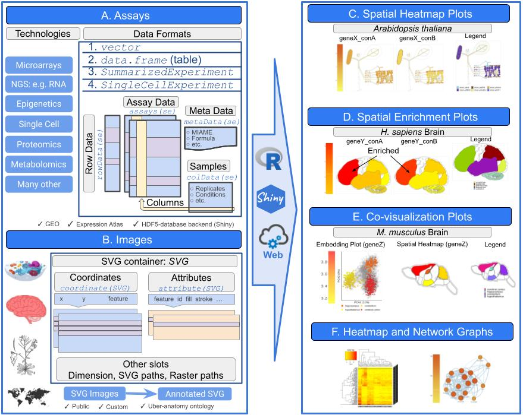
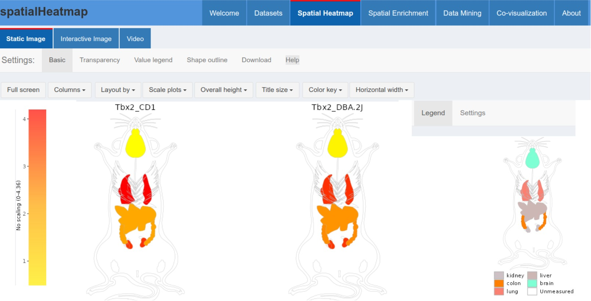

```{css, echo=FALSE}
pre code {
white-space: pre !important;
overflow-x: scroll !important;
word-break: keep-all !important;
word-wrap: initial !important;
}
```

```{r global_options, echo=FALSE, include=TRUE}
## ThG: chunk added to enable global knitr options. The below turns on
## caching for faster vignette re-build during text editing.
knitr::opts_chunk$set(cache=TRUE)
```
<!-- 

<style type="text/css">
 .main-container { max-width: 1800px; margin-left: 5px; margin-right: auto; }
</style>

<style>body { text-align: justify }</style>  


```{r css, echo = FALSE, results = 'asis'}
BiocStyle::markdown(css.files=c('file/custom.css'))
```

-->

```{r setup0, eval=TRUE, echo=FALSE, message=FALSE, warning=FALSE}
library(knitr); opts_chunk$set(message=FALSE, warning=FALSE)
```


# Introduction 

## Motivation

The _spatialHeatmap_ package provides functionalities for visualizing cell-,
tissue- and organ-specific data of biological assays by coloring the
corresponding spatial features defined in anatomical images according to
quantitative abundance levels of measured biomolecules, such as transcripts, proteins
or metabolites. A color key is used to represent the quantitative assay values
and can be customized by the user. This core functionality of the package is called
a _spatial heatmap_ (SHM) plot. Additional important functionalities include
_Spatial Enrichment_ (SE), _Spatial Co-Expression_ (SCE), and _Single Cell to
SHM Co-Visualization_ (SC2SHM-CoViz). These extra utilities are useful for
identifying biomolecules with spatially selective abundance patterns (SE), groups of
biomolecules with related abundance profiles using hierarchical clustering, K-means clustering, or network analysis (SCE), and to co-visualize
single cell embedding results with SHMs (SCSHM-CoViz). The latter co-visualization
functionality (Figure \@ref(fig:illus)E) is described in a separate vignette called
[SCSHM-CoViz](https://bioconductor.org/packages/release/bioc/vignettes/spatialHeatmap/inst/doc/covisualize.html){target='_blank'}.     

The functionalities of _spatialHeatmap_ can be used either in a command-driven mode
from within R or a graphical user interface (GUI) provided by a Shiny App that
is part of this project. While the R-based mode provides flexibility to
customize and automate analysis routines, the Shiny App includes a variety of
convenience features that will appeal to experimentalists and users less
familiar with R. The Shiny App can be used on both local computers as
well as centralized server-based deployments (_e.g._ cloud-based or custom
servers). This way it can be used for both hosting community data on a 
public server or running on a private system. The core functionalities of the 
`spatialHeatmap` package are illustrated in Figure \@ref(fig:illus).   


```{r illus, echo=FALSE, fig.wide=TRUE, out.width="100%", fig.cap=("Overview of spatialHeatmap functionality. (A) The _spatialHeatmap_ package plots numeric assay data onto spatially annotated images. The assay data can be provided as numeric vectors, tabular data, _SummarizedExperiment_, or _SingleCellExperiment_ objects. The latter two are widely used data containers for organizing both assays as well as associated annotation data and experimental designs. (B) Anatomical and other spatial images need to be provided as annotated SVG (aSVG) files where the spatial features and the corresponding components of the assay data have matching labels (_e.g._ tissue labels). To work with SVG data efficiently, the _SVG_ S4 class container has been developed. The assay data are used to color the matching spatial features in aSVG images according to a color key. (C)-(D) The result is called a spatial heatmap (SHM). (E) Large-scale data mining such as hierarchical clustering and network analysis can be integrated to facilitate the identification of biomolecules with similar abundance profiles. Moreover, (E) Single cell embedding results can be co-visualized with SHMs.")}

```

The package supports anatomical images from public
repositories or those provided by users. In general any type of
image can be used as long as it can be provided in SVG (Scalable Vector
Graphics) format and the corresponding spatial features, such as organs, tissues, cellular compartments, are annotated (see [aSVG](#term) below). The numeric values 
plotted onto an SHM
are usually quantitative measurements from a wide range of profiling
technologies, such as microarrays, next generation sequencing (_e.g._ RNA-Seq
and scRNA-Seq), proteomics, metabolomics, or many other small- or large-scale
experiments. For convenience, several preprocessing and normalization methods
for the most common use cases are included that support raw and/or preprocessed
data. Currently, the main application domains of the _spatialHeatmap_ package
are numeric data sets and spatially mapped images from biological, agricultural
and biomedical areas. Moreover, the package has been designed to also work with
many other spatial data types, such as population data plotted onto geographic
maps. This high level of flexibility is one of the unique features of
_spatialHeatmap_. Related software tools for biological applications in this
field are largely based on pure web applications [@Maag2018-gi; @Lekschas2015-gd; @Papatheodorou2018-jy; @Winter2007-bq; @Waese2017-fx] or local tools [@Muschelli2014-av] that typically
lack customization functionalities. These restrictions limit users to utilizing
pre-existing expression data and/or fixed sets of anatomical image collections.
To close this gap for biological use cases, we have developed _spatialHeatmap_
as a generic R/Bioconductor package for plotting quantitative values onto any
type of spatially mapped images in a programmable environment and/or in an
intuitive to use GUI application.

## Design {#design}

The core feature of [`spatialHeatmap`](#shm) is to map assay values (_e.g._
gene expression data) of one or many biomolecules (_e.g._ genes) measured under
different conditions in form of numerically graded colors onto the
corresponding cell types or tissues represented in a chosen SVG image. In the
gene profiling field, this feature supports comparisons of the expression
values among multiple genes by plotting their SHMs next to each
other. Similarly, one can display the expression values of a single or multiple
genes across multiple conditions in the same plot (Figure \@ref(fig:mul)). This level of flexibility is
very efficient for visualizing complicated expression patterns across genes,
cell types and conditions. In case of more complex anatomical images with
overlapping multiple layer tissues, it is important to visually expose the
tissue layer of interest in the plots. To address this, several default and
customizable layer viewing options are provided. They allow to hide features in
the top layers by making them transparent in order to expose features below
them. This transparency viewing feature is highlighted below in the mouse
example (Figure \@ref(fig:musshm)). Moreover, one can plot multiple distinct 
aSVGs in a single SHM plot as shown in Figure \@ref(fig:arabshm). This is 
particularly useful for displaying abundance trends across multiple development 
stages, where each is represented by its own aSVG image. In addition to
static SHM representations, one can visualize them in form of interactive HTML files or videos.  

To maximize reusability and extensibility, the package organizes large-scale
omics assay data along with the associated experimental design information in a
`SummarizedExperiment` object [Figure \@ref(fig:illus)A; @se]. The latter is one of the core S4 classes within
the Bioconductor ecosystem that has been widely adapted by many other software
packages dealing with gene-, protein- and metabolite-level profiling data. 
In case of gene expression data, the `assays` slot of
the `SummarizedExperiment` container is populated with a gene expression
matrix, where the rows and columns represent the genes and tissue/conditions,
respectively. The `colData` slot contains experimental design definitions including 
replicate and treatment information. The tissues and/or cell type information in the object maps via
`colData` to the corresponding features in the SVG images using unique
identifiers for the spatial features (_e.g._ tissues or cell types). This
allows to color the features of interest in an SVG image according to the
numeric data stored in a `SummarizedExperiment` object. For simplicity the
numeric data can also be provided as numeric `vectors` or `data.frames`. This
can be useful for testing purposes and/or the usage of simple data sets that
may not require the more advanced features of the `SummarizedExperiment` class,
such as measurements with only one or a few data points. The details about how to
access the SVG images and properly format the associated expression data are
provided in the [Supplementary Section](#data_form) of this vignette.  

## Image Format: SVG {#term}

SHMs are images where colors encode numeric values in features of
any shape. For plotting SHMs, Scalable Vector Graphics (SVG) has
been chosen as image format since it is a flexible and widely adapted vector
graphics format that provides many advantages for computationally embedding
numerical and other information in images. SVG is based on XML formatted text
describing all components present in images, including lines, shapes and
colors. In case of biological images suitable for SHMs, the shapes
often represent anatomical or cell structures. To assign colors to specific
features in SHMs, _annotated SVG_ (aSVG) files are used where the
shapes of interest are labeled according to certain conventions so that they
can be addressed and colored programmatically. One or multiple aSVG files can be parsed and stored in the `SVG` S4 container with utilities provided by the _spatialHeatmap_ package (Figure \@ref(fig:illus)B). The main slots of `SVG` include `coordinate`, 
`attribute`, `dimension`, `svg`, and `raster`. They correspond to feature coordinates, styling attributes (color, line width, etc.), width and heigth, aSVG file paths, 
and raster image paths, respectively. Raster images are required only when including photographic image components in SHMs (Figure \@ref(fig:overCol)), which is optional.  

SVGs and aSVGs of anatomical structures can
be downloaded from many sources including the repositories described [below](#data_repo).
Alternatively, users can generate them themselves with vector graphics software
such as [Inkscape](https://inkscape.org/). Typically, in aSVGs one or more 
shapes of a feature of interest, such as the cell shapes of an organ, are
grouped together by a common feature identifier. Via these group identifiers
one or many feature types can be colored simultaneously in an aSVG according to
biological experiments assaying the corresponding feature types with the
required spatial resolution. To color spatial features according to numeric assay values, common identifiers are required for spatial features between the assay data and aSVGs. The color
gradient used to visually represent the numeric assay values is controlled by a
color gradient parameter. To visually interpret the meaning of the colors, the
corresponding color key is included in the SHM plots. Additional
details for properly formatting and annotating both aSVG images and assay data
are provided in the [Supplementary Section](#sup) section of this vignette. 

## Data Repositories {#data_repo}

If not generated by the user, SHMs can be generated with data downloaded from
various public repositories. This includes gene, protein and metabolic
profiling data from databases, such as [GEO](https://www.ncbi.nlm.nih.gov/gds){target='_blank'},
[BAR](http://bar.utoronto.ca/){target='_blank'} and [Expression
Atlas](https://www.ebi.ac.uk/gxa/home){target='_blank'} from EMBL-EBI [@Papatheodorou2018-jy]. A
particularly useful resource, when working with `spatialHeatmap`, is the EBI
Expression Atlas. This online service contains both assay and anatomical
images. Its assay data include mRNA and protein profiling experiments for
different species, tissues and conditions. The corresponding anatomical image
collections are also provided for a wide range of species including animals and
plants. In `spatialHeatmap` several import functions are provided to work with
the expression and [aSVG repository](#svg_repo) from the Expression Atlas
directly. The aSVG images developed by the `spatialHeatmap` project are
available in its own repository called [spatialHeatmap aSVG
Repository](https://github.com/jianhaizhang/spatialHeatmap_aSVG_Repository){target='_blank'},
where users can contribute their aSVG images that are formatted according to
our guidlines.

## Tutorial Overview {#sample_data}

The following sections of this vignette showcase the most important
functionalities of the `spatialHeatmap` package using as initial example a simple
to understand testing data set, and then more complex mRNA profiling data from the
Expression Atlas and GEO databases. The co-visualization functionality is explained in a separate vignette (see [SCSHM-CoViz](https://www.bioconductor.org/packages/release/bioc/vignettes/spatialHeatmap/inst/doc/covisualize.html){target='_blank'}). 
First, SHM plots are generated for both the testing
and mRNA expression data. The latter include gene expression data sets from
RNA-Seq and microarray experiments of [Human Brain](#hum), [Mouse
Organs](#mus), [Chicken Organs](#chk), and [Arabidopsis Shoots](#shoot). The
first three are RNA-Seq data from the [Expression
Atlas](https://www.ebi.ac.uk/gxa/home){target='_blank'}, while the last one is a microarray data
set from [GEO](https://www.ncbi.nlm.nih.gov/geo/){target='_blank'}. Second, gene context
analysis tools are introduced, which facilitate the visualization of
gene modules sharing similar expression patterns. This includes the
visualization of hierarchical clustering results with traditional matrix
heatmaps ([Matrix Heatmap](#mhm)) as well as co-expression network plots
([Network](#net)). Third, the [Spatial Enrichment](#se) functionality is illustrated 
with mouse RNA-seq data. Lastly, an overview of the corresponding [Shiny App](#shiny)
is presented that provides access to the same functionalities as the R
functions, but executes them in an interactive GUI environment [@shiny;
@shinydashboard].     

# Getting Started  

## Installation  

The `spatialHeatmap` package should be installed from an R (version $\ge$ 3.6)
session with the `BiocManager::install` command.  

```{ eval=FALSE, echo=TRUE, warnings=FALSE} 
if (!requireNamespace("BiocManager", quietly = TRUE))
    install.packages("BiocManager")
BiocManager::install("spatialHeatmap")
```

## Packages and Documentation

Next, the packages required for running the sample code in this vignette need to be loaded.  

```{r, eval=TRUE, echo=TRUE, warnings=FALSE, results='hide'}
library(spatialHeatmap); library(SummarizedExperiment); library(ExpressionAtlas); library(GEOquery); library(igraph); library(BiocParallel); library(kableExtra); library(org.Hs.eg.db); library(org.Mm.eg.db); library(ggplot2)
```

The following lists the vignette(s) of this package in an HTML browser. Clicking the corresponding name will open this vignette. 

```{r, eval=FALSE, echo=TRUE, warnings=FALSE}
browseVignettes('spatialHeatmap')
```

To reduce runtime, intermediate results can be cached under `~/.cache/shm`.   

```{r eval=TRUE, echo=TRUE, message=FALSE, warnings=FALSE }
cache.pa <- '~/.cache/shm' # Path of the cache directory.
```  

A temporary directory is created to save output files.  

```{r eval=TRUE, echo=TRUE, message=FALSE, warnings=FALSE }
tmp.dir <- normalizePath(tempdir(check=TRUE), winslash="/", mustWork=FALSE)
```

# Spatial Heatmaps {#shm}

## Quick Start {#test}

Spatial Heatmaps (SHMs) are plotted with the `shm` function. To provide a quick
and intuitive overview how these plots are generated, the following uses a
generalized tesing example where a small vector of random numeric values is
generated that are used to color features in an aSVG image. The image chosen
for this example is an aSVG depicting the human brain. The corresponding image
file `homo_sapiens.brain.svg` is included in this package for testing purposes.   

### aSVG Image

After the full path to the chosen target aSVG image on a user's system is
obtained with the `system.file` function, the function `read_svg` is used to import the aSVG information relevant for creating SHMs, which is stored in an `SVG` object
`svg.hum`.

```{r eval=TRUE, echo=TRUE, warnings=FALSE, results='hide'}
svg.hum.pa <- system.file("extdata/shinyApp/data", 'homo_sapiens.brain.svg', package="spatialHeatmap")
svg.hum <- read_svg(svg.hum.pa)
```

All features and their attributes can be accessed with the `attribute`
function, where `fill` and `stroke` are the two most important ones providing
color and line width information, respectively. The `feature` column includes group labels for sub-features in the `sub.feature` column. SHM plots are created by mapping assay data to labels in `feature`.    

```{r eval=TRUE, echo=TRUE, warnings=FALSE, collapse=TRUE}
feature.hum <- attribute(svg.hum)[[1]]
tail(feature.hum[, 1:6], 3) # Partial features and respective attributes
```

Feature coordinates can be accessed with the `coordinate` function.  

```{r eval=TRUE, echo=TRUE, warnings=FALSE, collapse=TRUE}
coord.df <- coordinate(svg.hum)[[1]]
tail(coord.df, 3) # Partial features and respective coordinates
```


### Numeric Data

The following generates a small named vector for testing, 
where the data slot contains four numbers, and the name slot is populated with 
three feature names and one missing one (here 'notMapped"). The numbers
are mapped to features (`feature.hum`) via matching names among the numeric vector and the aSVG,
respectively. Accordingly, only numbers and features with matching name
counterparts can be colored in the aSVG image. In addition, a summary of the numeric assay to feature mappings is stored
in a `data.frame` returned by the `shm` function (see below). 

```{r eval=TRUE, echo=TRUE, warnings=FALSE, collapse=TRUE }
set.seed(20) # To obtain reproducible results, a fixed seed is set.
unique(feature.hum$feature)[1:10]
my_vec <- setNames(sample(1:100, 4), c('substantia.nigra', 'putamen', 'prefrontal.cortex', 'notMapped'))
my_vec
```

### Plot SHM

Before plotting SHMs, the aSVG instance and numeric data are stored in an `SPHM` object for the sake of efficient data management and reusability.   

```{r eval=TRUE, echo=TRUE, warnings=FALSE, collapse=TRUE }
dat.quick <- SPHM(svg=svg.hum, bulk=my_vec)
```

Next, the SHM is plotted with the `shm` function (Figure
\@ref(fig:testshm)). Internally, the numbers in `my_vec` are translated into
colors based on the color key and then
painted onto the corresponding features in the aSVG. In the given example
(Figure \@ref(fig:testshm)) only three features ('substantia.nigra', 'putamen', and 'prefrontal.cortex') in the aSVG have matching entries in the data `my_vec`.   

```{r testshm, eval=TRUE, echo=TRUE, warnings=FALSE, fig.wide=TRUE, results='hide', fig.cap=("SHM of human brain with testing data. The plots from the left to the right represent the color key for the numeric data, followed by four SHM plots and the legend of the spatial features. The numeric values provided in `my_vec` are used to color the corresponding features in the SHM plots according to the color key while the legend plot identifies the spatial regions. "), out.width="100%" }
shm.res <- shm(data=dat.quick, ID='testing', ncol=1, sub.title.size=20, legend.nrow=3)
```

The named numeric values in `my_vec`, that have name matches with the features in the 
chosen aSVG, are stored in the `mapped_feature` slot.  

```{r eval=TRUE, echo=TRUE, warnings=FALSE, collapse=TRUE} 
# Mapped features
spatialHeatmap::output(shm.res)$mapped_feature
```

## Human Brain {#hum} 


This subsection introduces how to query and download cell- and tissue-specific assay data in
the Expression Atlas database using the `ExpressionAtlas` package [@ebi]. After the choosen data is downloaded directly into a user\'s R session, the 
expression values for selected genes can be plotted onto a chosen aSVG image with 
or without prior preprocessing steps (_e.g._ normalization).   

### Gene Expression Data

The following example searches the Expression Atlas for expression data derived from
specific tissues and species of interest, here _'cerebellum'_ and _'Homo sapiens'_,
respectively.      

```{r eval=TRUE, echo=TRUE, message=FALSE, warnings=FALSE, results='hide'}
all.hum <- read_cache(cache.pa, 'all.hum') # Retrieve data from cache.
if (is.null(all.hum)) { # Save downloaded data to cache if it is not cached.
  all.hum <- searchAtlasExperiments(properties="cerebellum", species="Homo sapiens")
  save_cache(dir=cache.pa, overwrite=TRUE, all.hum)
}
```

The search result contains `r nrow(all.hum)`
accessions. In the following code, the
accession
'[E-GEOD-67196](https://www.ebi.ac.uk/arrayexpress/experiments/E-GEOD-67196/){target="_blank"}'
from Prudencio _et al._ [-@Prudencio2015-wd] has been chosen, which corresponds
to an RNA-Seq profiling experiment of _'cerebellum'_ and _'frontal cortex'_ brain
tissue from patients with amyotrophic lateral sclerosis (ALS).   

```{r eval=TRUE, echo=TRUE, warnings=FALSE }
all.hum[2, ]
```

The `getAtlasData` function allows to download the chosen RNA-Seq experiment
from the Expression Atlas and import it into a `RangedSummarizedExperiment`
object.     

```{r eval=TRUE, echo=TRUE, warnings=FALSE, results='hide'}
rse.hum <- read_cache(cache.pa, 'rse.hum') # Read data from cache.
if (is.null(rse.hum)) { # Save downloaded data to cache if it is not cached.
  rse.hum <- getAtlasData('E-GEOD-67196')[[1]][[1]]
  save_cache(dir=cache.pa, overwrite=TRUE, rse.hum)
}
```

The design of the downloaded RNA-Seq experiment is described in the `colData` slot of 
`rse.hum`. The following returns only its first four rows and columns.

```{r eval=TRUE, echo=TRUE, warnings=FALSE, collapse=TRUE }
colData(rse.hum)[1:2, c(2, 4)]
```

### aSVG Image {#humSVG} 

The following example shows how to download from the above described [SVG
repositories](#data_repo) an aSVG image that matches the tissues and species
assayed in the gene expression data set downloaded above.
The `return_feature` function queries the repository for feature- and
species-related keywords, here `c('frontal cortex', 'cerebellum')` and `c('homo
sapiens', 'brain')`, respectively.    

The remote data are downloaded before calling `return_feature`.    

<!--
Code chunk not evaluated to save time building this vignette.
-->
```{r eval=FALSE, echo=TRUE, warnings=FALSE }
# Remote aSVG repos.
data(aSVG.remote.repo)
tmp.dir.ebi <- file.path(tmp.dir, 'ebi.zip')
tmp.dir.shm <- file.path(tmp.dir, 'shm.zip')
# Download the remote aSVG repos as zip files.
download.file(aSVG.remote.repo$ebi, tmp.dir.ebi)
download.file(aSVG.remote.repo$shm, tmp.dir.shm)
remote <- list(tmp.dir.ebi, tmp.dir.shm)
```

The downloaded aSVG repos are queried and returned aSVG files are saved in an empty directory (`tmp.dir`) to avoid overwriting of existing SVG files.   

```{r eval=TRUE, echo=TRUE, warnings=FALSE, results='hide' }
tmp.dir <- file.path(tempdir(check=TRUE), 'shm') # Empty directory. 
```
<!--
Code chunk not evaluated to save time building this vignette.
-->
```{r eval=FALSE, echo=TRUE, warnings=FALSE, results='hide' }
feature.df.hum <- return_feature(feature=c('frontal cortex', 'cerebellum'), species=c('homo sapiens', 'brain'), dir=tmp.dir, remote=remote) # Query aSVGs
feature.df.hum[1:8, ] # Return first 8 rows for checking
unique(feature.df.hum$SVG) # Return all matching aSVGs
```

To build this vignettes according to Bioconductor's package requirements, the
following code section uses aSVG file instances included in the
`spatialHeatmap` package rather than the downloaded instances above.  

```{r eval=TRUE, echo=TRUE, warnings=FALSE, results='hide' }
svg.dir <- system.file("extdata/shinyApp/data", package="spatialHeatmap") # Directory of the aSVG collection in spatialHeatmap
feature.df.hum <- return_feature(feature=c('frontal cortex', 'cerebellum'), species=c('homo sapiens', 'brain'), keywords.any=TRUE, return.all=FALSE, dir=svg.dir, remote=NULL)
```

Note, the target tissues `frontal cortex` and `cerebellum` are included in both
the experimental design slot of the downloaded expression data as well as the 
annotations of the aSVG. This way these features can be colored in the downstream
SHM plots. If necessary users can also change from within R the feature identifiers in an aSVG (see [Supplementary Section](#update)).    

```{r eval=TRUE, echo=TRUE, warnings=FALSE, collapse=TRUE }
tail(feature.df.hum[, c('feature', 'stroke', 'SVG')], 3)
```

Among the returned aSVG files, `homo_sapiens.brain.svg` is chosen for creating SHMs. Since it is the same as the [Quick Start](#test), the aSVG stored in `svg.hum` is used in the downstream steps.    

### Experimental Design

To display 'pretty' sample names in columns and legends of downstream tables and plots respectively, the following example imports a 'targets' file that can be customized by users in a text program. The targets file content is used to replace the text in the
`colData` slot of the `RangedSummarizedExperiment` object with a version containing
shorter sample names for plotting purposes. 

The custom targets file is imported and then loaded into `colData` slot of `rse.hum`. A slice of the simplified `colData` object is shown below.    

```{r eval=TRUE, echo=TRUE, warnings=FALSE, collapse=TRUE }
hum.tar <- system.file('extdata/shinyApp/data/target_human.txt', package='spatialHeatmap')
target.hum <- read.table(hum.tar, header=TRUE, row.names=1, sep='\t') # Importing
colData(rse.hum) <- DataFrame(target.hum) # Loading to "colData"
colData(rse.hum)[c(1:2, 41:42), 4:5]
```

### Preprocess Assay Data

The raw count gene expression data is stored
in the `assay` slot of `rse.hum`. The following shows how to apply basic preprocessing routines on the count data, such as normalizing, aggregating replicates, and removing genes with unreliable expression responses, which are optional for plotting SHMs.    

The `norm_data` function is developed to normalize RNA-seq raw count data. The following example uses the `ESF` normalization option due to its good time performance, which is `estimateSizeFactors` from DESeq2 [@deseq2].    


```{r eval=TRUE, echo=TRUE, warnings=FALSE, results='hide'}
se.nor.hum <- norm_data(data=rse.hum, norm.fun='ESF', log2.trans=TRUE)
```

Replicates are aggregated with the summary
statistics chosen under the `aggr` argument (_e.g._ `aggr='mean'`). The
columns specifying replicates can be assigned to the `sam.factor` and
`con.factor` arguments corresponding to samples and conditions, respectively.
For tracking, the corresponding sample/condition labels are used as column
titles in the aggregated `assay` instance, where they are concatenated with a
double underscore as separator (Table \@ref(tab:humtab)).    


```{r eval=TRUE, echo=TRUE, warnings=FALSE, results='hide'}
se.aggr.hum <- aggr_rep(data=se.nor.hum, sam.factor='organism_part', con.factor='disease', aggr='mean')
assay(se.aggr.hum)[c(120, 49939, 49977), ]
```

```{r humtab, eval=TRUE, echo=FALSE, warnings=FALSE}
cna <- c("cerebellum\\_\\_ALS", "frontal.cortex\\_\\_ALS", "cerebellum\\_\\_normal", "frontal.cortex\\_\\_normal")
kable(assay(se.aggr.hum)[c(120, 49939, 49977), ], caption='Slice of aggregated expression matrix.', col.names=cna, escape=TRUE, row.names=TRUE) %>% kable_styling("striped", full_width = FALSE) %>% scroll_box(width = "700px", height = "220px")
```

The filtering example below retains genes with expression values
larger than 5 (log2 space) in at least 1% of all samples (`pOA=c(0.01, 5)`), and
a coefficient of variance (CV) between 0.30 and 100 (`CV=c(0.30, 100)`). After that, the Ensembl gene ids are converted to UniProt ids with the function `cvt_id`.    

```{r eval=TRUE, echo=TRUE, warnings=FALSE, results='hide'}
se.fil.hum <- filter_data(data=se.aggr.hum, sam.factor='organism_part', con.factor='disease', pOA=c(0.01, 5), CV=c(0.3, 100))
se.fil.hum <- cvt_id(db='org.Hs.eg.db', data=se.fil.hum, from.id='ENSEMBL', to.id='SYMBOL')
```

### SHM: Multiple Genes

Spatial features of interest can be subsetted with the function `sub_sf` by assigning their indexes (see below) to the argument `show`. In the following, 'brain outline', 'prefrontal.cortex', 'frontal.cortex', and 'cerebellum' are subsetted.    

Next, for efficient data management and reusability the subset aSVG and assay data are stored in an `SPHM` object.    

```{r eval=TRUE, echo=TRUE, warnings=FALSE, collapse=TRUE }
# Subsetting aSVG features.
svg.hum.sub <- sub_sf(svg.hum, show=c(64:132, 162:163, 164, 190:218))
tail(attribute(svg.hum.sub)[[1]][, 1:6], 3)
# Storing assay data and subsetted aSVG in an 'SPHM' object.
dat.hum <- SPHM(svg=svg.hum.sub, bulk=se.fil.hum)
```

SHMs for multiple genes can be plotted by providing the
corresponding gene IDs under the `ID` argument as a character vector. The
`shm` function will then sequentially arrange the SHMs for
each gene in a single composite plot. To facilitate comparisons among expression
values across genes and/or conditions, the `lay.shm` parameter can be assigned
`gene` or `con`, respectively. For instance, in Figure \@ref(fig:mul) the
SHMs of the genes `'OLFM4` and `LOC440742` are organized
by condition in a horizontal view. This functionality is particularly useful when comparing associated genes such as gene families.    
 
```{r mul, eval=TRUE, echo=TRUE, warnings=FALSE, fig.wide=TRUE, fig.cap=("SHMs of two genes. The subplots are organized by \"condition\". Only cerebellum and frontal cortex are colored, because they are present in both the aSVG and the expression data."), out.width="100%", results='hide'}
res.hum <- shm(data=dat.hum, ID=c('OLFM4', 'LOC440742'), lay.shm='con', legend.r=1.5, legend.nrow=3, h=0.6)
```

In the above example, the normalized expression values of chosen genes 
are used to color the frontal cortex and cerebellum, where the different conditions, 
here normal and ALS, are given in separate SHMs. The color and feature mappings are defined
by the corresponding color key and legend plot on the left and right, respectively.

By default, spatial features in assay data are mapped to their counterparts in aSVG according to the same identifiers on a one-to-one basis. However, the mapping can be customized, such as mapping a spatial feature in the data to a different or multiple counterparts in the aSVG. This advanced functionality is demonstrated in the [Supplementary Section](#remat).  

### SHM: Other Selected Features

SHMs can be saved to interactive HTML files as well as video files. Each HTML file
contains an interactive SHM with zooming in and out functionality. Hovering over
graphics features will display data, gene, condition and other information. The
video will play the SHM subplots in the order specified under the `lay.shm`
argument. 

The following example saves the interactive HTML and video files under the directory `tmp.dir`.  

<!--
Code chunk not evaluated to save time building this vignette.
-->
```{r eval=FALSE, echo=TRUE, warnings=FALSE, results='hide'}
shm(data=dat.hum, ID=c('OLFM4', 'LOC440742'), lay.shm='con', legend.r=1.5, legend.nrow=3, h=0.6, aspr=2.3, animation.scale=0.7, bar.width=0.1, bar.value.size=4, out.dir=tmp.dir)
```

The following code saves individual SHMs into the same SVG file `shm_hum.svg` with the color scale and legend plot included.  

```{r eval=FALSE, echo=TRUE, warnings=FALSE, results='hide'}
res <- shm(data=dat.hum, ID=c('OLFM4', 'LOC440742'), lay.shm='con', legend.r=1.5, legend.nrow=3, h=0.5, aspr=2.3, animation.scale=0.7, bar.width=0.08, bar.value.size=12)
ggsave(file="./shm_hum.svg", plot=output(res)$spatial_heatmap, width=10, height=8) 
```

The following code exports each SHM (associated with a specific gene and condition) as separate SVG files in `tmp.dir`. In contrast to the original aSVG file, spatial features in the output SVG files are assigned heat colors.    

```{r eval=FALSE, echo=TRUE, warnings=FALSE, results='hide'}
write_svg(input=res, out.dir=tmp.dir)
```

A meta function `plot_meta` is developed as a wraper of individual steps necessary for plotting SHMs. The benefit of this function is creating SHMs with the Linux command line as shown below.  

```{r eval=FALSE, echo=TRUE, warnings=FALSE, results='hide'}
Rscript -e "spatialHeatmap::plot_meta(svg.path=system.file('extdata/shinyApp/data', 'mus_musculus.brain.svg', package='spatialHeatmap'), bulk=system.file('extdata/shinyApp/data', 'bulk_mouse_cocluster.rds', package='spatialHeatmap'), sam.factor='tissue', aggr='mean', ID=c('AI593442', 'Adora1'), ncol=1, bar.width=0.1, legend.nrow=5, h=0.6)"
```

### SHM: Customization

To provide a high level of flexibility, many arguments are developed for `shm`.
An overview of important arguments and their utility is provided in Table \@ref(tab:arg).

```{r arg, eval=TRUE, echo=FALSE, warnings=FALSE} 
arg.df <- read.table('file/spatial_hm_arg.txt', header=TRUE, row.names=1, sep='\t')
kable(arg.df, caption='List of important argumnets of \'shm\'.', col.names=colnames(arg.df), row.names=TRUE, escape=TRUE) %>% kable_styling("striped", full_width = FALSE) %>% scroll_box(width = "650px", height = "230px")  
```  

## Mouse Organs {#mus}

This section generates an SHM plot for mouse data from the Expression Atlas.
The code components are very similar to the previous [Human Brain](#hum)
example. For brevity, the corresponding text explaining the code has
been reduced to a minimum. 

### Gene Expression Data

The chosen mouse RNA-Seq data compares tissue level gene expression across 
mammalian species [@Merkin2012-ak]. The following searches the Expression 
Atlas for expression data from _'kidney'_ and _'Mus musculus'_.

```{r eval=TRUE, echo=TRUE, warnings=FALSE, results='hide'}
all.mus <- read_cache(cache.pa, 'all.mus') # Retrieve data from cache.
if (is.null(all.mus)) { # Save downloaded data to cache if it is not cached.
  all.mus <- searchAtlasExperiments(properties="kidney", species="Mus musculus")
  save_cache(dir=cache.pa, overwrite=TRUE, all.mus)
}
```

Among the many matching entries, accession 'E-MTAB-2801' will be downloaded.  

```{r eval=TRUE, echo=TRUE, warnings=FALSE, results='hide'}
all.mus[7, ]
rse.mus <- read_cache(cache.pa, 'rse.mus') # Read data from cache.
if (is.null(rse.mus)) { # Save downloaded data to cache if it is not cached.
  rse.mus <- getAtlasData('E-MTAB-2801')[[1]][[1]]
  save_cache(dir=cache.pa, overwrite=TRUE, rse.mus)
}
```

The design of the downloaded RNA-Seq experiment is described in the `colData` slot of 
`rse.mus`. The following returns only its first three rows.

```{r eval=TRUE, echo=TRUE, warnings=FALSE, collapse=TRUE }
colData(rse.mus)[1:3, ]
```

### aSVG Image  

The following example shows how to retrieve from the [remote SVG
repositories](#data_repo) an aSVG image that matches the tissues and species
assayed in the downloaded data above. The sample data from [Human Brain](#humSVG) are used such as `remote`.      

<!--
Code chunk not evaluated to save time building this vignette.
-->
```{r eval=FALSE, echo=TRUE, warnings=FALSE, results='hide' }
feature.df.mus <- return_feature(feature=c('heart', 'kidney'), species=c('Mus musculus'), dir=tmp.dir, remote=remote)
```

To meet the R/Bioconductor package requirements, the following uses aSVG file instances included in the
`spatialHeatmap` package rather than the downloaded instances.   

```{r eval=TRUE, echo=TRUE, warnings=FALSE, results='hide' }
feature.df.mus <- return_feature(feature=c('heart', 'kidney'), species=NULL, dir=svg.dir, remote=NULL) 
```

Return the names of the matching aSVG files.

```{r eval=TRUE, echo=TRUE, warnings=FALSE, collapse=TRUE}
unique(feature.df.mus$SVG)
```

The `mus_musculus.male.svg` instance is selected and imported.   

```{r eval=TRUE, echo=TRUE, warnings=FALSE, results='hide'}
svg.mus.pa <- system.file("extdata/shinyApp/data", "mus_musculus.male.svg", package="spatialHeatmap")
svg.mus <- read_svg(svg.mus.pa)
```

### Experimental Design

A sample target file that is included in this package is imported and then loaded to the `colData` slot of `rse.mus`. To inspect its content, the first three rows are shown.   

```{r eval=TRUE, echo=TRUE, warnings=FALSE, collapse=TRUE}
mus.tar <- system.file('extdata/shinyApp/data/target_mouse.txt', package='spatialHeatmap')
target.mus <- read.table(mus.tar, header=TRUE, row.names=1, sep='\t') # Importing
colData(rse.mus) <- DataFrame(target.mus) # Loading
target.mus[1:3, ]
```

### Preprocess Assay Data

The raw RNA-Seq counts are preprocessed with the following steps: (1)
normalization, (2) aggregation of replicates, and (3) filtering of un-reliable
expression data. The details of these steps are explained in the sub-section of the [Human Brain](#humSVG) example.    

```{r eval=TRUE, echo=TRUE, warnings=FALSE, results='hide'}
rse.mus <- cvt_id(db='org.Mm.eg.db', data=rse.mus, from.id='ENSEMBL', to.id='SYMBOL', desc=TRUE) # Convert Ensembl ids to UniProt ids.  
se.nor.mus <- norm_data(data=rse.mus, norm.fun='CNF', log2.trans=TRUE) # Normalization
se.aggr.mus <- aggr_rep(data=se.nor.mus, sam.factor='organism_part', con.factor='strain', aggr='mean') # Aggregation of replicates
se.fil.mus <- filter_data(data=se.aggr.mus, sam.factor='organism_part', con.factor='strain', pOA=c(0.01, 5), CV=c(0.6, 100)) # Filtering of genes with low counts and variance 
```

### SHM: Transparency

The pre-processed expression data for gene `Scml2` is plotted in form
of an SHM. In this case the plot includes expression data for 8 tissues across 3 
mouse strains. 

```{r, musshm, eval=TRUE, echo=TRUE, warnings=FALSE, fig.wide=TRUE, fig.cap=("SHM of mouse organs. This is a multiple-layer image where the shapes of the 'skeletal muscle' is set transparent to expose 'lung' and 'heart'."), out.width="100%", results='hide'}
dat.mus <- SPHM(svg=svg.mus, bulk=se.fil.mus)
shm(data=dat.mus, ID=c('H19'), legend.width=0.7, legend.text.size=10, sub.title.size=9, ncol=3, ft.trans=c('skeletal muscle'), legend.ncol=2, line.size=0.2, line.color='grey70')
```

The SHM plots in Figures \@ref(fig:musshm) and below demonstrate
the usage of the transparency feature via the `ft.trans` parameter. The
corresponding mouse organ aSVG image includes overlapping tissue layers. In
this case the skelectal muscle layer partially overlaps with lung and heart
tissues. To view lung and heart in Figure \@ref(fig:musshm), the skelectal
muscle tissue is set transparent with `ft.trans=c('skeletal muscle')`.    

To fine control the visual effects in feature rich aSVGs, the `line.size` and
`line.color` parameters are useful. This way one can adjust the thickness and 
color of complex structures.

```{r, musshm1, eval=TRUE, echo=TRUE, warnings=FALSE, fig.wide=TRUE, fig.cap=("SHM of mouse organs. This is a multiple-layer image where the view onto 'lung' and 'heart' is obstructed by displaying the 'skeletal muscle' tissue."), out.width="100%", fig.show='show', results='hide'}
gg <- shm(data=dat.mus, ID=c('H19'), legend.text.size=10, sub.title.size=9, ncol=3, legend.ncol=2, line.size=0.1, line.color='grey70')
```

A third example on real data from Expression Atlas is SHMs of time series across chicken organs. Since the procedures are the same with the examples above, this example is illustrated in the [Supplementary Section](#chk).  

## Arabidopsis Shoot {#shoot}

This section generates an SHM for _Arabidopsis thaliana_ tissues with gene expression
data from the Affymetrix microarray technology. The chosen experiment used
ribosome-associated mRNAs from several cell populations of shoots and roots that were
exposed to hypoxia stress [@Mustroph2009-nu]. In this case the expression data
will be downloaded from [GEO](https://www.ncbi.nlm.nih.gov/geo/){target="_blank"} with utilites
from the `GEOquery` package [@geo]. The data preprocessing routines are
specific to the Affymetrix technology. The remaining code components for
generating SHMs are very similar to the previous examples. For brevity, the
text in this section explains mainly the steps that are specific to this data
set. 

### Gene Expression Data

The GSE14502 data set is downloaded with the `getGEO` function from the `GEOquery` package. Intermediately, the expression data is stored in an
`ExpressionSet` container [@biobase], and then converted to a
`SummarizedExperiment` object.  

```{r eval=TRUE, echo=TRUE, warnings=FALSE, results='hide'}
gset <- read_cache(cache.pa, 'gset') # Retrieve data from cache.
if (is.null(gset)) { # Save downloaded data to cache if it is not cached.
  gset <- getGEO("GSE14502", GSEMatrix=TRUE, getGPL=TRUE)[[1]]
  save_cache(dir=cache.pa, overwrite=TRUE, gset)
}
se.sh <- as(gset, "SummarizedExperiment")
```

The gene symbol identifiers are extracted from the `rowData` component to be used 
as row names. Similarly, one can work with AGI identifiers by providing below `AGI` 
under `Gene.Symbol`.

```{r eval=TRUE, echo=TRUE, warnings=FALSE}
rownames(se.sh) <- make.names(rowData(se.sh)[, 'Gene.Symbol'])
```

A slice of the experimental design stored in the
`colData` slot is returned. Both the samples and treatments are contained in the `title` column.
The samples are indicated by corresponding promoters (pGL2, pCO2, pSCR, pWOL, p35S) and treatments include control and hypoxia.  

```{r eval=TRUE, echo=TRUE, warnings=FALSE, collapse=TRUE}
colData(se.sh)[60:63, 1:2]
```

### aSVG Image  

In this example, the aSVG image has been generated in Inkscape from 
the corresponding figure in @Mustroph2009-nu. Detailed instructions for generating custom aSVG images are provided in the 
[SVG tutorial](https://jianhaizhang.github.io/SVG_tutorial_file/){target="_blank"}. The resulting custom aSVG file 'arabidopsis.thaliana_shoot_shm.svg' is included in the `spatialHeatmap` package and imported as below.    

```{r eval=TRUE, echo=TRUE, warnings=FALSE, results='hide'}
svg.sh.pa <- system.file("extdata/shinyApp/data", "arabidopsis.thaliana_shoot_shm.svg", package="spatialHeatmap")
svg.sh <- read_svg(svg.sh.pa)
```

### Experimental Design

A sample target file that is included in this package is imported and then loaded to the `colData` slot of `se.sh`. To inspect its content, four selected rows are returned.  

```{r eval=TRUE, echo=TRUE, warnings=FALSE, collapse=TRUE}
sh.tar <- system.file('extdata/shinyApp/data/target_arab.txt', package='spatialHeatmap')
target.sh <- read.table(sh.tar, header=TRUE, row.names=1, sep='\t') # Importing
colData(se.sh) <- DataFrame(target.sh) # Loading
target.sh[60:63, ]
```

### Preprocess Assay Data

The downloaded GSE14502 data set has already been normalized with the RMA
algorithm [@affy]. Thus, the pre-processing steps can be restricted to replicate aggregation and filtering.   

 
```{r eval=TRUE, echo=TRUE, warnings=FALSE, results='hide'}
se.aggr.sh <- aggr_rep(data=se.sh, sam.factor='samples', con.factor='conditions', aggr='mean') # Replicate agggregation using mean
se.fil.arab <- filter_data(data=se.aggr.sh, sam.factor='samples', con.factor='conditions', pOA=c(0.03, 6), CV=c(0.30, 100)) # Filtering of genes with low intensities and variance
```

### SHM: Microarray 

The expression profile for the HRE2 gene is plotted for the control and the hypoxia treatment
across six cell types (Figure \@ref(fig:shshm)).

```{r shshm, eval=TRUE, echo=TRUE, warnings=FALSE, fig.wide=TRUE, fig.cap=('SHM of Arabidopsis shoots. The expression profile of the HRE2 gene is plotted for control and hypoxia treatment across six cell types.'), out.width="100%", results='hide'}
dat.sh <- SPHM(svg=svg.sh, bulk=se.fil.arab)
shm(data=dat.sh, ID=c("HRE2"), legend.ncol=2, legend.text.size=10, legend.key.size=0.02)
```

## Superimposing raster and vector graphics 

`spatialHeatmap` allows to superimpose raster images with vector-based SHMs. This 
way one can generate SHMs that resemble photographic representations
of tissues, organs or entire organisms. For this to work the shapes represented in the
vector-graphics need to be an aligned carbon copy of the raster image.
Supported file formats for the raster image are JPG/JPEG and PNG, and for the
vector image it is SVG. Matching raster and vector graphics are indicated by
identical base names in their file names (_e.g._ imageA.png and imageA.svg).
The layout order in SHMs composed of multiple independent images can be
controlled by numbering the corresponding file pairs accordingly such as
imageA_1.png and imageA_1.svg, imageA_2.png and imageA_2.svg, *etc*. 

In the following example, the required image pairs have been pre-generated from
a study on abaxial bundle sheath (ABS) cells in maize leaves
[@Bezrutczyk2021-fq]. Their file names are labeled 1 and 2 to indicate two
developmental stages.  

Import paths of first png/svg image pair:  

```{r eval=TRUE, echo=TRUE, warnings=FALSE}
raster.pa1 <- system.file('extdata/shinyApp/data/maize_leaf_shm1.png', package='spatialHeatmap')
svg.pa1 <- system.file('extdata/shinyApp/data/maize_leaf_shm1.svg', package='spatialHeatmap')
```

Import paths of second png/svg image pair:  
```{r eval=TRUE, echo=TRUE, warnings=FALSE}
raster.pa2 <- system.file('extdata/shinyApp/data/maize_leaf_shm2.png', package='spatialHeatmap')
svg.pa2 <- system.file('extdata/shinyApp/data/maize_leaf_shm2.svg', package='spatialHeatmap')
```

The two pairs of png/svg images are imported in the `SVG` container `svg.overlay`.     
```{r eval=TRUE, echo=TRUE, warnings=FALSE, results='hide'}
svg.overlay <- read_svg(svg.path=c(svg.pa1, svg.pa2), raster.path=c(raster.pa1, raster.pa2))
```

A slice of attributes in the first aSVG instance is shown.   
```{r eval=TRUE, echo=TRUE, warnings=FALSE, collapse=TRUE}
attribute(svg.overlay)[[1]][1:3, ]
```

Create random quantitative assay data.  

```{r eval=TRUE, echo=TRUE, warnings=FALSE, collapse=TRUE}
df.ovl <- data.frame(matrix(runif(6, min=0, max=5), nrow=3))
colnames(df.ovl) <- c('cell1', 'cell2') # Assign column names.
rownames(df.ovl) <- paste0('gene', seq_len(3)) # Assign row names 
df.ovl[1:2, ]
```

To minimize masking of the features in the SHMs by dense regions in the raster images, 
the `alpha.overlay` argument allows to adjust the transparency level. In Figure \@ref(fig:overCol), 
the spatial features of interest are superimposed onto the raster image.   

```{r overCol, eval=TRUE, echo=TRUE, warnings=FALSE, fig.wide=TRUE, fig.cap=('Superimposing raster images with SHMs (colorful backaground). The expression profiles of gene1 are plotted on ABS cells.'), out.width="80%", fig.show='show', results='hide'}
dat.over <- SPHM(svg=svg.overlay, bulk=df.ovl)
shm(data=dat.over, charcoal=FALSE, ID=c('gene1'), alpha.overlay=0.5, bar.width=0.09, sub.title.vjust=4, legend.r=0.2)
```

Another option for reducing masking effects is to display the raster image in black and white by setting `charcoal=TRUE` (Figure \@ref(fig:overChar)).  

```{r overChar, eval=TRUE, echo=TRUE, warnings=FALSE, fig.wide=TRUE, fig.cap=('Superimposing raster images with SHMs (black and white background). The expression profiles of gene1 are plotted on ABS cells.'), out.width="80%", fig.show='show', results='hide'}
shm(data=dat.over, charcoal=TRUE, ID=c('gene1'), alpha.overlay=0.5, bar.width=0.09, sub.title.vjust=4, legend.r=0.2)
```


## SHMs of Multiple Variables {#sthm} 


The SHM plots shown so far are restricted to two variables, here spatial features
(*e.g.* tissues) and treatments. In theory, the complexity of experimental designs scales 
to any number of variables in `spatialHeatmap`. This section
extends to experiments with three or more variables, such as experiments with spatiotemporal resolution and geographical locations, genotypes, treatments, *etc*.    

To visualize multi-variable assay data, the variables are reduced to two by keeping the spatial feature unchanged and combining all other variables into a composite one. For instance, the following example contains four variables including spatial features, time points, drug treatments and injury conditions. The latter three are combined to produce a composite variable.   


### Gene Expression Data

The following uses RNA-seq data assayed from hippocampus and hypothalamus in mouse brain, and the experimental variables include traumatic brain injury (TBI), 3 or 29 days post injury (DPI), candesartan or vehicle treatment [@Attilio2021-pp]. The original data are modified for demonstration purpose and included in `spatialHeatmap` as a `SummarizedExperiment` object, which is imported below.   

```{r eval=TRUE, echo=TRUE, warnings=FALSE, results='hide'}
se.mus.vars <- readRDS(system.file('extdata/shinyApp/data/mus_brain_vars_se.rds', package='spatialHeatmap'))
```

The experiment design is stored in `colData` slot, where 'Veh', 'Drug', 'TBI', and 'NoTBI' refer to 'vehicle', 'candesartan', 'traumatic brain injury', and 'sham injury' respectively. The `time`, `treatment` and `injury` variables are combined into a composite one `comVar`.     

```{r eval=TRUE, echo=TRUE, warnings=FALSE, collapse=TRUE}
colData(se.mus.vars)[1:3, ]
unique(colData(se.mus.vars)$comVar)
```

Since this example data are small, the pre-processing only involves normalization without the filtering step. The expression values are aggregated across replicates in tissues (`tissue`) and replicates in the composite variable (`comVar`) with the summary statistic of mean, which is similar with the [Human Brain](#hum) exmple.    

```{r eval=TRUE, echo=TRUE, warnings=FALSE, collapse=TRUE}
se.mus.vars.nor <- norm_data(data=se.mus.vars, norm.fun='ESF', log2.trans=TRUE) # Normalization.
se.mus.vars.aggr <- aggr_rep(data=se.mus.vars.nor, sam.factor='tissue', con.factor='comVar', aggr='mean') # Aggregate replicates.
assay(se.mus.vars.aggr)[1:3, 1:3]
```

### aSVG Image

The aSVG image of mouse brain is downloaded from the [EBI anatomogram] repository (https://github.com/ebi-gene-expression-group/anatomogram/tree/master/src/svg){target="_blank"} and included in `spatialHeatmap`, which is imported as below.  

```{r eval=TRUE, echo=TRUE, warnings=FALSE, results='hide'}
svg.mus.brain.pa <- system.file("extdata/shinyApp/data", "mus_musculus.brain.svg", package="spatialHeatmap")
svg.mus.brain <- read_svg(svg.mus.brain.pa)
```

The aSVG features and attributes are partially shown.  

```{r eval=TRUE, echo=TRUE, warnings=FALSE, collapse=TRUE}
tail(attribute(svg.mus.brain)[[1]], 3)
```


### SHM: Multiple Variables

The expression values of gene `Acnat1` in hippocampus and hypothalamus across the composite variable are mapped to matching aSVG features. The output SHM plots of each composite variable are organized in a composite plot in Figure \@ref(fig:dimshm).   

```{r dimshm, eval=TRUE, echo=TRUE, warnings=FALSE, fig.wide=TRUE, fig.cap=("SHM plots of multiple variable. Gene expression values of `Acnat1` in hippocampus and hypothalamus under composite variables are mapped to corresponding aSVG features. "), out.width="100%", results='hide' }
dat.mul.dim <- SPHM(svg=svg.mus.brain, bulk=se.mus.vars.aggr)
shm(data=dat.mul.dim, ID=c('Acnat1'), legend.r=1.5, legend.key.size=0.02, legend.text.size=12, legend.nrow=3)
```


## Multiple aSVGs {#mul_svg}

In a spatiotemporal application, different development stages may need to be represented 
in separate aSVG images. In such a case, the `shm` function is able to arrange 
multiple aSVGs in a single SHM plot. To organize the subplots, the names
of the separate aSVG files are expected to include the following suffixes: `*_shm1.svg`,
`*_shm2.svg`, *etc*.   
As a simple testing example, the following stores random numbers as expression
values in a `data.frame`.  

```{r eval=TRUE, echo=TRUE, warnings=FALSE, collapse=TRUE}
df.random <- data.frame(matrix(runif(50, min=0, max=10), nrow=10))
colnames(df.random) <- c('shoot_totalA__treatment1', 'shoot_totalA__treatment2', 'shoot_totalB__treatment1', 'shoot_totalB__treatment2', 'notMapped') # Assign column names
rownames(df.random) <- paste0('gene', 1:10) # Assign row names 
df.random[1:2, ]
```

The paths to the aSVG files are obtained, here for younger and older plants
using `*_shm1` and `*_shm1`, respectively, which are generated from
@Mustroph2009-nu. Subsequently, the two aSVG files are loaded with the `read_svg`
function.

```{r eval=TRUE, echo=TRUE, warnings=FALSE, results='hide'}
svg.sh1 <- system.file("extdata/shinyApp/data", "arabidopsis.thaliana_organ_shm1.svg", package="spatialHeatmap")
svg.sh2 <- system.file("extdata/shinyApp/data", "arabidopsis.thaliana_organ_shm2.svg", package="spatialHeatmap")
svg.sh.mul <- read_svg(c(svg.sh1, svg.sh2))
```

The following generates the corresponding SHMs plot for `gene2`. The orginal 
image dimensions can be preserved by assigning `TRUE` to the `preserve.scale` argument.   


<!--
This image is hidden to meet the 5MB requirement on vignette.
-->

```{r arabshm, eval=TRUE, echo=TRUE, warnings=FALSE, fig.wide=TRUE, fig.cap=('Spatial heatmap of Arabidopsis at two growth stages. The expression profile of "gene2" under condition1 and condition2 is plotted for two growth stages (top and bottom row).'), out.width="100%", fig.show='show', results='hide'}
dat.mul.svg <- SPHM(svg=svg.sh.mul, bulk=df.random)
shm(data=dat.mul.svg, ID=c('gene2'), width=0.7, legend.r=0.2, legend.width=1, preserve.scale=TRUE, bar.width=0.09, line.color='grey50') 
```

Note in Figure \@ref(fig:arabshm) shoots are drawn with thicker outlines than roots. 
This is another useful feature of `shm`, *i.e.* preserving the outline 
thicknesses defined in aSVG files. This feature is particularly useful in cellular SHMs
where different cell types may have different cell-wall thicknesses. The outline
widths can be updated with `update_feature` programatically, or within Inkscape
manually. The former is illustrated in the Supplementary Section.   

# Extended functionalities

## Spatial Enrichment {#se} 

The Spatial Enrichment (SpEn) functionality is an extension of SHMs for identifying groups of biomolecules (*e.g.* RNAs, proteins, metabolites) that are particularly abundant or
enriched in certain spatial regions, such as tissue-specific transcripts. Given a group of spatial features, SpEn identifies biomolecules significantly up- or down-regulated in each spatial feature relative to all other features (references). These biomolecules are classified as spatially enriched or depleted respectively. Then by querying a feature in the enrichment results, the corresponding enriched and depleted biomolecules will be returned, and their abundance values are subsequently visualized as enrichment SHMs. Similarly, biomolecules enriched or depleted in one experimental variable relative to reference variables can be detected and visualized as well. SpEn utilizes differential expression (DE) analysis methods to detect enriched or depleted biomolecules, including edgeR [@edgeR], limma [@limma], DESeq2 [@deseq2], distinct [@distinct].    

The application of SpEn is illustrated with the 
above [mouse organ data](#mus). The function `sf_var` is used to subset spatial features and variables of interest in the assay data. In the following, five features ('brain', 'liver', 'lung', 'colon', and 'kidney') and three variables (mouse strains 'DBA.2J', 'C57BL.6', and 'CD1') are subsetted. The `com.by` argument specifies whether the enrichment will be performed on spatial features (`ft`) or variables (`var`). In the following, `com.by` is set `ft`, so SpEn is performed for spatial features and the variables under each spatial feature are treated as replicates.   


```{r eval=TRUE, echo=TRUE, warnings=FALSE, collapse=TRUE}
sub.mus <- sf_var(data=rse.mus, feature='organism_part', ft.sel=c('brain', 'lung', 'colon', 'kidney', 'liver'), variable='strain', var.sel=c('DBA.2J', 'C57BL.6', 'CD1'), com.by='ft')
colData(sub.mus)[1:3, c('organism_part', 'strain')]
```

The subsetted data are filtered. Details about this step are given under the [human brain](#hum) section.   

```{r eval=TRUE, echo=TRUE, warnings=FALSE, results='hide'}
sub.mus.fil <- filter_data(data=sub.mus, pOA=c(0.5, 15), CV=c(0.8, 100), verbose=FALSE)
```

The SpEn is implemented in the function `spatial_enrich`. In the following, the method `edgeR` is chosen and the count data are internally normalized by the `TMM` method from `edgeR`. The enrichment results are selected by log2 fold change (`log2.fc`) and FDR (`fdr`). The `outliers` argument specifies a number of outliers allowed in references.   

```{r eval=TRUE, echo=TRUE, warnings=FALSE, results='hide'}
enr.res <- spatial_enrich(sub.mus.fil, method=c('edgeR'), norm='TMM', log2.fc=1, fdr=0.05, outliers=1)
```

The overlap of enriched biomolecules (`type='up'`) across spatial features are presented in an UpSet plot (`plot='upset'`). Assigning `matrix` or `venn` to the `plot` argument will present the overlaps in form of a matrix plot or Venn diagram respectively.     

```{r enOvl, eval=TRUE, echo=TRUE, warnings=FALSE, fig.wide=TRUE, fig.cap=('Overlap of enriched biomolecules across spatial features.'), out.width="100%", fig.show='show', results='hide'}
ovl_enrich(enr.res, type='up', plot='upset')
```

The enriched and depleted genes in brain are queried with the function `query_enrich`. In the `type` column, 'up' and 'down' refer to 'enriched' and 'depleted' respectively, while the `total` column shows the total reference features excluding outliers.    

```{r eval=TRUE, echo=TRUE, warnings=FALSE, collapse=TRUE}
en.brain <- query_enrich(enr.res, 'brain')
up.brain <- subset(rowData(en.brain), type=='up' & total==4)
up.brain[1:2, 1:3] # Enriched.
dn.brain <- subset(rowData(en.brain), type=='down' & total==4)
dn.brain[1:2, 1:3] # Depleted. 
```

One enriched (`Kif5c`) and one depleted
(`Cdhr5`) gene in mouse brain are chosen to plot SHMs. The resulting SHMs are termed as SHMs of spatially-enriched/depleted biomolecules (enrichment SHMs) respectively.    

```{r enr, eval=TRUE, echo=TRUE, warnings=FALSE, fig.wide=TRUE, fig.cap=('Enrichment SHMs. Top row: SHMs of spatially-enriched gene. Bottom row: SHMs of spatially-depleted gene.'), out.width="100%", fig.show='show'}
dat.enrich <- SPHM(svg=svg.mus, bulk=en.brain)
shm(data=dat.enrich, ID=c('Kif5c', 'Cdhr5'), legend.r=1, legend.nrow=7, sub.title.size=15, ncol=3, bar.width=0.09, lay.shm='gene')
```

The expression profiles of the two chosen genes (Figure \@ref(fig:enr)) are also presented in line graphs.    

```{r prof, eval=TRUE, echo=TRUE, warnings=FALSE, fig.wide=TRUE, fig.cap=('Line graph of gene expression profiles.'), out.width="100%", fig.show='show'}
graph_line(assay(en.brain)[c('Kif5c', 'Cdhr5'), ], lgd.pos='right')
```

## Hierarchical Clustering {#mhm}

SHMs are suitable for comparing assay profiles among small number of biomolecules
(_e.g._ few genes or proteins) across cell types and conditions. To also
support analysis routines of larger number of biomolecules, `spatialHeatmap` integrates
functionalities for identifying groups of biomolecules with similar and/or dissimilar 
assay profiles, and subsequently analyzing the results with data mining 
methods that scale to larger numbers of biomolecules than SHMs, such as hierarchical
clustering and network analysis methods.   

To identify similar biomolecules, the `submatrix` function can be used. It identifies biomolecules sharing similar profiles with one or more query biomolecules of
interest. The given example uses correlation coefficients as similarity metric.
The `p` argument allows to restrict the number of
similar biomolecules to return based on a percentage cutoff relative to the number of
biomolecules in the assay data set (_e.g._ 1% of the top most similar biomolecules). If several
query biomolecules are provided then the function returns the similar genes for each
query, while assuring uniqueness among biomolecules in the result. 

In a typical scenario, a spatial feature of interest is chosen in the first place, then a query biomolecule is chosen for the chosen feature, such as a tissue-specific gene. The following introduces the large-scale data mining using as sample data the preprocessed gene expression data (`se.fil.mus`) from the [Mouse Organs](#mus) section. The brain is selected as the query feature and 'Kif5c' is selected as the query gene, which is spatially enriched in brain and known to play important roles in motor neurons [@Kanai2000-tc].    

```{r eval=TRUE, echo=TRUE, warnings=FALSE}
sub.mat <- submatrix(data=se.fil.mus, ID='Kif5c', p=0.15)
```

The result from the previous step is the assay matrix subsetted to the genes sharing similar assay profiles
with the query gene 'Kif5c'.  

```{r eval=TRUE, echo=TRUE, warnings=FALSE}
assay(sub.mat)[1:2, 1:3] # Subsetted assay matrix
```

<a name="mhm1"></a>
Subsequently, hierarchical clustering is applied to the subsetted assay matrix
containing only the genes that share profile similarities with the query gene 'Kif5c'. The clustering result is displayed as a matrix heatmap where
the rows and columns are sorted by the corresponding hierarchical clustering
dendrograms (Figure \@ref(fig:static)). The position of the query gene ('Kif5c') is indicated in the heatmap by black lines. Setting `static=FALSE`
will launch the interactive mode, where users can zoom into the heatmap by
selecting subsections in the image or zoom out by double clicking.  

```{r static, eval=TRUE, echo=TRUE, warnings=FALSE, fig.cap=("Matrix Heatmap. Rows are genes and columns are samples. The input genes are tagged by black lines."), out.width='100%'}
res.hc <- matrix_hm(ID=c('Kif5c'), data=sub.mat, angleCol=60, angleRow=60, cexRow=0.8, cexCol=0.8, margin=c(10, 6), static=TRUE, arg.lis1=list(offsetRow=0.01, offsetCol=0.01))
```   

The most important information of Figure \@ref(fig:static) is returned in `res.hc`. The row dendrogram is saved in `res.hc$rowDendrogram`. By using the function `cut_dendro`, it can be cut at a certain height (here `h=15`) to obtain the cluster containing the query gene.   

```{r eval=TRUE, echo=TRUE, warnings=FALSE}
cut_dendro(res.hc$rowDendrogram, h=15, 'Kif5c')
```


## Network Graphs {#net}

### Module Identification

<a name="ds"></a>
Network analysis is performed with the WGCNA algorithm [@Langfelder2008-sg;
@Ravasz2002-db] using as input the subsetted assay matrix generated in the 
previous section. The objective is to identify network modules that can be 
visualized in the following step in form of network graphs. Applied to the gene
expression sample data used here, these network modules represent groups of
genes sharing highly similar expression profiles. Internally, the network
module identification includes five major steps. First, a correlation matrix 
(Pearson or Spearman) is computed for each pair of biomolecules. Second, the 
obtained correlation matrix is transformed into an adjacency matrix that 
approximates the underlying global network to scale-free topology [@Ravasz2002-db]. 
Third, the adjacency matrix is used to calculate a topological overlap matrix (TOM) 
where shared neighborhood information among biomolecules is used to preserve robust 
connections, while removing spurious connections. Fourth, the distance transformed 
TOM is used for hierarchical clustering. To maximize time performance, the 
hierarchical clustering is performed with the `flashClust` package [@Langfelder2012-nv]. 
Fifth, network modules are identified with the `dynamicTreeCut` package [@dynamicTreeCut]. Its `ds`
(`deepSplit`) argument can be assigned integer values from `0` to `3`, where
higher values increase the stringency of the module identification process.  To
simplify the network module identification process with WGCNA, the individual
steps can be executed with a single function called `adj_mod`. The result is a
list containing the adjacency matrix and the final module assignments stored in
a `data.frame`. Since the [interactive network](#inter_net) feature used in the
visualization step below performs best on smaller modules, only modules are
returned that were obtained with stringent `ds` settings (here `ds=2` and `ds=3`). 

```{r eval=TRUE, echo=TRUE, warnings=FALSE, results='hide'}
adj.mod <- adj_mod(data=sub.mat)
```

A slice of the adjacency matrix is shown below.    

```{r eval=TRUE, echo=TRUE, warnings=FALSE}
adj.mod[['adj']][1:3, 1:3]
```

The module assignments are stored in a `data frame`. Its columns contain the results
for the `ds=2` and `ds=3` settings. Integer values $>0$ are the module labels, while $0$ 
indicates unassigned biomolecules. The following returns the first three rows of the module 
assignment result.  

```{r eval=TRUE, echo=TRUE, warnings=FALSE}
adj.mod[['mod']][1:3, ] 
```

### Module Visualization

Network modules can be visualized with the `network` function. To plot a module
containing a biomolecule (gene) of interest, its ID needs to be
provided under the corresponding argument. Typically, this could be one of the
biomolecules chosen for the above SHM plots. There are two modes to visualize the
selected module: static or interactive. Figure \@ref(fig:inter) was generated
with `static=TRUE`. Setting `static=FALSE` will generate the interactive
version. In the network plot shown below the nodes and edges represent genes
and their interactions, respectively. The thickness of the edges denotes the
adjacency levels, while the size of the nodes indicates the degree of
connectivity of each biomolecule in the network. The adjacency and connectivity levels
are also indicated by colors (Figure \@ref(fig:inter)). The gene of interest assigned
under `ID` is labeled in the plot with the suffix tag: `*_target`.  

```{r inter, eval=TRUE, echo=TRUE, warnings=FALSE, fig.cap=("Static network. Node size denotes gene connectivity while edge thickness stands for co-expression similarity.") }
network(ID="Kif5c", data=sub.mat, adj.mod=adj.mod, adj.min=0, vertex.label.cex=1.2, vertex.cex=3, static=TRUE)
```   

<a name="inter_net"></a>
Setting `static=FALSE` launches the interactive network. In this mode there
is an interactive color bar that denotes the gene connectivity. To modify it,
the color labels need to be provided in a comma separated format, _e.g._: 
`yellow, orange, red`. The latter would indicate that the gene connectivity 
increases from yellow to red. 

If the expression matrix contains gene/protein annotation information in the `rowData` slot and specified through `desc`, then it will be shown when moving the cursor over a network
node.   

```{r eval=FALSE, echo=TRUE, warnings=FALSE}
network(ID="Kif5c", data=sub.mat, adj.mod=adj.mod, desc='desc', static=FALSE)
```

# Shiny App {#shiny}

In additon to running `spatialHeatmap` from R, the package includes a [Shiny
App](https://shiny.rstudio.com/){target="_blank"} that provides access to the same
functionalities from an intuitive-to-use web browser interface. Apart from
being very user-friendly, this App conveniently organizes the results of the
entire visualization workflow in a single browser window with options to adjust
the parameters of the individual components interactively. For instance, genes
can be selected and replotted in SHMs simply by clicking the corresponding
rows in the expression table included in the same window. 
This representation is very efficient in guiding the interpretation of the results 
in a visual and user-friendly manner. For testing purposes, the `spatialHeatmap` 
Shiny App also includes ready-to-use sample expression data and aSVG images 
along with embedded user instructions.

## Local System 

The Shiny App of `spatialHeatmap` can be launched from an R session with the following function call. 

```{r eval=FALSE, echo=TRUE, warnings=FALSE}
shiny_shm()
```   

The main dashboard panels of the Shiny App are organized as follows:

1. Datasets: options for uploading custom datasets, selecting default datsets, or downloading example datasets.    
2. Spatial Heatmap: interactive tables of assay data/metadata, plotting SHMs with single or multiple genes, settings to customize the SHMs.  
3. Spatial Enrichment: overlap plots of enrichment results across spatial features, data table of enriched and depleted biomolecules.  
4. Data Mining: hierarchical clustering, K-means clustering, network analysis.  
5. Co-visualization: co-visualizing single-cell and bulk data in embedding plots (PCA, UMAP, or TSNE) and SHMs repectively. This functionality is described in a separate [vignette](#https://bioconductor.org/packages/devel/bioc/vignettes/spatialHeatmap/inst/doc/covisualize.html){target='_blank'}.   

A screenshot is shown below depicting SHM plots generated with the `spatialHeatmap` Shiny App (Figure \@ref(fig:shiny)).   

```{r shiny, echo=FALSE, fig.wide=TRUE, fig.cap=("Screenshot of spatialHeatmap's Shiny App."), out.width="100%"}

```  

The assay data along with metatdata are uploaded to the Shiny App as tabular (_e.g._ in CSV or TSV format) or '.rds' files. The latter is a `SummarizedExperiment` object saved with the `saveRDS` function. In addition, the images are uploaded as aSVG files. The `filter_data` function can be used to export assay data from `SummarizedExperiment` to tabular files (TSV format). In the following example, the `file` argument specifies the the output file name, while the `sam.factor` and `con.factor` specifies spatial features and experiment variables in the `colData` slot respectively, which will be retained in the column names of the output tabular file. An example of the output format is shown in Table \@ref(tab:humtab). In addition, the `desc` argument can be optionally used to specify gene annotations in the `rowData` slot, which will be appended to the output tabular file. More details of assay data formats are provided in the [Supplement](#df).   

```{r eval=FALSE, echo=TRUE, warnings=FALSE}
se.fil.arab <- filter_data(data=se.aggr.sh, desc="Target.Description", sam.factor='samples', con.factor='conditions', pOA=c(0.03, 6), CV=c(0.30, 100), file='./filtered_data.txt')
```

## Server Deployment

As most Shiny Apps, `spatialHeatmap` can be deployed as a centralized web
service. A major advantage of a web server deployment is that the
functionalities can be accessed remotely by anyone on the internet without the
need to use R on the user system. For deployment one can use custom web
servers or cloud services, such as AWS, GCP or
[shinysapps.io](https://www.shinyapps.io/){target="_blank"}. An example web instance for testing
`spatialHeatmap` online is available
[here](https://tgirke.shinyapps.io/spatialHeatmap/){target="_blank"}.

## Custom Shiny App

The `spatialHeatmap` package also allows users to create custom Shiny App
instances using the `custom_shiny` function. This function provides options to include
custom assay and image data, and define default settings (*e.g.* color schemes). For details users want
to consult the help file. To maximize flexibility, the default settings are stored in a yaml file in the App. This makes it easy to refine and optimize default settings simply by changing this yaml file.   

## Database Backend

To maintain scalability, the Shiny App is designed to work with backend databases that comprise HDF5-based `SummarizedExperiment` objects [@rhdf5; @hdf5array], aSVG files, and the pairing between assay data and aSVGs. This allows users to manage large amounts of assay data and aSVGs in a batch. Both `data.frame` or `SummarizedExperiment` formats are supported data structures to create the backend database. Each assay dataset is saved as an independent HDF5-based `SummarizedExperiment` object in a specified directory [@rhdf5; @hdf5array]. Simultaneously, the corresponding aSVG files and the pairing information (stored as a nested `list`) between the assay data and aSVGs are also saved in the same directory. Finally, the assay data, aSVG files, and pairing `list` are compressed into a '.tar' file to form the database. More details are referred to the help file of `write_hdf5`.    

# Supplementary Section {#sup} 

## Numeric Data {#data_form}

The numceric data used to color the features in aSVG images can be provided as
three different object types including `vector`, `data.frame` and
`SummerizedExperiment`. When working with complex omics-based assay data then
the latter provides the most flexibility, and thus should be the preferred
container class for managing numeric data in `spatialHeatmap`. Both
`data.frame` and `SummarizedExperiment` can hold data from many measured biomolecules,
such as many genes or proteins. In contrast to this, the
`vector` class is only suitable for data from single biomolecules. Due to its
simplicity this less complex container is often useful for testing or when
dealing with simple data sets.

### Object Types

#### `vector`

When using numeric vectors as input to `shm`, then their name slot needs
to be populated with strings matching the feature names in the corresponding aSVG. 
To also specify experiment variables, their labels need to be appended to the feature names
with double underscores as separator, _i.e._ 'spFfeature__variable'. 

The following example replots the [testing example](#test) for two spatial features 
('putamen' and 'prefrontal.cortex') and two experiment variables ('1' and '2'). 

```{r eval=TRUE, echo=TRUE, warnings=FALSE }
vec <- sample(x=1:100, size=5) # Random numeric values
names(vec) <- c('putamen__variable1', 'putamen__variable2', 'prefrontal.cortex__variable1', 'prefrontal.cortex__variable2', 'notMapped') # Assign unique names to random values
vec
```

With this configuration the resulting plot contains two SHMs
for the human brain, corresponding to 'variable1' and 'variable2' respectively. To keep the build time of this package to a minimum, the `shm` function call in the code block below is not evaluated, and thus the corresponding SHMs are not shown.  

```{r vecshm, eval=FALSE, echo=TRUE, warnings=FALSE, fig.wide=FALSE, fig.cap=c('SHMs created with a vector. '), results='hide'}
dat.vec <- SPHM(svg=svg.hum, bulk=vec)
shm(data=dat.vec, ID='testing', ncol=1, legend.r=1.2, sub.title.size=14, ft.trans='g4320', legend.nrow=3)
```

#### `data.frame` {#df} 

The `data.frame` stores assay data in a table, where columns and rows are spatial features/variables and biomolecules respectively. The naming of spatial features and variables in the column names follows the same convention as the above vector example. The following illustrates the `data.frame` container with random numbers.  

```{r eval=TRUE, echo=TRUE, warnings=FALSE }
df.test <- data.frame(matrix(sample(x=1:1000, size=100), nrow=20)) # Create numeric data.frame
colnames(df.test) <- names(vec) # Assign column names
rownames(df.test) <- paste0('gene', 1:20) # Assign row names
df.test[1:3, ]
```

With the resulting `data.frame`, SHMs can be plotted for one or multiple genes (`ID=c('gene1')`).    

```{r dfshm, eval=FALSE, echo=TRUE, warnings=FALSE, fig.wide=FALSE, fig.cap=c('SHMs created with a `data.frame`.'), results='hide'}
dat.df <- SPHM(svg=svg.hum, bulk=df.test)
shm(data=dat.df, ID=c('gene1'), ncol=1, legend.r=1.2, sub.title.size=14, legend.nrow=3)
```

Additional gene annotation information can be appended to the `data.frame`. This information can then be displayed 
interactively in the network plots of the Shiny App by placing the cursor over network nodes.

```{r eval=TRUE, echo=TRUE, warnings=FALSE }
df.test$ann <- paste0('ann', 1:20)
df.test[1:3, ]
```

#### `SummarizedExperiment` 

The `SummarizedExperiment` class is a much more extensible and flexible container for providing metadata for both rows and columns of numeric data.   

To import experimental design information (e.g. replicates, treatments) from tabular files, users can provide
a target file that will be stored in the `colData` slot of the
`SummarizedExperiment` (SE) object. Usually,
the target file contains at least two columns: one for spatial features and
one for experimental variables, where replicates are indicated by identical entries. The actual numeric matrix representing the assay data is stored in
the `assay` slot, where the rows correspond to biomolecules (e.g. genes). Optionally, additional annotation information for the rows (_e.g._ gene
descriptions) can be stored in the `rowData` slot. 

For constructing a valid `SummarizedExperiment` object that can be used by 
the `shm` function, the target file should meet the following requirements.  

1. It should contain at least two columns. One column represents spatial features (`spFeature`)
   and the other one experimental variables (`variable`) such as treatments. The rows in the target file 
   correspond to the columns of the numeric data stored in the `assay` slot.     
 
2. To be colored in SHMs, the spatial features must have common identifiers between the assay data and aSVG. Note, the double underscore is a special string reserved for specific purposes in *spatialHeatmap*, and thus should be avoided for naming spatial features and variables.   

The following example illustrates the design of a valid `SummarizedExperiment` object for generating SHMs. In this example, the 'putamen' tissue has 2 variables and each has 2 replicates. Thus, there are 4 assays for `putamen`. The same design applies to the `prefrontal.cortex` tissue.    

```{r eval=TRUE, echo=TRUE, warnings=FALSE }
spft <- c(rep('putamen', 4), rep('prefrontal.cortex', 4))
vars <- rep(c('variable1', 'variable1', 'variable2', 'variable2'), 2)
target.test <- data.frame(spFeature=spft, variable=vars, row.names=paste0('assay', 1:8))
target.test
```

The `assay` slot is populated with a `data.frame` containing random
numbers. Each column corresponds to an assay in the target file (here imported 
into `colData`), while each row corresponds to a gene. 

```{r eval=TRUE, echo=TRUE, warnings=FALSE }
df.se <- data.frame(matrix(sample(x=1:1000, size=160), nrow=20))
rownames(df.se) <- paste0('gene', 1:20)
colnames(df.se) <- row.names(target.test)
df.se[1:3, ]
```

Next, the final `SummarizedExperiment` object is constructed by providing the
numeric and target data under the `assays` and `colData` arguments,
respectively.

```{r eval=TRUE, echo=TRUE, warnings=FALSE }
se <- SummarizedExperiment(assays=df.se, colData=target.test)
se
```

In addition, row-wise annotation information (_e.g._ for genes) can be included in the `rowData` slot.   

```{r eval=TRUE, echo=TRUE, warnings=FALSE }
rowData(se) <- df.test['ann']
```

The replicates are aggregated by means.    

```{r eval=TRUE, echo=TRUE, warnings=FALSE }
se.aggr <- aggr_rep(data=se, sam.factor='spFeature', con.factor='variable', aggr='mean')
assay(se.aggr)[1:2, ]
```

With the fully configured `SummarizedExperiment` object, a similar SHM is plotted as in the previous examples. 

```{r seshm, eval=FALSE, echo=TRUE, warnings=FALSE, fig.wide=FALSE, fig.cap=c('SHMs created with a `SummarizedExperiment` object.'), results='hide'}
dat.se <- SPHM(svg=svg.hum, bulk=se.aggr)
shm(data=dat.se, ID=c('gene1'), ncol=1, legend.r=1.2, sub.title.size=14, ft.trans=c('g4320'), legend.nrow=3)
```

## aSVG Files

### aSVG repository {#svg_repo}

A public aSVG repository, that can be used by `spatialHeatmap` directly, is the [EBI anatomogram](https://github.com/ebi-gene-expression-group/anatomogram/tree/master/src/svg){target="_blank"}.
It contains annatomical aSVG images from different species. The same aSVG
images are also used by the web service of the Expression Atlas project. In addition, the
`spatialHeatmap` has its own repository called [spatialHeatmap aSVG
Repository](https://github.com/jianhaizhang/spatialHeatmap_aSVG_Repository){target="_blank"},
that stores custom aSVG files developed for this project (*e.g.* Figure
\@ref(fig:shshm)).  

If users cannot find a suitable aSVG image in these two repositories, we have developed 
a step-by-step [SVG tutorial](https://jianhaizhang.github.io/SVG_tutorial_file/){target="_blank"} for creating
custom aSVGs. For example, by following this tutorial, various anatomical images in the [BAR eFP browser](http://bar.utoronto.ca/){target="_blank"} can be used as templates to create custom aSVGs. In the future, we will expand our repository with more aSVGs, and users are encouraged to contribute their own aSVGs to this repository, allowing them to share their creations with the community.

### Update aSVG features {#update}

To edit spatial feature identifiers in aSVGs, the `update_feature` function can be used. The demonstration below first creates an empty folder `tmp.dir1` and copies
into it the aSVG `homo_sapiens.brain.svg`.    

<!--
Code chunk not evaluated to save time building this vignette.
-->
```{r eval=FALSE, echo=TRUE, warnings=FALSE }
tmp.dir1 <- file.path(tempdir(check=TRUE), 'shm1') 
if (!dir.exists(tmp.dir1)) dir.create(tmp.dir1)
svg.hum.pa <- system.file("extdata/shinyApp/data", 'homo_sapiens.brain.svg', package="spatialHeatmap") 
file.copy(from=svg.hum.pa, to=tmp.dir1, overwrite=TRUE) # Copy "homo_sapiens.brain.svg" file into 'tmp.dir1'
```

The folder `tmp.dir1` is queried with feature and species keywords, and matches are returned in a `data.frame`.    

```{r eval=FALSE, echo=TRUE, warnings=FALSE, results='hide' }
feature.df <- return_feature(feature=c('frontal cortex', 'prefrontal cortex'), species=c('homo sapiens', 'brain'), dir=tmp.dir1, remote=NULL, keywords.any=FALSE)
feature.df
``` 

New feature identifiers are stored in a vector, corresponding to 
each of the returned features (here 'prefrontal.cortex' and 'frontal.cortex').     

```{r eval=FALSE, echo=TRUE, warnings=FALSE } 
f.new <- c('prefrontalCortex', 'frontalCortex')
```

To also update strokes (thickness of spatial feature outlines) and colors, store new strokes and colors in separate vectors in a similar way as above.   

```{r eval=FALSE, echo=TRUE, warnings=FALSE } 
s.new <- c('0.05', '0.1') # New strokes.
c.new <- c('red', 'green') # New colors.
```

Next, new features, strokes, and colors are stored as three respective columns in a `data.frame`. The column names `featureNew`, `strokeNew`, and `colorNew` are internally recognized by the `update_feature` function when updating the aSVG.   

```{r eval=FALSE, echo=TRUE, warnings=FALSE } 
feature.df.new <- cbind(featureNew=f.new, strokeNew=s.new, colorNew=c.new, feature.df)
feature.df.new
```

Finally, `update_feature` is used to update spatial features, strokes, and colors in the aSVG stored in the `tmp.dir1` folder.   

```{r eval=FALSE, echo=TRUE, warnings=FALSE } 
update_feature(df.new=feature.df.new, dir=tmp.dir1)
```

## Advanced Functionalities

### SHM: Re-matching {#remat}

*spatialHeatmap* supports re-matching one spatial feature in the assay data to one or multiple counterparts in the aSVG. The re-matching is defined in a named `list`. In the `list`, a name slot refers to a spatial feature in assay data and the corresponding `list` elements represent aSVG features for re-matching.   

The example below takes assay data from the [Human Brain](#hum) section, such as `svg.hum.sub` and `se.fil.hum`. The spatial feature `frontal.cortex` in assay data is re-matched to `frontal.cortex` and `prefrontal.cortex` in the aSVG through a `list` (`remat.hum`). Figure \@ref(fig:shmNoMatch) is the SHM before re-matching while Figure \@ref(fig:remat) is the SHM after re-matching.   

```{r eval=TRUE, echo=TRUE, warnings=FALSE }
remat.hum <- list(frontal.cortex=c('frontal.cortex', 'prefrontal.cortex'))
```

```{r shmNoMatch, eval=TRUE, echo=TRUE, warnings=FALSE, fig.wide=TRUE, fig.cap=("SHMs before re-matching."), out.width="100%", results='hide'}
dat.no.match <- SPHM(svg=svg.hum.sub, bulk=se.fil.hum)
shm(data=dat.no.match, ID=c('OLFM4'), lay.shm='con', ncol=1, legend.r=0.8, legend.nrow=2, h=0.6)
```

```{r remat, eval=TRUE, echo=TRUE, warnings=FALSE, fig.wide=TRUE, fig.cap=("SHMs after re-matching. The spatial feature `frontal.cortex` in assay data is re-matched to aSVG features `frontal.cortex` and `prefrontal.cortex`."), out.width="100%", results='hide'}
dat.rematch <- SPHM(svg=svg.hum.sub, bulk=se.fil.hum, match=remat.hum)
shm(data=dat.rematch, ID=c('OLFM4'), lay.shm='con', ncol=1, legend.r=0.8, legend.nrow=2, h=0.6)
```

Re-matching has various applications, such as mapping gene expression profiles from one species to a closely related species in the same anatomical region. It enables leveraging existing data when direct measurements are challenging. Additionally, re-matching can be used to map gene assay profiles of a sub-tissue to the whole tissue, when assaying the entire tissue is difficult. It allows extrapolating and analyzing gene expression patterns of the entire tissue based on data from the sub-tissues.    


## SHMs of Time Series {#chk}

This section generates a SHM plot for chicken data from the Expression Atlas.
The code components are very similar to the [Human Brain](#hum) example. For
brevity, the corresponding text explaining the code has been reduced to a
minimum. 

### Gene Expression Data

The following searches the Expression Atlas for expression data from _'heart'_ and _'gallus'_.

```{r eval=TRUE, echo=TRUE, warnings=FALSE, results='hide'}
all.chk <- read_cache(cache.pa, 'all.chk') # Retrieve data from cache.
if (is.null(all.chk)) { # Save downloaded data to cache if it is not cached.
  all.chk <- searchAtlasExperiments(properties="heart", species="gallus")
  save_cache(dir=cache.pa, overwrite=TRUE, all.chk)
}
```

Among the matching entries, accession 'E-MTAB-6769' will be downloaded, which is an RNA-Seq experiment comparing the developmental changes across 
nine time points of seven organs [@Cardoso-Moreira2019-yq].

```{r eval=TRUE, echo=TRUE, warnings=FALSE, results='hide'}
all.chk[3, ]
rse.chk <- read_cache(cache.pa, 'rse.chk') # Read data from cache.
if (is.null(rse.chk)) { # Save downloaded data to cache if it is not cached.
  rse.chk <- getAtlasData('E-MTAB-6769')[[1]][[1]]
  save_cache(dir=cache.pa, overwrite=TRUE, rse.chk)
}
```

The first three rows of the design in the downloaded experiment are shown.    

```{r eval=TRUE, echo=TRUE, warnings=FALSE } 
colData(rse.chk)[1:3, ]
```

### aSVG Image  

The following example shows how to download from the above [SVG
repositories](#data_repo) an aSVG image that matches the tissues and species
assayed in the downloaded data. As before downloaded images are saved to the directory `tmp.dir`.   

<!--
Code chunk not evaluated to save time building this vignette.
-->
```{r eval=FALSE, echo=TRUE, warnings=FALSE, results='hide' }
tmp.dir <- file.path(tempdir(check=TRUE), 'shm')
# Query aSVGs.
feature.df <- return_feature(feature=c('heart', 'kidney'), species=c('gallus'), dir=tmp.dir, remote=remote)
```

To meet the R/Bioconductor package requirements, the following uses aSVG file instances included in the `spatialHeatmap` package rather than the downloaded instances.   

```{r eval=TRUE, echo=TRUE, warnings=FALSE, results='hide' }
feature.df <- return_feature(feature=c('heart', 'kidney'), species=c('gallus'), dir=svg.dir, remote=NULL)
feature.df[1:2, c('feature', 'stroke', 'SVG')] # A slice of the search result.
```

The target aSVG instance `gallus_gallus.svg` is imported.   

```{r eval=TRUE, echo=TRUE, warnings=FALSE, results='hide'}
svg.chk.pa <- system.file("extdata/shinyApp/data", "gallus_gallus.svg", package="spatialHeatmap")
svg.chk <- read_svg(svg.chk.pa)
```

### Experimental Design

A sample target file that is included in this package is imported and then loaded to the `colData` slot of `rse.chk`, the first three rows of which are displayed.   

```{r eval=TRUE, echo=TRUE, warnings=FALSE, collapse=TRUE}
chk.tar <- system.file('extdata/shinyApp/data/target_chicken.txt', package='spatialHeatmap')
target.chk <- read.table(chk.tar, header=TRUE, row.names=1, sep='\t') # Importing
colData(rse.chk) <- DataFrame(target.chk) # Loading
target.chk[1:3, ]
```


### Preprocess Assay Data

The raw RNA-Seq count are preprocessed with the following steps: (1)
normalization, (2) aggregation of replicates, and (3) filtering of reliable
expression data, details of which are seen in the [Human Brain](#hum) example.  

```{r eval=TRUE, echo=TRUE, warnings=FALSE, results='hide'}
se.nor.chk <- norm_data(data=rse.chk, norm.fun='ESF', log2.trans=TRUE) # Normalization
se.aggr.chk <- aggr_rep(data=se.nor.chk, sam.factor='organism_part', con.factor='age', aggr='mean') # Replicate agggregation using mean 
se.fil.chk <- filter_data(data=se.aggr.chk, sam.factor='organism_part', con.factor='age', pOA=c(0.01, 5), CV=c(0.6, 100)) # Filtering of genes with low counts and varince
```

### SHM: Time Series

The expression profile for gene `ENSGALG00000006346` is plotted across nine time
points in four organs in form of a composite SHM with 9 panels. Their layout in
three columns is controlled with the argument setting `ncol=3`. In the legend plot, spatial features are labeled by `label=TRUE`.   

```{r chkshm, eval=TRUE, echo=TRUE, warnings=FALSE, fig.wide=TRUE, fig.cap=("Time course of chicken organs. The SHM shows the expression profile of a single gene across nine time points and four organs."), out.width="100%", results='hide'}
dat.chk <- SPHM(svg=svg.chk, bulk=se.fil.chk)
shm(data=dat.chk, ID='ENSGALG00000006346', width=0.9, legend.width=0.9, legend.r=1.5, sub.title.size=9, ncol=3, legend.nrow=3, label=TRUE)
```

<br/>

# Version Informaion 

```{r eval=TRUE, echo=TRUE}
sessionInfo()
```

# Funding

This project has been funded by NSF awards: [PGRP-1546879](https://www.nsf.gov/awardsearch/showAward?AWD_ID=1546879&HistoricalAwards=false){target="_blank"}, [PGRP-1810468](https://www.nsf.gov/awardsearch/showAward?AWD_ID=1810468){target="_blank"}, [PGRP-1936492](https://www.nsf.gov/awardsearch/showAward?AWD_ID=1936492&HistoricalAwards=false){target="_blank"}.

# References
<!-- 
ThG: keep this html comment to number Reference list like any other section in table of content.
-->


