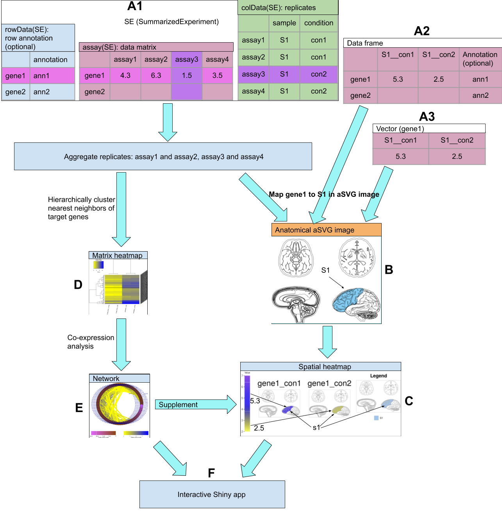
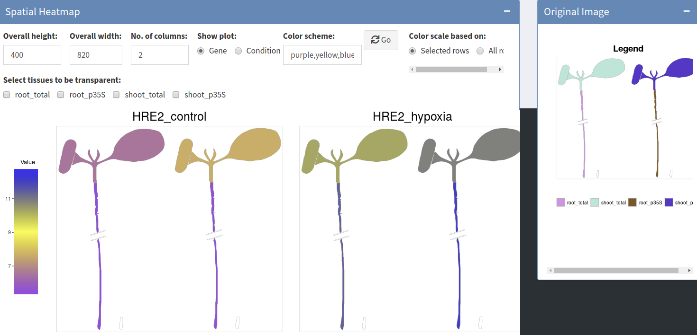

```{r global_options, include=FALSE}
## ThG: chunk added to enable global knitr options. The below turns on
## caching for faster vignette re-build during text editing.
knitr::opts_chunk$set(cache=FALSE)
```
<!-- 

<style type="text/css">
 .main-container { max-width: 1800px; margin-left: 5px; margin-right: auto; }
</style>

<style>body { text-align: justify }</style>  


```{r css, echo = FALSE, results = 'asis'}
BiocStyle::markdown(css.files=c('file/custom.css'))
```

-->

```{r setup0, eval=TRUE, echo=FALSE, message=FALSE, warning=FALSE}
library(knitr); opts_chunk$set(message=FALSE, warning=FALSE)
```


# Introduction 

## Motivation

The _spatialHeatmap_ package provides functionalities for visualizing cell-, tissue-
and organ-specific data of biological assays by coloring the corresponding spatial
features defined in anatomical images according to a numeric color key. The
color scheme used to represent the assay values can be customized by
the user. This core functionality of the package is called a _spatial heatmap_ plot. It is
enhanced with nearest neighbor visualization tools for groups of measured items 
(_e.g._ gene modules) sharing related abundance profiles, including matrix heatmaps
combined with hierarchical clustering dendrograms and network representations.
The functionalities of _spatialHeatmap_ can be used either in a command-driven
mode from within R or a graphical user interface (GUI) provided by a Shiny App
that is also part of this package. While the R-based mode provides flexibility
to customize and automate analysis routines, the Shiny App includes a variety
of convenience features that will appeal to biologists. Moreover, the
Shiny App can be used on both local computers as well as centralized
server-based deployments (_e.g._ cloud-based or custom servers) that can be
accessed remotely as a public web service for using _spatialHeatmap's_
functionalities with community and/or private data. The functionalities
of the `spatialHeatmap` package are illustrated in Figure \@ref(fig:illus).   


```{r illus, echo=FALSE, fig.wide=TRUE, fig.cap=("Functionality overview. The numeric data can come as a `vector`, `data frame`, or `SummarizedExperiment` (SE). If `vector` or `data frame`, the sample and condition identifiers should be in the form of \'sample__condition\', e.g. \'S1__con1\'. If `data frame` or SE, the columns and rows should be sample/conditions and assayed items (gene1, gene2) respectively. In SE, the `colData` slot is required and contains replicate information, while the `rowData` slot is optional and contains row item annotation. If the latter is available, the annotation is seen by mousing over a node in the interactive network. In the aSVG image (see [aSVG](#term) below), spatial features are pre-defined and assigned unique identifiers. In visualization, only aSVG features having identical sample counterparts in data are colored (*e.g.* S1) in spatial heatmaps. To supplement spatial heatmaps, coexpression analysis is applied on \'data matrix\' to identify network modules. The gene in spatial heatmaps can be investigated in the gene module it belongs to, where the module is in form of matrix heatmap and network. Lastly, the spatial heatmaps, matrix heatmap, network are all combined as an interactive Shiny app."), out.width="100%"}



```


As anatomical images the package supports both tissue maps from public
repositories and custom images provided by the user. In general any type of
image can be used as long as it can be provided in SVG (Scalable Vector
Graphics) format, where the corresponding spatial features have been defined
(see [aSVG](#term) below). The numeric values plotted onto a spatial heatmap
are usually quantitative measurements from a wide range of profiling
technologies, such as microarrays, next generation sequencing (_e.g._ RNA-Seq
and scRNA-Seq), proteomics, metabolomics, or many other small- or large-scale
experiments. For convenience, several preprocessing and normalization methods
for the most common use cases are included that support raw and/or preprocessed
data. Currently, the main application domains of the _spatialHeatmap_ package
are numeric data sets and spatially mapped images from biological, agricultural
and biomedical areas. Moreover, the package has been designed to also work with
many other spatial data types, such a population data plotted onto geographic
maps. This high level of flexibility is one of the unique features of
_spatialHeatmap_. Related software tools for biological applications in this
field are largely based on pure web applications [@Winter2007-bq;
@Waese2017-fx] or local tools [@Maag2018-gi; @Muschelli2014-av] that typically
lack customization functionalities. These restrictions limit users to utilizing
pre-existing expression data and/or fixed sets of anatomical image collections.
To close this gap for biological use cases, we have developed _spatialHeatmap_
as a generic R/Bioconductor package for plotting quantitative values onto any
type of spatially mapped images in a programmable environment and/or in an
intuitive to use GUI application.

## Design {#design}

The core feature of [`spatialHeatmap`](#shm) is to map the assay values (_e.g._
gene expression data) of one or many items (_e.g._ genes) measured under
different conditions in form of numerically graded colors onto the
corresponding cell types or tissues represented in a chosen SVG image. In the
gene profiling field, this feature supports comparisons of the expression
values among multiple genes by plotting their spatial heatmaps next to each
other. Similarly, one can display the expression values of a single or multiple
genes across multiple conditions in the same plot (Figure \@ref(fig:mul)). This level of flexibility is
very efficient for visualizing complicated expression patterns across genes,
cell types and conditions. In case of more complex anatomical images composed
of overlapping multiple layer tissues, it is important to visually expose the
tissue layer of interest in the plots. To address this, several default and
customizable layer viewing options are provided. They allow to hide features in
the top layers by making them transparent in order to expose features below
them. This transparency viewing feature is highlighted below in the mouse
example (Figure \@ref(fig:musshm1)).

To maximize reusability and extensibility, the package organizes large-scale
omics assay data along with the associated experimental design information in a
`SummarizedExperiment` object. The latter is one of the core S4 classes within
the Bioconductor ecosystem that has been widely adapted by many other software
packages dealing with gene-, protein- and metabolite-level profiling data
[@SummarizedExperiment]. In case of gene expression data, the `assays` slot of
the `SummarizedExperiment` container is populated with a gene expression
matrix, where the rows and columns represent the genes and tissue/conditions,
respectively, while the `colData` slot contains replicate information. The
tissues and/or cell type information in the object maps via `colData` to the
corresponding features in the SVG images using unique identifiers for the
spatial features (_e.g._ tissues or cell types). This allows to color the
features of interest in an SVG image according to the numeric data stored in a
`SummarizedExperiment` object. For simplicity the numeric data can also be
provided as numeric `vectors` or `data frames`. This can be useful for testing
purposes and/or the usage of simple data sets that may not require the more 
advanced features of the `SummarizedExperiment` class, such as measurements with only one or a
few data points. Details about how to access the SVG images and properly format
the associated expression data are provided in the [Supplement
section](#data_form) of this vignette.

## Terminology {#term}
Spatial heatmaps are images where colors encode numeric values in features of
any shape. For plotting spatial heatmaps, Scalable Vector Graphics (SVG) has
been chosen as image format since it is a flexible and widely adapted vector
graphics format that provides many advantages for computationally embedding
numerical and other information in images. SVG is based on XML formatted text
describing all components present in images, including lines, shapes and
colors. In case of biological images suitable for spatial heatmaps, the shapes
often represent anatomical or cell structures. To assign colors to specific
features in spatial heatmaps, _annotated SVG_ (aSVG) files are used where the
shapes of interest are labeled according to certain conventions so that they
can be addressed and colored programmatically. SVGs and aSVGs of anatomical structures can
be downloaded from many sources including the repositories described [below](#data_sources).
Alternatively, users can generate them themselves with vector graphics
such as [Inkscape](https://inkscape.org/). Typically, in aSVGs one or more 
shapes of a feature of interest, such as the cell shapes of an organ, are
grouped together by a common feature identifier. Via these group identifiers
one or many feature types can be colored simultaneously in an aSVG according to
biological experiments assaying the corresponding feature types with the
required spatial resolution. Correct assignment of image features and assay
results is assured by using for both the same feature identifiers. The color
gradient used to visually represent the numeric assay values is controlled by a
color gradient parameter. To visually interpret the meaning of the colors, the
corresponding color key is included in the spatial heatmap plots.
The formatting details for properly annotating both aSVG images and
assay data are provided in the [Supplement](#sup) section of this vignette. 

## Data Repositories {#data_sources}

If not generated by the user, spatial heatmaps can be generated with data
downloaded from various public repositories. This includes gene, protein and
metabolic profiling data from databases, such as GEO, BAR and EBI. A
particularly useful resource, when working with `spatialHeatmap`, is the Expression
Atlas from EMBL-EBI [@Papatheodorou2018-jy]. This online service contains both assay and
anatomical images. Its assays data include mRNA and protein profiling
experiments for different species, tissues and conditions. The corresponding
anatomical image collections are also provided for a wide range of species
including animals and plants. In `spatialHeatmap` several import functions are
provided to work with the expression and [aSVG repository](#svg_repo) from the Expression Atlas
directly. The aSVG images developed by this project will be deposited in its
own [repository](https://github.com/jianhaizhang/SVG_tutorial_file/tree/master/svg_repo), where users can contribute their aSVG images that are 
formatted according to our guidlines. <font color="red">[ThG-Comment: URL and name
of your own aSVG repos is missing.]</font>
<font color='blue'>jianhai_comment: a specific repo name will be added later. </font>


## Tutorial Overview {#sample_data}

The following sections of this vignette showcase the most important
functionalities of the `spatialHeatmap` package using as initial example a simple
to understand toy data set, and then more complex mRNA profiling data from the
Expression Atlas.  First, spatial heatmap plots are generated for both the toy
and mRNA expression data. The latter include gene expression data sets from
RNA-Seq and microarray experiments of [Human Brain](#hum), [Mouse
Organs](#mus), [Chicken Organs](#chk), and [Arabidopsis Shoots](#shoot). The
first three are RNA-Seq data from the [Expression
Atlas](https://www.ebi.ac.uk/gxa/home) and the last one is a microarray data
set from [GEO](https://www.ncbi.nlm.nih.gov/geo/).  Second, gene context
visualization features are introduced, which facilitate the visualization of
gene modules sharing similar expression patterns. This includes the
visualization of hierarchical clustering results with traditional matrix
heatmaps ([Matrix Heatmap](#mhm)) as well co-expression network plots
([Network](#net)). Third, an overview of the corresponding [Shiny App](#shiny)
is presented that provides access to the same functionalities as the R
functions, but executes them in an interactive environment [@shiny;
@shinydashboard]. Fourth, more advanced features for plotting customized
spatial heatmaps are introduced using the Human Brain data set as an example.  


# Getting Started  

## Installation  

The `spatialHeatmap` package should be installed from an R (version $\ge$ 3.6)
session with the `BiocManager::install` command.  

```{ eval=FALSE, echo=TRUE, warnings=FALSE} 
if (!requireNamespace("BiocManager", quietly = TRUE))
    install.packages("BiocManager")
BiocManager::install("spatialHeatmap")
```

## Load Packages and Documentation

Next, the packages required for running the sample code in this vignette need to be loaded.  

```{r, eval=TRUE, echo=TRUE, warnings=FALSE}
library(spatialHeatmap); library(SummarizedExperiment); library(ExpressionAtlas); library(GEOquery)
```

The following lists the vignette(s) of this package in an HTML browser. Clicking the corresponding name will open this vignette. 

```{r, eval=FALSE, echo=TRUE, warnings=FALSE}
browseVignettes('spatialHeatmap')
```

# Spatial Heatmaps {#shm}


## Toy Example {#toy}

Spatial heatmaps are plotted with the `spatial_hm` function. To provide a quick
and transparent overview how these plots are generated, the following uses a
generalized toy example where a vector of random numeric values is generated
that are used to color the corresponding features in an aSVG image. The image
chosen for this example is an aSVG depicting the human brain. The corresponding
image file 'homo_sapiens.brain.svg' is included in this package for testing purposes. 
The path to this image on a user\'s system, where `spatialHeatmap` is installed, can 
be obtained with the `system.file` function.

```{r eval=TRUE, echo=TRUE, warnings=FALSE }
# Directory of the aSVG collection.
svg.dir <- system.file("extdata/shinyApp/example", package="spatialHeatmap")
# Path of the target aSVG image.
svg.hum <- system.file("extdata/shinyApp/example", 'homo_sapiens.brain.svg', package="spatialHeatmap")
```

To identify features of interest in annotated in aSVG images, the `return_feature` function
can be used. The following searches the aSVG images stored in `dir` for the query terms
'lobe' and 'homo sapiens' under `feature` and `species`, respectively. The identified 
matches are returned as a `data.frame`.   


```{r eval=TRUE, echo=TRUE, warnings=FALSE }
feature.df <- return_feature(feature=c('lobe'), species=c('homo sapiens'), remote=FALSE, dir=svg.dir)
feature.df
fnames <- feature.df[, 1]
```

The following example generates a small numeric toy vector, where the data slot
contains four numbers and its name slot is populated with the three feature
names obtained from the above aSVG image. In addition, a non-matching entry
(here 'notMapped') is included for demonstration purposes. Note, the numbers
are mapped to features via name matching among the numeric vector and the aSVG,
respectively. Accordingly, only numbers and features with matching name
counterparts can be colored in the aSVG image.  Entries without name matches
are indicated by a message printed to the R console, _here_ "notMapped". This
behavior can be turned off with `verbose=FALSE` in the corresponding function
call. In addition, a summary of the numeric assay to feature mappings is stored
in the result `data.frame` returned by the `spatial_hm` function (see below). 


```{r eval=TRUE, echo=TRUE, warnings=FALSE }
my_vec <- sample(1:100, length(unique(fnames))+1)
names(my_vec) <- c(unique(fnames), 'notMapped')
my_vec
```

Next, the spatial heatmap is plotted with the `spatial_hm` function (Figure
\@ref(fig:toyshm)). Internally, the numbers in `my_vec` are translated to
colors based on the color key assigned to the `col.com` argument, and then
painted onto the corresponding features in the aSVG, where the path to the image
file is defined by `svg.path=svg.hum`. The remaining arguments used here include:
`ID` for defining the title of the plot; `ncol` for setting the column-wise layout 
of the plot excluding the feature legend plot on the right; and `height` for defining 
the height of the spatial heatmap relative to its width. In the given example
(Figure \@ref(fig:toyshm)) only three features in `my_vec` ('occipital lobe', 
'parietal lobe', and 'temporal lobe') have matching entries in the corresponding 
aSVG. 

```{r toyshm, eval=TRUE, echo=TRUE, warnings=FALSE, fig.wide=TRUE, fig.cap=("Spatial heatmap on toy data. The middle plot is the spatial heatmap and the right is the legend."), out.width="100%" }
shm.df <- spatial_hm(svg.path=svg.hum, data=my_vec, ID='toy', ncol=1, height=0.7, sub.title.size=20)
```

The named numeric values in `my_vec`, that have name matches with the features in the 
chosen aSVG, are stored in the `mapped_feature` slot.

```{r eval=TRUE, echo=TRUE, warnings=FALSE} 
# Spatial heatmaps and mapped features are stored in a list.
names(shm.df)
# Mapped features
shm.df[['mapped_feature']]
```

## Human Brain {#hum} 

This subsection introduces how to find cell- and tissue-specific assay data in
the Expression Atlas database. After choosing a gene expression experiment, the
data is downloaded directly into a user\'s R session and preprocessed.
Subsequently, the processed expression values of genes selected by users are
plotted onto a chosen aSVG image. In this case, the query and downloading
functionalities of expression data are provided by functionalities of the
`ExpressionAtlas` package [@ebi]. 

The following example searches the Expression Atlas for expression data derived from
specific tissues and species of interest, here _'cerebellum'_ and _'Homo sapiens'_,
respectively.

```{r eval=TRUE, echo=TRUE, message=FALSE, warnings=FALSE }
all.hum <- searchAtlasExperiments(properties="cerebellum", species="Homo sapiens")
```

The search result is stored in a `DataFrame` containing `r nrow(all.hum)`
accessions matching the above query. For the following sample code, the
accession
'[E-GEOD-67196](https://www.ebi.ac.uk/arrayexpress/experiments/E-GEOD-67196/)'
from Prudencio _et al._ [-@Prudencio2015-wd] has been chosen, which corresponds
to an RNA-Seq profiling experiment of _'cerebellum'_ and _'frontal cortex'_ brain
tissue from patients with amyotrophic lateral sclerosis (ALS). Details about the
corresponding record can be returned as follows.

```{r eval=TRUE, echo=TRUE, warnings=FALSE }
all.hum[2, ]
```

The `getAtlasData` function allows to download the chosen RNA-Seq experiment from the 
Expression Atlas and import it into a `RangedSummarizedExperiment` of a user\'s R session.   

<font color='blue'> 
Regarding the data type, if the data involves complex samples and conditions ([mouse example](#mus), [chicken example](#chk), [Arabidopsis example](#shoot)), `SummarizedExperiment` or `RangedSummarizedExperiment` is highly recommended. Otherwise, if the data contains simple samples and conditions, it can come as a `vector` ([toy example](#toy)) or `data frame`. The function `sapatial_hm` will distinguish the data types internally. In this example, the default `RangedSummarizedExperiment` is used. The usage of `vector` and `data frame` is detailed in [Supplement](#data_form).  

</font>

```{r eval=TRUE, echo=TRUE, warnings=FALSE }
rse.hum <- getAtlasData('E-GEOD-67196')[[1]][[1]]
```

The design of the downloaded RNA-Seq experiment is described in the `colData` slot of 
`rse.hum`. The following returns only its first five rows and columns.

```{r eval=TRUE, echo=TRUE, warnings=FALSE }
colData(rse.hum)[1:5, 1:5]
```

<font color="red">
[ThG-Comment 5: please add here the corresponding but unevaluated code to download the 
 aSVG from your repos. Users want to know how this works.]
</font>

<font color='blue'>
The following shows how to download the corresponding pre-annotated aSVG image from the [EBI SVG repository](#svg_repo) based on above tissues and species involved. The function `return_feature` queries the repository with feature and species keywords, i.e. `c('frontal cortex', 'cerebellum')` and `c('homo sapiens', 'brain')` respectively. The argument `keywords.any` is set `TRUE` by default so that aSVGs containing at least one feature word and one species word are returned. The argument `return.all=FALSE` means only aSVGs matching the keywords are returned and saved in `dir`. Otherwise, all aSVGs are returned regardless of the keywords. An empty directory is recommended so as to avoid overwriting existing SVG files with the same names. Here `~/test` is used. `remote=TRUE` means the remote SVG repository is queried. If users want to query a local aSVG collection `remote=FALSE` should be used, and directory of the local aSVG collection should be provided to `dir`. `match.only` is set `TRUE` so that only matching features are returned. If `FALSE`, all features in the matching aSVGs are returned.     
</font>

<font color='blue'>
jianai: The functionality of using EBI online aSVG directly is completed. 
</font>

```{r eval=FALSE, echo=TRUE, warnings=FALSE }
# Make an empty directory.
dir.create('~/test')
# Query aSVGs.
feature.df <- return_feature(feature=c('frontal cortex', 'cerebellum'), species=c('homo sapiens', 'brain'), keywords.any=TRUE, return.all=FALSE, dir='~/test', remote=TRUE, match.only=TRUE, desc=FALSE)
# First 8 rows.
feature.df[1:8, ]
# All matching aSVGs.
unique(feature.df$SVG)
```

<font color='blue'> 
As explained in the [toy example](#toy), the target aSVG image (homo_sapiens.brain.svg) has been included in this 
package. To meet the requirements for building vignettes in R packages, the following 
code section uses the packaged instance of the aSVG file (i.e. local aSVG) rather than downloading it. The ontology ids are available in the R package `rols` [@rols] or [Ontology Lookup Service](https://www.ebi.ac.uk/ols/index).  

```{r eval=TRUE, echo=TRUE, warnings=FALSE }
feature.df <- return_feature(feature=c('frontal cortex', 'cerebellum'), species=c('homo sapiens', 'brain'), keywords.any=TRUE, return.all=FALSE, dir=svg.dir, remote=FALSE)
```

The target tissues `frontal cortex` and `cerebellum` in the experiment design are all included in the aSVG, so it can be used for plotting spatial heatmaps. If users want to change the feature identifiers in the aSVG refer to the [Supplement](#update) for details.  

```{r eval=TRUE, echo=TRUE, warnings=FALSE }
feature.df
```

</font>

For downstream plotting purposes it can be desirable to shorten the text in
certain columns of `colData`. This way one can use the source data for
including 'pretty' sample names in columns and legends of all downstream tables
and plots, respectively, in an automated and reproducible manner. To achieve
this, the following example imports a 'targets' file that can be maintained by
the user and is used to replace the text in the `colData` slot with the
shortened version suitable for column titles and legends. This targets file
utility is particularly useful for data sets requiring custom annotations. 

```{r eval=TRUE, echo=TRUE, warnings=FALSE }
hum.tar <- system.file('extdata/shinyApp/example/target_human.txt', package='spatialHeatmap')
target.hum <- read.table(hum.tar, header=TRUE, row.names=1, sep='\t')
```

<font color='blue'>
Use the tagets file to replace the data frame in `colData` slot.  

jianhai_comment: `DataFrame` should be used otherewise errors arise, so I isolated this code chunk to emphasise it. 

```{r eval=TRUE, echo=TRUE, warnings=FALSE }
colData(rse.hum) <- DataFrame(target.hum)
```

A slice of the simplified `colData` object is shown below, where the `disease` column
contains now shorter labels than in the original data set. Additional details for generating and using targets files in `spatialHeatmap`
are provided in the [Supplement](#data_form) of this vignette.  


```{r eval=TRUE, echo=TRUE, warnings=FALSE}
colData(rse.hum)[c(1:3, 41:42), 4:5]
```

</font>

The actual expression data of the downloaded RNA-Seq experiment is stored in
the `assay` slot of `rse.hum`. Since it contains raw count data, it is
often beneficial to apply prior to plotting spatial heatmaps basic preprocessing 
routines. The following shows how to normalize the count data, aggregate
replicates and then remove genes with unreliable expression responses.

<font color="red">[ThG-Comment 4: can you please substantially improve the
below text in the following preprocessing code step as well as the help files
of the corresponding functions. I am not able to follow why and how certain
parts are done. For instance, why is ratio used as a normalization method?  The final
result also does not seem to be log ratios. You need to better describe what you
are doing here.  Asking readers to look through your code is not appropriate
for a package.]
</font>
<font color='blue'>Added</font>

<font color='blue'> 
The raw-count normalizing function is `norm_data`. It builds on `calcNormFactors` (CNF) from edgeR [@edgeR], and `estimateSizeFactors` (EST), `varianceStabilizingTransformation` (VST), `rlog` from DESeq2 [@DESeq2]. The argument `norm.fun` specifies one of the four internal normalizing functions: `CNF`, `EST`, `VST`, `rlog`. If `none`, no normalization is applied. The arguments of each internal normalizing function are provided through `parameter.list`, which is a named list. For example, `norm.fun='ESF'` and `parameter.list=list(type='ratio')` is equivalent to `estimateSizeFactors(object, type='ratio')`.  

If `paramter.list=NULL`, the default arguments are applied for the normalizing function provided to `norm.fun`. See the help file of `norm_data` for details by running `?norm_data` in R console. In this example, `ESF` is chose for faster speed.   

```{r eval=TRUE, echo=TRUE, warnings=FALSE }
# Normalise.
se.nor.hum <- norm_data(data=rse.hum, norm.fun='ESF', data.trans='log2')
```

The replicates used for aggregation is generated by concatenating the 'sample' and 'contition' column in `colData` slot with double underscore (_\_). The former is specified by `sam.factor` and the latter by `con.factor`. For example, in the following, `organism_part` is sample and `disease` is condition. Thus `cerebellum__ALS`, `frontal_cortex__ALS`, `cerebellum__normal`,	`frontal_cortex__normal` are generated as 'sample__condition' replicates and aggregated.  

```{r eval=TRUE, echo=TRUE, warnings=FALSE }
# Aggregate replicates.
se.aggr.hum <- aggr_rep(data=se.nor.hum, sam.factor='organism_part', con.factor='disease', aggr='mean')
assay(se.aggr.hum)[1:3, ]
```

</font>

The filtering removes unreliable expression measures. Specifically, the following example eliminates genes with expression values larger 
than 5 (log2 unit) in at least 1% of all samples (pOA=c(0.01, 5)), and with coefficient of variance
(CV) between 0.30 and 100 (CV=c(0.30, 100)) are retained.  

```{r eval=TRUE, echo=TRUE, warnings=FALSE }
# Filter genes with low variance and low counts.
se.fil.hum <- filter_data(data=se.aggr.hum, sam.factor='organism_part', con.factor='disease', pOA=c(0.01, 5), CV=c(0.3, 100), dir=NULL)
```

To inspect the results, the following returns three selected rows of the fully
preprocessed data matrix (Table \@ref(tab:humtab)). 

```{r eval=FALSE, echo=TRUE, warnings=FALSE }
assay(se.fil.hum)[733:735, ]
```

```{r humtab, eval=TRUE, echo=FALSE, warnings=FALSE}
kable(assay(se.fil.hum)[733:735, ], caption='A slice of fully preprocessed data matrix.')
```

Next, the preprocessed expression values of gene `ENSG00000268433` are plotted onto the
corresponding features of the aSVG image depicting the human brain. 

```{r humshm, eval=TRUE, echo=TRUE, warnings=FALSE, fig.wide=TRUE, fig.cap=("Spatial heatmaps of human brain. Cerebellum and frontal cortex are colored, since they are the only 2 identical tissues between the aSVG image and the data."), out.width="100%" }
shm.df <- spatial_hm(svg.path=svg.hum, data=se.fil.hum, ID=c('ENSG00000268433'), height=0.6, legend.r=1.3)
```

The spatial heatmaps and mapped features are stored in a list and assigned to an object `shm.df`.

```{r eval=TRUE, echo=TRUE, warnings=FALSE }
names(shm.df)
# Mapped features
shm.df[['mapped_feature']]
```

In this example, the expression profile of gene `ENSG00000268433` in frontal
cortex and cerebellum is plotted under ALS and normal conditions (Figure \@ref(fig:humshm)) with the legend plot on the right. For example, in Table \@ref(tab:humtab) its expression value in cerebellum under ALS is 5.324064. After
mapping, this tissue is colored blue corresponding to 5.324064 in the color
scale. By contrast, this gene\'s expression profile is dark yellow in the same tissue
under normal condition. On the other hand, the expression profile (purple) in
frontal cortex is similar across ALS and normal. Therefore, it is intuitive
that this gene\'s higher activity in cerebellum is potentially associated with
ALS and could contribute to hypothesis generation.  

<font color='blue'> 
Note that only frontal cortex and cerebellum are colored while others are blank in the spatial
heatmaps, since they are the only 2 aSVG features having identical tissue counterpars in the data. And the legend plot only shows these 2 tissues, because `sam.legend=identical` limits the legend to matching tissues between the data and aSVG. If `sam.legend=all`, all tissues are shown and legend plot would overlap with spatial heatmaps. Except for `identical` and `all`, `sam.legend` also accepts a vector of specific tissues for display.  
</font>


<font color="red">
[ThG-Comment 6: I suggest to include here a table where you summarize all arguments
relevant for controlling the output of `spatial_hm` function. This will make it much 
easier for the user to look up relevant arguments and how to use them.]
</font>
<font color='blue'>Added</font>

<font color='blue'>
In cases of multiple input genes, and/or multiple conditions, the subplots of spatial heatmaps might get squeezed. To achieve optimal appearance, the main function `spatial_hm` is designed to be as flexible as possible to avoid such issues. The flexibility is carried out by the arguments listed in Table \@ref(tab:arg).  

```{r arg, eval=TRUE, echo=FALSE, warnings=FALSE}
arg.df <- read.table('file/spatial_hm_arg.txt', header=TRUE, sep='\t')
kable((arg.df), escape=TRUE, caption='Description of arguments in \"spatial_hm\".')
```

</font>


<font color="red">
[ThG-Comment 7: The paragraphs below have been moved here for now. There is a
lot of duplication in this text that needs to be deleted (or hidden via comment
tags) and/or merged into other sections where appropriate. Some of the text is
certainly important but it often should be used to explain code sections rather
than keeping it separate from the code. For instance the first paragraph below
should go to a section where you show how to generate multiple target gene
plots rather then just describing it in stand-alone text, especially since a
summary of this particular example has been given in the intro section already.] 
</font>

<font color='blue'>Moved</font>

<font color='blue'>
If mutiple target genes are input, a set of spatial
heatmaps for each gene are plotted sequentially and organised on the same page.
The `lay.shm` parameter specifies display these spatial heatmaps by genes or by
conditions. This feature makes it flexible for users to compare expression
profiles of the same gene across conditions or different genes across the same
condition, and is particularly useful when compare gene families. For instance, Figure \@ref(fig:mul) is the spatial heatmaps of gene `ENSG00000268433` and `ENSG00000006047`, which are organised by condition (horizontal view).   


```{r mul, eval=TRUE, echo=TRUE, warnings=FALSE, fig.wide=TRUE, fig.cap=("Spatial heatmaps of two genes. The subplots are organised by \"condition\" through `lay.shm` argument."), out.width="100%" }
spatial_hm(svg.path=svg.hum, data=se.fil.hum, ID=c('ENSG00000268433', 'ENSG00000006047'), lay.shm='con', width=1, height=1, legend.r=1.5)
```

</font>

## Mouse Organ {#mus}

This example is based on a mouse data from an RNA-seq study aiming at assessing tissue-specific transcriptome variation across mammals [@Merkin2012-ak], which is from EBI Expression Atlas.   

The following process is similar to the Human Brain example, so explanation of code chunks is simplified to avoid lengthy text.  

Search Expression Atlas for expression data derived from *'hear'* and *'Mus musculus'*.  

```{r eval=TRUE, echo=TRUE, warnings=FALSE }
all.mus <- searchAtlasExperiments(properties="heart", species="Mus musculus")
```

Among the results, select 'E-MTAB-2801'.  

```{r eval=TRUE, echo=TRUE, warnings=FALSE }
all.mus[7, ]
rse.mus <- getAtlasData('E-MTAB-2801')[[1]][[1]]
```

A slice of the experiment design, which is stored in `colData` slot.  

```{r eval=TRUE, echo=TRUE, warnings=FALSE }
colData(rse.mus)[1:3, ]
```

<font color='blue'> 
Download aSVGs from remote EBI repository directly based on tissues and species involved. An empty directory `~/test` is suggested to save the downloaded files so as to avoid overwriting existing files.

```{r eval=FALSE, echo=TRUE, warnings=FALSE }
# Make an empty directory "~/test" if not exist.
if (!dir.exists('~/test')) dir.create('~/test')
# Query aSVGs.
feature.df <- return_feature(feature=c('heart', 'kidney'), species=c('Mus musculus'), keywords.any=TRUE, return.all=FALSE, dir='~/test', remote=TRUE, match.only=FALSE)
```

As explained in the [toy example](#toy), the target aSVG file has been included in this 
package. To meet the requirements for building vignettes in R packages, the following 
code section uses the packaged instance of the aSVG files (`remote=FALSE`) rather than downloading it. To explain how to select a certain aSVG among the returned resutls, `species` is set `NULL` on purpose so that all aSVGs marching the feature keywords are returned.   

```{r eval=TRUE, echo=TRUE, warnings=FALSE }
feature.df <- return_feature(feature=c('heart', 'kidney'), species=NULL, keywords.any=TRUE, return.all=FALSE, dir=svg.dir, remote=FALSE, match.only=FALSE) 
```

All aSVG files matching the query.  

```{r eval=TRUE, echo=TRUE, warnings=FALSE }
unique(feature.df$SVG)
```

Select `mus_musculus.male.svg` as the target aSVG. A slice of the feature data frame and all the aSVG features are shown.   

```{r eval=TRUE, echo=TRUE, warnings=FALSE }
feature.df <- subset(feature.df, SVG=='mus_musculus.male.svg')
# A slice of the feature data frame.
feature.df[1:3, ]
# All features in the aSVG.
unique(feature.df[, 1])
```

Get the target aSVG path.   

```{r eval=TRUE, echo=TRUE, warnings=FALSE}
svg.mus <- system.file("extdata/shinyApp/example", "mus_musculus.male.svg", package="spatialHeatmap")
```

</font>

Make a targets file based on the experiment design and features of interest in the aSVG file. It is included in this package and part is shown below.  

```{r eval=TRUE, echo=TRUE, warnings=FALSE }
mus.tar <- system.file('extdata/shinyApp/example/target_mouse.txt', package='spatialHeatmap')
target.mus <- read.table(mus.tar, header=TRUE, row.names=1, sep='\t')
target.mus[1:3, ]
# Tissues in the experiment. 
unique(target.mus[, 3])
```

Use the targets file to replace the data frame in `colData` slot.  

```{r eval=TRUE, echo=TRUE, warnings=FALSE }
colData(rse.mus) <- DataFrame(target.mus)
```

Pre-process the raw count matrix: normalise, aggregate, filter. Genes with expression values larger than 5 (log2 unit) in at least 1% of all samples (pOA=c(0.01, 5)), and with coefficient of variance (CV) between 0.60 and 100 (CV=c(0.6, 100)) are retained.    

```{r eval=TRUE, echo=TRUE, warnings=FALSE }
# Normalise.
se.nor.mus <- norm_data(data=rse.mus, norm.fun='ESF', data.trans='log2')
# Aggregate replicates.
se.aggr.mus <- aggr_rep(data=se.nor.mus, sam.factor='organism_part', con.factor='strain', aggr='mean')
# Filter genes with low variance and low counts.
se.fil.mus <- filter_data(data=se.aggr.mus, sam.factor='organism_part', con.factor='strain', pOA=c(0.01, 5), CV=c(0.6, 100), dir=NULL)
```

Plot spatial heatmaps.   

```{r musshm, eval=TRUE, echo=TRUE, warnings=FALSE, fig.wide=TRUE, fig.cap=("Mouse organ spatial heatmap. This is a multiple-layer image and `skeletal muscle` is set transparent to expose lung and heart."), out.width="100%" }
spatial_hm(svg.path=svg.mus, data=se.fil.mus, ID=c('ENSMUSG00000000263'), height=0.5, legend.r=1.1, sub.title.size=9, ncol=3, tis.trans=c('skeletal muscle'), legend.nrow=4, line.size=0.2, line.color='grey70')
```

The spatial heatmap of gene `ENSMUSG00000000263` is plotted in 8 tissues across 3 strains. It is manifest that only brain exhibits obvious difference across the 3 strains with DBA.2J, C57BL.6, and CD1 being highest, medium, and lowest respectively. In contrast, all the other 8 tissues display similar profile across strains. Thus this gene is potentially strain-specific. Moreover, the expression levels of all the other 8 tissues are all lower than brain.   

<font color='blue'>
This is a typical example to demonstrate the usage of `tis.trans` parameter, since this mouse organ image includes tissues in multiple layers and skelectal muscle covers lung and heart. In Figure \@ref(fig:musshm), skelectal muscle is set transparent through `tis.trans=c('skeletal muscle')` so that lung and heart are exposed. By contrast, in Figure \@ref(fig:musshm1) `tis.trans=NULL` exposes `skeletal muscle` and lung and heart are covered.  

Moreover, presence of too many tissues might affect the visual effects due to the messy
polygon outlines. The `line.size` and `line.color` parameters are used to
adjust the thickness and color of polygon outlines respectively and thus enhance the visualisation. In Figure 2, the default values of the 2 arguments are used.   
</font>


```{r musshm1, eval=TRUE, echo=TRUE, warnings=FALSE, fig.wide=TRUE, fig.cap=("Mouse organ spatial heatmap. This is a multiple-layer image and `skeletal muscle` convers lung and heart."), out.width="100%" }
spatial_hm(svg.path=svg.mus, data=se.fil.mus, ID=c('ENSMUSG00000000263'), height=0.5, legend.r=1.1, sub.title.size=9, ncol=3, tis.trans=NULL, legend.ncol=2, line.size=0.2, line.color='grey70')
```

## Chicken Organ {#chk}

In this example, the data come from developments of 7 chicken organs under 9 time points [@Cardoso-Moreira2019-yq], which is an RNA-seq analysis and accessed from EBI Expression Atlas.  

The following process is similar to the Human Brain example, so explanation of code chunks is simplified to avoid lengthy text.  

Search Expression Atlas for expression data derived from *'heart'* and *'gallus'*.  

```{r eval=TRUE, echo=TRUE, warnings=FALSE }
all.chk <- searchAtlasExperiments(properties="heart", species="gallus")
```

Among the results, select 'E-MTAB-6769'.  

```{r eval=TRUE, echo=TRUE, warnings=FALSE }
all.chk[3, ]
rse.chk <- getAtlasData('E-MTAB-6769')[[1]][[1]]
```

A slice of the experiment design, which is stored in colData slot.  

```{r eval=TRUE, echo=TRUE, warnings=FALSE } 
colData(rse.chk)[1:3, ]
```

<font color='blue'> 
Download aSVGs from EBI repository based on the tissues and species involved. An empty directory `~/test` is suggested to save the downloaded files so as to avoid overwriting existing files.  

```{r eval=FALSE, echo=TRUE, warnings=FALSE }
# Make an empty directory "~/test" if not exist.
if (!dir.exists('~/test')) dir.create('~/test')
# Query aSVGs.
feature.df <- return_feature(feature=c('heart', 'kidney'), species=c('gallus'), keywords.any=TRUE, return.all=FALSE, dir='~/test', remote=TRUE, match.only=FALSE)
```

As explained in the [toy example](#toy), the target aSVG image has been included in this 
package, and will be used for plotting spatial heatmaps.    

```{r eval=TRUE, echo=TRUE, warnings=FALSE }
feature.df <- return_feature(feature=c('heart', 'kidney'), species=c('gallus'), keywords.any=TRUE, return.all=FALSE, dir=svg.dir, remote=FALSE, match.only=FALSE)
feature.df
```

Get the target aSVG path.   

</font>

```{r eval=TRUE, echo=TRUE, warnings=FALSE}
svg.chk <- system.file("extdata/shinyApp/example", "gallus_gallus.svg", package="spatialHeatmap")
```

Make a targets file based on the experiment design and features of interest in the aSVG. It is included in this package and part is shown below.  

```{r eval=TRUE, echo=TRUE, warnings=FALSE }
chk.tar <- system.file('extdata/shinyApp/example/target_chicken.txt', package='spatialHeatmap')
target.chk <- read.table(chk.tar, header=TRUE, row.names=1, sep='\t')
target.chk[1:3, ]
```

Use the targets file to replace the data frame in `colData` slot.  

```{r eval=TRUE, echo=TRUE, warnings=FALSE }
colData(rse.chk) <- DataFrame(target.chk)
```

All samples used for plotting spatial heatmaps.  

```{r eval=TRUE, echo=TRUE, warnings=FALSE }
unique(colData(rse.chk)[, 'organism_part'])
```

All conditions used for plotting spatial heatmaps.  

```{r eval=TRUE, echo=TRUE, warnings=FALSE }
unique(colData(rse.chk)[, 'age'])
```

Pro-process data matrix: normalize, aggregate, filter. Genes with expression values larger than 5 (log2 unit) in at least 1% of all samples (pOA=c(0.01, 5)), and with coefficient of variance (CV) between 0.6 and 100 (CV=c(0.6, 100)) are retained.  

```{r eval=TRUE, echo=TRUE, warnings=FALSE }
# Normalise.
se.nor.chk <- norm_data(data=rse.chk, norm.fun='ESF', data.trans='log2')
# Aggregate replicates. 
se.aggr.chk <- aggr_rep(data=se.nor.chk, sam.factor='organism_part', con.factor='age', aggr='mean')
# Filter genes with low variance and low counts.
se.fil.chk <- filter_data(data=se.aggr.chk, sam.factor='organism_part', con.factor='age', pOA=c(0.01, 5), CV=c(0.6, 100), dir=NULL)
```


Plot spatial heatmaps.  

```{r chkshm, eval=TRUE, echo=TRUE, warnings=FALSE, fig.wide=TRUE, fig.cap=("Example of plotting chicken organ spatial heatmaps. Liver in day10 is not plotted since this tissue in day10 in not available in the data matrix."), out.width="100%" }
spatial_hm(svg.path=svg.chk, data=se.fil.chk, ID='ENSGALG00000006346', legend.r=1.5, sub.title.size=9, ncol=3, legend.nrow=2)
```

The spatial heatmap of gene `ENSGALG00000006346` is plotted. It is intuitive that the profiles of liver, heart, and kidney are all higher in day17 than other days. Therefore, the important role of this gene in day10 is worth futher exploration. In day10 liver is blank, because in the expression matrix liver data is not availble for day10. This reflects the plotting algorithm that only matching samples between the data and SVG image are plotted.    

In this example, the usage of argument `ncol` is exhibited on how to achieve optimal layout. There are 9 time conditions, so `ncol=3` is set to make make full use of the space.   

## Arabidopsis Shoot {#shoot}

[GEO](https://www.ncbi.nlm.nih.gov/geo/) is a another well-known public repository of array- and sequence-based data. To demonstrate the use of spatialHeatmap on this resource, the dataset GSE14502 is plotted on a shoot aSVG image. It a microarray data from a study of translatome variation of *Arabidopsis thaliana* (Arabidopsis) shoot and root tissues under control and hypoxia conditions [@Mustroph2009-nu], and is downloaded through GEOquery [@geo].  

Access the GEO dataset GSE14502 and convert it to `SummarizedExperiment`.  

```{r eval=TRUE, echo=TRUE, warnings=FALSE}
gset <- getGEO("GSE14502", GSEMatrix=TRUE, getGPL=TRUE)[[1]]
se.sh <- as(gset, "SummarizedExperiment")
```

Use gene symbols to replace probes.   

```{r eval=TRUE, echo=TRUE, warnings=FALSE}
rownames(se.sh) <- make.names(rowData(se.sh)[, 'Gene.Symbol'])
```

A slice of the experiment design, which is stored in `colData` slot. The samples and conditions are included in the `title` column. In samples, promoter *pGL2, pCO2, pSCR, pWOL* labels *root atrichoblast epidermis, root cortex meristematic zone, root endodermis, root vasculature* respectively, and *p35S* labels *root_total* and *shoot_total*. There are 2 conditions: `control` and `hypoxia`.  

```{r eval=TRUE, echo=TRUE, warnings=FALSE}
colData(se.sh)[60:63, 1:4]
```

In this example, the aSVG image of Arabidopsis is made from @Mustroph2009-nu. Similarly, it is included in this packaged and thus can be queried locally. The instructions on how to make custom aSVG images are provided in the [SVG tutorial](https://jianhaizhang.github.io/SVG_tutorial_file/).   

Query the packaged aSVG files.  

```{r eval=TRUE, echo=TRUE, warnings=FALSE }
feature.df <- return_feature(feature=c('pGL2', 'pRBCS'), species=c('shoot'), keywords.any=TRUE, return.all=FALSE, dir=svg.dir, remote=FALSE, match.only=FALSE)
```

All matching aSVGs.   

```{r eval=TRUE, echo=TRUE, warnings=FALSE } 
unique(feature.df$SVG)
```

Select 'shoot_final.svg' for plotting spaital heatmaps.  

```{r eval=TRUE, echo=TRUE, warnings=FALSE }
feature.df <- subset(feature.df, SVG=='shoot_final.svg')
# A slice of the feature data frame.
feature.df[1:3, ]
```

Get path of 'shoot_final.svg'.  

```{r eval=TRUE, echo=TRUE, warnings=FALSE }
svg.sh <- system.file("extdata/shinyApp/example", "shoot_final.svg", package="spatialHeatmap")
```

Make a targets file based on the `title` column in experiment design and features of interest in the aSVG. It is included in this package and part is shown below.

```{r eval=TRUE, echo=TRUE, warnings=FALSE}
sh.tar <- system.file('extdata/shinyApp/example/target_arab.txt', package='spatialHeatmap')
target.sh <- read.table(sh.tar, header=TRUE, row.names=1, sep='\t')
target.sh[60:63, ]
```

All samples in targets file.     

```{r eval=TRUE, echo=TRUE, warnings=FALSE}
unique(target.sh[, 'samples'])
```

All conditions in targets file.  

```{r eval=TRUE, echo=TRUE, warnings=FALSE}
unique(target.sh[, 'conditions'])
```

Use the targets file to replace the data frame in `colData` slot.  

```{r eval=TRUE, echo=TRUE, warnings=FALSE}
colData(se.sh) <- DataFrame(target.sh)
```

The dataset GSE14502 is already normalised by RMA [@affy], so the pro-processing only includes aggregation and filtering. Genes with expression values larger than 6 (log2 unit) in at least 3% of all samples (pOA=c(0.03, 6)), and with coefficient of variance (CV) between 0.30 and 100 (CV=c(0.30, 100)) are retained.   

```{r eval=TRUE, echo=TRUE, warnings=FALSE }
# Aggregate replicates. 
se.aggr.sh <- aggr_rep(data=se.sh, sam.factor='samples', con.factor='conditions', aggr='mean')
# Filter genes with low variance and low intensity.
se.fil.arab <- filter_data(data=se.aggr.sh, sam.factor='samples', con.factor='conditions', pOA=c(0.03, 6), CV=c(0.30, 100), dir=NULL)
```

Plot spatial heatmaps.   

```{r shshm, eval=TRUE, echo=TRUE, warnings=FALSE, fig.wide=TRUE, fig.cap=('Spatial heatmaps of Arabidopsis shoot. Pre-defined tissue regions are colored by the expression profile of the target gene. The promoter pGL2, pRBCS, pCER5, pSultr2.2, pSUC2, pKAT1 label shoot trichomes, shoot photosynthetic cell, cotyledon and leaf epidermis, shootbundle sheath, shoot phloem companion cells, Cotyledon and leaf guard cells, respectively.'), out.width="100%"}
spatial_hm(svg.path=svg.sh, data=se.fil.arab, ID=c("HRE2"), height=0.6, legend.nrow=3, legend.r=1.3, legend.key.size=0.3)
```

Figure \@ref(fig:shshm) is the spatial heatmap of gene `HRE2` under `control` and `hypoxia`. It is clear that this gene\'s exression profiles under control are lower than `hypoxia` across all the 5 tissues (*pGL2, pRBCS, pCER5, pSUC2, pKAT1*). Therefore, it can be hypothesised that `hypoxia` induces over-expression of `HRE2` across the 5 tissues and thus `HRE2` might be an important factor for Arabidopsis shoot to cope with `hypoxia` stress. The tissue *pSultr2.2* is blank under `hypoxia` due to unavailability of its data under `hypoxia` in the data matrix.   

<font color='blue'>jianhai_comment: From here to Shiny App section, slight changes are made.</font>

# Matrix Heatmaps {#mhm}

The Matrix Heatmap is designed to supplement the core feature of spatial heatmap. It displays the target gene in the context of corresponding gene network module, so there is a process of gene modules identification.

**Adjacency Matrix and Module Identification**  

<a name="ds"></a>
The modules are identified by `adj_mod`. It first computes an adjacency matrix on the gene expression matrix then hierarchically clusters the adjacency matrix by using WGCNA [@Langfelder2008-sg] and flashClust [@flashClust]. The clutersing includes 4 alternative sensitivity levels (`ds`=0, 1, 2, or 3). From 3 to 0, the sensitivity decreases and results in less modules with larger sizes. Since the [interactive network](#inter_net) functionality performs better on smaller modules, only `ds` of 3 and 2 are used. There is another  parameter `type` for module identification: `signed` and `unsinged`. The former means both positive and negative adjacency between genes are used while the latter takes the absolute values of negative adjacency.  

The function `adj_mod` returns a list containing an adjacency matrix and a data frame of module assignment. It is domenstrated on the [Arabidopsis Shoot](#plot_sh) data.

```{r eval=TRUE, echo=TRUE, warnings=FALSE, results=FALSE}
adj.mod <- adj_mod(data=se.fil.arab)
```   

The adjacency matrix is a measure of co-expression similarity between genes, where larger value denotes more similarity.   

```{r eval=TRUE, echo=TRUE, warnings=FALSE}
adj.mod[['adj']][1:3, 1:3]
```

The module assignment is a data frame. The first column is `ds=2` while the second is `ds=3`. The numbers in each column are module labels with "0" meaning genes not assigned to any modules.   

```{r eval=TRUE, echo=TRUE, warnings=FALSE}
adj.mod[['mod']][1:3, ]
```

<a name="mhm1"></a>
The matrix heatmap is implemented in function `matrix_hm` with 2 modes provided: static or interactive. Figure \@ref(fig:static) is the static mode on gene `HRE2`. Setting `static=FALSE` launches the interactive mode, where users can zoom in and out by drawing a rectangle and by double clicking the heatmap, respectively.

```{r static, eval=TRUE, echo=TRUE, warnings=FALSE, fig.cap=("Matrix Heatmap. Rows are genes and columns are samples. The input gene is tagged by 2 black lines."), out.width='100%'}
matrix_hm(geneID="HRE2", data=se.fil.arab, adj.mod=adj.mod, angleCol=80, angleRow=35, cexRow=0.8, cexCol=0.8, margin=c(10, 6), static=TRUE, arg.lis1=list(offsetRow=0.1, offsetCol=0.1))
```   

In Figure \@ref(fig:static), the target gene is displayed in the gene module it belongs to, which is indicated by 2 black lines. The rows and columns are sorted by hierarchical clustering dendrograms. The expression matrix of this module is visualised without being scaled (`scale="no"`). It can be seen that the expression levels of this module is overall much higher in `hypoxia` than `control`, and therefore it could potentially be used to infer the `hypoxia` response mechanism in Arabidopsis.   

# Network Graphs {#net}

The same target gene and module from matrix heatmap can also be displayed as a network. Similarly, the network can be dispayed in static or interactive mode.  

Setting `static=TRUE` launches the static network. In Figure \@ref(fig:inter) Nodes are genes and edges are adjacencies between genes. The thicker edge denotes higher adjacency (co-expression similarity) while larger node indicates higher gene connectivity (sum of a gene\'s adjacency with all its direct neighbours). The target gene is labeled by '_selected'.  

```{r inter, eval=TRUE, echo=TRUE, warnings=FALSE, fig.cap=("Static network. Node size denotes gene connectivity while edge thickness stands for co-expression similarity.") }
network(geneID="HRE2", data=se.fil.arab, adj.mod=adj.mod, adj.min=0.75, vertex.label.cex=1.2, vertex.cex=2, static=TRUE)
```   

<a name="inter_net"></a>
Setting `static=FALSE` launches the interactive network. There is an interactive color bar to denote gene connectivity. The color ingredients must only be separated by comma, e.g. `purple,yellow,blue`, which means gene connectivity increases from purple to yellow. If too many edges (e.g.: > 300) are displayed, the network could get stuck. So the 'Input an adjacency threshold to display the adjacency network.' option sets a threthold to filter out weak edges. If not too many edges retained (e.g.: < 300), users can check 'Yes' under 'Display or not?', then the network would be responsive smoothly. To maintain acceptable performance, users are advised to choose a stringent threshold (e.g. 0.9) initially, then decrease the value gradually. The interactive feature allows users to zoom in and out, or drag a gene around. All the gene IDs in the network module are listed in 'Select by id' in decreasing order according to gene connectivity. Same with static mode, the target gene ID is appended '_selected'.  

If gene annotation is available in `rowData` slot and provided to `ann` argument, the annotation is seen by mousing over a node. In this example, `Target.Description` in `rowData` is provided to `ann`.  

```{r eval=FALSE, echo=TRUE, warnings=FALSE}
network(geneID="HRE2", data=se.fil.arab, ann='Target.Description', adj.mod=adj.mod, static=FALSE)
```

# Shiny App {#shiny}

All the above functionality (spatial heatmap, interactive matrix heatmap, interactive network) is also combined into a web-browser based [Shiny App](https://shiny.rstudio.com/), which takes advantage of the computational power of R and interactivity of the web. The main benefits of the Shiny App is combine all the utities in one interface and increase interactivity. On the left of this app is the menu. It includes pre-formatted ready-to-use examples, options to upload formatted data matrix and aSVG images, and instruction to use this app. On the right is the interactive interfacce, including Data Matrix, Spatial Heatmap, Matrix Heatmap, and Network. To use interactive features, there are paramters on the left menu to operate. Upon launched, the app automatically displays a pre-formatted example. A good practice to use this app is to follow steps in the menu rather than skipping steps. If unexpectation happens, the app webpage should be refreshed.

This app is launched by the function `shiny_all` without any parameters. Figure \@ref(fig:shiny) is the screenshot of Spatial Heatmap.  

```{r eval=FALSE, echo=TRUE, warnings=FALSE}
shiny_all()
```   

```{r shiny, echo=FALSE, fig.wide=TRUE, fig.cap=("The snapshot of Shiny App. Left is the menu and right is the Spatial Heatmap."), out.width="100%"}



```  

The data matrix to upload is a data frame. If the data is a `SummarizedExperiment` class, the data matrix can be obtained by setting a directory path to `dir` in function `filter_data`. A folder `local_mode_result/` is automatically created in the provided path, and the filtered data matrix is written to `local_mode_result/processed_data.txt` with column names in the scheme 'sample__condition' (Table \@ref(tab:humtab)), which is a tab-separated file. If users want to see annotation by mousing over a node in the network, a column of gene annotation in `rowData` slot should be provided to `ann`, then the annotation is appended to the last column in `processed_data.txt`.  

For example, in `filter_data`, setting `dir='./'` (current working directory) will output the filtered data matrix in `./local_mode_result/processed_data.txt`, and setting `ann='Target.Description'` appends the annotation from `rowData` slot to the last column of `processed_data.txt`, which is ready to upload to the app.

```{r eval=FALSE, echo=TRUE, warnings=FALSE}
se.fil.arab <- filter_data(data=se.aggr.sh, ann="Target.Description", sam.factor='samples', con.factor='conditions', pOA=c(0.03, 6), CV=c(0.30, 100), dir='./')
```

<font color='blue'>jianhai_comment: the following Supplement section is substantially changed.</font>

# Supplement {#sup} 

To plot spatial heatmaps, a pair of data (`vector`, `data frame`, `SummarizedExperiment`) and aSVG image are required. The most important step is to format the data and aSVG image so that target features in aSVG have matching counterparts in the data, since only the matching features in aSVG images are colored. This section explains details of data and aSVG setup that are not covered in the main vignette.  

## Format the Data {#data_form}

The accepted data classes include `vector`, `data frame`, or `SummarizedExperiment` (SE). A `vector` applies to several numeric values measured for a single item (*e.g.* gene), and `data frame` applies to more items assayed in several samples and/or several conditions (e.g. 2 samples under 2 conditions). By contrast, SE applies to experiments with many samples and many conditions. Formatting the data is essentially define samples and/or conditions.     

**Vector**  
In the case of vector, the numeric values are measured from different samples. If one or more conditions are provided, the samples and conditions should be connected by double undescore, i.e. in the form of 'sample__condition'. If no conditions are provided, all the samples are assumed to have same condition, which is the [toy example](#toy).    

Take 2 samples `occipital lobe` and `parietal lobe` from the [toy example](#toy) for instance and assume there are 2 conditions, `condition1` and `condition2`. Select 5 random values, assign 4 of them to the 2 samples under the 2 conditions, and the last one to a not-mapped sample. Note the value names should be unique.   

```{r eval=TRUE, echo=TRUE, warnings=FALSE }
# Random numeric values.
vec <- sample(x=1:100, size=5)
# Give unique names to random values.
names(vec) <- c('occipital lobe__condition1', 'occipital lobe__condition2', 'parietal lobe__condition1', 'parietal lobe__condition2', 'notMapped')
vec
```

Plot spatial heatmaps.  

```{r vecshm, eval=FALSE, echo=TRUE, warnings=FALSE, fig.wide=FALSE, fig.cap=c('Spatial heatmaps on a vector. \'occipital lobe\' and \'parietal lobe\' are 2 aSVG features and \'condition1\' and \'condition2\' are conditions.')}
spatial_hm(svg.path=svg.hum, data=vec, ID='toy', ncol=1, legend.r=1.2, sub.title.size=14)
```

**Data Frame**  
In the case of data frame, numeric values are measured from different samples. Similarly, if one or more conditions are provided, the column names should be in the form of 'sample__condition'. If no conditions are provided, all the samples are assumed to have same condition.   

Take the same samples and conditions in the `vector` case as example.  

Make a numeric data frame of 20 rows and 5 columns. Name columns with the value names (each is unique) from above vector and rows with 20 genes (gene1, gene2, ..., gene20).  

```{r eval=TRUE, echo=TRUE, warnings=FALSE }
# Make a numeric data frame.
df.test <- data.frame(matrix(sample(x=1:1000, size=100), nrow=20))
# Name the columns.
colnames(df.test) <- names(vec)
# Name the rows.
rownames(df.test) <- paste0('gene', 1:20)
# A slice of the data frame.
df.test[1:3, ]
```

In the downstream [interactive network](#inter_net), if users want to have a gene annotation by mousing over a node, a column of gene annotation can be appended to the data frame. For example, the 20 genes are annotated as ann1, ann2, ..., ann20.   

```{r eval=TRUE, echo=TRUE, warnings=FALSE }
df.test$ann <- paste0('ann', 1:20)
df.test[1:3, ]
```

Plot spatial heatmaps on `gene1`.   

```{r dfshm, eval=FALSE, echo=TRUE, warnings=FALSE, fig.wide=FALSE, fig.cap=c('Spatial heatmaps on a data frame. \'occipital lobe\' and \'parietal lobe\' are 2 aSVG features and \'condition1\' and \'condition2\' are conditions.')}
spatial_hm(svg.path=svg.hum, data=df.test, ID=c('gene1'), ncol=1, legend.r=1.2, sub.title.size=14)
```

**SummarizedExperiment**  

In the following, the same samples and conditions in the above data frame are taken as example.  

Formatting data of `SummarizedExperiment` (SE, @SummarizedExperiment) is essentially to make a targets file (a data frame of column metadata). The targets file usually has at least 2 columns that specifies sample and condition replicates respectively, and should be added to the `colData` slot. The data matrix should have assayed items (*e.g.* genes) and sample/conditions in rows and columns respectively, and must be in the `assay` slot. The `rowData` slot can store a data frame of annotaions corresponding to rows in `assay` slot, but is not required.  

To plot spaital heatmap successfully, the targets file should meet the following requirements.  

1. It is a `data frame` and usually has at least one column of samples and one column of conditions. The rows correspond with columns in `assay` slot. If the condition column is not defined, the samples are assumped under same condition.
 
2. The sample column specifies sample replicates. It is crucial that replicate names of the same sample must be identical. Otherwise, they are treated as different samples. E.g. 
`occipital lobe`, `occipital lobe` are the same sample while `occipital lobe1`, `occipital lobe2` are different samples. 

3. The sample identifiers of interest must be identical with features of interest in aSVG respectively. It means even a dot, undescore, space, *etc* can make a difference and lead to target features not colored in spatial heatmaps. Since double underscore (_\_) is a reserved separator in *spatialHeatmap*, it cannot be used in sample or condition identifiers.  

4. The condition column has the same requirement with the sample column. E.g. `condition1`, `condition1` is same conditoin while `condition1A`, `condition1B` is treated as different conditions.   


In the following example, `occipital lobe` has 2 conditions `condition1` and `condition2`, and each condition has 2 replicates, so there are 4 assays for `occipital lobe`. The same applies to `parietal lobe`. Based on this experiment design, the corresponding targets file is made, where a row is an assay.   

```{r eval=TRUE, echo=TRUE, warnings=FALSE }
# Two samples.
sample <- c(rep('occipital lobe', 4), rep('parietal lobe', 4))
# Two conditions.
condition <- rep(c('condition1', 'condition1', 'condition2', 'condition2'), 2)
# Targets file.
target.test <- data.frame(sample=sample, condition=condition, row.names=paste0('assay', 1:8))
target.test
```

Make a random numeric data frame of 8 columns and 20 rows. Each column is an assay and each row is a gene\'s expression profile. Columns must correspond with rows in targets file, so column names are assigned assay1-8.  

```{r eval=TRUE, echo=TRUE, warnings=FALSE }
# Make a numeric data frame.
df.se <- data.frame(matrix(sample(x=1:1000, size=160), nrow=20))
# Name the rows.
rownames(df.se) <- paste0('gene', 1:20)
# Replace the default column names. 
colnames(df.se) <- row.names(target.test)
# A slice of the data frame.
df.se[1:3, ]
se <- SummarizedExperiment(assays=df.se, colData=target.test)
se
```

Similarly, in the downstream [interactive network](#inter_net), if users want to have a gene annotation by mousing over a node, a data frame of gene annotation can be added to `rowData` slot, *i.e.* the `ann` column in `df.test`.  

```{r eval=TRUE, echo=TRUE, warnings=FALSE }
rowData(se) <- df.test['ann']
```

In this simple example, the normalization and filtering process is left out, but replicates should be aggregated. In function `aggr_rep`, the `sample` and `condition` columns in targets file are concatenated with double underscore to form 'sample__condition' replicates for aggregating.  

```{r eval=TRUE, echo=TRUE, warnings=FALSE }
se.aggr <- aggr_rep(data=se, sam.factor='sample', con.factor='condition', aggr='mean')
assay(se.aggr)[1:3, ]
```

Plot spatial heatmaps on `gene1`.     

```{r seshm, eval=FALSE, echo=TRUE, warnings=FALSE, fig.wide=FALSE, fig.cap=c('Spatial heatmaps on a SummarizedExperiment. \'occipital lobe\' and \'parietal lobe\' are 2 aSVG features and \'condition1\' and \'condition2\' are conditions.')}
spatial_hm(svg.path=svg.hum, data=se.aggr, ID=c('gene1'), ncol=1, legend.r=1.2, sub.title.size=14)
```

## aSVG repository {#svg_repo}

The aSVG repository is from [EBI Gene Expression Group](https://github.com/ebi-gene-expression-group/anatomogram/tree/master/src/svg), where the requirements on aSVG format are included. It contains aSVGs across different species and can be downloaded with funtion `return_feature` directly. If users cannot find a target aSVG in this repository, there is a step-by-step [SVG tutorial](https://jianhaizhang.github.io/SVG_tutorial_file/) to create custom aSVG images, which is developed by this project.    


## Update aSVG features {#update}

To change existing feature identifiers in aSVG, the function `update_feature` should be used. For testing purpose, an empty folder `~/test1` is created and a copy of the aSVG `homo_sapiens.brain.svg` packaged in *spatialHeatmap* is saved in there.  

<!-- To avoid creating '~/test1' in users' computer, the following code chunks are not evaluated when building this vignette. -->

```{r eval=FALSE, echo=TRUE, warnings=FALSE }
# Make an empty directory.
if (!dir.exists('~/test1')) dir.create('~/test1')
# Copy the "homo_sapiens.brain.svg" aSVG.
svg.hum <- system.file("extdata/shinyApp/example", 'homo_sapiens.brain.svg', package="spatialHeatmap")
file.copy(from=svg.hum, to='~/test1', overwrite=FALSE)
```

Use feature and species keywords to query the aSVG and return existing features, which is a data frame. 

```{r eval=FALSE, echo=TRUE, warnings=FALSE }
feature.df <- return_feature(feature=c('frontal cortex'), species=c('homo sapiens', 'brain'), dir='~/test1', remote=FALSE, keywords.any=FALSE)
feature.df
``` 

Make a vector of new feature identifiers corresponding to every returned feature, *e.g.* replacing spaces with dots. This vector must be added to the first column of the feature data frame, since that is where `update_feature` looks for new features. Then features are updated with `update_feature`.    

```{r eval=FALSE, echo=TRUE, warnings=FALSE } 
# A vector of new features.
f.new <- c('frontal.cortex', 'prefrontal.cortex')

# New features added to the first column of feature data frame.
feature.df.new <- cbind(featureNew=f.new, feature.df)
feature.df.new

# Update the features.
update_feature(feature=feature.df.new, dir='~/test1')
```

<br/>


```{r eval=TRUE, echo=TRUE}

# Version Informaion
sessionInfo()
```

# Funding

This project has been funded by NSF awards: [PGRP-1546879](https://www.nsf.gov/awardsearch/showAward?AWD_ID=1546879&HistoricalAwards=false), [PGRP-1810468](https://www.nsf.gov/awardsearch/showAward?AWD_ID=1810468), [PGRP-1936492](https://www.nsf.gov/awardsearch/showAward?AWD_ID=1936492&HistoricalAwards=false).

# References


