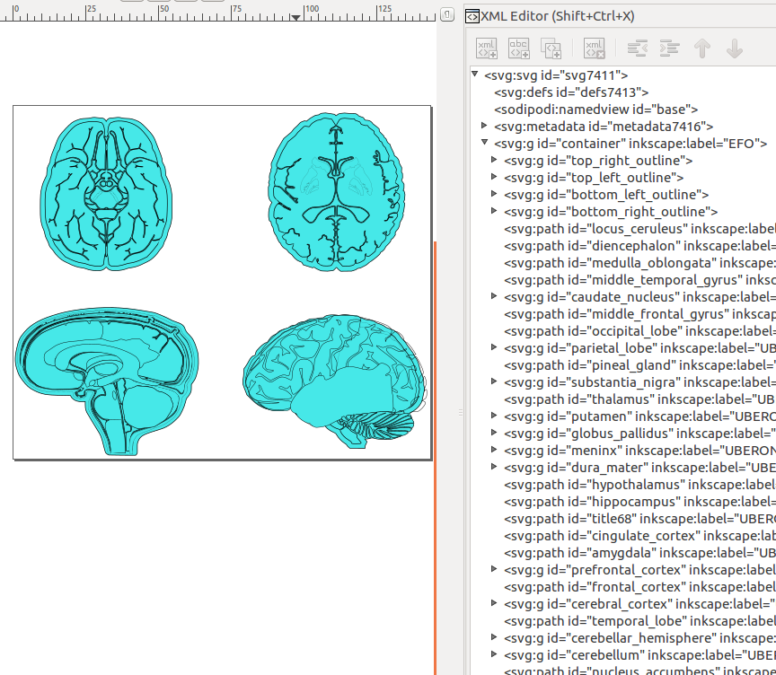

<style type="text/css">
.main-container { max-width: 1800px; margin-left: 5px; margin-right: auto; }
</style>

<style>body { text-align: justify }</style>

```{r setup0, eval=TRUE, echo=FALSE, message=FALSE, warning=FALSE}

library(knitr); opts_chunk$set(message=FALSE, warning=FALSE)

```

# Introduction 

## Motivation

The _spatialHeatmap_ package provides functionalities for visualizing tissue-
and cell-specific gene expression data by coloring the corresponding spatial
features, defined in anatomical images, according to a numeric color key. The
color scheme used to represent the gene expression values can be customized by
the user. This core functionality is called a _spatial heatmap_ plot. It is
enhanced with nearest neighbor visualization tools for groups of genes (_e.g._ gene
modules) sharing related expression patterns, including matrix heatmaps
combined with hierarchical clustering dendrograms and network representations.
The functionalities of _spatialHeatmap_ can be used either in a command-driven
mode from within R or a graphical user interface (GUI) provided by a Shiny App
that is also part of this package. While the R-based mode provides flexibility
to customize and automate analysis routines, the Shiny App includes a variety
of convenience features that will appeal to many biologists. Moreover, the
Shiny App has been designed to work on both local computers as well as
server-based deployments (_e.g._ cloud-based or custom server) that can be
accessed remotely as a centralized community web service.

<font color="red">
Please add here an overview illustration ("visual abstract") of the entire
package that outlines all its core functionalities in one figure. Similar to
Fig 1 and Fig 2 in the <i>signatureSearch</i> vignette <a
href="https://bit.ly/2RGmUON">here</a>. In your case, the package design
illustration (from Fig 2) could go into the same figure. To keep it simple and
reusable, please create this illustration in a Google Drawing that you share
with me. This way we can jointly edit it, and export to SVG or PNG as needed.
Please take your time to create a quality illustration for this purpose that
both looks professional and is informative too. The intent of this
illustration is to use it in various places, e.g. slide shows, posters,
vignette and paper.
</font>

As anatomical images the package supports both tissue maps from public
repositories (_e.g._ EMBL-EBI's Expression Atlas) and custom images provided by
the user. In general any type of image can be used as long as it can be
provided in SVG (Scalable Vector Graphics) format, where the corresponding
spatial features have been defined. The numeric values plotted onto a spatial
heatmap are usually gene or protein expression values from a wide range of
expression profiling technologies, such as microarray, RNA-Seq or proteomics
experiments. For convenience, several preprocessing and normalization methods
are included that support the usage of raw and/or preprocessed data. Currently,
the main application domains of the _spatialHeatmap_ package are numeric data
sets and spatially mapped images from biological and biomedical areas. However,
the package has been designed to also work with many other spatial data types,
such a population data plotted onto geographic maps. This level of flexibility
is one of the unique features of _spatialHeatmap_.  Existing software in this
field is largely based on pure web applications [@Winter2007-bq; @Waese2017-fx]
or local tools [@Maag2018-gi; @Muschelli2014-av] that typically lack
customization functionalities by restricting users to utilizing pre-existing
expression data and/or fixed sets of anatomical image collections. To close
this gap in the gene expression field, we have developed _spatialHeatmap_ as a
generic R/Bioconductor package for plotting quantitative values onto any type
of spatially mapped images in a programmable manner and/or in an intuitive to
use GUI application.

## Design

The core feature [Spatial Heatmap](#shm) is to map the expression values of one or
many genes assayed under different conditions in form of spatial heatmaps onto the
corresponding cell types or tissues represented in a chosen SVG image. 
This feature supports comparisons of the expression values among multiple genes by 
plotting their spatial heatmap representations next to each other. 
Similarly, one can display the expression values of a single or multiple genes 
across multiple conditions in the same plot. This level of flexibility is very 
efficient for visualizing complicated expression patterns across genes, cell types
and conditions. In case of more complex anatomical images composed of multiple
layer tissues, it is important to visually expose the tissue layer of interest in 
the plots. To address this, several default and customizable layer viewing options 
are provided. They allow to hide features in the top layers by making them 
transparent in order to expose features below them. This transparency viewing 
feature is highlighted below in the [mouse example](#mus_shm).

To maximize reusability and extensibility, the package organizes all numeric
gene expression data along with the associated experimental design information
in a `SummarizedExperiment` object. The latter is one of the core S4 classes
within the Bioconductor ecosystem that has been widely adapted by many other
software packages dealing with gene and protein expression data
[@SummarizedExperiment]. The `assays` slot of the `SummarizedExperiment`
container is populated with the gene expression matrix, where the rows and
columns represent the genes and tissue/conditions, respectively, while the
`colData` slot contains replicate information. The tissues and/or cell type
information in the object maps via `colData` to the corresponding features in
the SVG images using unique identifiers for the spatial features (_e.g._ tissues or
cell types). This allows to color the features of interest in an SVG image
according to the numeric data stored in a `SummarizedExperiment` object. More
details about properly formatting both the SVG images and the associated
expression data are provided in the [Formatting Requirements](#form) section
of this vignette.

The following sections of this vignette highlight the most important
functionalities of the `spatialHeatmap` package. First, spatial heatmap plots
are generated for four gene expression data sets including both RNA-seq and
microarray experiments from [Human Brain](#hum), [Mouse Organs](#mus), [Chicken
Organs](#chk), and [Arabidopsis Shoots](#shoot). Second, gene context
visualization features are introduced, which facilitate the visualization of
gene modules sharing similar expression patterns. This includes the
visualization of hierarchical clustering results with traditional matrix
heatmaps ([Matrix Heatmap](#mhm)) as well co-expression network plots
([Network](#net)). Third, an overview of the corresponding [Shiny App](#shiny)
is presented providing access to the same functionalities as the R functions,
but executing them in an interactive environment [@shiny; @shinydashboard].
Fourth, more advanced features for plotting customized spatial heatmaps are
introduced using the Human Brain data set as an example.  

# Installation

Start R (version 3.6 or higher) and run: 

```{r, eval=FALSE, echo=TRUE, warnings=FALSE} 

if (!requireNamespace("BiocManager", quietly = TRUE))
    install.packages("BiocManager")
BiocManager::install("spatialHeatmap")

```

# Load Packages and Vignette

Load packages.  

```{r, eval=TRUE, echo=TRUE, warnings=FALSE}

library(spatialHeatmap); library(SummarizedExperiment); library(ExpressionAtlas); library(GEOquery)

```   

Access the vingette in R console.

```{r, eval=FALSE, echo=TRUE, warnings=FALSE}

browseVignettes('spatialHeatmap')

```

# Functionality

The core functionality is spatial heatmap. It is designed to intuitively visualise the expression profile of target gene in a data matrix on an SVG image and promote hypothesis generation. As enhancements to the core functionality, the matrix heatmap and network explores a target gene in the background of the gene module it belongs to, which makes the visualisation in this package more informative. In addition, all the 3 functionality is combined into a Shiny app so that this package can be used interactively.  

## Spatial Heatmap {#shm}

This is the core functionality of this package and is implemented by the function `spatial_hm`. Given a pair of formatted data matrix and SVG image, it maps the expression profile of a target gene under different conditions onto different tissues defined in the SVG image, and the resulting plots are spaial heatmaps. This functionality is designed to be flexible so as to achieve optimal display under different circumstances. The main features are introduced below.   

It is able to take mutiple target genes as input. If so, a set of spatial heatmaps for each gene are plotted sequentially and organised on the same page. The `layout` parameter specifies display these spatial heatmaps by genes or by conditions. This feature makes it flexible for users to compare expression profiles of the same gene across conditions or different genes across the same condition. If many conditions are displayed, the `ncol` parameter can be used to adjust the column number in the layout to achieve optimal dispaly.     

In the case of tissues existing in multiple layers, some tissues might be covered and invisible in the spatial heatmaps. In this case, the `tis.trans` parameter can be used to set the front tissues transparent. Then the covered tissues will be visible, a representative example of which is shown in [Figure 2](#mus_shm). 

In the legend plot, if too many tissues are included, the legends might occupy too much space and lead to main plot squeezed. To overcome this issue, the `sam.legend` parameter is developed to allows users to only show selected tissues in the legend, and the default "identical" only shows the coloured tissues.   

Moreover, too many tissues might affect the visual effects due to the messy polygon outlines. The `line.size` and `line.color` parameters are used to adjust the thickness and colour of polygon outlines respectively and thus can enhance the visualisation.  

This core functionality is presented with 4 examples: Human Brain, Mouse Organ, Chicken Organ, Arabidopsis Shoot. The first 3 are RNA-seq data from [Expression Atlas-EMBL-EBI](https://www.ebi.ac.uk/gxa/home) and the last one is microarray data from [GEO](https://www.ncbi.nlm.nih.gov/geo/). Successful plotting of spatial heatmaps requires a pair of formatted data matrix and SVG image, as explained in format requirements on [data matrix](#mat_form) and [SVG image](#svg_form).   

The Expression Atlas-EMBL-EBI is a rich resource of gene and protein expression. It contains gene expression data measured from diverse origins such as different species, biological conditions, tissues, cell types, developmental stages, and diseases. Moreover, Expression Atlas also provides a rich resource of SVG images, which convers many species from animals to plants. The format of these SVG images are slightly modified to be compatible with the spatialHeatmap, which are available in the [SVG repository](#svg_tmp). The GEO is another rich repository of public genomics data covering a wide range of species, which accepts array- and sequence-based data in MIAME-compliant format. To demonstrate the wide usage of spatialHeatmap, example data are chosen from the 2 popular databases.     

### Human Brain 

The first example is plotting an EBI RNA-seq data matrix of human brain tissues onto a human brain SVG image from the [SVG repository](#svg_tmp). The data come from a transcriptome study of frontal cortex and cerebellum between normal and amyotrophic lateral sclerosis (ALS) subjects [@Prudencio2015-wd]. Below is the simplified plotting process, and details are explained in the [Supplement](#sup) section.  

Download the SVG image "homo_sapiens.brain.svg" from the [repository](https://github.com/jianhaizhang/SVG_tutorial_file/tree/master/svg_repo/ebi_trans) and check tissue ids in [Inkscape](https://inkscape.org/). Use a tissues id as key word to search for gene expression data. Take "cerebellum" for instance. Use function `searchAtlasExperiments` from the package ExpressionAtlas [@ebi] to search for human data with key words "cerebellum" and "Homo sapiens".    

```{r eval=TRUE, echo=TRUE, warnings=FALSE }

all.hum <- searchAtlasExperiments(properties="cerebellum", species="Homo sapiens")

```

Check the results and select one study conducted in at least one tissue in the downloaded SVG image. In this example, the experiment "E-GEOD-67196" is selected, since the data is measured in cerebellum and frontal cortex that are represented in the SVG image.   

```{r eval=TRUE, echo=TRUE, warnings=FALSE }

all.hum[2, ]

```

Access the selected data automatically from EBI Expression Atlas.  

```{r eval=TRUE, echo=TRUE, warnings=FALSE }

rse.hum <- getAtlasData('E-GEOD-67196')[[1]][[1]]

```

Make a targets file (a data frame describing replicates of tissues and conditions) for the data matrix, which is available in this package.   

```{r eval=TRUE, echo=TRUE, warnings=FALSE }

brain.pa <- system.file('extdata/shinyApp/example/target_brain.txt', package='spatialHeatmap')
target.hum <- read.table(brain.pa, header=TRUE, row.names=1, sep='\t')
colData(rse.hum) <- DataFrame(target.hum)

```

```{r eval=FALSE, echo=TRUE, warnings=FALSE}

target.hum[c(1:3, 41:42), 4:5]

```

<a name='tar_hum'></a>
```{r, eval=TRUE, echo=FALSE, warnings=FALSE}

kable(target.hum[c(1:3, 41:42), 4:5], caption='Table 1 Targets file (metadata of replicates of tissues and conditions) of the human brain count matrix, which describes replicates of tissues and conditions.')

``` 

The data from EBI is raw RNA-seq count matrix, so there is process of normalisation, replicates aggregation, and filtering. In this example, genes with expression values larger than 5 in at least 1% of all samples (pOA=c(0.01, 5)), and with coefficient of variance (CV) between 0.30 and 100 (CV=c(0.30, 100)) are retained.  

```{r eval=TRUE, echo=TRUE, warnings=FALSE }

# Normalise.
se.nor.hum <- norm_data(se=rse.hum, method.norm='ratio', data.trans='log2')
# Aggregate replicates.
se.aggr.hum <- aggr_rep(se=se.nor.hum, sam.factor='organism_part', con.factor='disease', aggr='mean')
# Filter genes with low variance and low counts.
se.fil.hum <- filter_data(se=se.aggr.hum, sam.factor='organism_part', con.factor='disease', pOA=c(0.01, 5), CV=c(0.3, 100), dir=NULL)

```

```{r eval=FALSE, echo=TRUE, warnings=FALSE }

assay(se.fil.hum)[733:735, ]

```

<a name='hum_table'></a> 
```{r, eval=TRUE, echo=FALSE, warnings=FALSE}

kable(assay(se.fil.hum)[733:735, ], caption='Table 2 Pre-processed data matrix in Human Brain example.')

``` 

The downloaded SVG image is formatted and is available in this package.   

```{r eval=TRUE, echo=TRUE, warnings=FALSE }

svg.hum <- system.file("extdata/shinyApp/example", "homo_sapiens.brain.svg", package="spatialHeatmap")

```

Plot spatial heatmaps.   

<a name="brain_shm"></a>
```{r eval=TRUE, echo=TRUE, warnings=FALSE, fig.align="center", fig.cap=("Figure 1 Example of plotting EBI data matrix on the SVG template. Cerebellum and frontal cortex are coloured, since they are the only 2 identical tissues between the SVG image and the data matrix."), out.width="100%" }

spatial_hm(svg.path=svg.hum, se=se.fil.hum, ID='ENSG00000268433', col.com=c("yellow", "blue", "purple"), width=1, height=0.4, legend.r=0.5, sub.title.size=11, layout="gene", ncol=2, tis.trans=NULL, sam.legend='identical', line.size=0.2, line.color='grey70', legend.position=c(0.5, -0.15), legend.nrow=1)

```

In this example, the expression profile of gene ENSG00000268433 in frontal cortex and cerebellum is plotted under ALS and normal conditions ([Figure 1](#brain_shm)) with the legend plot on the right. For example, in [Table 2](#hum_table) its expression value in cerebellum under ALS is 5.3240638. After mapping, this tissue is coloured purple corresponding to 5.3240638 in the colour scale. By contrast, this gene's expression profile is blue in the same tissue under normal condition. On the other hand, the expression profile (yellow) in frontal cortex is similar across ALS and normal. Therefore, it is intuitive that this gene's higher activity in cerebellum is potentially associated with ALS and could contribute to hypothesis generation. Note that only frontal cortex and cerebellum are coloured while others are blank in the spatial heatmaps, since they are the only 2 identical tissues between the data matrix and SVG image.  

### Mouse Organ {#mus}

This example is based on a mouse data from an RNA-seq study aiming at assessing tissue-specific transcriptome variation across mammals [@Merkin2012-ak], which is from EBI Expression Atlas.   

Download "mus_musculus.male.svg" from the [SVG repository](#svg_tmp), and check tissue ids in [Inkscape](https://inkscape.org/). Search for related gene expression matrix with tissue id "heart" and "Mus musculus", and select "E-MTAB-2801".   

```{r eval=TRUE, echo=TRUE, warnings=FALSE }

all.mus <- searchAtlasExperiments(properties="heart", species="Mus musculus")
rse.mus <- getAtlasData('E-MTAB-2801')[[1]][[1]]

```

Make a targets file (metadata of replicates of tissues and conditions) for the data matrix, which is available in this package.  

```{r eval=TRUE, echo=TRUE, warnings=FALSE }

pa.mus <- system.file('extdata/shinyApp/example/target_mouse.txt', package='spatialHeatmap')
target.mus <- read.table(pa.mus, header=TRUE, row.names=1, sep='\t')
colData(rse.mus) <- DataFrame(target.mus)

```

Pro-process the raw count matrix: normalise, aggregate, filter. Genes with expression values larger than 5 in at least 1% of all samples (pOA=c(0.01, 5)), and with coefficient of variance (CV) between 0.60 and 100 (CV=c(0.6, 100)) are retained.    

```{r eval=TRUE, echo=TRUE, warnings=FALSE }

# Normalise.
se.nor.mus <- norm_data(se=rse.mus, method.norm='ratio', data.trans='log2')
# Aggregate replicates.
se.aggr.mus <- aggr_rep(se=se.nor.mus, sam.factor='organism_part', con.factor='strain', aggr='mean')
# Filter genes with low variance and low counts.
se.fil.mus <- filter_data(se=se.aggr.mus, sam.factor='organism_part', con.factor='strain', pOA=c(0.01, 5), CV=c(0.6, 100), dir=NULL)

```

The SVG image is formatted and is available in this package.  

```{r eval=TRUE, echo=TRUE, warnings=FALSE}

svg.mus <- system.file("extdata/shinyApp/example", "mus_musculus.male.svg", package="spatialHeatmap")

```

<a name='mus_shm'></a>
Plot spatial heatmaps.    

```{r eval=TRUE, echo=FALSE, warnings=FALSE, fig.align="center", fig.cap=("Figure 2 Mouse organ spatial heatmap. This is a multiple-layer image and skeletal.muscle is set transparent to exposed lung and heart."), out.width="100%" }

spatial_hm(svg.path=svg.mus, se=se.fil.mus, ID='ENSMUSG00000000263', col.com=c("yellow", "blue", "purple"), width=1, height=0.5, legend.r=0.6, sub.title.size=7, layout="gene", ncol=3, tis.trans='skeletal.muscle', sam.legend='identical', legend.key.size=0.3, legend.nrow=4, legend.position=c(0.5, -0.15))

```

The spatial heatmap of gene ENSMUSG00000000263 is plotted in 8 tissues across 3 strains. It is manifest that only brain exhibits obvious difference across the 3 strains with DBA.2J, C57BL.6, and CD1 being highest, medium, and lowest respectively. In contrast, all the other 8 tissues display similar profile across strains. Thus this gene is potentially strain-specific. Moreover, the expression levels of all the other 8 tissues are all lower than brain.   

This is a typical example to demonstrate the usage of `tis.trans` parameter, since this mouse organ image includes tissues in multiple layers and skelectal muscle covers lung and heart. In Figure 2, skelectal muscle is set transparent by `tis.trans='skeletal.muscle'` so that lung and heart are exposed. Users can try setting `tis.trans=NULL` to see the difference.   

### Chicken Organ {#chk}

In this example, the data come from developments of 7 chicken organs under 9 time points [@Cardoso-Moreira2019-yq], which is an RNA-seq analysis and available in EBI Expression Atlas.  

Download "gallus_gallus.svg" from the [SVG repository](#svg_tmp) and check tissue ids in [Inkscape](https://inkscape.org/). Search for related gene expression matrix with key word "gallus", and select "E-MTAB-6769".  

```{r eval=TRUE, echo=TRUE, warnings=FALSE }

all.chk <- searchAtlasExperiments(properties="", species="gallus")
rse.chk <- getAtlasData('E-MTAB-6769')[[1]][[1]]

```

Access the selected data automatically from EBI.  

```{r eval=TRUE, echo=TRUE, warnings=FALSE }

rse.chk <- getAtlasData('E-MTAB-6769')[[1]][[1]]

```

Make a targets file (metadata of replicates of tissues and conditions) for the data matrix, which is available in this package.  

```{r eval=TRUE, echo=TRUE, warnings=FALSE }

pa.chk <- system.file('extdata/shinyApp/example/target_chicken.txt', package='spatialHeatmap')
target.chk <- read.table(pa.chk, header=TRUE, row.names=1, sep='\t')
colData(rse.chk) <- DataFrame(target.chk)

```

Pro-process data matrix: normalise, aggregate, filter. Genes with expression values larger than 5 in at least 1% of all samples (pOA=c(0.01, 5)), and with coefficient of variance (CV) between 0.6 and 100 (CV=c(0.6, 100)) are retained.  

```{r eval=TRUE, echo=TRUE, warnings=FALSE }

# Normalise.
se.nor.chk <- norm_data(se=rse.chk, method.norm='ratio', data.trans='log2')
# Aggregate replicates. 
se.aggr.chk <- aggr_rep(se=se.nor.chk, sam.factor='organism_part', con.factor='age', aggr='mean')
# Filter genes with low variance and low counts.
se.fil.chk <- filter_data(se=se.aggr.chk, sam.factor='organism_part', con.factor='age', pOA=c(0.01, 5), CV=c(0.6, 100), dir=NULL)

```

The SVG image is formatted and is available in this package.  

```{r eval=TRUE, echo=TRUE, warnings=FALSE}

svg.chk <- system.file("extdata/shinyApp/example", "gallus_gallus.svg", package="spatialHeatmap")

```

Plot spatial heatmaps.  

<a name="chk_shm"></a>
```{r eval=TRUE, echo=FALSE, warnings=FALSE, fig.align="center", fig.cap=("Figure 3 Example of plotting chicken organ spatial heatmaps. Liver in day10 is not plotted since this tissue in day10 in not available in the data matrix."), out.width="100%" }

spatial_hm(svg.path=svg.chk, se=se.fil.chk, ID='ENSGALG00000006346', col.com=c("yellow", "blue", "purple"), bar.width=0.7, width=1, height=0.9, legend.r=0.4, sub.title.size=7, layout="gene", ncol=3, legend.key.size=0.4, legend.label.size=7.5, legend.position=c(0.5, -0.15), legend.nrow=2)

```

The spatial heatmap of gene ENSGALG00000006346 is plotted. It is intuitive that the profiles of liver, heart, and kidney are all higher in day17 than other days. Therefore, the important role of this gene in day10 is worth futher exploration. In day10 liver is blank, because in the expression matrix liver data is not availble for day10. This reflects the plotting algorithm that only identical samples between the data matrix and SVG image are plotted.    


### Arabidopsis Shoot {#shoot}

[GEO](https://www.ncbi.nlm.nih.gov/geo/) is a another well-known public repository of array- and sequence-based data. To demonstrate the use of spatialHeatmap on this resource, the dataset GSE14502 is plotted on a shoot SVG image. This a microarray data from a study of translatome variation of *Arabidopsis thaliana* (Arabidopsis) shoot and root tissues under control and hypoxia conditions [@Mustroph2009-nu], which is accessed through GEOquery [@geo].  

Download "shoot_final.svg" from the [SVG repository](https://github.com/jianhaizhang/SVG_tutorial_file/tree/master/svg_repo/ucr). Access the GEO dataset GSE14502 and convert it to "SummarizedExperiment".

```{r eval=TRUE, echo=TRUE, warnings=FALSE}

gset <- getGEO("GSE14502", GSEMatrix=TRUE, getGPL=TRUE)[[1]]
se.sh <- as(gset, "SummarizedExperiment")

```

Use gene symbols to replace probes.   

```{r, eval=TRUE, echo=TRUE, warnings=FALSE}

rownames(se.sh) <- make.names(rowData(se.sh)[, 'Gene.Symbol'])

```

Make a targets file (metadata of replicates of tissues and conditions) for the data matrix, which is available in this package.  

```{r, eval=TRUE, echo=TRUE, warnings=FALSE}

pa.sh <- system.file('extdata/shinyApp/example/target_arab.txt', package='spatialHeatmap')
target.sh <- read.table(pa.sh, header=TRUE, row.names=1, sep='\t')
colData(se.sh) <- DataFrame(target.sh)

```

The dataset GSE14502 is already normalised by RMA [@affy], so the pro-processing includes aggregate and filter. Genes with expression values larger than 6 in at least 3% of all samples (pOA=c(0.03, 6)), and with coefficient of variance (CV) between 0.30 and 100 (CV=c(0.30, 100)) are retained.   

```{r eval=TRUE, echo=TRUE, warnings=FALSE }

# Aggregate replicates. 
se.aggr.sh <- aggr_rep(se=se.sh, sam.factor='samples', con.factor='conditions', aggr='mean')
# Filter genes with low variance and low intensity.
se.fil.sh <- filter_data(se=se.aggr.sh, sam.factor='samples', con.factor='conditions', pOA=c(0.03, 6), CV=c(0.30, 100), dir=NULL)

```

The SVG image is formatted and is available in this package.  

```{r eval=TRUE, echo=TRUE, warnings=FALSE }

svg.sh <- system.file("extdata/shinyApp/example", "shoot_final.svg", package="spatialHeatmap")

```

Plot spatial heatmaps.   

<a name="sh_shm"></a>
```{r eval=TRUE, echo=FALSE, warnings=FALSE, fig.align="center", fig.cap=('Figure 4 Spatial heatmaps of Arabidopsis shoot. Pre-defined tissue regions are coloured by the expression profile of the target gene. The promoter pGL2, pRBCS, pCER5, pSultr2.2, pSUC2, pKAT1 label shoot trichomes, shoot photosynthetic cell, cotyledon and leaf epidermis, shootbundle sheath, shoot phloem companion cells, Cotyledon and leaf guard cells, respectively.'), out.width="100%"}

spatial_hm(svg.path=svg.sh, se=se.fil.sh, ID="HRE2", col.com=c('purple', 'cyan', "brown"), width=1, height=0.5, layout="gene", ncol=2, legend.nrow=3, legend.r=0.8, legend.key.size=0.3, legend.label.size=7, legend.position=c(0.5, -0.07))

```   

Figure 4 is the spatial heatmap of gene "HRE2" under control and hypoxia. It is clear that this gene's exression profiles under control are lower than hypoxia across all the 5 tissues (pGL2, pRBCS, pCER5, pSUC2, pKAT1). Therefore, it can be hypothesised that hypoxia induces over-expression of "HRE2" across the 5 tissues and thus "HRE2" might be an important factor for Arabidopsis shoot to cope with hypoxia stress. The tissue pSultr2.2 is blank under hypoxia due to unavailability of its data under hypoxia in the data matrix.    

## Matrix Heatmap {#mhm}

The Matrix Heatmap is designed to supplement the core feature of spatial heatmap. It displays the target gene in the context of corresponding gene network module, so there is a process of gene modules identification.

**Adjacency Matrix and Module Identification**  

<a name="ds"></a>
The modules are identified by `adj_mod`. It first computes an adjacency matrix on the gene expression matrix then hierarchically clusters the adjacency matrix by using WGCNA [@Langfelder2008-sg] and flashClust [@flashClust]. The clutersing includes 4 alternative sensitivity levels (ds=0, 1, 2, or 3). From 3 to 0, the sensitivity decreases and results in less modules with larger sizes. Since the [interactive network](#inter_net) functionality performs better on smaller modules, only ds of 3 and 2 are used. There are two additional parameters for module identification: signed and unsinged. The "signed" means both positive and negative adjacency between genes are used while the "unsigned" takes the absolute values of negative adjacency.  

The function `adj_mod` returns a list containing an adjacency matrix and a data frame of module assignment. It is domenstrated on the [Arabidopsis Shoot](#plot_sh) data.

```{r eval=TRUE, echo=TRUE, warnings=FALSE, results=FALSE}

adj.mod <- adj_mod(se=se.fil.sh, type="signed", minSize=15, dir=NULL)

```   

The adjacency matrix is a measure of co-expression similarity between genes, where larger value denotes more similarity.   

```{r eval=TRUE, echo=TRUE, warnings=FALSE}

adj.mod[['adj']][1:3, 1:3]

```

The module assignment is a data frame. The first column is ds=2 while the second is ds=3. The numbers in each column are module labels with "0" meaning genes not assigned to any modules.   

```{r eval=TRUE, echo=TRUE, warnings=FALSE}

adj.mod[['mod']][1:3, ]

```

<a name="mhm1"></a>
The matrix heatmap is implemented in function `matrix_hm` with 2 modes provided: static or interactive. Figure 7 is the static mode on gene "HRE2". Setting "static=FALSE" launches the interactive mode, where users can zoom in and out by drawing a rectangle and by double clicking the heatmap, respectively.

```{r eval=TRUE, echo=TRUE, warnings=FALSE, fig.cap=("Figure 5 Matrix Heatmap. Rows are genes and columns are samples. The input gene is tagged by 2 black lines."), out.width='100%'}

matrix_hm(geneID="HRE2", se=se.fil.sh, adj.mod=adj.mod, ds="3", scale="no", angleCol=80, angleRow=35, cexRow=0.8, cexCol=0.8, margin=c(10, 6), static=TRUE, arg.lis1=list(offsetRow=0.1, offsetCol=0.1))

```   

In Figure 5, the target gene is displayed in the gene module it belongs to, which is indicated by 2 black lines. The rows and columns are sorted by hierarchical clustering dendrograms. The expression matrix of this module is visualised without being scaled (`scale="no"`). It can be seen that the expression levels of this module is overall much higher in hypoxia than control, and therefore it could potentially be used to infer the hypoxia response mechanism in Arabidopsis.   

## Network {#net}

The same target gene and module from matrix heatmap can also be displayed as a network. Similarly, the network can be dispayed in static or interactive mode.  

Setting `static=TRUE` launches the static network. In Figure 6 Nodes are genes and edges are adjacencies between genes. The thicker edge denotes higher adjacency (co-expression similarity) while larger node indicates higher gene connectivity (sum of a gene's adjacency with all its direct neighbours). The target gene is labeled by "_selected".  

```{r eval=TRUE, echo=TRUE, warnings=FALSE, fig.cap=("Figure 6 Static network. Node size denotes gene connectivity while edge thickness stands for co-expression similarity.") }

network(geneID="HRE2", se=se.fil.sh, ann=NULL, adj.mod=adj.mod, ds="3", adj.min=0.75, con.min=0, vertex.label.cex=1.2, vertex.cex=2, static=TRUE)

```   

<a name="inter_net"></a>
Setting `static=FALSE` launches the interactive network. There is an interactive colour bar to denote gene connectivity. The colour ingredients must only be separated by comma, e.g. "yellow,black,purple", which means gene connectivity increases from yellow to purple. If too many edges (e.g.: > 300) are displayed, the network could get stuck. So the "Input an adjacency threshold to display the adjacency network." option sets a threthold to filter out weak edges. If not too many edges retained (e.g.: < 300), users can check "Yes" under "Display or not?", then the network would be responsive smoothly. To maintain acceptable performance, users are advised to choose a stringent threshold (e.g. 0.9) initially, then decrease the value gradually. The interactive feature allows users to zoom in and out, or drag a gene around. All the gene IDs in the network module are listed in "Select by id" in decreasing order according to gene connectivity. Same with static mode, the target gene ID is appended "_selected".  

If gene annotation is available in "rowData" slot and provided to 'ann', the annotation is seen by mousing over a node. In this example, "Target.Description" in "rowData" is provided to "ann".  

```{r eval=FALSE, echo=TRUE, warnings=FALSE}

network(geneID="HRE2", se=se.fil.sh, ann='Target.Description', adj.mod=adj.mod, adj.min=0.75, con.min=0, vertex.label.cex=1.2, vertex.cex=2, static=FALSE)

```

## The Integrated Shiny App {#shiny}

All the above functionality (spatial heatmap, interactive matrix heatmap, interactive network) is also combined into a web-browser based [Shiny App](https://shiny.rstudio.com/), which takes advantage of the computational power of R and interactivity of the web. The main benefits of the Shiny App is combine all the utities in one interface and increase interactivity. On the left of this app is the menu. It includes pre-formatted ready-to-use examples, options to upload formatted data matrix and SVG images, and instruction to use this app. On the right is the interactive interfacce, including Data Matrix, Spatial Heatmap, Matrix Heatmap, and Network. To use interactive features, there are paramters on the left menu to operate. Upon launched, the app automatically displays a pre-formatted example. A good practice to use this app is to follow steps in the menu rather than skipping steps. If unexpectation happens, the app webpage should be refreshed.

This app is launched by the function `shiny_all` without any parameters. Figure 7 is the screenshot of Spatial Heatmap.  

```{r eval=FALSE, echo=TRUE, warnings=FALSE}

shiny_all()

```   

<a name="shiny_shm"></a>
```{r echo=FALSE, fig.align="center", fig.cap=("Figure 7 The snapshot of Shiny App. Left is the menu and right is the Spatial Heatmap."), out.width="100%"}

include_graphics('img/shiny.png')

```  

The data matrix to upload is a data frame and can be obtained by setting a directory path to `dir` in function `filter_data`. A directory "local_mode_result/" is automatically created in the provided path, and the filtered data matrix is written to "local_mode_result/processed_data.txt" with column names in the syntax ["sample__condition"](#hum_table), which is a tab-separated file. If users want to see annotation by mousing over a node in the network, then the column of gene annotation in "rowData" slot should be provided to `ann`, and the annotation is appended to the last column in "processed_data.txt".  

For example, in `filter_data`, setting `dir='./'` (current working directory) will output the filtered data matrix in "./local_mode_result/processed_data.txt", and setting `ann="Target.Description"` appends the annotation from `rowData` slot to the last column of "processed_data.txt", which is ready to upload to the app.

```{r eval=FALSE, echo=TRUE, warnings=FALSE}

se.fil.sh <- filter_data(se=se.aggr.sh, ann="Target.Description", sam.factor='samples', con.factor='conditions', pOA=c(0.03, 6), CV=c(0.30, 100), dir='./')

```

<!-- The following code is duplicate with respective example above, so "eval=FALSE" is set if the code chunk is not neccessary to run. --> 

# Supplement {#sup} 

To plot spatial heatmaps, a pair of formatted data matrix and SVG images are required. The most important step is to format data matrix and SVG image so that the values in data matrix are mapped to polygons in SVG image as expected. The plotting algorithm maps values from the data matrix onto SVG image according to sample names, so only samples with identcial names between the matrix and SVG are coloured. The SVG images can be downloaded from the SVG repository or created by following the step-by-step [SVG tutorial](https://jianhaizhang.github.io/SVG_tutorial_file/), which is based on [Inkscape](https://inkscape.org/).     

<a name='svg_tmp'></a>
**SVG repository**  

To make it user-friendly, an [SVG repository](https://github.com/jianhaizhang/SVG_tutorial_file/tree/master/svg_repo/ebi_trans) across different species is created, where more SVG images will be added in future. These SVG templates are modified from [EBI Gene Expression Group](https://github.com/ebi-gene-expression-group/anatomogram/tree/master/src/svg) to be compatible with spatialHeatmap and are ready to use. If the target SVG image is available in this reposiroty, users only need to download it and set tissue ids. Otherwise, users can follow the step-by-step [SVG tutorial](https://jianhaizhang.github.io/SVG_tutorial_file/) to create custom SVG images. 

To plot spatial heatmaps using data from the [Expression Atlas-EMBL-EBI](https://www.ebi.ac.uk/gxa/home) or [GEO](https://www.ncbi.nlm.nih.gov/geo/), first download an SVG image from the SVG repository and a gene exppression data acquired from at least one tissue in the SVG image, then format the data matrix and SVG image.  

In the following, the detailed plotting procedure is explained on the Human Brain example only, since other examples are plotted similarly.  

### Download SVG Image and Data Matrix {#plot_hum} 

Download "homo_sapiens.brain.svg" from the [repository](https://github.com/jianhaizhang/SVG_tutorial_file/tree/master/svg_repo/ebi_trans) (click an image, mouse over the image and right click, then select "Save image as…"). Open the dowloaded SVG image in [Inkscape](https://inkscape.org/) and check tissue ids in the "XML Editor (Shift+Ctrl+X)" ([Figure 5](#brain)). These ids are preferred key words for searching the expression data. Take the id "cerebellum" for instance. Use function `searchAtlasExperiments` from the package ExpressionAtlas [@ebi] to search for human data with key words "cerebellum" and "Homo sapiens".    

```{r eval=FALSE, echo=TRUE, warnings=FALSE }

all.hum <- searchAtlasExperiments(properties="cerebellum", species="Homo sapiens")

```

Check the results and select one study conducted in at least one tissue in the downloaded SVG image. In this example, the experiment "E-GEOD-67196" is selected, since the data is measured in cerebellum and frontal cortex that are represented in the SVG image, which is an RNA-seq analysis of the 2 tissues from normal and amyotrophic lateral sclerosis (ALS) disease [@Prudencio2015-wd].  

```{r eval=TRUE, echo=TRUE, warnings=FALSE }

all.hum[2, ]

```

```{r eval=TRUE, echo=TRUE, warnings=FALSE }

rse.hum <- getAtlasData('E-GEOD-67196')[[1]][[1]]
assay(rse.hum)[1:3, 1:3]

```

### Format the Data Matrix {#mat_form}

Formatting the data matrix is essentially define replicates of tissues and conditions, and this is carried out by a targets file (a data frame of column metadata) with at least 2 columns specifying sample and condition replicates respectively. The data matrix with rows and columns being genes and sample/conditions respectively should be in the form of "SummarizedExperiment" [@SummarizedExperiment]. The "colData" slot contains the a targetes file, while the "rowData" slot is not required for plotting spatial heatmaps. 

**Requirements on the targets file**  

1. It is a data frame with at least 2 columns. The rows corresponds with columns in the data matrix.
 
2. The sample column specifies sample replicates. It is crucial that replicate names of the same sample must be identical. E.g. In [Table 1](#tar_hum), "organism_part" is the sample column, and replicate names of both "cerebellum" and "frontal_cortex" are identical.

3. The condition column has the same requirement with the sample column. E.g. In [Table 1](#tar_hum), "disease" is the condition column, and the replicate names of "ALS" and "normal" are identical.

4. The name of sample and condition replicates should only consist of letters, digits, dots, single space, or single underscore ([Table 1](#tar_hum)).  
 
The data accessed with function `getAtlasData` is raw count matrix is in form of "RangedSummarizedExperiment". The "colData" slot contains replicates of tissues and conditions and should be used to make a targets file, which mainly involves using abbreviations to replace long phrases, using preffered tissue or condition names.  

The formatted targets file is available in this package. The "organism_part" and "disease" column describes tissue and condition replicates respectively. For successful plotting, the 2 tissues cerebellum and frontal_cortex must be identical with respective tissue ids in the downloaded "homo_sapiens.brain.svg".    

```{r eval=TRUE, echo=TRUE, warnings=FALSE }

brain.pa <- system.file('extdata/shinyApp/example/target_brain.txt', package='spatialHeatmap')
target.hum <- read.table(brain.pa, header=TRUE, row.names=1, sep='\t')

```

```{r, eval=TRUE, echo=TRUE, warnings=FALSE}

target.hum[c(1:3, 41:42), 4:5]

```

The targets file needs to be added to "colData" slot as a "DataFrame" class.  

```{r eval=TRUE, echo=TRUE, warnings=FALSE }

colData(rse.hum) <- DataFrame(target.hum)

```

For users with little R expertise, if the gene expression matrix comes as a data frame, it should be placed into "SummarizedExperiment" before proceeding to next step. An example is shown below by borrowing a data frame from the brain data. 

Borrow a data matrix.

```{r eval=TRUE, echo=TRUE, warnings=FALSE }

df <- assay(rse.hum); df[1:2, 1:3]

```

Place the data matrix and targets file (target.hum) into "SummarizedExperiment". The "rowData" slot is optional.

```{r eval=TRUE, echo=TRUE, warnings=FALSE }

rse.hum <- SummarizedExperiment(assay=df, colData=target.hum, rowData=NULL)

```


**Pre-process the data matrix**  

It is optional to pre-process the data matrix for plotting spatial heatmaps as long as the format is right. However, as a convention the transcriptome data matrix is always pre-processed before downstream analysis, including normalising, replicates aggregating, filtering. The normalising function `norm_data` builds on normalisation methods of `calcNormFactors` in edgeR [@edgeR], and `estimateSizeFactors`, `varianceStabilizingTransformation`, `rlog` in DESeq2 [@DESeq2]. In this example, the raw count matrix is normalised with `estimateSizeFactors` (type='ratio') and converted to log2 unit.   

```{r eval=FALSE, echo=TRUE, warnings=FALSE }

se.nor.hum <- norm_data(se=rse.hum, method.norm='ratio', data.trans='log2')

```

To aggregate replicates, the sample (organism_part) and condition (disease) column in "colData" slot need to be specified in function `aggr_rep`. This function concatenates sample and condition replicates in the targets file with a "double underscore" and treat them as sample__condition replicates for aggregating. For example, in the above [targets file](#tar_hum), each of the 2 samples cerebellum and frontal_cortex is concatenated with each of the 2 conditions ALS and normal by "__" to make 4 sample__condition replicates cerebellum__ALS, cerebellum__normal, frontal_cortex__ALS, frontal_cortex__normal. The sample__condition replicates can be aggregated by mean or median. Here mean is chosen.    

```{r eval=FALSE, echo=TRUE, warnings=FALSE }

se.aggr.hum <- aggr_rep(se=se.nor.hum, sam.factor='organism_part', con.factor='disease', aggr='mean')

```

The concatenated sample__conditions are the column names of the output data matrix. In downstream spatial heatmap plotting, the "double underscore" is indispensable as it is the separator for the algorithm to recognise samples and conditions.  

```{r eval=FALSE, echo=TRUE, warnings=FALSE }

assay(se.aggr.hum)[49939:49941, ]

```

```{r eval=TRUE, echo=FALSE, warnings=FALSE}

kable(assay(se.aggr.hum)[49939:49941, ], caption='Table 3 Aggregated data matrix in Human Brain example. The column names are concatenated tissues and conditions by a "__".')

``` 

Genes with low expression level and low variantion are always filtered. In this example, genes with expression values larger than 5 in at least 1% of all samples (pOA=c(0.01, 5)), and with coefficient of variance (CV) between 0.30 and 100 (CV=c(0.30, 100)) are retained. 

```{r eval=FALSE, echo=TRUE, warnings=FALSE }

se.fil.hum <- filter_data(se=se.aggr.hum, sam.factor='organism_part', con.factor='disease', pOA=c(0.01, 5), CV=c(0.3, 100), dir=NULL)

```

### Format The SVG Image {#svg_form}

Spatial heatmap plotting also requires the SVG image is formatted in a specific way by using [Inkscape](https://inkscape.org/). [Figure 8](#brain) the downloaded SVG image opened in Inkscape, tissues are represented by paths and labeled by ids.

**SVG format requirements**

1. A path represents a shape. If a tissue consists of multiple paths and is expected to be colured in the spatial heatmap, all its paths must be grouped as a whole (labeled by tag "g", e.g. "bottom_right_outline" in [Figure 8](#brain)). The group id is the tissue id and the inside path ids are useless. A group should not include another group, which means all elements in a group should be single paths. However, if a multiple-path tissue is not expected to coloured in the spatial heatmap, there is no need to group them and the paths can keep random ids.

2. If a tissue has only one path, it can stay as an individual path, no need to be formatted as a group (e.g. "frontal_cortex"). 

3. If a tissue is expected to be coloured in the spatial heatmaps, its "id" must be identical with corresponding tissue name from the targets file. It means even a difference of dot, space, underscore, uppercase, or lowercase matters.  
   E.g. In [Figure 8](#brain), the tissue "frontal_cortex" is identical with corresponding tissue in [Table 1](#tar_hum), and thus frontal_cortex is coloured in [Figure 1](#brain_shm). By contrast, the group with id "bottom_right_outline" does not correspond with any identical tissue in [Table 1](#tar_hum) and are not coloured.  

4. All the tissues (groups and single paths) must be placed in another container group (id="container" in Figure 8) as a whole, and this group must be the last element in the "XML Editor".  

<a name="brain"></a>
```{r echo=FALSE, fig.align="center", fig.cap=("Figure 8 The human brain SVG image opened in Inkscape. Every tissue is labeled by a unique \"id\". "), out.width="100%"}



```   

The formatted SVG image is accessible in this package and shown in [Figure 9](#brain_svg). Colours are only used to label target tissues for easy identification.  

```{r eval=TRUE, echo=TRUE, warnings=FALSE}

svg.hum <- system.file("extdata/shinyApp/example", "homo_sapiens.brain.svg", package="spatialHeatmap")

```

<a name="brain_svg"></a>
```{r echo=FALSE, dev='svg', fig.align="center", fig.cap=("Figure 9 Formatted brain SVG image. Target tissues \"frontal cortex\" and \"cerebellum\" are labelled by lightblue and yellow for easy identification."), out.width="40%"}

include_graphics(svg.hum)

```

### Plot spatial heatmaps 

With the formatted data matrix and SVG image, the spatial heatmap is plotted with function `spatial_hm`, which is shown in [Figure 1](#brain_shm).

```{r eval=FALSE, echo=TRUE, warnings=FALSE, fig.align="center", fig.cap=("Figure 3 Example of plotting EBI data on the SVG template. Cerebellum and frontal cortex are coloured, since they are the only 2 common tissues between the SVG and the expression matrix."), out.width="100%" }

spatial_hm(svg.path=svg.hum, se=se.fil.hum, ID='ENSG00000268433', col.com=c("yellow", "blue", "purple"), width=1, height=0.5, sub.title.size=11, layout="gene", ncol=2, tis.trans=NULL, sam.legend='identical', line.size=0.2, line.color='grey70', legend.position=c(0.5, -0.15), legend.nrow=1)

```

<br/>


```{r eval=TRUE, echo=TRUE}

# Session informaion.  
sessionInfo()

```

# Reference


