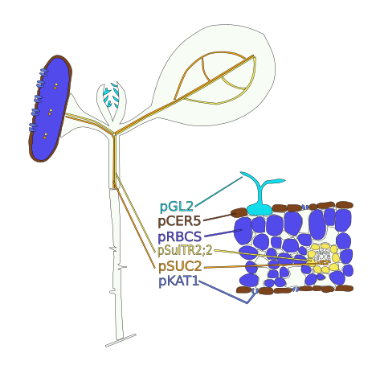

  Maintainer: Jianhai Zhang (<jzhan067@ucr.edu>; <zhang.jianhai@hotmail.com>)

<style type="text/css">
.main-container { max-width: 1800px; margin-left: 5px; margin-right: auto; }
</style>

<style>body { text-align: justify }</style>

```{r setup0, eval=TRUE, echo=FALSE, message=FALSE, warning=FALSE}

  library(knitr); opts_chunk$set(message=FALSE, warning=FALSE)

```

# Introduction 

This R package spatialHeatmap is designed to allow users to visualise custom data matrix on SVG images in an intuitive way, and therefore promote hypothesis generation. In biological research, examples include but not limit to gene expression profiling by RNA-seq or microarray, qPCR, protein subcellular localisation, etc., regardless of species. 

The application is not limited to biological data. It is applicable as long as a data matrix and a configured SVG image are provided. Other exmaples include population data collected in different years across different cities, health data of an individual under different conditions, ect. In the following, the vignette is given with a gene expression matrix and an associated SVG image as examples. Usage on other cases is in the same way.    

The core feature "Spatial Heatmap" is to map expression profile of a target gene under different conditions to different cells/tissues/organs (samples) on a configured SVG image, where different samples are predefined. After mapping, the expression profile is represented as different colours across samples in the image, which are called spatial heatmaps. The requirements on how to configure an SVG image with a data matrix is provided [below](#svg_mat). Not all samples in the expression matrix need to be defined in the SVG image and only those defined will be mapped, vice versa. This feature allows to input multiple genes. If so, the spatial heatmaps of different genes are generated sequentially on the same page. There is also an option to display these spatial heatmaps by genes or by conditions, which makes it flexible for users to compare expression profiles of the same gene across conditions or different genes across the same condition.  

In addition, the accessory features of "Matrix Heatmap" and "Network" display the target gene in the context of corresponding gene module, which make this package more informative. All the utilities implemented in this R package are also combined as a web-browser based Shiny app [@shiny; @shinydashboard]. It can be used locally or [online](https://tgirke.shinyapps.io/spatialHeatmap/) on the Shiny server. 

For a quick test, users can use the example code below or the online [Shiny app](https://tgirke.shinyapps.io/spatialHeatmap/). On the online app, users can either select the pre-configured examples from the left menu or download the example data matrix and SVG image in the insturction page.

# Installation

Start R (version "3.5") and run: 

```{r, eval=FALSE, echo=TRUE, warnings=FALSE} 

if (!requireNamespace("BiocManager", quietly = TRUE))
    install.packages("BiocManager")
BiocManager::install("spatialHeatmap")

```

# Functionality

Load the required packages.

```{r, eval=TRUE, echo=TRUE, warnings=FALSE}

library(spatialHeatmap); library(data.table); library(SummarizedExperiment); library(XML); library(igraph); library(ExpressionAtlas); library(genefilter); library(DESeq2); library(Biobase); library(GEOquery)

```   

## Spatial Heatmap

This is the core functionality of this package and is implemented by the function `spatial_hm` [@SummarizedExperiment; @grImport; @rsvg; @ggplot2; @gridExtra; @XML; @grid; @Gentleman2018-xj]. It maps expression profiles of target genes from the [data matrix](#table) [@Mustroph2009-nu] onto the configured SVG image ([Figure 2](#root_R), @Mustroph2009-nu) and displays as spatial heatmaps ([Figure 3](#shm_R)).   

### Format the Data Matrix {#svg_mat}

<a name="name_format"></a>
To plot the spatial heatmaps, the gene expression matrix must be formatted in the following way:

1. The row and column names should be gene IDs and sample/conditions respectively. 

2. In sample/condition names, a sample name is followed by double underscore "__" then the condition. For example, in the column name "shoot_pRBCS__control" in [Table 1](#table), "shoot_pRBCS" is the sample and "control" is the condition. 

3. The column names of sample/condition can only consist of letters, digits, dots, single space, or single underscore. 

4. Each column name must be unique. 

Not all samples in the matrix need to be present in the [SVG image](#svg_form), vice versa. Only samples common between the data matrix and the SVG image are recognised and coloured. Even a dot, space, underscore, uppercase, or lowercase matters.


### Format the SVG Image {#svg_form}

The SVG image is an XML file as shown below. To use this spatialHeatmap package, it must be formatted in the following way:  

1. If a tissue contains multiple shapes (e.g. tissue1), all the shapes must be combined as a group. The group "id" is the tissue name and must be exactly the same with that from the data matrix, which means even a dot, space, underscore, uppercase, or lowercase matters. Otherwise, this tissue group will not be coloured in the spatial heatmaps. There is no need to change path ids in this group.

2. If a tissue only has one shape (e.g. tissue2), it can stay as an individual path, no need to be formatted as a group, but its "id" must be exactly the same with that from the data matrix. Otherwise, this tissue will not be coloured in the spatial heatmaps.  

3. A group should not include another group, which means all elements in a group should be single paths.  

4. If a multiple-shape tissue is not present in the data matrix, and therefore not expected to be coloured, they can stay as individual paths, no need to group its shapes or change their ids.

5. All the tissues (groups or single paths) must be placed in another large group (e.g. large) as a whole, and this large group must be the last element in the SVG/XML file.

The SVG image can be formatted with [Inkscape](https://inkscape.org/). Refer to the step-by-step [SVG tutorial](https://jianhaizhang.github.io/SVG_tutorial_file/) for details. [Figure 1](#svg_root) is the formatted SVG image opened in Inkscape, where different tissues are labeled by colours. The first group (id="g258") is not present in the data matrix and has a random id. The other groups such as "shoot_pGL2" have multiple shapes and will be coloured in the spatial heatmaps, since they are present in the data matrix ([Table 1](#table)). The SVG image (shoot_final_vignette.svg) is accessible in this package as shown below. 

A simplified example of formatted SVG/XML file viewed in a text editor:

```{r svg_format, eval=FALSE, echo=TRUE }

<svg ...>

  <metadata ...>
  ...
  </metadata>

  <defs .../>
  <sodipodi:namedview .../>
  
  <g id="large" ...>
    
    <g id="tissue1" ...>
      <path .../>
      <path .../>
      ...
    </g>

    <path id="tissue2" .../>
    
    ...
  
  </g>

</svg>

```

<a name="svg_root"></a>
```{r svg_root, echo=FALSE, fig.align="center", fig.cap=("Figure 1: SVG image formatted in Inkscape. The first group (id=\"g258\") are not present in the data matrix and has a random id while all other groups have idential ids of tissue names in the data matrix (Table 1). Colours just label different tissues, which can be changed by users."), out.width="100%"}

  include_graphics('img/svg_format.png')

```


### SVG Templates {#svg_tmp}

To make it easy for users, a [repository](https://github.com/jianhaizhang/SVG_tutorial_file/tree/master/anatomogram/src/svg/svg_trans) of SVG templates across different species is created. This repository is modified from [EBI Gene Expression Group](https://github.com/ebi-gene-expression-group/anatomogram/tree/master/src/svg), since the SVG images from EBI cannot be directly used in this package because of the format. To use this repository, users should download an SVG template of interest and configure it with a gene expression matrix as stated above. Then input the configured SVG and expression data to function `spatial_hm`. More SVG templates will be added to this repository in the future. If users cannot find an SVG template of interest in this repository, they can follow the step-by-step [SVG tutorial](https://jianhaizhang.github.io/SVG_tutorial_file/) to create their custom SVG images.


### Application on GEO Data

To demonstrate the use of this tool, the GEO dataset GSE14502 [@Mustroph2009-nu] is used as the first example. As a convention, the gene expression matrix should be normalised and filtered before downstream processing [@edgeR; @DESeq2; @affy; @gcrma]. Since the normalisation is not relavant in this vignette, and the dataset GSE14502 is already normalised by "RMA", normalisation is not covered in this vignette. The gene expression matrix of GSE14502 is filtered by function `filter_data` [@SummarizedExperiment; @utils], which builds on `pOverA` and `cv` in the package "genefilter" [@Gentleman2018-xj]. The filtered matrix ([Table 1](#table)) is stored as an "SummarizedExperiment" object [@SummarizedExperiment], where metadata of genes and sample/conditions can be optionally added.  

**Format the data matrix:**

<a name="filter"></a>
```{r, geo, eval=TRUE, echo=TRUE, warnings=FALSE}

  # Download GEO dataset GSE14502.
  gset <- getGEO("GSE14502", GSEMatrix =TRUE, getGPL=FALSE)[[1]]
  # Assign tissue/condition names.
  mat <- exprs(gset); titles <- gset$title
  colnames(mat) <- make.names(titles) # Make syntactically valid names out of character vectors. 
  
  # Average replicates.
  sam.var <- sub('_rep\\d+$', '', colnames(mat))
  mat <- aggregate(x=t(mat), by=list(sam.var=sam.var), FUN=mean); mat[1:3, 1:4]
  sam.var <- mat[, 1]
  # Transpose the matrix.
  mat <- t(mat[, -1]); colnames(mat) <- sam.var; mat[1:3, grep('shoot', sam.var)[1:3]]

  # Format tissue/condition names: use a double underscore to separate tissue and condition. E.g. in "shoot_control_pCER5", "shoot" and "pCER5" stands for the tissue "cotyledon and leaf epidermis", and "control" is the condition, so this column name is changed to "shoot_pCER5__control".
  sam.var <- gsub('(root|shoot)(_)(control|hypoxia)(_.*)', '\\1\\4\\2\\2\\3', sam.var)
  colnames(mat) <- sam.var; mat[1:3, grep('shoot', sam.var)[1:3]]
  
  # Store the gene expression matix in "SummarizedExperiment" class.
  se <- SummarizedExperiment(assays=list(expr=mat))

  # Filter genes. In "pOA", genes with expression value A >= 6 in at least P=0.02 (2%) of all samples are retained; in "CV", genes with coefficient of variance (CV) between 0.25 and 100 are retained. 
  exp <- filter_data(data=se, pOA=c(0.02, 6), CV=c(0.30, 100), dir=NULL)

  # Get the filtered matrix. "filter_data" returns a "SummarizedExperiment" object.
  df <- assay(exp)

```

<a name="table"></a>
```{r, table, eval=TRUE, echo=FALSE, warnings=FALSE}

  kable(df[7:9, grep('shoot', colnames(df))[c(5, 13, 3, 11)]], caption='Table 1. Gene expression matrix. Rows and columns are genes and sample/conditions respectively.')

``` 

<a name="root_R"></a>
```{r root_R, echo=FALSE, dev='svg', fig.align="center", fig.cap=("Figure 2. Original SVG image. Tissues are labelled by different colours for easy identification. The promoter pGL2, pRBCS, pCER5, pSultr2.2, pSUC2, pKAT1 label shoot trichomes, shoot photosynthetic, cotyledon and leaf epidermis, shootbundle sheath, shoot phloem companion cells, Cotyledon and leaf guard cells, respectively"), out.width="50%"}



```

**Plot spatial heatmaps:**  

<a name="shm_R"></a>
```{r, shm, eval=TRUE, echo=TRUE, warnings=FALSE, fig.align="center", fig.cap=('Figure 3. Spatial Heatmaps. User defined tissue regions are coloured by the expression profile of the target gene.'), fig.width=9, fig.height=5}

  # Path of the original svg image.
  svg.path <- system.file("extdata/shinyApp/example", "shoot_final_vignette.svg", package = "spatialHeatmap")
  # Mapping of the target gene "245173_at" to the SVG image. Multiple target genes can be mapped at the same time. Here only one is mapped. 
spatial_hm(svg=svg.path, data=exp, pOA=c(0, 0), CV=c(0, 100), ID="245173_at", col.com=c('purple', 'cyan', "brown"), width=1, height=1, sub.title.size=15, layout="gene", ncol=2)

```   

In Figure 2, the colours are only used to distinguish different tissues, while in Figure 3 user defined tissue regions are coloured by the expression profile of a target gene under different contidions. For example, in [Table 1](#table) the expression value of gene "245173_at" in "shoot_pRBCS" under "control" is "7.631643". After mapping the "shoot_pRBCS" is coloured "sky blue", corresponsing to "7.631643" in the colour scale.  


### Application on Expression Atlas-EMBL-EBI Data

The second example of spatial heatmap is plotting gene expression data from [Expression Atlas-EMBL-EBI](https://www.ebi.ac.uk/gxa/home) onto the [SVG template](#svg_tmp), which is a rich resource of gene expression data across many conditions and species. 

Download SVG template and find tissue names: download "homo_sapiens.brain.svg" from the [SVG repository](https://github.com/jianhaizhang/SVG_tutorial_file/tree/master/anatomogram/src/svg/svg_trans) (mouse over the image and right click, then select “Save image as…”) and open it in [Inkscape](https://inkscape.org/), which should be pre-installed. In the Inkscape, as shown in Figure 4 find the "Edit" tab at the top left corner then click "XML Editor...". In the "XML Editor" panel, click the small black triangle at the bottom, then all the tissue names (ids) are shown. These tissue names must be identical with that in the expression matrix. Otherwise, the tissues would not be coloured in the spatial heatmaps.

<p/><center></center> <p/>
<p/><center></center> <p/>
<figcaption>Figure 4 Snapshots of finding tissue names in Inkscape.</figcaption>  

<br/>Format the expression matrix and plot the spatial heatmaps:

```{r ebi, eval=TRUE, echo=TRUE, warnings=FALSE, fig.align="center", fig.cap=("Figure 5 Example of plotting EBI data on the SVG template. Cerebellum and frontal cortex are coloured, since they are the only 2 common tissues between the SVG and the expression matrix."), out.width="100%" }

# Search for human samples related to brain.
all.res <- searchAtlasExperiments(properties="brain", species="Homo sapiens")
# Select "E-GEOD-67196", which is RNA-seq data of cerebellum and frontal cortex in brain.
sl <- getAtlasData('E-GEOD-67196')[[1]][[1]]
# Raw count matrix.
df.exp <- assay(sl); df.exp[1:3, 1:5]
# Tissue/condition metadata.
df.con <- as.data.frame(colData(sl)); df.con[1:3, ]

# The matching tissues in the SVG template are "cerebellum" and "frontal_cortex" while in the expression data are "cerebellum" and "frontal cortex". The tissue names must be exactly same between the SVG and the expression matrix, so change "frontal cortex" to "frontal_cortex".
df.con$organism_part <- sub(' ', '_', df.con$organism_part)
# Use abbreviations of the conditions ("individual", "disease", "genotype").
df.con$individual <- sub('individual', 'indi', df.con$individual)
df.con$individual <- sub('Individual ', 'indi', df.con$individual)
df.con$disease <- sub('amyotrophic lateral sclerosis', 'ALS', df.con$disease)
df.con$genotype <- sub('presence of a C9orf72 repeat expansion', 'pre.C9orf72', df.con$genotype)
df.con$genotype <- sub('absence of a C9orf72 repeat expansion', 'ab.C9orf72', df.con$genotype)
df.con$genotype <- sub('not applicable', 'NA', df.con$genotype)

# The condition can be "individual", "disease", "genotype", or combinations of them. If use combined conditions, just paste the selected contitions together. 
con1 <- paste0(df.con$organism_part, '__', df.con$genotype); con1[1:4] # Single condition of "genotype".
con2 <- paste0(df.con$organism_part, '__', df.con$individual, '.', df.con$genotype); con2[1:4] # Combined conditions of "individual" and "genotype".
# Use "individual" and "genotype" as the condition.
colnames(df.exp) <- con2

# Normalise the raw counts.
se <- SummarizedExperiment(assays=list(expr=df.exp), rowData=rownames(df.exp), colData=con2)
dds <- DESeqDataSet(se, design=~1); dds <- estimateSizeFactors(dds)
# Use log2 unit.
log.df <- log2(counts(dds, normalized=TRUE)+1)
# Summary of the expression matrix.
quantile(log.df, probs=seq(0, 1, 0.25))

# Filter the expression matrix.
ffun <- filterfun(pOverA(1/ncol(log.df), 5), cv(0.6, 1000))
filtered <- genefilter(log.df, ffun); log.df <- log.df[filtered, ]; dim(log.df)

# Subset the columns to make a toy example.
log.df <- log.df[, c(1:2, 17:18, 37:38)]; con2 <- con2[c(1:2, 17:18, 37:38)]; log.df[1:3, ]
# Store the filtered expression matrix as a "SummarizedExperiment" object.
exp.ebi <- SummarizedExperiment(assays=list(expr=log.df), rowData=rownames(log.df), colData=con2)
# Set "cerebral_cortex" as transparent, since it covers "frontal_cortex". Pass the path of downloaded SVG image to the argument "svg".
svg.path <- system.file("extdata/shinyApp/example", "homo_sapiens.brain.svg", package="spatialHeatmap")
spatial_hm(svg=svg.path, data=exp.ebi, pOA=c(0, 0), CV=c(0, 10000), ID=rownames(log.df)[6], col.com=c("yellow", "blue", "purple"), width=1, height=0.5, sub.title.size=7, layout="gene", ncol=3, tis.trans='cerebral_cortex')

```


## Adjacency Matrix and Module Identification
<a name="ds"></a>

The `matrix_heatmap` [@SummarizedExperiment; @ggdendro; @ggplot2; @plotly; @stats; @gplots; @reshape2] and `network` [@SummarizedExperiment; @igraph; @graphics; @shiny; @shinydashboard; @visNetwork] function are used to supplement the core feature of spatial heatmap, which are designed to display the target gene in the context of corresponding gene network module. The function `adj_mod` computes adjacency matrix and identify modules. The modules are identified using WGCNA [@Langfelder2008-sg] and flashClust [@flashClust] at two alternative sensitivity levels (3, 2). From 3 to 2, the sensitivity decreases and results in less modules with larger sizes. There are two additional options for module identification: signed and unsinged. The "signed" means both positive and negative adjacency between genes are used while the "unsigned" takes the absolute values of negative adjacency [@Langfelder2008-sg].

**The usage of "matrix_heatmap" and "network" are demonstrated on the GEO example.**

```{r, eval=TRUE, echo=TRUE, warnings=FALSE}

  adj.mod <- adj_mod(data=exp, type="signed", minSize=15, dir=NULL)

```   
## Matrix Heatmap

<a name="mhm1"></a>
The function `matrix_heatmap` displays the target gene in the context of corresponding gene module as a [matrix heatmap](#mhm_R), where the rows and columns are sorted by hierarchical clustering dendrograms and the target gene is tagged by 2 black lines [@ggdendro; @plotly]. The matrix heatmap has 2 modes: static or interactive. If interactive, users can zoom in and out by drawing a rectangle and by double clicking the heatmap, respectively. Users can scale the expression matrix by gene or sample.

<a name="mhm_R"></a>
```{r, eval=TRUE, echo=TRUE, warnings=FALSE, fig.cap=("Figure 6. Matrix Heatmap. Rows are genes and columns are samples. The input gene is tagged by 2 black lines."), fig.width=8, fig.height=6, out.width='100%'}

  # Static mode. For interactive mode, set "static=FALSE"
  matrix_heatmap(geneID="245173_at", data=exp, adj.mod=adj.mod, ds="2", scale="row", angleCol=80, angleRow=35, cexRow=0.8, cexCol=0.8, margin=c(10, 6), static=TRUE, arg.lis1=list(offsetRow=0.1, offsetCol=0.1))

```   

## Network

<a name="net1"></a>
The function `network` returns a [network graph](#net_R) to display the target gene in the context of the corresponding gene module, where nodes are genes and edges are adjacencies between genes. The gene module is the same with that in `matrix_heatmap`. The network can be dispayed in static or interactive mode. The thicker edge denotes higher adjacency (coexpression similarity) between genes while larger node indicates higher gene connectivity (sum of a gene's adjacency with all its direct neighbours). In the interactive mode, there is an interactive colour bar to denote gene connectivity. The colour ingredients must only be separated by comma, e.g. "yellow,black,purple", which means gene connectivity increases from yellow to purple. If too many edges (e.g.: > 300) are displayed, the network could get stuck. So the "Input an adjacency threshold to display the adjacency network." option sets a threthold to filter out weak edges. If not too many edges retained (e.g.: < 300), users can check "Yes" under "Display or not?", then the network would be responsive smoothly. To maintain acceptable performance, users are advised to choose a stringent threshold (e.g. 0.9) initially, then decrease the value gradually. The interactive feature allows users to zoom in and out, or drag a gene around. All the gene IDs in the network module are listed in "Select by id" in decreasing order according to gene connectivity. The selected gene ID is appended "_selected". By clicking an ID in this list, users can identify the corresponding gene in the network. If the input contains gene annotation, then the annotation can be seen by hovering the cursor over a node.

<a name="net_R"></a>
```{r, eval=TRUE, echo=TRUE, warnings=FALSE, fig.cap=("Figure 7 Network. Node size denotes gene connectivity while edge thickness stands for coexpression similarity.") }
  
  # Static mode. For interactive mode, set "static=FALSE" 
  network(geneID="245173_at", data=exp, adj.mod=adj.mod, adj.min=0.85, con.min=0, vertex.label.cex=1, vertex.cex=1.5, static=TRUE)

```   

## The Integrated spatialHeatmap

<a name="shiny"></a>
All the above functionality is also combined into a web-browser based [Shiny app](https://shiny.rstudio.com/), which takes advantage of the computational power of R and interactivity of the web. This app can run locally by the function `spatial_hm_all` [@shiny] or [online](https://tgirke.shinyapps.io/spatialHeatmap/) on the Shiny server.

```{r, eval=FALSE, echo=TRUE, warnings=FALSE}

  # Lauch the Shiny app.
  spatial_hm_all()

```   

<iframe width="1100" height="2000" src="https://tgirke.shinyapps.io/spatialHeatmap/" frameborder="0" style="overflow-y:hidden; overflow-x:scroll;"></iframe>


<br/>

```{r session, eval=TRUE, echo=TRUE}

# Session informaion.
sessionInfo()

```

# Reference


