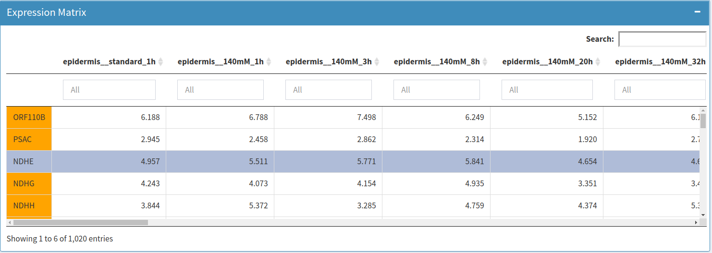
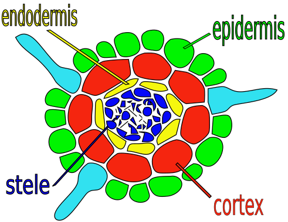
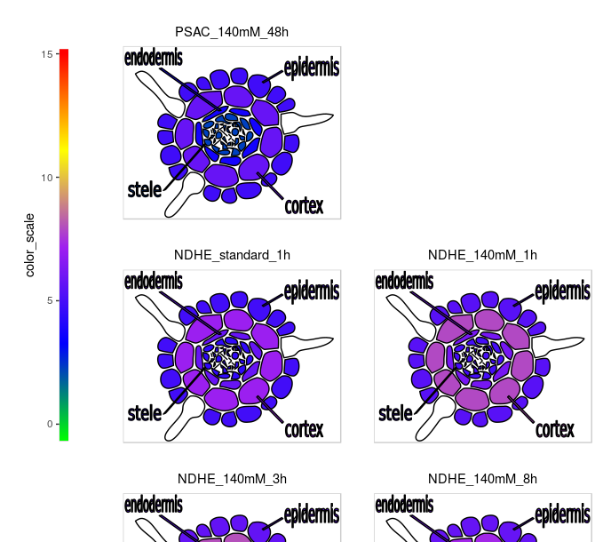
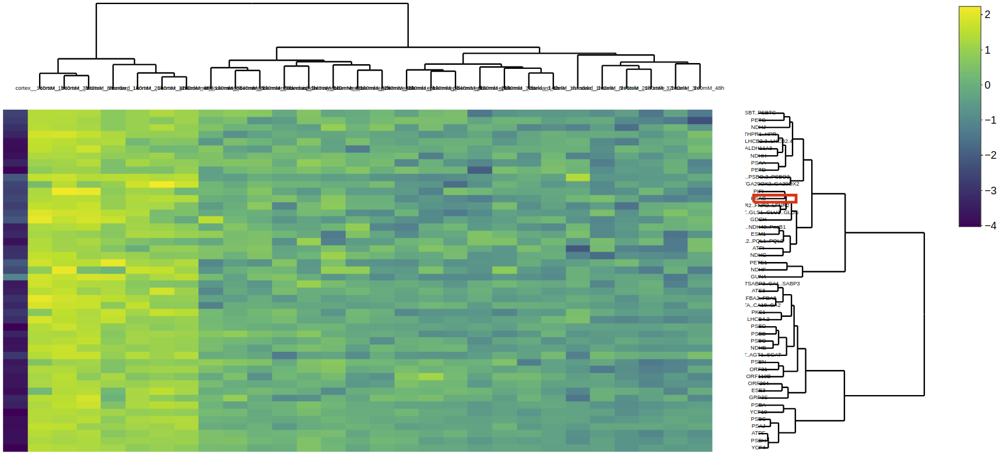
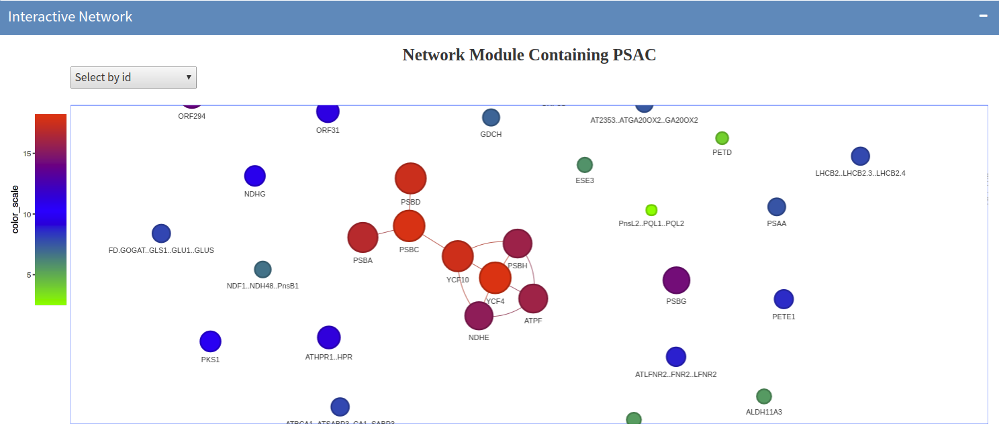
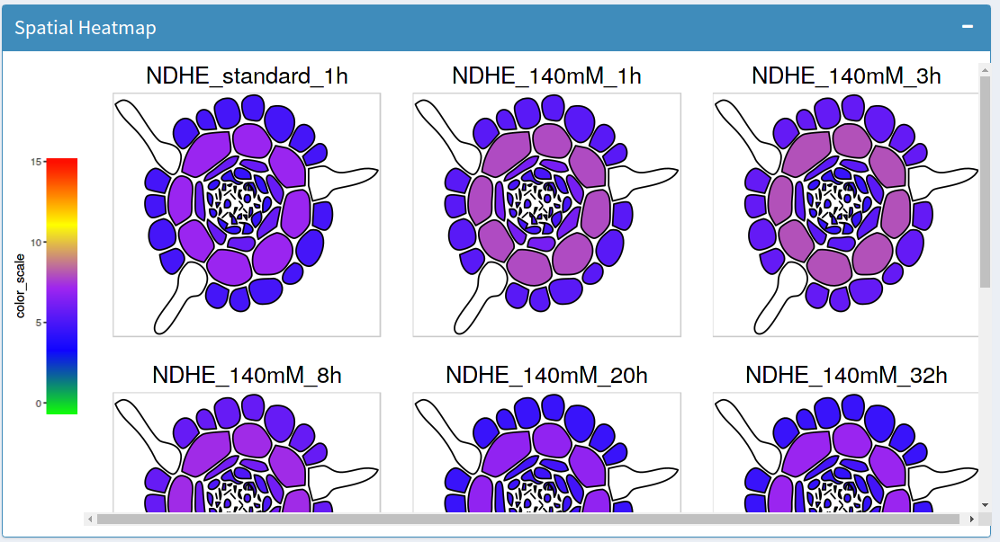
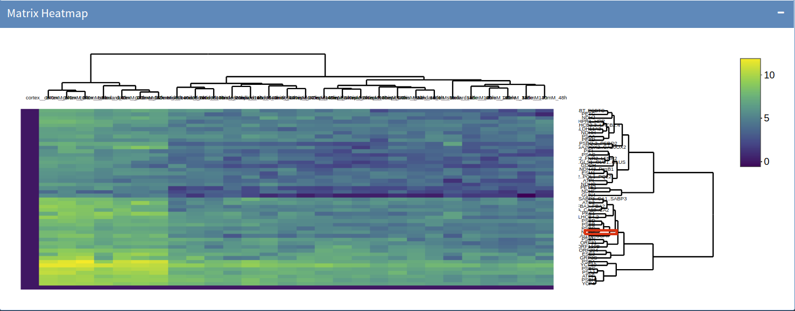
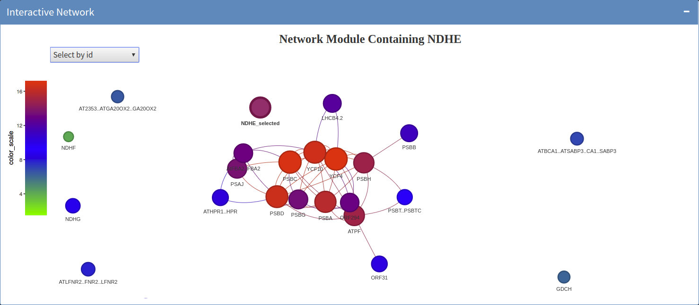

  Maintainer: Jianhai Zhang (<jzhan067@ucr.edu>; <zhang.jianhai@hotmail.com>)

<style>body { text-align: justify }</style>

```{r setup0, echo=FALSE, message=FALSE, warning=FALSE}
library(knitr); opts_chunk$set(message=FALSE, warning=FALSE)
```

# Introduction 

This Shiny App based spatialHeatmap can be used for interactive visualisation as long as a data matrix and an associated SVG image are provided, such as microarray or sequencing data generated on different tissues under different conditions, population data generated in different years across different cities. In the following the instructions are given with a gene expression matrix and an associated root tissue image in SVG format as an example. This app has three main functionality: spatial heatmap, interactive matrix heatmap, interactive network module.  

This vignette describes the R functions corresponding to the functionality of this app and instruction on how to use the web-browser based app. The tutorial of how to properly format and associate custom SVG images with expression tables are provided in an independent file "SVG_tutorial.html".

<b> For quick start up, users can either select the default examples from the left menu or download the example data matrix and SVG image in the insturction page of the web-browser based app </b>.

# Functionality and Corresponding R Functions

To run the following functions and use the complete app, the pacakge should be first loaded.

```{r, eval=FALSE, echo=TRUE, warnings=FALSE}

 library(spatialHeatmap)

```   

## Filter the Data Matrix

The gene expression matrix usually contains noise and needs to be filtered at the beginning. The function `filter.data` has two filter functions "pOverA" and "cv", which are from the package "genefilter" [@Gentleman2018-xj]. When running this function, a directory "local_mode_result" is created in the current work directory, and the resulting matrix (processed_data.txt) is saved in this directory.  

<b>In the gene matrix, the dimension names are gene IDs and sample/conditions. The sample/condition names MUST be fomatted this way: a sample name is followed by double underscore then the condition, such as "epidermis__standard_2h" [@Geng2013-ek], where epidermis is the tissue and standard_2h is the condition</b>. One column or row of meta data (e.g. gene annotation) can also be included in parallel with sample/condition at the end. <b>In the names of sample/condition and meta data, only letters, digits, single underscore, dots are allowed</b>. The example gene expression matrix is shown [below](#filter) or can be downloaded from the web-browser based app.

```{r, eval=FALSE, echo=TRUE, warnings=FALSE}

  data.path <- system.file("extdata/example", "root_expr_ann_row_gen.txt", package = "spatialHeatmap")
  exp <- filter.data(data=data.path, sep="\t", isRowGen=TRUE, c(0, 0), c(0.1, 10000), "processed_data")

```   
<a name="filter"></a>
```{r expr, echo=FALSE, fig.cap=("Root expression matrix. Rows are genes and columns are tissue samples under different conditions."), out.width='100%'}



```

## Spatial Heatmap

This is the core functionality of this package and carried out by the function `spatial.hm`. It takes the data matrix and an [associated SVG image](#root_R) to display [corresponding spatial heatmaps](#shm_R). It can display spatial tissue heatmaps for mutltiple genes under multiple conditions. In each such tissue heatmap, user defined tissue regions are coloured by the expression profile of a gene of interest.  

The tutorial of how to properly format and associate custom SVG images with expression tables are provided in an independent file “SVG_tutorial.html”.

```{r, eval=FALSE, echo=TRUE, warnings=FALSE}

  data.path <- system.file("extdata/example", "root_expr_ann_row_gen.txt", package = "spatialHeatmap")
  svg.path <- system.file("extdata/example", "root_cross_final.svg", package = "spatialHeatmap")
  spatial.hm(svg=svg.path, data=data.path, sep="\t", isRowGene=TRUE, pOA=c(0.1, 3), CV=c(0.05, 1000), ID=c("PSAC", "NDHE"), colour=c("green", "blue", "purple", "yellow", "red"), width=1, height=1, sub.title.size=11, layout="gene", ncol=3)

```   
<a name="root_R"></a>
```{r root_R, echo=FALSE, fig.align="center", fig.cap=("Original root. Tissues are coloured differently."), out.width='50%'}



```

<a name="shm_R"></a>
```{r shm_R, echo=FALSE, fig.align="center", fig.cap=("Spatial Heatmaps of gene \"NDHE\". User defined tissue regions are coloured by theexpression profile of a gene of interest."), out.width='70%'}



```

## Adjacency matrix and module identification

To supplement the core feature of spatial heatmap, the interactive matrix heatmap and network features were developed, which are used to display gene network modules. The function `adj.mod` is designed to compute adjacency matrix and identify modules. The resulting adjacency matrix (adj.txt) and module definition (mod.txt) files are saved in the directory "local_mode_result". The modules are identified using WGCNA [@Langfelder2008-sg] at two alternative sensitivity levels (3, 2). From 3 to 2, the sensitivity decreases and results in less modules with larger sizes. There are two additional options for module identification: signed and unsinged. The "signed" means both positive and negative adjacency between genes are used while the "unsigned" takes the absolute values of negative adjacency [@Langfelder2008-sg].

```{r, eval=FALSE, echo=TRUE, warnings=FALSE}

  data.path <- system.file("extdata/example", "root_expr_ann_row_gen.txt", package = "spatialHeatmap")
  exp <- filter.data(data=data.path, sep="\t", isRowGen=TRUE, c(0, 0), c(0.1, 10000), "processed_data")
  adj_mod <- adj.mod(data=exp, type="signed", minSize=15)

```   
## Matrix Heatmap

The function `matrix.heatmap` displays the gene network module containing the input gene as an [interactive matrix heatmap](#mhm_R), where the rows and columns are sorted by hierarchical clustering dendrograms and the input gene is tagged by a red rectangle. To explore the results, the matrix heatmap has several interactive features. For instance, users can zoom in and out by drawing a rectangle and by double clicking the image, respectively. Users can scale the expression values by gene or sample. The same module can also represented as an interactive network by the `network` function.

```{r, eval=FALSE, echo=TRUE, warnings=FALSE}

  data.path <- system.file("extdata/example", "root_expr_ann_row_gen.txt", package = "spatialHeatmap")
  exp <- filter.data(data=data.path, sep="\t", isRowGen=TRUE, c(0, 0), c(0.1, 10000), "processed_data")
  adj_mod <- adj.mod(data=exp, type="signed", minSize=15)
  matrix.heatmap("PSAC", exp, adj_mod, "2", "row")

```   
<a name="mhm_R"></a>
```{r mhm_R, echo=FALSE, fig.height=5, fig.width=5, fig.cap=("Matrix Heatmap. Rows are genes and columns are samples. The input gene is tagged by a redrectangle."), out.width='100%'}



```

## Network

The function `network` launches an [interactive interface](#net_R) to display the gene module containing the input gene. The gene network modules are identified at two alternative sensitivities levels (3, 2). From 3 to 2, the sensitivity decreases and results in less modules with larger sizes. The "Select a module splitting sensitivity level" option allows users to choose which level to use. Nodes and edges mean genes and adjacency between genes respectively. There is an interactive colour bar to denote gene connectivity (sum of a gene's adjacency with all its direct neighbours). The colour ingredients must only be separated by comma, e.g. the default are "blue,green,red", which means gene connectivity increases from blue to red. The edge length is inversely proportional to gene adjacency. If too many edges (e.g.: > 300) are displayed in this network, the app can possibly get stuck. So the "Input an adjacency threshold to display the adjacency network." option sets a threthold to filter out some weak edges. Only edges above the threshold are displayed in the network. The app outputs the total number of remaining edges resulting from each input adjacency threshold. If it is not too large (e.g.: < 300), users can check "Yes" under "Display or not?", then the network can be responsive smoothly. To maintain acceptable performance, users are advised to choose a stringent threshold (e.g. 0.9) initially, then decrease the value gradually. The interactive feature allows users to zoom in and out, or drag a gene around. All the gene IDs in the network module are listed in "Select by id" in decreasing order according to gene connectivity. The selected gene ID is appended "_selected", which can be easily identified from the list. By clicking an ID in this list, users can identify the corresponding gene in the network. If the input expression matrix has an annotation column, then the annotation can be seen by hovering the cursor over a node.  

The same module can also be displayed in the form of an interactive matrix heatmap with the function `matrix.heatmap`. The network can seen by clicking the "View" button at the bottom of the side menu.

```{r, eval=FALSE, echo=TRUE, warnings=FALSE}

  data.path <- system.file("extdata/example", "root_expr_ann_row_gen.txt", package = "spatialHeatmap")
  exp <- filter.data(data=data.path, sep="\t", isRowGen=TRUE, c(0, 0), c(0.1, 10000), "processed_data")
  adj_mod <- adj.mod(data=exp, type="signed", minSize=15)
  network("PSAC", exp, adj_mod)

```   
<a name="net_R"></a>
```{r net_R, echo=FALSE,  fig.cap=("Network module. Nodes are genes and edges are similarity between genes."), out.width='100%'}



```

## The Integrated spatialHeatmap

All the above functionality is combined into a single function `spatial.hm.all`. Running the following command will lauch the complete app.

```{r, eval=FALSE, echo=TRUE, warnings=FALSE}
 
  spatial.hm.all()

```   

# The Web-browser Based App

The integrated web-browser based spatialHeatmap includes all the features listed above, which is more convenient. The network module identification is computationally demanding for large gene expression matrix (e.g.: > 10,000 genes), so to make this app more widely applicable the "Compute locally" mode is developed for processing large data matrix. If the data matrix is small (e.g.: < 10,000 genes), the "Compute online" mode can be used. If the app times out at some time, then users want to refresh the page in their web browser. 

## Input

At first, users need to select a mode under "Select a work mode" in the left "Input" menu. The "Default" is most convenient for users to test the app, since this option relies on pre-uploaded files and users do not need to upload any files at all. The "Compute locally" should be selected if users have a large gene expression file (e.g.: > 10,000 genes) while the "Compute online" can be selected if users have a small gene expression file (e.g.: < 10,000 genes). In "Step 1: upload an SVG file" and "Step 2: upload a gene expression file", users are asked to upload the SVG file and associated gene expression file respectively. Details about how to properly format and associate custom SVG images with expression tables are provided in a separated vignette "SVG_tutorial.html".

The "Step 3: is column or row gene?" option specifies if column or row is gene in the gene expression table, and "Step 4: separator" specifies the separator among the expression values. "Step 5: Color scheme" allows users to input colour components to construct colour scale for gene expression levels. Colours must only be sepatated by comma, e.g. the default is "green,blue,purple,yellow,red". The colour scale can be constructed based on the selected genes or whole matrix.

<b>In the gene matrix, the dimension names are gene IDs and sample/conditions. The sample/condition names MUST be fomatted this way: a sample name is followed by double underscore then the condition, such as "epidermis__standard_2h" [@Geng2013-ek], where epidermis is the tissue and standard_2h is the condition</b>. One column or row of meta data (e.g. gene annotation) can also be included in parallel with sample/condition at the end. <b>In the names of sample/condition and meta data, only letters, digits, single underscore, dots are allowed</b>. The example SVG image and associated gene expression matrix are shown in the Example section below or can be downloaded in the instruction page of this app.

The "Compute locally" option is designed for large gene expression data (e.g.: > 10,000 genes), since gene network modules are identified using the R package WGCNA and the computation of topological overlap matrix (TOM) is time comsuming for large expression matrix [@Langfelder2008-sg]. To maintain good performance, this process is expected to be performed on user's local computer. The relevant functions are `filter.data` and `adj.mod` in this package, which saves the resulting files in the directory "local_mode_result".

The "Compute online" option is designed for small gene expression data (e.g.: < 10,000 genes). The first two items filter genes according to a proportion that a gene's expression values exceed a threthold A across all samples. Only the genes exceeding the proportion will be maintained. The third and fourth items filter genes according to the coefficient of variation (CV). Only the genes with CV between the two specified values are maintained [@Gentleman2018-xj]. The genes passing all these criteria are retained for downstream analysis. To save time, the app is designed to internally compute TOM only once when the matrix heatmap is displayed for the first time, but if the gene expression martix or its filter parameters are changed, the TOM will be re-computed.

The "Minmum module size" sets the minimum module size in gene module indentification. In "Network type", "Signed" means both positive and negative adjacency between genes are used in network module identification while "Unsigned" takes the absolute values of negative adjacency [@Langfelder2008-sg].

## Expression Matrix & Spatial Heatmap 

The gene expression data is represented as an interactive table under "Expression Matrix", where row names are gene IDs and column names are samples/conditions and meta data (the dimension names of the original table are adjusted internally by "Step 3: is column or row gene?"). Users can sort the expression values for a sample or search for a particular gene by its ID. Users can select multiple genes by clicking IDs in the [table](#filter) to display corresponding spatial heatmaps. In each [spatial heatmap](#sh), the gene expression levels are represented by colours for each sample under each condition. In the "Spatial Heatmap" section, users can customise the dimension and layout of the spatial heatmaps. <br/><br/>
<br/>

<a name="sh"></a>
```{r SH, echo=FALSE, fig.cap=("Root spatial heatmap. The spatial heatmaps of the selected gene \"NDHE\". The expression values of \"NDHE\" are presented as colours across tissues under each condition."), out.width='100%'}



```

## Matrix Heatmap & Network

In the "Matrix heatmap & network" section, all gene IDs chosen in "Expression Matrix" are listed under "Select a gene to display matrix heatmap & network.". After a gene is selected from this list, the gene module containing the selected gene would be displayed in the form of [interactive matrix heatmap](#mhm), where the rows and columns are sorted by hierarchical clustering dendrograms and the chosen gene is tagged by a red rectangle. To explore the results, the matrix heatmap has several interactive features. For instance, users can zoom in and out by drawing a rectangle and by double clicking the image, respectively. Users can scale the expression values by gene or sample. The scaled values are only used for matrix heatmap display, not for downstream module identifications. <br/> <br/> 

<a name="mhm"></a>
```{r MH, echo=FALSE, fig.cap=("Root matrix heatmap. The matrix heatmap of the selected gene \"NDHE\", where rows are genes and columns are tissue samples. \"NDHE\" is labelled by a red rectangle."), out.width='100%'}



```
<br/>

The gene network modules are identified at two alternative sensitivities levels (3, 2). From 3 to 2, the sensitivity decreases and results in less modules with larger sizes [@Langfelder2011-qk]. The "Select a module splitting sensitivity level" option allows users to choose which level to use for displaying the iteractive matrix heatmap and network.

The module in "Matrix Heatmap" is displayed as an [interactive network](#net). Nodes and edges mean genes and adjacency between genes respectively. There is an interactive colour bar to denote gene connectivity (sum of a gene's adjacency with all its direct neighbours). The colour ingredients must only be separated by comma, e.g. the default are "blue,green,red", which means gene connectivity increases from blue to red. The edge length is inversely proportional to gene adjacency. If too many edges (e.g.: > 300) are displayed in this network, the app can possibly get stuck. So the "Input an adjacency threshold to display the adjacency network." option sets a threthold to filter out some weak edges. Only edges above the threthold are displayed in the network. The app outputs the total number of remaining edges resulting from each input adjacency threthold. If it is not too large (e.g.: < 300), users can check "Yes" under "Display or not?", then the network can be responsive smoothly. To maintain acceptable performance, users are advised to choose a stringent threshold (e.g. 0.9) initially, then decrease the value gradually. The interactive feature allows users to zoom in and out, or drag a gene around. All the gene IDs in the network module are listed in "Select by id" in decreasing order according to gene connectivity. The selected gene ID is appended "_selected", which can be easily identified from the list. By clicking an ID in this list, users can identify the corresponding gene in the network.

<a name="net"></a>
```{r net, echo=FALSE, fig.cap=("Network. The same network module containing \"NDHE\" is presented as an interactive network. Nodes and edges mean genes and adjacency between genes respectively. Node size is gene connectivity, i.e. the sum of a gene's adjacency with all its direct neighbours, which increases from blue to red. The edge length is inversely proportional to gene adjacency. \"NDHE\" is appended \"_selected\" for easier identification. "), out.width='100%'}



```
<br/>

# Reference

  https://www.w3schools.com/graphics/svg_intro.asp  
  https://shiny.rstudio.com/tutorial/  
  https://shiny.rstudio.com/articles/datatables.html  
  https://rstudio.github.io/DT/010-style.html  
  https://plot.ly/r/heatmaps/  
  https://www.gimp.org/tutorials/  
  https://inkscape.org/en/doc/tutorials/advanced/tutorial-advanced.en.html  
  http://www.microugly.com/inkscape-quickguide/  
  https://cran.r-project.org/web/packages/visNetwork/vignettes/Introduction-to-visNetwork.html  

  Winston Chang, Joe Cheng, JJ Allaire, Yihui Xie and Jonathan McPherson (2017).
  shiny: Web Application Framework for R. R package version 1.0.3.
  https://CRAN.R-project.org/package=shiny

  Winston Chang and Barbara Borges Ribeiro (2017). shinydashboard: Create
  Dashboards with 'Shiny'. R package version 0.6.1.
  https://CRAN.R-project.org/package=shinydashboard

  Paul Murrell (2009). Importing Vector Graphics: The grImport Package for R.
  Journal of Statistical Software, 30(4), 1-37. URL
  http://www.jstatsoft.org/v30/i04/.

  Jeroen Ooms (2017). rsvg: Render SVG Images into PDF, PNG, PostScript, or
  Bitmap Arrays. R package version 1.1. https://CRAN.R-project.org/package=rsvg

  H. Wickham. ggplot2: Elegant Graphics for Data Analysis. Springer-Verlag New
  York, 2016.

  Yihui Xie (2016). DT: A Wrapper of the JavaScript Library 'DataTables'. R
  package version 0.2. https://CRAN.R-project.org/package=DT

  Baptiste Auguie (2016). gridExtra: Miscellaneous Functions for "Grid" Graphics.
  R package version 2.2.1. https://CRAN.R-project.org/package=gridExtra

  Andrie de Vries and Brian D. Ripley (2016). ggdendro: Create Dendrograms and
  Tree Diagrams Using 'ggplot2'. R package version 0.1-20.
  https://CRAN.R-project.org/package=ggdendro

  Peter Langfelder, Steve Horvath (2012). Fast R Functions for Robust
  Correlations and Hierarchical Clustering. Journal of Statistical Software,
  46(11), 1-17. URL http://www.jstatsoft.org/v46/i11/.

  Simon Urbanek and Jeffrey Horner (2015). Cairo: R graphics device using cairo
  graphics library for creating high-quality bitmap (PNG, JPEG, TIFF), vector
  (PDF, SVG, PostScript) and display (X11 and Win32) output. R package version
  1.5-9. https://CRAN.R-project.org/package=Cairo

  R Core Team (2017). R: A language and environment for statistical computing. R
  Foundation for Statistical Computing, Vienna, Austria. URL
  https://www.R-project.org/.

  Duncan Temple Lang and the CRAN Team (2017). XML: Tools for Parsing and
  Generating XML Within R and S-Plus. R package version 3.98-1.9.
  https://CRAN.R-project.org/package=XML

  Carson Sievert, Chris Parmer, Toby Hocking, Scott Chamberlain, Karthik Ram,
  Marianne Corvellec and Pedro Despouy (NA). plotly: Create Interactive Web
  Graphics via 'plotly.js'. https://plot.ly/r,
  https://cpsievert.github.io/plotly_book/, https://github.com/ropensci/plotly.

  Matt Dowle and Arun Srinivasan (2017). data.table: Extension of `data.frame`. R
  package version 1.10.4. https://CRAN.R-project.org/package=data.table

  R. Gentleman, V. Carey, W. Huber and F. Hahne (2017). genefilter: genefilter:
  methods for filtering genes from high-throughput experiments. R package version
  1.58.1.

  Peter Langfelder, Steve Horvath (2012). Fast R Functions for Robust
  Correlations and Hierarchical Clustering. Journal of Statistical Software,
  46(11), 1-17. URL http://www.jstatsoft.org/v46/i11/.

  Almende B.V., Benoit Thieurmel and Titouan Robert (2017). visNetwork: Network
  Visualization using 'vis.js' Library. R package version 2.0.1.
  https://CRAN.R-project.org/package=visNetwork


